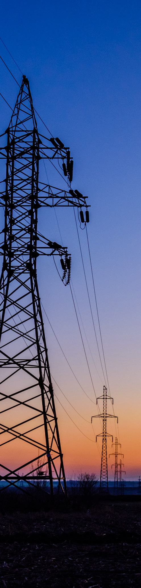

# WorldEnergyOutlook2025 - Part 3

*Pages 101-150*

## Page 101

Chapter 2 | Setting the scene 
101
 
2 
Figure 2.10 ⊳ Selected energy policies and climate targets, 2010-2025 
IEA. CC BY 4.0.
Over the last decade the energy policy toolkit diversified from  
energy efficiency mandates to more government spending and trade measures 
Notes: NDCs = Nationally Determined Contributions. Renewable power and biofuel policies include: regulatory 
policies, such as feed-in tariffs and biofuel blending; fiscal incentives; and public financing. Other energy 
government spending includes: energy technology development and incentive programmes, and short-term 
energy affordability measures. Trade policies indicate a single instance of a trade measure impacting solar PV 
and wind energy components, and car batteries.  
Sources: IEA data and analyses based on ESMAP (2024 and 2025); IMF (2025b); IAEA (2025); GTA (2025); 
REN21 (2025). 
National energy plans of various kinds have been put in place over the past twelve months 
by fifteen countries, in many cases including updated goals for energy security and emissions 
50%
100%
2010
2025
Share of demand covered by
energy efficiency mandates
Air 
conditioners
Industrial
motors
Passenger
cars
 100
 200
2010
2025
Number of countries with incentives/
mandates for low-emissions sources
Renewable
power
policies
Biofuel
policies
Nuclear
programmes
 30
 60
2010
2025
Number of countries with
energy access roadmaps
Electricity
access
Clean 
cooking
 600
1 200
2010
2025
Government energy spending
Billion USD
Fossil-fuel
subsidies
Other energy
government 
spending
1 000
2 000
2010
2025
Number of enforced
energy-related trade policies
Local content
measures
Import and
export bans
Tariff
measures
50%
100%
2010
2025
Share of energy emissions
covered by climate targets
First NDCs
Second NDCs
Revised first
NDCs
IEA. CC BY 4.0.

---

## Page 102

102 
International Energy Agency | World Energy Outlook 2025
 
reductions. For example, Japan’s 7th Strategic Energy Plan outlined its Safety, Energy 
Security, Economic Efficiency and Environment (S+3Es) principles, alongside guidance on the 
envisaged energy mix to 2040. In Brazil, the Energy Transition Acceleration Programme sets 
new ambitions for the energy sector to promote clean energy employment, innovation and 
transition in coal mining regions. And in November 2025, an amendment to the European 
climate law was endorsed by EU Environment Ministers, setting a target to reduce emissions 
by 90% by 2040, relative to 1990 levels. 
Alongside ongoing policy developments, fourteen countries and regions adopted new targets 
for power generation over the past year. For example, the European Union member states 
agreed new goals for offshore wind capacity for 2030, 2040 and 2050; Korea set a target to 
raise the share of renewables and nuclear by 2038; along with its 7th Strategic Energy Plan, 
Japan referenced a goal for the share of generation to be met by renewables in 2040; both 
Indonesia and Viet Nam set goals for renewables and nuclear power capacity.  
In the buildings sector, several countries including Nigeria, Morocco and Malaysia put in 
place or announced new efficiency standards for air conditioners. Countries with expanding 
cooling needs like India and Saudi Arabia are upgrading their building energy codes to ensure 
new buildings are more resilient to heatwaves and other extreme weather events. Many 
countries with clean cooking and electricity access deficits, particularly in sub-Saharan Africa, 
are taking steps to bring about improvements. The IEA has tracked 25 new clean cooking 
access policies enacted or announced since 2024 in countries that are home to more than a 
third of people without clean cooking access. 
In the transport sector, some new incentives for EVs and charging infrastructure were 
introduced. Nigeria has started to exempt EVs and charging infrastructure from value-added 
tax, while India launched an incentive scheme for EVs (PM E-Drive). By contrast, a few 
countries, such as the United Kingdom, introduced greater flexibility in meeting their zero 
emissions vehicle (ZEV) mandates by allowing higher shares of plug-in hybrids. Canada 
paused its 2026 ZEV mandate to give the automotive industry additional time to prepare. 
Australia is implementing its first fuel efficiency standard and Indonesia increased its 
biodiesel blending mandates.  
In the industry sector, changes to emissions trading systems were announced in the last year 
related to carbon pricing as well as new support schemes. In February 2025, for example, the 
European Commission launched its Clean Industrial Deal, aiming to boost EU industrial 
competitiveness and decarbonisation through efforts to provide more affordable energy, 
stimulate demand for low-emissions industrial products, mobilise significant financing 
support, and promote access to critical raw materials.  
Some policy shifts come in waves, often in response to specific events or shocks. This has 
been the case with energy security policies in recent years, as countries have responded to 
the global energy crisis and emerging security vulnerabilities (Spotlight). However, the 
direction in which policy settings evolve is not preordained or uniform, and the adoption of 
specific policies reflects different national circumstances and priorities. The aim of the 
scenario analysis in the WEO-2025 is not to anticipate or prescribe changes, but to place 
them within a broad analytical framework to help understand their implications. 
IEA. CC BY 4.0.

---

## Page 103

Chapter 2 | Setting the scene 
103
 
2 
Are governments better positioned to respond to  
energy security shocks than in the past?  
With geopolitical uncertainty on the rise and renewed volatility in energy markets, 
energy security has once again become a top priority for governments around the world. 
They are deploying a wide range of policies to be better prepared in case of an energy 
emergency.  
Since the oil crises of the 1970s, governments in net oil importing countries adopted 
policies and emergency response measures to mitigate the impacts of potential supply 
disruptions, while diversifying and increasing the efficiency of their energy portfolios. 
Virtually all main oil importers now have in place stockholding and demand restraint 
measures advocated by the IEA. Prior to the first oil crisis in 1973, only a handful of 
countries – representing less than 1% of net oil imports – had such emergency measures 
in place. Today, countries responsible for 99% of net oil imports have one or more oil 
security measure in place, and 61 countries have introduced emergency oil stock 
requirements (Figure 2.11).  
Figure 2.11 ⊳ Cumulative number of countries with selected emergency 
response and energy security policies, 1970-2025 
IEA. CC BY 4.0.
Since the 1970s, global events and energy crises have triggered a rise 
 in emergency response and energy security policies worldwide 
Note: The analysis focuses on 85 countries, covering 93% of global primary energy demand, 87% of global 
oil demand and 95% of global natural gas demand. 
The number of natural gas security measures in place has grown rapidly in recent years.  
In 2015, stockholding requirements only covered countries accounting for 10% of net gas 
imports, a figure that has now risen to 34%, mostly made up by EU member countries. 
 10
 20
 30
 40
 50
 60
1970
1980
1990
2000
2010
2020 2025
1973 First oil crisis
1991 Gulf war
2022 Russia's
invasion of Ukraine
2009 Russia-Ukraine gas crisis
1979 Second oil crisis
Oil stockholding
Oil demand restraint
Gas demand restraint
Gas stockholding
Critical minerals 
stockholding
2011 Libyan civil war
S P O T L I G H T  
IEA. CC BY 4.0.

---

## Page 104

104 
International Energy Agency | World Energy Outlook 2025
 
Demand restraint measures for natural gas such as fuel switching, interruptible contracts 
and load shedding have become increasingly common since Russia’s annexation of 
Crimea in 2014. Over 40 net gas importing countries now have legislation in place to 
implement such measures, with 15 introducing them in the past ten years, including most 
European Union and Balkan countries. 
The focus of policy is expanding to cover emerging energy security threats, including 
those with a bearing on the supply of critical minerals, technology supply chains, 
electricity security, cybersecurity and climate resilience. To take one important example, 
the expanding number of trade restrictions on critical minerals and related manufactured 
products is leading to efforts to strengthen resilience to potential supply disruption, 
notably by putting in place strategic reserves of critical minerals, as the United States, 
China, Japan and Korea have done, and by adopting measures to diversify supply. The 
rising number of cyber and physical attacks on power infrastructure represents another 
important threat, especially against the background of rapid growth in demand for 
electricity. Countries are increasingly taking steps to integrate long-term strategic 
planning and reform regulatory frameworks and market design to improve operational 
security and resilience. The IEA supports regulatory discussions in each of these emerging 
security areas and established a Voluntary Critical Minerals Security Programme in 2022 
and an Electricity Security Advisory Board in 2024 to help address these challenges. 
2.3 
WEO scenarios  
Analysis in the World Energy Outlook (WEO) provides a framework for understanding the 
future of energy, not by setting out a single vision of the future, but by examining several 
different potential scenarios for its development. Each scenario has the same starting point 
and is based on the latest data for energy supply and demand, markets, technology costs and 
policies, as well as the same pathways for future population and economic growth. None of 
the individual WEO scenarios should be regarded as a forecast. 
The energy system described and explored in each scenario evolves in a distinctive pathway 
that delivers energy services with a different mix of technologies and fuels, with varying 
implications for energy security, affordability and emissions. This is primarily due to differing 
assumptions about how energy policies are implemented and evolve, and how these interact 
with the evolution of energy technologies and markets.  
This edition of the WEO examines the outlook for the energy system through an updated set 
of scenarios. The first two, the Current Policies Scenario (CPS) and the Stated Policies 
Scenario (STEPS) do not target a specific endpoint or objective but rather establish different 
sets of starting conditions and explore where they may lead. 
Of the many factors that can influence the evolution of the energy sector, policies play a 
profound role, and are the key differentiating factor between these two scenarios. However, 
IEA. CC BY 4.0.

---

## Page 105

Chapter 2 | Setting the scene 
105
 
2 
policies are generally only a partial guide to the direction of travel. They are sometimes 
imprecise, can have unintended consequences, and are subject to change. To reflect the 
wider complexity of factors that can shape the evolution of the energy system, the design of 
the CPS and STEPS also reflects the speed and extent to which technology challenges and 
barriers to change in the energy sector are overcome. 
 
The Current Policies Scenario (CPS) returns in this Outlook, setting out a pathway for 
the future of the energy system in which no change in energy-related policies is assumed 
beyond what is already in place. The CPS therefore builds on a narrow reading of today’s 
policy settings, only considering those that are adopted in legislation and regulation, and 
assuming no change, even where governments have indicated their intention to do so. 
Where existing policies target a range of outcomes, it is assumed that the lower end of 
the range is achieved. In the CPS, policies that are time-bound or that target specific 
years are not strengthened after they expire. Alongside this view of the policy landscape, 
the CPS also offers a generally cautious perspective on the speed at which new energy 
technologies are deployed and integrated into the energy system. It tends to project 
slower growth in the adoption of new technologies in the energy system than seen in 
recent years, or than projected in the STEPS. 
 
The Stated Policies Scenario (STEPS) builds on a broader reading of the policy landscape 
than the CPS, also taking account of those policies that have been formally tabled but 
not yet adopted as well as other official strategy documents that indicate the direction 
of travel. These could include, for example, development plans for the power sector that 
aim to achieve a certain mix of generation assets by a specific date; or plans to reform 
the regulatory framework for part of the transport sector or to achieve a certain level of 
efficiency for new or retrofitted buildings. Such targets are not automatically assumed 
to be met; the prospects and timing for their realisation are subject to an assessment of 
relevant market, infrastructure and financial constraints.  
Another difference with the CPS relates to time-bound policies. Whereas the CPS 
assumes no further change in a policy once it expires, the STEPS assumes that time-
bound policies are prolonged into the future and retain a similar pace of change. In 
addition, the STEPS offers a more dynamic perspective on energy technology and 
market trends, and it allows for a slightly more rapid introduction of new energy 
technologies than the CPS. However, like the CPS, the STEPS does not assume that 
aspirational goals, such as those included in the Paris Agreement, are achieved. 
In addition, we include scenarios that have normative elements relating to energy access or 
the achievement of various goals related to emissions. This means that these scenarios work 
toward a defined outcome and map out a way to achieve it.  
 
The Net Zero Emissions by 2050 (NZE) Scenario maps out a pragmatic but ambitious 
global pathway for the energy sector to achieve net zero CO2 emissions by 2050 and is 
consistent with a long-term goal of limiting the rise in global average temperatures to 
1.5 °C (with a 50% probability). In contrast with previous editions of the WEO, the 
IEA. CC BY 4.0.

---

## Page 106

106 
International Energy Agency | World Energy Outlook 2025
 
NZE Scenario is no longer a limited-overshoot scenario, as warming peaks above 1.6 °C 
and exceeds 1.5 °C for several decades before returning below 1.5 °C by 2100. These 
changes in the scenario trajectory reflect the reality of persistently high emissions in 
recent years and slow or uneven momentum behind the deployment of some policies 
and technologies. In addition to very rapid progress with the transformation of the 
energy sector, bringing the temperature rise back down below 1.5 °C by 2100 also 
requires widespread deployment of CO2 removal technologies that are currently 
unproven at large scale. 
 
The Accelerating Clean Cooking and Electricity Services Scenario (ACCESS) – an 
additional scenario included for the first time in this WEO – is a data-driven roadmap to 
achieve universal access to electricity by 2035 and clean cooking by 2040. It is grounded 
in practical constraints and solutions, examining what historical rates of progress have 
been achieved in the past, and then prioritises cost-effective, proven means to replicate 
those successes. It explores all relevant fuels and technologies needed to achieve 
universal access as well as the infrastructure, policies and financing needed to scale 
them up. 
This year’s Outlook does not include the Announced Pledges Scenario, which models a future 
for the energy system in which all national energy and climate targets, such as countries’ 
Nationally Determined Contributions (NDCs) and long-term, low-emissions development 
strategies, are achieved in full and on time.2 Our assessment of the new round of NDCs due 
this year, generally covering the period to 2035, will follow once there is a more complete 
picture of these pledges. 
2.3.1 
GDP and population 
The global economy is assumed to grow by 2.6% on average annually to 2050 across all 
scenarios (Table 2.2). Out to 2030, our GDP assumptions at a country and regional level are 
based on the IMF World Economic Outlook (April 2025), with global GDP projected to grow 
by 3% annually over this period (IMF, 2025c). This projection is similar to the rate of growth 
in the IMF October 2025 assessment (IMF, 2025a). After 2030, GDP growth assumptions are 
based on Oxford Economics forecasts (Oxford Economics, 2025) and the application of the 
Solow growth model (World Bank, 2022). The Solow model estimates future GDP on a 
country and regional basis by accounting for labour supply, capital stock, and total factor 
productivity (TFP). TFP growth reflects catch-up dynamics in lower income countries and 
convergence towards advanced economy levels.3 Economic assumptions are held constant 
across the various scenarios to facilitate comparisons between them, although we recognise 
 
2 NDCs are national climate action plans by each country under the Paris Agreement, submitted every five 
years to the UNFCCC secretariat. The Paris Agreement provides that successive NDCs will represent a 
progression compared to the previous NDC and reflect its highest possible ambition. 
3 Details on GDP and other macroeconomic assumptions are available in the IEA GEC-Model documentation 
(IEA, 2025g). 
IEA. CC BY 4.0.

---

## Page 107

Chapter 2 | Setting the scene 
107
 
2 
that decisions taken by policy makers in the energy sector have broader economic 
implications. 
The global population – another major driver of global energy trends – is expected to expand 
from 8.1 billion in 2024 to 9.6 billion in 2050, based on the medium population projection of 
the United Nations World Population Prospects (United Nations, 2024). This represents a 
slowing of annual global population growth from roughly 1% over the last decade to 0.6% by 
2050, although the population in sub-Saharan Africa increases by 70% over the period. 
Demographic changes impact GDP growth and therefore energy demand. Regions with rising 
working age populations, such as India and Indonesia, are set to see stronger energy demand 
growth, whereas ageing societies, such as Japan and Korea, are likely to experience slower 
growth or declines in energy demand. These demographic shifts also influence the structure 
of energy use: younger populations drive energy demand in transport, construction and 
manufacturing, while older populations tend to increase residential energy consumption.  
Table 2.2 ⊳ 
GDP average growth assumptions by region 
  
Compound average annual growth rate 
  
2010-24 
2024-35 
2035-50 
2024-50 
North America 
2.3% 
2.0% 
1.8% 
1.9% 
United States 
2.3% 
2.0% 
1.8% 
1.9% 
Central and South America 
1.4% 
2.6% 
2.1% 
2.3% 
Brazil 
1.3% 
2.3% 
2.1% 
2.2% 
Europe 
1.7% 
1.6% 
1.3% 
1.4% 
European Union 
1.4% 
1.3% 
1.0% 
1.1% 
Africa 
3.1% 
4.2% 
3.9% 
4.0% 
South Africa 
1.1% 
1.8% 
2.6% 
2.2% 
Middle East 
2.5% 
2.9% 
2.7% 
2.8% 
Eurasia 
2.2% 
1.8% 
1.4% 
1.6% 
Russia 
1.8% 
1.0% 
0.5% 
0.7% 
Asia Pacific 
4.9% 
3.9% 
2.8% 
3.3% 
China 
6.3% 
3.5% 
2.2% 
2.7% 
India 
6.0% 
6.1% 
4.0% 
4.9% 
Japan 
0.6% 
0.6% 
0.7% 
0.6% 
Southeast Asia 
4.3% 
4.1% 
3.0% 
3.5% 
World 
3.1% 
3.0% 
2.4% 
2.6% 
Note: Calculated based on GDP expressed in year-2024 US dollars at purchasing power parity terms. 
Sources: IEA analysis based on IMF (2025c) and Oxford Economics (2025). 
UN projections for future global population growth have been successively lowered in recent 
years. Population growth to 2050 is concentrated in emerging market and developing 
economies, which are expected to account for over 95% of the global increase over the 
period, and these regions have seen the most significant downgrades (Figure 2.12). 
Projections in this Outlook are based on a population growth figure for these economies from 
2019 to 2050 which is 161 million lower than in the WEO in 2022. 
IEA. CC BY 4.0.

---

## Page 108

108 
International Energy Agency | World Energy Outlook 2025
 
Figure 2.12 ⊳ Revisions to population growth projections for emerging  
market and developing economies, 2019-2050 
 
IEA. CC BY 4.0.
Populations projections for emerging market and developing economies in 2050 have 
 seen significant downward revisions in recent years, especially for China and Africa 
Notes: WEO = World Energy Outlook. UN 2019, UN 2022 and UN 2024 refer to editions of United Nations 
World Population Prospects. EMDE = emerging market and developing economies. For further details on 
population assumptions used in this World Energy Outlook, see Annex B. 
Source: United Nations (2024). 
The largest change is in China, whose population in 2050 is now assumed to be 51 million 
lower than estimated in the WEO-2024, and 127 million lower than in the WEO-2022. China’s 
population peaked in 2021 and is now in long-term decline. Indeed, China is set to experience 
the largest absolute decline of any country between 2024 and 2050, with its population 
falling by nearly 160 million to levels last seen in 1999. This Outlook update also includes 
downward 2050 population revisions for Africa and Southeast Asia, and smaller upward 
revisions for the Middle East. The downward shift in assumptions about global population 
growth to 2050 has implications for long-term energy use: it implies fewer additional cars on 
the road and homes to heat and cool, and lower additional demand for material goods. 
2.3.2 
Prices  
Oil prices 
In our scenarios, oil prices function as a balancing mechanism for global supply and demand, 
ensuring market stability. As such, the trajectories are smooth and show a sustained 
equilibrium, although in practice volatility and uncertainty are ever-present features of oil 
markets (Table 2.3).  
In the Current Policies Scenario, strong and sustained growth in oil demand leads to oil prices 
reaching USD 106/barrel in 2050 to incentivise the necessary production of resources. 
0.5
1.0
1.5
2.0
WEO-2022
(UN 2019)
WEO-2024
(UN 2022)
WEO-2025
(UN 2024)
Population growth, 2019-2050
Billion people
-150
-100
-50
0
 50
Other EMDE
Middle East
India
SE Asia
Africa
China
WEO-2022 to WEO-2024
WEO-2024 to WEO-2025
Change in population growth, 2019-2050
Million people
IEA. CC BY 4.0.

---

## Page 109

Chapter 2 | Setting the scene 
109
 
2 
Market balances in this scenario depend on how major producers in different regions 
maintain high levels of production and how they manage their costs. In the Stated Policies 
Scenario, decreasing oil demand brings down the price at which markets find equilibrium, 
but high levels of investment are still required to compensate for declining output from 
existing fields and for the development of new resources (IEA, 2025b). Prices remain around 
2024 levels over the next decade and decrease modestly to 2050. In the NZE Scenario, robust 
policies are required to effectively neutralise any increase in demand that might result from 
lower prices, ensuring that climate objectives remain on track. In the NZE Scenario, oil prices 
fall to USD 33/barrel by 2035 and USD 25/barrel by 2050 as oil demand declines.  
Table 2.3 ⊳ 
Wholesale fossil fuel prices by scenario 
 
 
 
CPS 
 
STEPS 
 
NZE 
USD (MER, 2024) 
2024 
 
2035 
2050 
 
2035 
2050 
 
2035 
2050 
IEA crude oil (USD/barrel) 
79 
 
89 
106 
 
80 
76 
 
33 
25 
Natural gas (USD/MBtu) 
  
 
 
 
 
 
 
 
 
 
United States 
2.2 
 
4.5 
5.0 
 
3.9 
4.6 
 
2.1 
2.2 
European Union 
10.3 
 
9.1 
10.6 
 
6.5 
8.4 
 
4.2 
4.0 
China 
10.3 
 
9.9 
11.2 
 
7.5 
9.1 
 
4.9 
4.8 
Japan 
13.5 
 
11.2 
12.9 
 
8.4 
9.7 
 
4.9 
4.9 
Steam coal (USD/tonne) 
  
 
 
 
 
 
 
 
 
 
United States 
56 
 
56 
53 
 
41 
41 
 
25 
23 
European Union 
112 
 
92 
82 
 
78 
66 
 
47 
39 
Japan 
151 
 
112 
105 
 
100 
84 
 
57 
49 
Coastal China 
131 
 
115 
105 
 
99 
84 
 
59 
49 
Notes: CPS = Current Policies Scenario; STEPS = Stated Policies Scenario; NZE = Net Zero Emissions by 
2050 Scenario. MER = market exchange rate; MBtu = million British thermal units. The IEA crude oil price is a 
weighted average of import prices among IEA member countries. Natural gas prices are weighted averages 
expressed on a gross calorific-value basis. The US natural gas price reflects the wholesale price prevailing on 
the domestic market. Natural gas prices in the European Union and China reflect a balance of pipeline and 
liquefied natural gas (LNG) imports, while the Japan gas price is solely for LNG imports. LNG prices are those 
at the customs border prior to regasification. Steam coal prices are weighted averages adjusted to 
6 000 kilocalories per kilogramme. The US steam coal price reflects mine mouth prices plus transport and 
handling costs. Coastal China steam coal price reflects a balance of imports and domestic sales, while the 
European Union and Japanese steam coal prices are solely for imports. Wholesale prices exclude any emissions 
pricing applied at the point of use.  
Natural gas prices 
In contrast to oil, there is no global natural gas price but rather a series of regional prices that 
are loosely connected by an increasingly liquid market for internationally traded gas, 
primarily in the form of LNG. Around 60% of LNG is currently delivered under long-term 
contracts with oil-linked pricing formulas or indexed to gas market prices: the remainder is 
traded on the spot market. 
IEA. CC BY 4.0.

---

## Page 110

110 
International Energy Agency | World Energy Outlook 2025
 
Our gas price benchmarks are weighted average prices that incorporate these different 
pricing methods. They represent an equilibrium between supply and demand that ensures 
that new projects come online in a timely manner and can cover their long-run marginal cost 
of supply. They also consider market conditions in the years ahead; in periods of ample 
supply availability, prices may for a period reflect the short-run marginal cost of supply. For 
example, the price of LNG in the European Union in 2035 in the STEPS is around USD 6.2 per 
million British thermal units (MBtu), based on the US Henry Hub price plus a 15% uplift, some 
capital recovery for LNG liquefaction terminals, variable shipping fees and a regasification 
charge. The oil-indexation price is just above USD 8/MBtu. Around 90% of gas in 2035 is 
priced on a gas hub-indexation basis and 10% on an oil-indexation level, meaning the 
weighted average gas import price is around USD 6.5/MBtu.  
Global gas trade is expected to continue shifting toward LNG. Over the period to 2030, 
around 300 billion cubic metres (bcm) of new LNG export capacity is set to come online, led 
by the United States, Qatar and Canada – the largest wave of global capacity additions ever. 
This will put downward pressure on prices over the coming years, but the impacts vary by 
scenario. 
In the CPS, the new supply is absorbed relatively quickly by robust increases in demand. With 
strong domestic demand growth and a surge in LNG exports, the United States sees its 
domestic gas price rise from USD 2.2/MBtu in 2024 to USD 4.5/MBtu in 2035; afterwards 
China, European Union and Japan also see modest price increases to 2050 driven by their 
increasing exposure to tightening LNG balances. In the STEPS, downward price pressures and 
a well-supplied global gas market remains into the 2030s. In the NZE Scenario, global 
demand and prices are both much lower throughout the Outlook period: they 
remain significantly below 2024 levels by 2035 as the rapid expansion of renewables and 
electrification limits gas demand growth, despite abundant LNG availability.  
Coal prices 
Over time, demand for steam coal declines across all the WEO-2025 scenarios, which has 
implications for price trajectories. In the CPS, prices need to be high enough to maintain 
existing mines and incentivise the opening of new ones: this maintains prices at relatively 
high levels, although some major importers nonetheless see significant declines from current 
levels. In the STEPS, an earlier downturn in demand in China pulls down global prices more 
quickly. In the NZE Scenario, falling demand brings prices down to very low levels: higher cost 
mines are forced to close, and no new mines are needed. More than for any other fuel, the 
global trajectory for coal is determined by a handful of major consuming countries, notably 
China and India, whose consumption of coal for power generation accounts for nearly half 
of current coal use worldwide. 
Critical mineral prices 
Critical mineral prices are increasingly important in today’s energy sector. They do not have 
the same economic influence on near-term energy prices as fuel prices, but they significantly 
influence the overall cost of key energy technologies. For example, lithium, nickel, cobalt and 
graphite have a major impact on battery manufacturing; copper is at the heart of a more 
IEA. CC BY 4.0.

---

## Page 111

Chapter 2 | Setting the scene 
111
 
2 
electrified energy system. Prices for base metals such as copper, aluminium and zinc 
rebounded in 2024 and have continued to rise in 2025, driven by increasing demand and 
tightening supply dynamics. By contrast, demand growth for many battery metals has been 
outstripped by new supply growth, bringing prices down sharply: lithium prices, which had 
surged in 2021-2022, have fallen by over 85% since the start of 2023. 
We do not yet generate equilibrium prices that balance supply and demand of critical 
minerals in the same way as for fuels, as there are many sources of demand coming from 
outside the energy sector, but our analysis of current technology trends and future market 
balances nonetheless provides insights about possible price pressures. Ample supply means 
that prices for battery metals are likely to remain subdued in the near term, although our 
project-by-project analysis of lithium supply indicates that further project development will 
be required to keep pace with strong demand growth. Copper presents a more worrying 
picture:  mined output growth has been relatively slow because of declining resource quality, 
the increasing complexity and capital intensity of projects, and long project lead times – all 
factors that are likely to persist in the future. Despite the possibility of some material 
substitution and additional recycling, there is a significant risk of tighter markets for copper 
as demand increases for its use not just in energy technologies and power grids but also in 
construction and industrial applications. Price and volume risks for critical minerals are also 
linked in many cases to the highly concentrated nature of supply, with China having an 
exceptionally strong position in refining and processing of many minerals. 
Carbon prices 
Carbon pricing instruments are increasingly being used to mitigate emissions in the energy 
sector. Eighty direct carbon pricing instruments are now in place – five more than in 2024. 
Coverage of these schemes has risen to about 28% of global greenhouse gas emissions, with 
most of the increase stemming from the expansion of the emissions trading system (ETS) in 
China to the cement, steel and aluminium sub-sectors. Despite this increased coverage, 
government revenues of USD 102 billion in 2024 were 1.9% lower than in 2023. This slight 
decrease in revenue reflects a decline in ETS allowance prices in large systems, including the 
European Union and United Kingdom emissions trading systems. It also reflects the abolition 
in Canada from March 2025 of the federal fuel charge, which was introduced in 2019 to price 
carbon emissions from the transport and buildings sectors. However, Canada’s Output-Based 
Pricing System for power and industry remains unchanged. 
The CPS only considers laws and regulations already in place. It excludes carbon taxes, 
emissions trading systems and reforms to extend existing systems that have yet to be 
implemented. The STEPS incorporates both existing and scheduled carbon pricing systems. 
It assumes that ETS allowance prices rise continuously, and that carbon taxes and other non-
market mechanisms remain constant unless scheduled to increase. It also includes planned 
reforms to extend coverage and to phase out free allowances. The NZE Scenario assumes 
that carbon prices are introduced in all regions and most energy sectors, and that they vary 
with the level of mitigation required in each region and level of development. Prices reach 
USD 250 per tonne of carbon dioxide (t CO2) in 2050 for advanced economies, USD 200/t CO2 
for selected emerging markets, and USD 55/t CO2 for other emerging market and developing 
IEA. CC BY 4.0.

---

## Page 112

112 
International Energy Agency | World Energy Outlook 2025
 
economies, on the assumption that regions also pursue more direct policies to adapt and 
transform their energy systems.  
The level of carbon prices included in our scenarios should be interpreted with caution. A 
broad range of energy policies and accompanying measures, including energy performance 
standards and incentive programmes, interact with carbon pricing, lowering the need for a 
high CO2 price to reduce emissions. As a result, CO2 prices in our scenarios do not represent 
the marginal cost of abatement. (See Annex B for more details of assumptions and coverage). 
2.3.3 
Technology costs 
The evolution of technology costs in the WEO-2025 scenarios is built into the modelling 
framework via a continuous process of technology improvement and learning over time, 
offset in some cases – notably for fossil fuels – by upward pressure on costs due to resource 
depletion. These processes play out differently in each scenario. Technology costs differ from 
the prices ultimately paid by end-users, which are shaped not only by underlying costs but 
also by market design, regulatory frameworks, and policies affecting trade and affordability. 
In the case of energy technologies, costs are linked to cumulative deployment, so they come 
down more quickly in scenarios where deployment is faster. In the case of fossil fuels, high 
demand scenarios tend to feature higher costs as more remote, geologically challenging and 
expensive resources come into play. We do not assume any major new technology 
breakthroughs in the WEO scenarios, but the modelling framework contains a very rich 
representation of energy technologies across all parts of the energy sector, including those 
that are judged to be approaching commercialisation. 
The IEA Clean Energy Equipment Price Index tracks price movements for a global basket of 
solar PV modules, wind turbines and lithium-ion batteries for EVs and battery storage, 
weighted by shares of investment (Figure 2.13). High critical minerals prices and supply chain 
problems pushed up the cost of a number of key clean energy technologies in 2021 and 2022, 
but prices for most energy technologies have fallen significantly since then. The index 
reached its lowest ever level in 2024, thanks in large part to price reductions for batteries 
and solar PV. This comes after a decade of cost decreases for these technologies, during 
which prices for solar PV and EV batteries have both fallen by more than 80%.  
Battery prices hit a record low of USD 115 per kilowatt (kW) in 2024, with average battery 
pack prices falling by 20% – the largest annual drop since 2017. This was largely driven by 
major price declines for lithium, nickel, cobalt and graphite. Other factors include: fierce price 
competition as battery manufacturers vied for market share amid considerable excess 
manufacturing capacity, particularly in China; increasing adoption of lithium iron phosphate 
(LFP) batteries (around 30% cheaper than lithium nickel manganese cobalt oxide (NMC) 
batteries); and improved economies of scale. Battery prices fell in all markets, but the extent 
of the drop varied across regions. In China, prices fell around 30% in 2024, compared with 
10-15% in the United States and Europe, due to stronger price competition and more rapid 
adoption of LFP battery technologies. 
IEA. CC BY 4.0.

---

## Page 113

Chapter 2 | Setting the scene 
113
 
2 
Figure 2.13 ⊳ Indices of clean energy equipment prices and upstream oil and 
gas capital costs, and global average capital cost of selected 
energy technologies, 2015-2024 
 
IEA. CC BY 4.0.
Falling critical minerals prices and fierce competition stemming from excess 
manufacturing capacity have driven major price reductions in batteries and solar PV 
Notes: Q4 = 4th quarter; MW = megawatt; kWh = kilowatt-hour. Nominal prices. 
Sources: IEA analysis based on company financial reports and BNEF (2024). 
Solar PV prices reached historic lows in 2024, almost 45% lower than in 2023 as the cost of 
panels rapidly decreased. As with batteries and as detailed in previous World Energy 
Outlooks, significant excess manufacturing capacity for solar PV underpinned intense 
competition between the main Chinese manufacturers, which pushed margins into negative 
territory across the supply chain from polysilicon production through to module 
manufacturing. The resulting financial turmoil has since prompted a series of efforts in China 
to stabilise the market, but these have met with limited success so far, and the overhang of 
manufacturing capacity is likely to maintain downward pressure on solar PV prices.  
Although global wind turbine costs decreased by 2% in 2024 from 2023, western 
manufacturers maintained higher prices in order to recover from the financial difficulties of 
previous years in which project profitability fell. Onshore projects generally are proving 
resilient in the face of higher turbine prices, but the offshore market has suffered 
considerable setbacks, exacerbated in some cases by policy changes: investment and 
projects have been scaled back, and some major oil companies have spun off their offshore 
wind portfolios.  
Natural gas turbines, like other mature technologies, have seen comparatively limited 
underlying cost changes in the past decade, having already benefited from the type of cost 
reductions that technologies experience as they mature. However, there are indications of 
100
200
300
400
 0.5
 1.0
 1.5
 2.0
2015
2020
2024
USD per kWh
Million USD per MW
EV batteries (right axis)
Battery storage
Wind 
turbines
Solar panels
Average price
 50
 100
 150
 200
 250
2015
2020
2024
Index (2019 Q4 = 100)
IEA price and cost indices
Clean energy 
equipment price index
Upstream oil and gas 
capital cost index
IEA. CC BY 4.0.

---

## Page 114

114 
International Energy Agency | World Energy Outlook 2025
 
recent upward price pressure for some gas turbines, particularly for new orders that incur 
premiums to avoid the already long queue. For example, in the United States, reported 
construction costs for new efficient gas turbines to be added in 2030 are roughly double 
recent costs (GridLab, 2025). While this may affect short-term trends, it is less likely to 
indicate long-term implications for gas turbine prices. 
Nuclear power experienced significant delays and cost overruns in recent years for large-
scale reactors in Europe and the United States, which on average have been completed eight 
years later than planned and cost 2.5-times as much as originally estimated (IEA, 2025h). 
However, some nuclear projects have been completed closer to original timelines and cost 
estimates in other countries, including China, Russia and Korea.  
Grid investment costs have been pushed up by recent price increases for new transformers 
and cables; however, new manufacturing facilities are being planned and built that should 
ease these constraints over time. These include major projects such as a medium-voltage 
cable manufacturing plant in Morocco that is expected to begin operation in 2026. 
Upstream oil and gas operations face some upward cost pressure driven by high utilisation 
rates for specialised equipment such as drill ships and semi-submersibles. In addition, trade 
frictions in the United States have raised the price of imported steel and aluminium, both of 
which are critical inputs to pipelines, rigs and other oilfield infrastructure, further intensifying 
cost pressures.  
Figure 2.14 ⊳ Installed costs of onshore wind, solar PV and battery storage  
by scenario and region/country, 2024 and 2035 
 
IEA. CC BY 4.0.
Installed costs decline to 2035 for onshore wind, solar PV and  
utility-scale battery storage across scenarios 
Notes: kW= kilowatt; MER = market exchange rate; US = United States; EU = European Union. CPS = Current 
Policies Scenario; STEPS = Stated Policies Scenario; NZE = Net Zero Emissions by 2050 Scenario. Battery storage 
is based on four-hour storage. 
 400
 800
1 200
1 600
US
EU
India
China
US
EU
India
China
US
EU
India
China
2024
CPS
STEPS
NZE
Onshore wind
Battery storage
USD per kW (2024, MER)
Solar PV
2035
IEA. CC BY 4.0.

---

## Page 115

Chapter 2 | Setting the scene 
115
 
2 
Looking ahead, the installed costs of renewables such as solar PV, onshore and offshore wind 
are set to continue to decline, as are costs for battery storage (Figure 2.14). The extent of 
these declines varies by country, region and scenario, depending on starting points and 
global deployment trends. The IEA Global Energy and Climate (GEC) Model incorporates a 
technology-specific, local learning-by-doing process for projected capital costs – particularly 
for technologies such as renewables whose markets are maturing – as well as  global learning 
through technology innovation. By contrast, oil and gas resources are generally set to 
become more expensive to extract over time, with continued upstream innovation and 
technology improvements more than offset by the effects of resource depletion (IEA, 2025b). 
However, recent experience provides a reminder that cost trajectories are unlikely to be 
smooth and linear, and that governments need to pay close attention to potential 
vulnerabilities and imbalances in supply chains. 
 
IEA. CC BY 4.0.

---

## Page 117

PART B 
OUTLOOKS BASED ON EXISTING 
TRENDS AND POLICIES 
Part B describes the trends for energy demand, emissions, power 
generation, and fuels in our exploratory scenarios. Neither of 
which is a forecast or prediction. 
Chapter 3 explores the Current Policies Scenarios, which considers 
a snapshot of policies and regulation that are already in place and 
offers a generally cautious perspective on the speed at which new 
energy technologies can be deployed and integrated into the 
energy system.  
Chapter 4 examines the Stated Policies Scenario, which considers 
the application of a broader range of policies, including those that 
have been formally tabled but not yet adopted as well as other 
official strategy documents that indicate the direction of travel. 
Barriers to the introduction of new technologies are lower than in 
the Current Policies Scenario, but this scenario does not assume 
that aspirational targets are met. 
Chapter 5 compares the outcomes of the Stated Policies Scenario 
and the Current Policies Scenario, examining both elements of 
continuity and change across all fuels and technologies. It assesses 
the implications of the two scenarios for energy security, 
emissions and the environment, as well as investment and 
affordability trends. 
 
 
IEA. CC BY 4.0.

---

## Page 119

Chapter 3 | Current Policies Scenario 
119
 
Chapter 3 
Current Policies Scenario 
Expanding the world we know 
• Total final consumption rises in the Current Policies Scenario (CPS) by around 1.3% 
each year over the next decade, similar to the average annual increase over the last 
decade: global industrial output, appliance ownership and demands for mobility all 
increase, while energy efficiency gains are modest. 
• Demand for oil rises to 113 million barrels per day by 2050, mainly due to its increased 
use in emerging market and developing economies for road transport, petrochemical 
feedstocks, and aviation. Electric vehicle (EV) uptake stalls in regions lacking strong 
policy support: China and Europe are the main exceptions, and they see continued 
growth in EV sales. Global natural gas demand rises to 5 600 billion cubic metres by 
2050: demand in the Middle East increases strongly, but developing economies in Asia 
are the largest source of demand growth, and their rising supply needs are met by 
new pipelines from Russia to China and by increased flows of liquefied natural gas.  
• Oil and gas prices rise to 2050 in the CPS. The United States remains the world’s 
largest oil and gas producer through to 2050, but oil production of the OPEC+ in 2050 
is 15% higher than at any point in history. The CPS assumes that, by the latter part of 
the projection period, constraints on oil production and trade in countries currently 
subject to sanctions ease, so their output is determined by the underlying economics. 
If this is not the case, and geopolitical constraints remain in place, demand could be 
met through increased production in other countries, but this would entail increased 
investment, and would probably also mean higher prices.  
• Electricity demand rises in all countries and regions, with the strongest growth in India 
and Indonesia, but the push for a much more electrified energy system does not gain 
broad momentum in the CPS. Solar photovoltaics (PV) and wind are cost competitive 
in many regions, but deployment faces integration challenges that slow further 
growth: annual solar PV capacity additions average 540 gigawatts to 2035, similar to 
the level in 2024. Coal remains the largest single source of global power generation 
for the next ten years. Construction of new nuclear facilities accelerates in the 2030s. 
Global electricity grids increase by 25 million kilometres (km), a 30% increase, to 2035, 
and by a further 40 million km to 2050. 
• Annual global energy-related CO2 emissions rise slightly from current levels and 
approach 40 gigatonnes of carbon dioxide per year in the early 2030s, remaining 
around this level through to 2050. Emissions fall in aggregate in advanced economies, 
most substantially in Europe, and decline in China from 2030 onwards, but they 
increase elsewhere. Total greenhouse gas emissions lead to a global average surface 
temperature rise of around 2 °C in 2050 and 2.9 °C in 2100. 
S U M M A R Y  
IEA. CC BY 4.0.

---

## Page 120

2000
2024
2050
EJ
Several regions see a slowdown in energy intensity 
reductions and renewable energy growth
Established producers dominate fossil 
fuel supply through to 2050
The United States remains the world’s largest oil and gas producer through
to 2050, but production in the Middle East grows robustly.
Oil
Natural gas
Coal
50
100
150
200
North America
Middle East
Eurasia
Asia Pacific
Africa
Central and
South America
Europe
2035
2035
2035
Oil
Natural gas
Coal
2050
2050
2050
2024
2024
2024
Reductions in total final
consumption per unit of GDP
Annual global solar PV and
wind capacity additions
GW
300
600
Wind
2025-2030
2031-2035
2036-2040
2041-2045
2046-2050
2022 2023 2024
Solar PV
Oil and gas demand do not peak
-3%
-1.5%
Advanced
economies
China
Other emerging market
and developing
economies
0.5%
0.1%
0.5%
-0.3%
0.2%
0.3%
2024-2035
2035-2050
2015-2024
The Current Policies Scenario
IEA. CC BY 4.0.

---

## Page 121

Chapter 3 | Current Policies Scenario 
121
 
3 
3.1 
Introduction 
This edition of the World Energy Outlook (WEO) reintroduces the Current Policies Scenario 
(CPS). It was a regular feature of the International Energy Agency suite of scenarios until the 
WEO-2020, when it was discontinued amid turmoil in energy markets and rapid changes in 
the policy landscape during the Covid-19 pandemic. Now that the world has passed through 
the pandemic and the global energy crisis triggered at the outset of the Russian invasion of 
Ukraine, there is merit in revisiting the CPS, a scenario that relies only on measures that are 
formally written into existing legislation and regulation, and which does not consider any 
additional changes to policy, even where governments have announced an intention to enact 
them. (Details of the Current Policies Scenario design are in Chapter 2). 
The CPS is not a forecast or a prediction of the way the energy system will unfold. Nor should 
it be interpreted as a “business-as-usual” scenario. There are several parts of the energy 
system today where innovative technologies are already being deployed at scale, 
underpinned by robust economics and mature, existing policy frameworks. In these areas, 
business-as-usual would imply continuing the current process of change. However, in the 
CPS, we assume that potential constraints, whether due to insufficient infrastructure, a lack 
of institutional capacity or financing, or the absence of continued policy support, slow the 
uptake of these new technologies. 
The CPS sees higher levels of total energy demand and carbon dioxide (CO2) emissions than 
our other scenarios. This should not be taken as a sign that more energy needs are met in 
the CPS than in the other scenarios. Slightly higher prices curtail energy service demands in 
some cases, for example, reducing the distances projected to be travelled by car, while the 
slowdown in efficiency measures means that more energy is used in the CPS to deliver the 
same level of energy service compared with other scenarios, for example for space cooling. 
This chapter describes the key outcomes of the CPS projections. It starts with an overview of 
the headline findings for energy demand and emissions, and moves on to review 
consumption in the main end-use sectors, exploring policy and technology assumptions.  
The electricity sector discussion examines the interplay between new and traditional sources 
of generation in various markets, as rapid electricity demand growth is met by expanding the 
use of almost all sources of electricity, including nuclear power. The concluding section is the 
outlook for fossil fuels, with a focus on the wide range of production sources and the supply 
dynamics that are needed to satisfy continued growth in demand for oil and natural gas.  
3.2 
Overview 
3.2.1 
Total energy demand  
Global energy demand rose by 1.6% per year between 2015 and 2024. In the CPS, it increases 
by 1.2% annually to 2035, adding demand equivalent to that of the United States today. 
Emerging market and developing economies account for 90% of the increase. After 2035, the 
annual average increase in demand slows to 0.8% (Figure 3.1).  
IEA. CC BY 4.0.

---

## Page 122

122 
International Energy Agency | World Energy Outlook 2025
 
Figure 3.1 ⊳ 
Total energy demand by fuel and region in the CPS to 2050 
 
IEA. CC BY 4.0.
Around 90% of global energy demand growth comes from emerging market and 
developing economies, and global oil and natural gas use rises through to 2050 
Notes: EJ = exajoule; C & S = Central and South America. Other includes traditional use of biomass and 
non-renewable waste.  
Among emerging market and developing economies, energy demand in India grows the 
fastest, increasing by 3% each year on average to 2035. Energy demand increases by 2.6% 
per year in Southeast Asia, 2.4% per year in the Middle East, and 2.1% per year in Africa. 
China was responsible for more than half of the global increase in total energy demand over 
the past 25 years, but as its economy changes shape, demand grows by 1.1% each year on 
average to 2035, much lower than the 3.6% annual increase seen between 2015 and 2024.  
Energy demand in advanced economies increases by around 0.15% on average each year to 
2035 in the CPS. Demand rises in the United States in all end-use sectors, but falls in Europe 
and Japan, where rising demand, notably from data centres and space cooling, is more than 
offset by efficiency and electrification policies that drive down overall energy use.  
Deployment rates of clean energy technologies and efficiency measures stagnate or decline 
in many regions in the CPS, but continue to rise in a number of countries, including those 
where efficiency measures have short payback periods, where clean energy technologies are 
the most affordable option, or where current policies point towards increased deployment 
of particular clean energy technologies, including nuclear. More than 40 countries have 
policies in place to expand the use of nuclear power, investment has doubled since 2015, 
and there is a growing pipeline of projects under development: as a result, global nuclear 
capacity in the CPS expands by one-third by 2035. The rapid growth seen in recent years in 
solar photovoltaics (PV) and wind capacity additions fades in the CPS. Yet, renewable energy 
expands by around 70% to 2035, with two-thirds of the global solar PV and wind capacity 
additions installed in China in the next decade (Figure 3.2). 
 200
 400
 600
 800
1 000
2015 2024 2035 2050
Rest of world
Africa
Middle East
C & S America
Southeast Asia
India
China
Japan and Korea
European Union
North America
By region (EJ)
 50
 100
 150
 200
 250
2015
2024
2035
2050
By fuel (EJ)
Renewables
Oil
Natural
Coal
Nuclear
Other
gas
IEA. CC BY 4.0.

---

## Page 123

Chapter 3 | Current Policies Scenario 
123
 
3 
Figure 3.2 ⊳ 
Increase in global energy demand by fuel and selected 
region/country in the CPS, 2024-2035 
 
IEA. CC BY 4.0.
Renewables and nuclear rise fastest to 2035 in China; India leads oil and coal growth; 
and the Middle East sees the largest increase in natural gas 
Note: EJ = exajoule; C & S America = Central and South America.  
Coal use starts to decline globally before 2030. Today power generation accounts for two-
thirds of worldwide coal consumption, but continued deployment of solar PV, wind and 
nuclear starts to outpace electricity demand growth in most regions, driving down the use of 
coal in power generation in nearly all regions, with the main exception of Southeast Asia. 
Coal use in industry falls in China and most advanced economies but it expands in India and 
other emerging market and developing economies, and it remains broadly flat globally 
through to 2050. 
Oil demand, excluding biofuels, rises by more than 5 million barrels per day (mb/d) to reach 
105 mb/d in 2035 in the CPS, mainly because of increased use of oil in road transport in 
emerging market and developing economies, for aviation and shipping, and as petrochemical 
feedstock. Meeting this demand leads to increased production from a wide range of 
countries, including countries currently subject to sanctions, and low-cost producer 
countries that expand beyond announced capacity limits. It also brings about an increase in 
oil prices to facilitate new development in regions where production costs are relatively high. 
If today’s geopolitical constraints were to remain in place to 2050, other countries could 
increase supply in place of those subject to sanctions, but this would require additional 
investment and might well raise oil prices further.  
Natural gas demand increases by 800 billion cubic metres (bcm) to around 5 000 bcm in 2035 
in the CPS, with volumes traded as liquefied natural gas (LNG) expanding by 60% to 880 bcm. 
-12
-6
0
6
12
18
24
China
India
European Union
North America
C & S America
Southeast Asia
Middle East
Japan and Korea
EJ
Renewables
Oil
Natural gas
Coal
Nuclear
Africa
IEA. CC BY 4.0.

---

## Page 124

124 
International Energy Agency | World Energy Outlook 2025
 
3.2.2 
CO2 emissions 
Annual global energy-related CO2 emissions rise from 38 gigatonnes (Gt) in 2024 to 39 Gt in 
the early 2030s and remain around this level to 2050, with increasing CO2 emissions from 
fossil fuel use in the industry and transport sectors offset by declining emissions in the power 
sector. The share of total emissions accounted for by the power sector declines from 40% in 
2024 to less than 35% in 2050 as coal-fired generation is replaced by renewables and natural 
gas. However, emissions from coal use in industry rise marginally to 2050, and coal remains 
the largest single source of CO2 emissions. 
Figure 3.3 ⊳ 
CO2 emissions by sector and region in the CPS, 2015-2050 
 
IEA. CC BY 4.0.
CO2 emissions increase in industry and transport but decline in power,  
leading to a broad plateau in emissions through to 2050 
Note: Gt CO2 = gigatonnes of carbon dioxide; C & S America = Central and South America.  
Large differences in emissions trends emerge (Figure 3.3). CO2 emissions in advanced 
economies – accounting for about 30% of today’s global total – decline by around 1% per 
year, as they have on average over the last decade. To 2050, CO2 emissions drop by around 
60% in the European Union and by 10% in North America. CO2 emissions in China, which 
accounts for a further one-third of the global total today, rise marginally to 2030, before 
starting a slow decline. The rest of the world – accounting for just under 40% of global 
emissions today – increases CO2 emissions by around 1% per year, and accounts for more 
than half of total emissions in 2050. In 2050, per capita emissions in emerging market and 
developing economies excluding China are around 2.7 tonnes of carbon dioxide (t CO2), 
which is a fraction of the level in the rest of the world in 2050: 5.7 t CO2 per person in 
advanced economies and 7.5 t CO2 per person in China.  
Methane emissions from the energy sector decline from around 145 million tonnes (Mt) 
today to 140 Mt in 2035, with emissions arising from increased fossil fuel use more than 
offset by continued efforts in some countries to reduce the emissions intensity of production.  
 10
 20
 30
 40
2015
2024
2035
2050
North America
European Union
Japan and Korea
China
Southeast Asia
C & S America
Middle East
Africa
By region
India
Rest of world
 4
 8
 12
 16
2015
2024
2035
2050
By sector
Gt CO2
Power
Industry
Transport
Buildings
Other
IEA. CC BY 4.0.

---

## Page 125

Chapter 3 | Current Policies Scenario 
125
 
3 
Taken together, the level of CO2, methane and other greenhouse gas (GHG) emissions would 
lead to a global average surface temperature rise of around 2 degrees Celsius (°C) in 2050 
and 2.9 °C in 2100 (see Chapter 5). 
3.3 
Total final consumption 
Total final consumption rose by an average of 1.3% each year over the past decade to reach 
just over 450 exajoules (EJ) globally in 2024. In the CPS, it continues to increase by around 
1.3% per year through to 2035. The average annual reduction in end-use energy intensity, 
measured as total final consumption excluding the traditional use of biomass per unit of 
gross domestic product (GDP), was 1.7% over the past decade. In the CPS, it averages 1.6% 
to 2035 and 1.4% between 2035 and 2050 (Figure 3.4). Current policies, such as those that 
have energy efficiency standards for new vehicle and appliance sales, contribute to some of 
these future reductions in intensity, and so does the gradual replacement and updating of 
the existing stock. In the CPS, however, policies are not renewed or strengthened after they 
reach the end of the current policy period, which means that increases in efficiency and 
electrification slow over time. In most advanced economies, per capita total final 
consumption has been declining since the 2000s. In the CPS, it remains at around today’s 
level to 2035. In many emerging market and developing economies, per capita total final 
consumption, excluding the traditional use of biomass, has been rising in recent years, and 
in the CPS it rises at the same pace to 2035 than over the last decade. Even so, average per 
capita consumption of emerging market and developing economies in 2035 (44 GJ/capita), 
remains well below the current global average of 54 GJ/capita.  
Figure 3.4 ⊳ 
Reductions in energy intensity and total final consumption by 
region in the CPS, 2015-2035 
IEA. CC BY 4.0.
Over the next decade, reductions in energy intensity are smaller than recent years,  
while total final consumption increases at a faster rate in many regions  
Notes: GJ/capita = gigajoule per capita; C & S = Central and South America. Total final consumption excludes 
the traditional use of solid biomass. Energy intensity is the ratio of total final consumption per unit of GDP, 
excluding the traditional use of biomass.  
-3%
-2%
-1%
2015-2024
2024-2035
World
North America
European Union
Japan and Korea
China
India
Southeast Asia
C & S America
Middle East
Africa
Average annual intensity reduction
 100
 200
2015
2024
2035
Final consumption (GJ/capita)
IEA. CC BY 4.0.

---

## Page 126

126 
International Energy Agency | World Energy Outlook 2025
 
Industry accounts for the largest share of growth in total final consumption, around 45%, 
with demand for base materials and other industrial outputs continuing to rise. The buildings 
sector is responsible for almost 30% of the increase, in particular reflecting increasing 
ownership of appliances and air conditioning. The transport sector accounts for more than 
20%, in large part because of rapid rises in car ownership and freight transport in emerging 
market and developing economies.  
3.3.1 
Transport 
With rising demand for passenger and goods transport, especially in emerging market and 
developing economies, transport energy demand increases in the CPS by more than 10% 
through to 2035 (Figure 3.5). Oil currently accounts for 90% of transport energy 
consumption, and it continues to dominate energy use in the sector through to 2050. Electric 
car sales have surged in recent years as a result of policy support and declining battery prices. 
Electric vehicles (EVs) are expected to account for more than one-quarter of new cars sold 
worldwide in 2025, although uptake has slowed in the United States and Canada in the first-
half of 2025. In the CPS, the share of the market taken by EVs continues to rise, though not 
as rapid as in recent years, with EVs accounting for around 40% of the over 100 million 
passenger cars sold worldwide in 2035. China accounts for more than 50% of total electric 
cars sold globally in 2035, and Europe for another 30%. EV deployment is much more 
subdued elsewhere, with sales shares remaining close to current levels through to 2050. 
Increases in efficiency of conventional technologies – cars, trucks, aircraft and ships – also 
slow from historical levels, as the CPS assumes that standards are not strengthened any 
further after their specified policy period. 
Figure 3.5 ⊳ 
Energy demand in transport by fuel and economic grouping in 
the CPS to 2050 
IEA. CC BY 4.0.
Electric car sales and fuel economy gains stall, while aviation and road transport  
demand rise sharply in emerging market and developing economies  
Notes: EJ = exajoule. Includes international bunkers. Hydrogen fuels include low-emissions hydrogen and 
hydrogen-based fuels.  
 30
 60
 90
 120
2015 2024 2035 2050
2015 2024 2035 2050
Hydrogen fuels
Electricity
Bioenergy
Natural gas
Oil
EJ
Advanced economies
Emerging market and 
developing economies
IEA. CC BY 4.0.

---

## Page 127

Chapter 3 | Current Policies Scenario 
127
 
3 
Road transport 
The road transport sub-sector is responsible for around 45% of global oil use today, mostly 
used in passenger cars. Today there are around 1.4 billion cars on the road, and around 
80 million new cars are sold each year. Rising demand for cars is concentrated in emerging 
market and developing economies, where the level of ownership, (one car per ten people), 
is much lower than in advanced economies, (five cars per ten people). This rise in demand 
takes the number of cars in emerging market and developing economies from nearly 
0.7 billion today up to 1.3 billion in 2050, which is the largest source of energy demand 
growth in road transport.  
The size of new vehicles sold in recent years has grown. Sports utility vehicles (SUVs),1 which 
use about 15% more fuel than an average medium-size car, are now around 30% of the global 
car fleet and account for about 50% of all new car sales. Around 60% of new electric cars sold 
in 2024 were SUVs, though around 95% of the SUV fleet still runs on oil. Absent policies to 
limit the size and use of SUVs, their share of sales continues to rise in the CPS. 
Figure 3.6 ⊳ 
Fuel economy of new conventional cars and electric car sales 
by selected region/country in the CPS to 2035 
 
IEA. CC BY 4.0.
Fuel economy of ICE cars slowly improves; electric car sales rise in China and  
the European Union, but are muted in other major car markets 
Note: ICE = internal combustion engine; Lge = litre of gasoline equivalent.  
Sources: Historical numbers for electric car sales are based on ACEA (2025); EV Volumes (2025); European 
Commission (2025); Marklines (2025). 
 
1 The definition of an SUV varies by country. Here we include small SUVs, sometimes known as crossovers, as 
well as large SUVs such as those with off-road features. Crossovers are the most popular options in the 
European market. The average SUV in North America is considered to be a large SUV. 
 3
 6
 9
 12
 15
2015
2024
2035
United States
China
India
European Union
Fuel economy of new ICE car sales
Lge per 100 km
 20%
 40%
 60%
 80%
 100%
2015
2024
2035
Electric car sales share
IEA. CC BY 4.0.

---

## Page 128

128 
International Energy Agency | World Energy Outlook 2025
 
Today in China, two-thirds of electric cars on the market are cheaper to buy than their 
conventional equivalents. In other countries, measures such as subsidies and fuel economy 
standards have underpinned EV sales. In the CPS, electric car sales continue to rise in some 
markets: the vast majority of cars sold in the European Union in 2035 are electric as a result 
of existing CO2 standards, and around 90% of those sold in China are electric as a result of 
their low prices and operating costs (Figure 3.6). However, EV sales stall elsewhere, 
especially in regions that lack policy support or have limited charging infrastructure available. 
Globally, the market share of EVs rises from around 25% in 2025 to over 40% in 2035 in the 
CPS: it then falls slightly to 2050 as more global car sales take place in countries with relatively 
low EV adoption rates. 
Over the past decade, the fuel economy of new internal combustion engine (ICE) cars, 
(measured as fuel consumption per distance travelled), has improved in countries and 
regions with established policies, including China, European Union, Japan and United States. 
This reflects advances in gasoline and diesel engine technology together with widening use 
of hybrid vehicles. The rising share of heavier and less efficient vehicles, such as SUVs, 
however, has offset some of these gains. In the CPS, ICE car fuel economy continues to 
improve broadly in line with historical trends, though in some advanced economies it does 
so a little more slowly than in the past.  
Global total oil demand for passenger cars declines by more than 1 mb/d to 2035 in the CPS. 
An increase of 1.2 mb/d in emerging market and developing economies is more than offset 
by a 2.5 mb/d decline in advanced economies which reflects mainly fuel economy standards 
and zero emissions car mandates in Australia, Canada, Europe, Japan and Korea. 
Road freight is responsible for around 40% of road transport energy demand today, more 
than 90% of which is fuelled by oil.2 Global annual average fuel economy improvements for 
ICE heavy freight trucks slow to around 0.1% to 2035, down from 0.5% over the past ten 
years. Energy use in heavy freight trucks rises nearly 25% to 2035, which accounts for over 
80% of the total growth in road freight energy demand.  
Electric heavy freight trucks accounted for just under 3% of global heavy freight trucks sold 
in 2024 and this rises to around 15% of global sales in 2035, mainly in China and the European 
Union (Figure 3.7). The growth of electric heavy freight trucks in these regions is driven by 
cost competitiveness in China and by CO2 standards in the European Union. Alternative 
powertrains such as hydrogen comprise a further 1% of global sales. 
Sales of LNG heavy freight trucks have been rising, mainly in China, where around 1 million 
were on the road in 2024. The market dipped slightly in the first-half of 2025, but in the CPS, 
the LNG heavy freight truck fleet more than doubles to 2035. 
 
2 Road freight includes light commercial vehicles, which have a gross weight of less than 3.5 tonnes, medium 
freight trucks, which have a gross weight between 3.5 and 15 tonnes, and heavy freight trucks, which have a 
gross weight of more than 15 tonnes. 
IEA. CC BY 4.0.

---

## Page 129

Chapter 3 | Current Policies Scenario 
129
 
3 
Figure 3.7 ⊳ 
Fuel economy of new ICE heavy freight trucks and electric 
heavy freight truck sales by region/country in the CPS to 2035  
 
IEA. CC BY 4.0.
 Conventional heavy freight trucks see limited improvement in fuel economy;  
electric heavy freight truck sales rise sharply in the European Union and China 
Note: Lge = litre of gasoline equivalent; ICE = internal combustion engine; HFT = heavy freight truck.  
Sources: Historical numbers for electric truck sales are based on data from EV Volumes (2025); China 
Commercial Vehicles Dealers Association (2025); Shandong Institute of Hydrogen Energy Technology (2025); 
and DaaS-Auto (2024). 
Aviation 
Aviation is a fast-growing sub-sector of transport: activity levels are up over 35% in the past 
decade. In the CPS, aviation activity increases by a further 50% to 2035. Around 80% of 
energy demand in aviation is for passenger transport; the rest is mainly for freight, military 
use and private flights. Increases are led by emerging market and developing economies, 
where its energy demand rises 4.2% per year to 2035, compared with around 1.5% in 
advanced economies (Figure 3.8). Soon after 2035, aviation demand in emerging market and 
developing economies rises to more than 7.5 trillion revenue passenger-kilometres each 
year, which is greater than the level in advanced economies. 3 Aviation activity swells 70% in 
China over the period and more than doubles in India. 
Aircraft fuel efficiency improved by around 2.5% per year on average over the last decade. 
Consequently the 35% increase in aviation demand over the period led to a much smaller 
increase of nearly 20% in energy demand. In the CPS, few new aircraft models are developed 
and introduced, and the annual average rate of improvement in aircraft fuel efficiency falls 
to 0.9% through to 2035.  
 
3 Revenue passenger kilometres is a measure of airline passenger traffic, calculated by multiplying the number 
of paying passengers by the distance flown in kilometres. 
 10
 20
 30
 40
 50
2015
2024
2035
United States
India
China
European Union
Fuel economy of new ICE HFT sales
Lge per 100 km
 20%
 40%
 60%
 80%
 100%
2015
2024
2035
Electric heavy freight truck sales share
IEA. CC BY 4.0.

---

## Page 130

130 
International Energy Agency | World Energy Outlook 2025
 
The use of biofuels and other sustainable aviation fuels has expanded in recent years, 
supported by policies such as ReFuelEU in the European Union, but oil still accounted for 
more than 99% of total aviation fuel consumption in 2024. The CPS sees some limited further 
expansion of sustainable aviation fuels, just under 60% of the current pipeline of projects are 
developed, and the share oil in the aviation fuel market stays above 95% to 2035. Oil use in 
aviation increases from 7 mb/d in 2024 to over 9 mb/d in 2035. 
Figure 3.8 ⊳ 
Aviation activity and energy demand by economic grouping 
and fuel in the CPS to 2035 
 
IEA. CC BY 4.0.
By 2035, aviation activity in emerging market and developing economies is similar to  
levels in advanced economies; global oil demand in aviation rises by 2 mb/d to 9 mb/d 
Note: RPK = revenue passenger kilometre; mb/d = million barrels per day; AE = advanced economies; 
EMDE = emerging market and developing economies. 
Shipping and rail 
Shipping activity increased by almost 30% in the 2015 to 2024 period. Thanks in large part to 
efficiency gains, oil demand rose by much less, just under 5% to 5 mb/d in 2024. In the CPS, 
projected changes in patterns of trade mean that growth in shipping activity slows, but 
shipping tonne-kilometres still rise by a further 15% by 2035, and oil demand increases by 
another 3%. Although turnover in the shipping fleet remains gradual, more LNG-powered 
ships enter the fleet, and the fuel mix adjusts to meet the requirements of FuelEU maritime 
regulation in the European Union. As a result, the share of oil in shipping drops from more 
than 90% in 2024 to around 80% in 2035, and the share of LNG rises to nearly 15%. Some 
energy efficiency technologies that offer a positive return on investment are introduced for 
new ships. This leads to a 4% decline in shipping energy use per tonne-kilometre by 2035 in 
the CPS. 
Oil demand for rail rises by 2.5% to 2035 in the CPS to reach 0.6 mb/d. This rate of increase 
is eight-times faster than in the previous ten years: it reflects sharply rising demand for rail 
 3
 6
 9
2015
2024
2035
AE
EMDE
Aviation activity
Trillion RPK
 2
 4
 6
2024 2035
2024 2035
Oil
Sustainable aviation fuel
Energy demand
mb/d
AE
EMDE
IEA. CC BY 4.0.

---

## Page 131

Chapter 3 | Current Policies Scenario 
131
 
3 
transport and fewer efforts to electrify railways in emerging market and developing 
economies, where passenger rail activity increases by 30% to 2035 and freight rail activity 
increases by 15%. 
3.3.2 
Buildings 
Energy use in the buildings sector increased 1% per year between 2015 and 2024, with rapid 
growth in the demand for energy services, such as heating, cooling and appliances, 
outweighing the impacts of efficiency gains, electrification and reductions in the traditional 
use of biomass. In the CPS, minimum energy performance standards (MEPS) and building 
codes are not strengthened beyond their current levels, and sales of more efficient 
appliances, such as heat pumps, remain flat to 2050 except in markets where they are 
already cost competitive without subsidy support. As a result, energy demand in the 
buildings sector increases by around 1.3% each year on average to 2035 in the CPS 
(Figure 3.9).  
Figure 3.9 ⊳ 
Energy demand in buildings by economic grouping and fuel in 
the CPS to 2050 
IEA. CC BY 4.0.
Electricity use in buildings increases rapidly in all regions, though 
 fossil fuel use in the sector decreases in advanced economies 
Notes: EJ = exajoule; Other = non-renewable waste and hydrogen; Other renewables = solar thermal and 
geothermal. Buildings sector includes energy consumption for data centres and desalination.  
Nearly all of the growth in energy demand in the buildings sector is from emerging market 
and developing economies. There are large increases in demand for air conditioning and 
appliances in Southeast Asia, India and Africa, driven by socioeconomic development and 
rising temperatures. Although the efficiency of new air conditioners has increased by more 
than 3% annually since 2015, it does not improve further in the CPS because MEPS are not 
reinforced. Globally, electricity demand for space cooling climbs by almost 1 500 terawatt-
hours (TWh) by 2035.  
 30
 60
 90
 120
2015 2024 2035 2050
2015 2024 2035 2050
Other
Other renewables
Modern bioenergy
Traditional use of
District heat
Electricity
Natural gas
Oil
Coal
EJ
biomass
Advanced economies
Emerging market and 
developing economies
IEA. CC BY 4.0.

---

## Page 132

132 
International Energy Agency | World Energy Outlook 2025
 
In advanced economies, energy use in buildings fell an average of 0.3% per year over the last 
decade. This decline comes to an end in the CPS, and demand rises by 0.4% each year to 
2035. Much of the increase stems from the use of electricity by artificial intelligence (AI) and 
data centres, notably in the United States. Some of it reflects the tendency of households to 
acquire larger appliances over time (e.g. televisions, refrigerators) and since the CPS sees no 
major change in efficiency standards, the larger appliances sold in 2035 in advanced 
economies consume more electricity than the ones sold today. 
Figure 3.10 ⊳ Change in activity and demand by end-use in the CPS between 
2024 and 2035 
 
IEA. CC BY 4.0.
Activity increases in all regions; all end-uses push up demand for  
both electricity and natural gas, notably for cooling, appliances and heating 
Notes: EU = European Union; C & S America = Central and South America; SE Asia = Southeast Asia. Activity 
driver for space cooling is air conditioner ownership. 
Coal use in the buildings sector has fallen by around 6% on average each year since 2015, 
and oil use by an annual average of 0.4%. In the CPS, their use declines at slightly faster rates 
to 2035, mostly as a result of a shift to other fuels in advanced economies and China. In 
contrast, natural gas demand in the buildings sector increases by around 0.7% on average 
each year to 2035, by when demand totals around 32 EJ (910 bcm). All of this increase is in 
emerging market and developing economies, where natural gas meets 45% of the increased 
demand for space and water heating, and cooking (Figure 3.10). In regions where networks 
are available or where countries have current plans to expand them, e.g. China, India and 
across much of Eurasia, natural gas helps to meet new energy service demand. In advanced 
economies, there is a 0.1% annual decline in natural gas use, lower than the 0.4% annual 
decline seen in the last decade. Since the CPS does not assume any increase in retrofit rates, 
further strengthening of mandatory building codes, or new gains from voluntary building 
codes, energy efficiency in buildings increases at a slower pace than it has done over the last 
decade. 
25%
50%
75%
100%
Electricity Natural
gas
Space heating
Water heating
Cooking
Appliances
Space cooling
Other
Demand growth by 
end-use and fuel
 25%
 50%
 75%
 100%
North
EU
China Middle
East
C & S
SE
Asia
India
Africa
America
America
Activity growth by end-use and region
195%
305%
125%
IEA. CC BY 4.0.

---

## Page 133

Chapter 3 | Current Policies Scenario 
133
 
3 
Electricity demand in the buildings sector increased by 2.6% each year on average over the 
last ten years, and this rises to an average of 3.2% over the next decade in the CPS. Space 
cooling and appliances contribute 60% of the growth in demand. In emerging market and 
developing economies, electricity use increases by close to 400 TWh per year to 2035, 
accounting for more than 90% of the total increase in energy demand in buildings; the 
number of appliances increases by 35% to 2035, and the number of air conditioning units 
increases by 70%; the new air conditioners purchased are on average about 20% less efficient 
than those in advanced economies. In advanced economies, rising demand for AI and other 
information technology services push electricity consumption in data centres to increase by 
an annual average of 50 TWh to 2035, while space cooling and appliances increase annual 
electricity demand in buildings by a further 45 TWh each year. 
Figure 3.11 ⊳ Efficiency improvements of key end-uses and demand for 
heating services by fuel in the CPS to 2035 
 
IEA. CC BY 4.0.
Slower increases in efficiency improvements for appliances and  
cooling equipment mean faster growth in energy demand in buildings 
In the CPS, the global average annual increase in equipment efficiency in the buildings sector 
falls from 1.2% over the last decade to 0.7% through to 2035 (Figure 3.11). Much of the 
efficiency gain that occurs in the CPS stems from natural turnover, as the existing stock of 
equipment and appliances is gradually renewed with new and often more efficient models. 
Only space heating efficiency increases above historical trends as heat pump sales rise in 
markets where such systems are already cost competitive (mostly air-to-air heat pumps in 
China and the United States), helping electricity to account for a rising share of total energy 
use for heating in buildings. While air-to-water heat pumps can offer similar costs to gas 
boilers over their lifetimes, current policies are not sufficient to persuade many households 
to accept the higher upfront costs that they entail, and sales remain flat. 
 0.5%
 1.0%
 1.5%
 2.0%
Space
heating
Water
heating
Cooling
Appliances
2015-2024
2024-2035
Average annual increase in efficiency
 20%
 40%
 60%
 80%
2015
2024
2035
Fossil fuels
Electricity
District heating
Renewables
Share of heating service demand
IEA. CC BY 4.0.

---

## Page 134

134 
International Energy Agency | World Energy Outlook 2025
 
3.3.3 
Industry 
Energy demand in the industry sector increased by 1.3% each year on average over the past 
ten years. In the CPS, recycling rates for plastics and aluminium increase at a slower rate than 
over the past decade, and industrial facilities invest in efficiency projects only if they have a 
short payback period. In addition, there is limited switching to electricity, infrastructure 
development is delayed, and funds from industrial financing support schemes are only 
disbursed if they are already earmarked. So, for example, the USD 1.1 billion auction for 
industrial decarbonisation from the EU Clean Industrial Deal is not disbursed. As a result, 
continued growth in demand for basic materials and industrial products drives a 1.5% 
average annual increase in energy use to 2035 in the CPS (Figure 3.12). 
Figure 3.12 ⊳ Energy demand in industry by fuel in the CPS to 2050 
 
IEA. CC BY 4.0.
Increasing activity and slower reductions in energy intensity lead to substantial 
industrial energy demand growth, with demand for virtually all fuels rising to 2035 
In emerging market and developing economies, energy demand in industry rises by 1.8% per 
year on average to 2035 as activity increases. Advanced economies see an average annual 
increase of around 0.6% to 2035 as industry gradually recovers from the suppressed demand 
levels seen after the Covid-19 pandemic and the global energy crisis.  
Coal use in industry rises marginally between 2024 and 2035 in the CPS, but remains well 
below its 2014 peak: increased materials production fuelled by coal in many emerging 
market and developing economies is almost offset by declining demand in advanced 
economies and China. Oil demand in industry increases by 2.1% per year to 2035, up from 
1.9% per year since 2015, mainly for use in petrochemicals. Natural gas demand rises by 2% 
on average per year to 2035, and electricity demand by 1.9%, in both economy groupings 
mainly as a result of demand from rapidly growing non-energy-intensive industries, 
especially the machinery sub-sector.  
 50
 100
 150
 200
 250
2015 2024 2035 2050
Other
Bioenergy and waste
Electricity
Natural gas
Oil feedstock
Oil
Coal
By fuel
EJ
2015 2024 2035 2050
Other industry
Paper
Non-ferrous metals
Chemicals
Non-metallic minerals
Iron and steel
By sector
IEA. CC BY 4.0.

---

## Page 135

Chapter 3 | Current Policies Scenario 
135
 
3 
Energy intensity, measured per unit of value added, of the global industry sector decreases 
by around 1.2% each year to 2035 in the CPS, compared with a 1.1% annual reduction over 
the past decade. This stems mostly from a continuation of the global structural shift towards 
higher value added and less energy-intensive industries, rather than from efficiency gains: 
there is only a limited increase in global average recycling rates for most materials in the CPS, 
and the reduction of clinker use in cement manufacturing only advances marginally. All sub-
sectors contribute to the increase in global energy demand in industry to 2035 in the CPS, 
but the chemicals and non-energy-intensive industries together account for around 85% of 
the total (Figure 3.13). 
Figure 3.13 ⊳ Industrial production growth by region/country and contribution 
of sub-sectors to energy demand growth in the CPS to 2035 
 
IEA. CC BY 4.0.
Chemicals and non-energy-intensive industries in emerging market and  
developing economies drive energy demand growth in industry 
Note: SE Asia = Southeast Asia; C & S America = Central and South America; AE = advanced economies.  
Petrochemical production rises by around 30% to 2035, mainly in emerging market and 
developing economies, notably China, India, and some countries in the Middle East and 
Southeast Asia. A number of countries have announced targets to increase recycling rates or 
restrict single-use plastics. In the CPS, these measures are not strengthened after their 
implementation deadlines, and the global average plastics collection rate, 19% in 2024, rises 
only marginally to 21% in 2035.  
The share of non-energy-intensive production in total industrial energy demand increased 
from around 29% in 2015 to 30% today. It rises to around 32% in 2035 in the CPS. Non-
energy-intensive industries include sub-sectors such as machinery, textiles and food 
processing, all of which are growing rapidly. This shift is most visible in China, where most 
energy-intensive industries apart from chemicals are plateauing or declining, and it leads 
-25%
0%
25%
50%
75%
100%
India
SE Asia
Africa
Middle
East
C & S
America
China
AE
World
Non-energy-intensive industries
Chemicals
Aluminium
Iron and steel
Cement
Other
Activity growth
World
Demand growth
IEA. CC BY 4.0.

---

## Page 136

136 
International Energy Agency | World Energy Outlook 2025
 
over time to other countries increasingly becoming the engines of growth for energy-
intensive industries (Box 3.1).  
Box 3.1 ⊳ 
Switching growth engines for energy-intensive materials: 
other countries take the lead as China shifts gear 
China accounted for more than half of the global energy demand growth in the industry 
sector since 2015, of which more than 75% is in its energy-intensive industries. More 
recently, lower domestic material demand slowed the rate of growth in some energy-
intensive sub-sectors and caused industrial production in others to peak. For example, 
with a slowdown in its real estate sector, cement production fell by more than 25% in 
2024 from its peak in 2014. It continues to decline in the CPS, but per capita cement 
demand in China remains far above the level seen today in advanced economies in Asia. 
Steel production in China peaked in 2020, and it too is set to fall further to 2035. As a 
result of such changes, in the CPS, energy demand in energy-intensive industries in China 
rises by just 0.3% each year on average to 2035, well below the 2% annual increase seen 
over the past decade, and its industrial coal use falls by around 1.6% per year 
(Figure 3.14). 
Figure 3.14 ⊳ Energy demand of energy-intensive industries, and industrial 
production in selected sub-sectors in the CPS to 2035 
 
IEA. CC BY 4.0. 
As industry in China moves towards higher value production, other emerging market 
and developing economies start to drive growth in energy-intensive industries 
Note: Chemicals = primary chemicals production; EMDE = emerging market and developing economies. 
China retains its dominant position in energy-intensive industries in the CPS: it accounts 
for 40% of global demand in energy-intensive industries in 2035. Nevertheless, its shift 
towards less energy-intensive industries means that other emerging market and 
20%
40%
60%
80%
100%
2015
2024
2035
2015
2024
2035
2015
2024
2035
Share in industrial production
Steel
Cement
Chemicals
 30
 60
 90
 120
 150
2015
2024
2035
Energy demand of energy-intensive 
industries (EJ)
Other EMDE
China
Advanced economies
IEA. CC BY 4.0.

---

## Page 137

Chapter 3 | Current Policies Scenario 
137
 
3 
developing economies drive future industrial energy demand growth. In the CPS, they 
account for almost two-thirds of global demand growth in industry to 2035, of which 
most is in energy-intensive industries. India and Southeast Asia contribute almost half of 
the global growth: for example, around a quarter of currently announced new steel plant 
capacity is located in these regions, and steel production there almost doubles by 2035. 
3.4 
Electricity 
3.4.1 
Demand  
Global electricity demand rose 2.9% on average each year over the last decade. China 
accounted for two-thirds of this growth. Demand for electricity also grew rapidly in India and 
Southeast Asia, both of which registered annual average growth rates of over 5%. In the CPS, 
global electricity demand increases by 3% per year to 2035 (Figure 3.15). Some countries and 
regions, including Japan and the European Union, have seen a plateau or decline in electricity 
consumption over the last decade, but this changes: in the CPS, every region sees growth in 
electricity demand to 2035. 
Figure 3.15 ⊳ Electricity demand by region/country in the CPS to 2035  
 
IEA. CC BY 4.0.
Electricity demand per capita rises to 2035 in all regions, and global electricity demand 
increases rapidly, predominately in emerging market and developing economies 
Note: MWh = megawatt-hour; TWh = terawatt-hour; C & S America = Central and South America.  
Global electricity demand increases by almost 1 000 TWh each year to 2035 in the CPS, which 
is roughly equivalent to adding Japan’s current total demand every year. Demand from 
appliances and cooling equipment account for 30% of the global increase, reflecting boosts 
in appliance ownership and in average temperatures. This is only offset in part by 
World
North America
European Union
Japan and Korea
China
India
Southeast Asia
C & S America
Middle East
Africa
Rest of world
2024
2035
6
12
Electricity demand
MWh per capita
 10
 20
 30
 40
2015
2024
2035
Rest of world
Africa
Middle East
C & S America
Southeast Asia
India
China
Japan and Korea
European Union
North America
Electricity demand
Thousand TWh
IEA. CC BY 4.0.

---

## Page 138

138 
International Energy Agency | World Energy Outlook 2025
 
improvements in MEPS, which remain at their current level except where legislation is 
already in place to strengthen standards. Industry accounts for 25% of the increase. New 
uses of electricity, such as EVs and data centres, contribute a further 20% increase: demand 
for such uses is largely concentrated in advanced economies and China (Figure 3.16). 
Figure 3.16 ⊳ Electricity demand by end-use, 2024-2050, and demand growth 
by end-use in the CPS to 2035 
 
IEA. CC BY 4.0.
Electricity demand increases by almost 1 000 TWh each year,  
mostly driven by appliances, cooling and industry 
Notes: Other buildings include electric space and water heating excluding heat pumps, lighting, cooking, 
desalination and data centres. Other includes agriculture, non-road transport and other energy sector. 
Today, electricity demand per capita in advanced economies is almost three-times higher 
than in emerging market and developing economies: higher incomes tend to increase 
residential electricity consumption, and advanced economies in general rely heavily on 
electricity for their economic output. Increases in efficiency and slow growth or declining 
production in certain industries have tempered the increase in electricity demand in 
advanced economies over the past decade. Yet, new sources of demand such as EVs, AI and 
data centres mean that demand in advanced economies rises in the CPS by around 200 TWh 
in aggregate each year to 2035. Electricity demand in emerging market and developing 
economies increases by much more, surging by around 750 TWh each year to 2035. It 
increases by 50% between 2024 and 2035 in China, where electricity consumption increases 
to 10 megawatt-hours (MWh) per capita – a higher level than in Japan and Europe. India has 
the fastest rate of growth of any region, with an increase in demand of 80% to 2035, driven 
by the rising use of air conditioners and appliances: despite this, it still has one of the lowest 
rates of electricity demand per capita among major economies in 2035. The second-fastest 
 10
 20
 30
 40
 50
2024
2035
2050
Electricity demand
Thousand TWh
Industry
Appliances 
and cooling
Heat pumps
data centres
Other 
buildings
​
Electric vehicles
Other
Demand growth to 2035
of which:
IEA. CC BY 4.0.

---

## Page 139

Chapter 3 | Current Policies Scenario 
139
 
3 
increase is in Indonesia, which sees a 70% increase in demand for electricity in the CPS, for 
broadly similar reasons as in India. 
Electricity demand growth in the CPS stems mainly from population increases and higher 
levels of economic activity, e.g. a 50% increase in the stock of air conditioning units, a 20% 
increase in floorspace in buildings, and a 35% increase in industrial value added. The 
electrification of end-uses that have previously relied on other fuels, notably the uptake of 
EVs in Europe and China, also contributes to more demand for electricity. Efficiency gains, 
notably in appliances, housing and industry, reduce overall growth in electricity demand to 
2035 by around 15% in the CPS. Electrification and efficiency gains are strongest in advanced 
economies, while in emerging market and developing economies, their impact is marginal 
relative to the impact of increased activity (Figure 3.17). 
Figure 3.17 ⊳ Annual average growth in electricity demand by economic 
grouping, driver and sector in the CPS, 2024-2035 
 
IEA. CC BY 4.0.
Most growth in electricity demand reflects higher activity; increased electrification boosts 
demand while efficiency gains subdue it, but both have a relatively minor impact 
Note: TWh = terawatt-hours; Elec. = electrification; Other includes agriculture and other energy sector. 
3.4.2 
Electricity generation 
Over the past five years, annual capacity additions of solar PV and wind expanded by 30% 
per year. Both technologies remain competitive in many markets in the CPS, and an average 
of almost 700 gigawatts (GW) of new capacity is added each year to 2035 – about 5% more 
than the amount added in 2024 – but the pace of growth slows. Existing procurement 
mechanisms are not expanded and indeed are rolled back in the case of the United States. 
In addition, countries with higher shares of wind and solar PV in the generation mix are 
 200
 400
 600
 800
Activity
Elec.
Efficiency 2024-35
Emerging market
and developing economies
 100
 200
 300
 400
Activity
Elec.
Efficiency 2024-35
Transport
Buildings
Industry
Other
Advanced economies
TWh
IEA. CC BY 4.0.

---

## Page 140

140 
International Energy Agency | World Energy Outlook 2025
 
assumed to make relatively slow progress in ensuring their cost-effective integration in the 
CPS, which leads to grid congestion and higher rates of solar PV and wind curtailment.  
Coal-fired power generation increases in the near term and remains the largest source of 
electricity through to 2035 in the CPS. Natural gas remains the second-largest source of 
electricity into the 2030s, and its use continues to rise through to 2050 in the CPS, providing 
both bulk power and flexibility in many markets. Nuclear output meanwhile rises by about 
35% to 2035 and over 80% by 2050 as over 40 countries have policies in place to expand their 
use of nuclear power (Figure 3.18).  
Figure 3.18 ⊳ Global electricity generation by source in the CPS to 2050 
 
IEA. CC BY 4.0.
Coal and natural gas continue as the bedrock of global electricity supply into the 2030s, 
complemented by a nuclear comeback and fast deployment of renewables 
Notes: TWh = terawatt-hour; CCUS = carbon capture, utilisation and storage. Other renewables include 
bioenergy and renewable waste, concentrating solar power, geothermal and marine. Other includes oil, non-
renewable waste and other sources.  
In advanced economies, electricity demand growth through to 2035 is met in the CPS 
primarily by solar PV, wind, and nuclear (Figure 3.19). This is despite recent policy changes 
that lead to a notable reduction in the pace of solar PV deployment in the United States 
compared with 2024 levels. Solar PV sees the largest increase in electricity generation in 
advanced economies to 2035, followed closely by wind mainly because of robust growth in 
the European Union. Geothermal energy for power generation in advanced economies 
expands by more than 50% to 2035, led by its further development in the United States 
(IEA, 2024a). Nuclear power meets more than 10% of demand growth, supported by reactor 
restarts in Japan and new units in the United States, Japan, Korea and France. Natural gas 
plays an important role to meet electricity demand growth in the United States in the CPS, 
notably to provide power for data centres. Gas-fired power generation rises modestly in 
 15
 30
 45
 60
2000
2024
2050
Electricity generation
Thousand TWh
25%
50%
75%
100%
2000
2024
2035
2050
Hydrogen, ammonia
Other renewables
Wind
Solar PV
Hydro
Nuclear
Other
Natural gas
Coal
Shares
and CCUS
Unabated
IEA. CC BY 4.0.

---

## Page 141

Chapter 3 | Current Policies Scenario 
141
 
3 
aggregate in advanced economies, peaking around 2030 and then declines slightly to just 
below current levels just after 2040. Coal-fired generation falls by 40% over the period to 
2035, continuing its long-term decline. From 2035 to 2050, nuclear and renewables each 
expand by over one-third, while natural gas declines by about 10% and coal by nearly 35%, 
further shifting the generation mix toward low-emissions sources. 
Figure 3.19 ⊳ Change in electricity generation by region/country and source 
in the CPS, 2013-2024 and 2024-2035 
 
IEA. CC BY 4.0.
Nuclear and renewables expand to meet most new demand in advanced economies; 
virtually all sources of generation expand in emerging market and developing economies 
Notes: TWh = terawatt-hours; AE = advanced economies; EMDE = emerging market and developing 
economies. Other renewables include bioenergy and renewable waste, concentrating solar power, 
geothermal and marine. Other includes oil, non-renewable waste and other sources. 
In emerging market and developing economies, rapid electricity demand growth is met by 
expanding the use of virtually all sources of electricity. Solar PV accounts for half of the total 
increase in electricity generation to 2035: much of the new capacity is located in China – the 
global leader in solar manufacturing – and India (IEA, 2024b). Wind accounts for about 20% 
of the increase in electricity supply, and nuclear power for just over 5%, with China again in 
the lead in terms of capacity additions for both technologies. Coal-fired generation peaks 
before 2030 but it remains the largest source of electricity until 2040. Natural gas-fired 
generation increases by more than 45% from 2024 to 2035, meeting a sizable portion of new 
electricity demand. Oil is the only source of electricity that sees a decline to 2035. 
-2
0
2
4
6
8
2013-24
2024-35
2013-24
2024-35
2013-24
2024-35
2013-24
2024-35
2013-24
2024-35
2013-24
2024-35
Thousand TWh
Hydrogen, ammonia
and CCUS
Other renewables
Wind
Solar PV
Hydro
Nuclear
Other
Natural gas
Coal
India
United
States
European
Union
Other
AE 
Unabated
Other
EMDE
China
IEA. CC BY 4.0.

---

## Page 142

142 
International Energy Agency | World Energy Outlook 2025
 
Fossil fuels accounted for nearly 60% of global electricity generation in 2024, compared with 
66% in 2015. In the CPS, fossil fuel generation increases by 5% to 2035, but its share of total 
generation continues to decline, falling to around 40% in 2035 and 30% by 2050 (Figure 3.20). 
The share of coal-fired power declines steadily over time, and the share of oil continues to 
fall; the share of natural gas remains close to 20% through 2035.  
Figure 3.20 ⊳ Electricity generation by source and region/country in the CPS 
to 2050 
IEA. CC BY 4.0.
Gas-fired generation continues to expand, particularly in emerging market and developing 
economies, while coal generation peaks before 2030 and oil continues to decline  
Note: TWh = terawatt-hours; C & S America = Central and South America. 
Coal-fired power generation is projected to peak before 2030, and in 2035 it is around 5% 
below 2024 levels, as robust electricity demand in several of its largest markets – China, India 
and Southeast Asia – is offset by declines in coal generation elsewhere. In China, coal remains 
its largest source of electricity to 2035, though by then its overall share of generation is in 
decline as the deployment of additional solar PV, wind and nuclear power outpaces 
electricity demand growth. In India, coal-fired generation rises in the near term before 
reaching a plateau by 2035 as renewables and nuclear advance. In Southeast Asia, coal use 
continues to grow to support economic development and rising demand. Meanwhile, several 
advanced economies, including Canada and many member states of the European Union, are 
on track to phase out unabated coal by 2035 in favour of renewables, nuclear and natural 
gas. In addition, Japan and Korea reduce unabated coal-fired generation to 2035 in the CPS. 
Natural gas remains a key contributor to global electricity supply growth in the CPS, though 
regional trends diverge. The United States generates more electricity from gas today than 
any other country, and that continues to be the position through to 2050. The Middle East 
 0.4
 0.8
 1.2
2015 2024
North America
European Union
Japan and Korea
China
Southeast Asia
C & S America
Middle East
Africa
Oil
India
Rest of world
 4
 8
 12
2015 2024
Coal
 4
 8
 12
2015 2024
Thousand TWh
Natural gas
2050
2050
2050
IEA. CC BY 4.0.

---

## Page 143

Chapter 3 | Current Policies Scenario 
143
 
3 
remains the second-largest user of gas-fired electricity to 2035, with gas use increasing in 
order to meet rising demand and to displace oil-fired generation. Major growth is also 
projected in China, Southeast Asia, Africa and India, where natural gas helps meet rising 
electricity demand. In Japan, natural gas rises 15% to 2035 before reaching a plateau. In 
contrast, countries such as Canada and Korea reduce gas-fired generation as its role shifts 
from bulk supply to the provision of system flexibility. 
Oil-fired power generation in the CPS remains heavily concentrated in the Middle East, which 
accounts for around 40% of the global total through to 2035, even though Saudi Arabia and 
several other countries in the region are actively reducing oil use in the power sector to free 
up supply for export. In Africa, oil continues to play a major role to provide electricity access, 
particularly in remote areas through mini-grids and off-grid systems (see Chapter 6). While 
many countries around the world are working to phase out oil in power generation, its use 
persists in remote areas where alternatives remain limited or costly to deploy.  
Renewables increase from one-third of global power generation in 2024 to nearly half by 
2035 in the CPS. Solar PV and wind continue to expand, but they face mounting integration 
challenges in the CPS in the absence of additional government policies, which slow their 
deployment. Annual solar PV capacity additions average 540 GW to 2035, holding steady at 
roughly the 2024 level, and halting the trend that has seen deployment rise ten-fold from 
2015 to 2024. Annual wind capacity additions average about 150 GW to 2035, which is 30% 
above the level in 2024, largely thanks to the pipeline of wind projects in the European Union; 
while many other markets, including the United States, see deployment stagnate. 
Figure 3.21 ⊳ Global annual average capacity additions by selected power 
technology in the CPS to 2035  
 
IEA. CC BY 4.0.
A wide range of dispatchable capacity is added to meet increasing electricity demand, 
while additions of variable generation sources is relatively stable  
Note: GW = gigawatts. 
 50
 100
 150
Unabated
coal
Unabated
natural gas
Nuclear
Hydro
Battery
storage
2015
2024
2025-2035
Dispatchable sources
GW
 200
 400
 600
Solar PV
Wind
Variable sources
IEA. CC BY 4.0.

---

## Page 144

144 
International Energy Agency | World Energy Outlook 2025
 
The rising share of variable renewables in the power mix of many countries alters the 
operational dynamics of power systems, increasing the need for flexibility, storage and 
enhanced grid management (see Chapter 5). Ensuring that sufficient dispatchable capacity4 
is available to meet hours of peak electricity demand is critical to overall electricity system 
security. Nearly all dispatchable sources of electricity increase to 2035 in the CPS 
(Figure 3.21). Coal-fired power is the largest dispatchable source of electricity in the world 
today, with over 9 000 units in operation in close to 80 countries, over 280 GW of additional 
coal-fired power units are currently under construction around the world, including over 
200 GW in China, and many more coal plants are at the planning stage. In the CPS, global 
coal-fired capacity additions average almost 55 GW per year to 2035, which is one-third more 
than additions in 2024, while capacity additions of other dispatchable sources of electricity 
accelerate, including gas-fired power, hydropower, nuclear and geothermal power, which is 
set to benefit from recent advances in drilling and stimulation techniques (Box 3.2). Battery 
storage is the fastest growing power technology, averaging 90% market growth over the past 
five years: around 135 GW of new battery capacity is added per year to 2035 in the CPS, 75% 
above the level of deployment in 2024.  
Box 3.2 ⊳ 
Nuclear power is making a comeback 
Several prominent nuclear energy projects in the United States and Europe face project 
delays and cost overruns, and the industry is still grappling with various public concerns, 
notably about long-term waste disposal challenges. Yet momentum for nuclear power is 
building, driven by concerns about rising CO2 emissions or energy security, or both. Over 
40 countries now include nuclear in their energy strategies and have taken concrete steps 
to develop new projects. Investment in nuclear power is rising. A record high in nuclear 
power output is expected in 2025. Technology advances – particularly in small modular 
reactors – are improving the outlook for nuclear power (IEA, 2025). As demand surges 
and the need for reliable, low-emissions baseload electricity increases, nuclear is 
increasingly seen as a critical part of a secure, affordable and diverse electricity mix. 
Global nuclear power capacity increases by three-quarters from the current level by 2050 
in the CPS, as the current pipeline of projects helps raise deployment in the 2030s to 
levels not seen since the 1980s (Figure 3.22). China leads the way, having steadily built 
up its nuclear supply chain to enable it to deliver a stream of new reactor projects. China 
accounts for close to half of all nuclear capacity under construction today, and is on track 
to become the world’s largest nuclear power operator around 2030. In the United States, 
recent policy developments are revitalising the nuclear industry after nearly three 
decades of limited construction, supported by strong interest from technology 
companies in developing small modular reactors to provide power to data centres. US 
nuclear capacity begins increasing by 2035 in the CPS, and expands by over 80% by 2050. 
 
4 Dispatchable sources of electricity are generally available around-the-clock and can be controlled or 
scheduled to meet demand. 
IEA. CC BY 4.0.

---

## Page 145

Chapter 3 | Current Policies Scenario 
145
 
3 
In Europe, nuclear power is increasingly viewed as essential to achieve both energy 
security and climate goals: several countries, including France, Poland, Czech Republic, 
Hungary and Sweden, have established policies, agreements with vendors and project 
plans, and are securing investment to start, expand or restart nuclear construction 
activities. Efforts to diversify the nuclear fuel supply are also underway in the United 
States, Europe and China. 
Figure 3.22 ⊳ Nuclear power capacity and capacity additions by 
region/country in the CPS to 2050 
 
IEA. CC BY 4.0. 
Global nuclear power capacity increases by 75% to 2050 as a growing number of 
countries aim to bolster electricity security and diversify their electricity mixes 
Note: GW = gigawatt; C & S America = Central and South America.  
3.4.3 
Electricity grids 
Status of grids today 
Grids are the backbone of electricity systems, serving as the bridge between power 
generation and end-use demand. They are essential to deliver secure and affordable 
electricity to consumers, support economic development and enable the evolution of 
electricity systems. Without resilient and modern electricity grids, achieving policy goals, 
such as providing sufficient volumes of secure, affordable and low-emissions electricity, or 
expanding electricity access, would remain out of reach. Today’s global electricity networks 
stretch more than 84 million kilometres (km) – nearly 52 million km in emerging market and 
developing economies, and over 32 million km in advanced economies (Figure 3.23). 
Over the past decade, global transmission grids have expanded by nearly 30% to almost 
6 million km. Most of this expansion has been in emerging market and developing 
economies, where total line length increased by almost 40%, compared with 8% in advanced 
 300
 600
 900
1990
2000
2010
2020
2030
2040
2050
North America
European Union
Japan and Korea
China
Southeast Asia
C & S America
Middle East
Africa
Installed capacity
GW
India
Rest of world
 10
 20
 30
1970s
1980s
1990s
2000s
2010s
2020s
2030s
2040s
Average annual capacity additions
IEA. CC BY 4.0.

---

## Page 146

146 
International Energy Agency | World Energy Outlook 2025
 
economies. Grids have expanded in lockstep with electricity demand, which rose 30% 
worldwide over the last decade, over 50% in emerging market and developing economies, 
and 4% in advanced economies. Electricity demand in China surged by 80%, spurring the 
construction of an additional 490 000 km of lines, over one-third of the global transmission 
network increase. Fast-growing electricity demand in other emerging market and developing 
economies led to the length of transmission systems increasing by 75% in Indonesia, 60% in 
India and 45% in Africa. By contrast, advanced economies, where electricity demand was 
more stable, extended their transmission grids by 120 000 km in aggregate. The United 
States added just 2% to its total, while the European Union enlarged its grid by over 10%, 
driven less by rising electricity demand than by the need to connect new variable renewables, 
which are often sited far from existing lines. 
Figure 3.23 ⊳ Global electrical grids by region/country and type, and growth 
rates by region, 2015-2024 
 
IEA. CC BY 4.0.
Electricity networks expand in all regions, creating opportunities  
for modernisation to support evolving power systems 
Note: km = kilometres; EMDE = emerging market and developing economies. 
Distribution grids have experienced similar growth patterns over the past decade. Driven by 
rising electricity demand, they have increased rapidly in emerging market and developing 
economies. In India, grids extended by more than 50%, by 4.6 million km, and in China by 
around one-third, by 2.2 million km. They have nearly doubled in Indonesia, which has added 
nearly 0.8 million km of additional lines, connecting many households and other customers 
for the first time. Mature distribution systems in advanced economies have seen modest 
additions as well, with an increase of close to 10% in both the United States and European 
Union, together totalling 1.8 million km. 
 30
 60
 90
2015
2024
Distribution
Transmission
Distribution
Transmission
Grid length
Million km
EMDE:
Advanced economies:
2%
4%
6%
United 
States
European 
Union
China
India
Middle 
East
Southeast 
Asia
World
Average annual growth rate 2015-2024
IEA. CC BY 4.0.

---

## Page 147

Chapter 3 | Current Policies Scenario 
147
 
3 
Electrical grids face several challenges. These include regional congestion, supply chain 
bottlenecks, public opposition and siting challenges. The risk of delay in grid expansion is 
evidenced in the growing interconnection queues: some 2 800 GW of solar and wind 
projects, more than half of them at an advanced stage, are waiting for a connection. 
Meanwhile, demand hotspots such as data centre clusters can strain local grids: in parts of 
the United States, they already draw over 10% of electricity demand, and in Ireland around 
20%.  
Another pressing issue is ageing of grid assets, particularly in advanced economies. Older 
grids tend to be more vulnerable to faults and to require investment to extend their 
operational lifetimes. Large parts of the transmission and distribution networks in Europe 
and North America date back to the mid-twentieth century: only around 20% of the grid 
infrastructure is less than ten years old, while more than 50% has been in service for more 
than twenty years. In emerging market and developing economies, in contrast, roughly 40% 
of the grid infrastructure was commissioned in the last decade, and around 35% is more than 
twenty years old (Figure 3.24). 
Figure 3.24 ⊳ Grid length by type, age and region/country, 2024 
 
IEA. CC BY 4.0.
Many advanced economies have ageing grid infrastructure in need of modernisation, 
emerging market and developing economies have newer grids 
Purchase and installation of new power lines and transformers are costly, involve long lead 
times and require complex planning. Faced with these challenges, grid operators have 
tended to opt for digital and power electronic upgrades rather than new lines in recent years, 
especially in advanced economies. Flexible alternating current transmission systems, known 
as FACTS, especially enhanced static synchronous compensators, known as STATCOMs, can 
provide fast, dynamic reactive power that stabilises voltage and short-term inertia during 
periods of high variable renewable electricity generation and free up additional transmission 
capacity. At the same time, tools such as dynamic line rating can increase thermal limits in 
United States
European Union
China
India
Southeast Asia
Middle East
World
Less than 10 years old
Between 10 and 20 years old
Older than 20 years
Transmission
50%
100%
50%
100%
Distribution
IEA. CC BY 4.0.

---

## Page 148

148 
International Energy Agency | World Energy Outlook 2025
 
real time, and large-scale monitoring and control systems can provide comprehensive 
visibility of what is happening in grid systems, optimise the use of existing assets, prevent 
cascading power outages, and accelerate system restoration if needed. 
Grid operators are also making use of high-voltage direct current (HVDC) transmission 
technology, which has become essential for modern grid operations. HVDC can transport 
large amounts of electricity over long distances and offers complete bidirectional flow 
control and valuable black start capability. Its use has increased notably in parallel with the 
growth of offshore wind farms, which are often connected via HVDC links because of their 
remote locations. HVDC can also connect national grids in neighbouring countries or 
geographic regions, helping them to pool reserves, balance renewable energy variability, and 
reduce the overall capacity required to ensure reliability. 
Grid expansion and replacement 
Grid systems need to develop in tandem as electricity systems expand to provide electricity 
to new demand centres and to connect new generation sources. In the CPS, global electricity 
grids increase by 25 million km from 2024 to 2035, becoming 30% more extensive than 
today, and by a further 40 million km to 2050.  
Increasing electricity demand is responsible for over 90% of total grid expansion to 2050. 
Most of this is in emerging market and developing economies, which in aggregate add over 
20 million km to their grids by 2035. China accounts for close to 40% of this total, extending 
its grid to 2035 by nearly three-times as much as advanced economies combined 
(Figure 3.25). 
Figure 3.25 ⊳ Expansion of grid lines by driver in selected region/country in 
the CPS, 2024-2050 
IEA. CC BY 4.0.
Most new lines are installed to meet increased demand; nearly 90%  
of all new lines are in emerging market and developing economies  
Note: AE = advanced economies; EMDE = emerging market and developing economies. 
 3
 6
 9
2024
2030
2040
2050
United States
European Union
Other AE
Million km
Advanced economies
 20
 40
 60
2024
2030
2040
2050
China
India
Southeast Asia
Middle East
Other EMDE
Emerging market and
developing economies
Increased
demand
Renewables
IEA. CC BY 4.0.

---

## Page 149

Chapter 3 | Current Policies Scenario 
149
 
3 
Grid expansions are also driven by the deployment of variable renewables such as solar PV 
and wind, which are often located far from demand centres. Connecting additional variable 
renewables in advanced economies requires a half million km of new lines; connecting them 
in emerging market and developing economies, many of which have less developed grids, 
requires 1.5 million km of new lines by 2050 in the CPS. However, all electricity network 
projects, especially high voltage interconnections, are complex in terms of both permitting 
and construction. Line route plans and reports have to be drawn up covering the entire 
length, conditions and specifications have to be assessed, and stakeholders need to be 
engaged. People living near the proposed line routes may oppose their development. Longer 
distances between power generation and demand centres and other technical issues can 
make high-voltage direct current (HVDC) transmission attractive in some cases, especially for 
connecting offshore wind farms. 
A growing number of electricity network lines and cables will need to be replaced or 
refurbished in the years ahead as they reach the end of their typical lifetime of around 
40 years. In some areas, such as Germany, the distribution grid is mostly underground, and 
extensive ground works will be needed for replacement. In others, such as the United States, 
the widespread use of more accessible overhead lines means that line replacement planning 
primarily involves tasks such as replacing masts and conductors, without the need for 
extensive earthworks. 
Figure 3.26 ⊳ Grid line replacement by selected region/country and 
replacement share of grid additions in the CPS, 2024-2050 
 
IEA. CC BY 4.0.
More than 45 million km of grid line are replaced by 2050, accounting for 40% of all  
cumulative grid additions, of which more than two-thirds are in advanced economies 
Note: AE = advanced economies; EMDE = emerging market and developing economies. 
In the CPS, grid line replacements worldwide total nearly 20 million km by 2035. This rises to 
more than 45 million km by 2050, 20 million km in advanced economies, mostly in the United 
 10
 20
 30
 40
 50
2024
2030
2035
2040
2050
United States
European Union
China
Southeast Asia
Middle East
Other AE
Cumulative replacements
Million km
India
Other EMDE
15%
30%
45%
60%
75%
EMDE
AE
Transmission
Distribution
2050 replacement 
share of grid additions
IEA. CC BY 4.0.

---

## Page 150

150 
International Energy Agency | World Energy Outlook 2025
 
States and Europe, and over 25 million km in emerging market and developing economies. 
In all cases, 90% of the replacements are for distribution lines (Figure 3.26). Replacements 
account for over two-thirds of all grid additions in advanced economies, where future grid 
expansion is limited and the existing grid network is ageing. In emerging market and 
developing economies, where the existing grids are newer and expanding rapidly, 
replacements comprise about 30% of total grid additions to 2050.  
Grid investment needs 
Global investment in electricity transmission and distribution networks is set to continue to 
increase in the years ahead, driven by rising electricity demand and changes in the 
generation mix. Annual spending on grids rose by 2.5% a year on average between 2013 and 
2024, increasing from under USD 300 billion to nearly USD 390 billion in 2024. In the CPS, it 
is projected to increase at 5% a year on average through to 2035, with annual grid-related 
investment spending reaching about USD 650 billion in 2035.  
Figure 3.27 ⊳ Average annual grid investment by economic grouping in the 
CPS to 2035  
 
IEA. CC BY 4.0.
 Grid investment rises in nearly all regions to modernise and expand transmission and 
distribution to meet rising electricity demand and to connect new sources of generation  
Note: MER = market exchange rate. 
Advanced economies and China have largely driven recent growth in grid investment. In the 
United States, investment in grid infrastructure more than doubled to nearly USD 110 billion 
between 2013 and 2024, supported by federal incentives and streamlined permitting 
processes. The European Union saw a 60% rise over the same period to nearly USD 70 billion, 
much of which was focused on the integration of variable renewables and cross-border grid 
development (Figure 3.27). China invested more than USD 80 billion in grids in 2024. 
 200
 400
 600
 800
2020 2021 2022 2023 2024
2025-
2030
2031-
2035
2036-
2050
Billion USD (2024, MER)
Transmission
Distribution
blank
blank
Transmission
Distribution
Emerging market and
developing economies
Advanced economies
IEA. CC BY 4.0.

