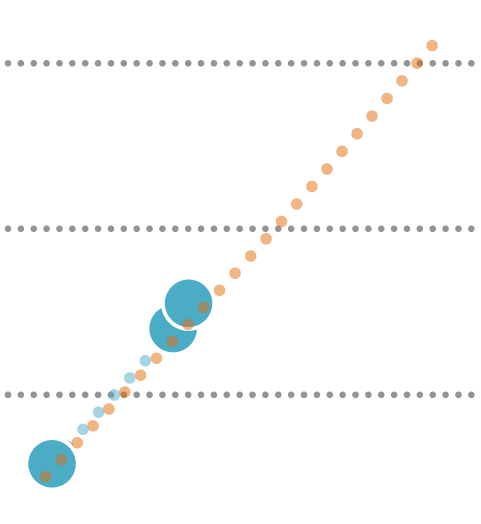
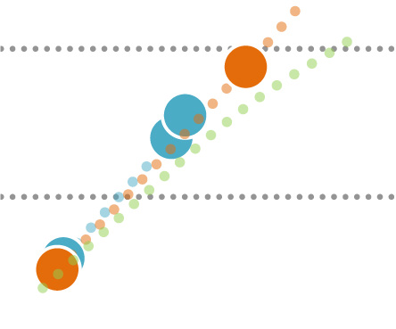

# WorldEnergyOutlook2025 - Part 5

*Pages 201-250*

## Page 201

Chapter 4 | Stated Policies Scenario 
201
 
4 
generating renewed optimism. This momentum follows a challenging period marked by 
delays and cost over-runs in several high-profile projects in Europe and the United States. 
Globally, nuclear power output doubles to 2050 in the STEPS, maintaining a stable 9% share 
of electricity generation but falling well short of global initiatives to triple capacity. In the 
European Union, share of nuclear generation dropped from one-third in the late 1990s to 
23% in 2024, and is projected to fall to 17% by 2035. The United States sees steady nuclear 
output to 2030, followed by strong growth that boosts its share from 18% today to over 20% 
in the long term. The nuclear share in the generation mix is also rising in Japan, Korea, India, 
Africa, Russia, Middle East and Brazil. In China, the nuclear share also edges up, outpacing 
soaring electricity demand, as the size of the nuclear fleet becomes the largest in the world 
in the early 2030s and it accounts of nearly half of global nuclear expansion to 2050. 
Box 4.4 ⊳ 
Competitiveness of solar PV, wind and battery storage 
Since 2010, the levelised cost of electricity (LCOE) has declined by 90% for solar PV, 70% 
for wind generation and 90% for batteries, driven down by innovation, manufacturing 
gains and improved performance. Costs are projected to decline further by about 40% 
for solar PV, 30% for batteries and about 10% for onshore wind from 2024 to 2035. 
In the STEPS, projected LCOEs for 2035 show that new solar PV, onshore and offshore 
wind have similar or lower average generation costs than new coal, gas and nuclear in 
the United States, European Union and China. However, assessing the competitiveness 
of power technologies requires looking beyond LCOE to the value these technologies 
provide to power systems. While LCOE captures all technology costs, i.e. construction, 
operation and maintenance, fuel and CO2 emissions (where they have a price), it does 
not reflect when electricity is produced, its contribution to system adequacy and stability, 
or its ability to provide flexibility. The value-adjusted levelised cost of electricity 
(VALCOE), developed for and used in the IEA Global Energy and Climate Model accounts 
for these factors, offering a more complete metric, though it does not assign grid 
expansion costs to individual technologies and does not include emissions that are not 
priced in markets (IEA, 2025b). The VALCOE can also be compared to system average 
generation costs as an indicator of affordability (Figure 4.25). 
The increasing competitiveness of solar PV and wind power has played an important part 
in their rapid expansion in many markets. A full assessment of their competitiveness 
depends on the value they bring to the system, which is influenced by weather variability 
and the cannibalisation effect. This effect, in which simultaneous output from many 
projects puts downward pressure on market prices and, in turn, their market value, is 
already evident in several markets with more and more hours of negative prices (IEA, 
2025c). As a result, by 2035, pairing solar PV with four-hour battery storage, e.g. 
20 megawatt (MW)/80 megawatt-hour (MWh) of battery storage paired with 100 MW of 
solar panels, becomes more competitive than standalone PV in major markets, as the 
added value of dispatchability outweighs the additional cost. 
IEA. CC BY 4.0.

---

## Page 202

202 
International Energy Agency | World Energy Outlook 2025
 
Figure 4.25 ⊳ 
LCOE and VALCOE of power technologies in selected 
regions in the STEPS, 2035 
United States 
 
China 
 
European Union 
 
 
IEA. CC BY 4.0. 
Solar PV and wind are competitive with dispatchable sources in major markets in 2035 
Notes: LCOE = levelised cost of electricity; VALCOE = value-adjusted levelised cost of electricity. MWh = 
megawatt-hour; MER = market exchange rate. 4-hr refers to battery storage duration. 24/7 refers to the 
ability to provide power in all hours of the day and all week. Availability factor is the share of nameplate 
capacity that can be reliably expected to generate electricity during times of peak demand. 
 30
 60
 90
 120
 150
Coal
Gas
Nuclear
Solar PV
Hybrid
USD per MWh (2024, MER)
Wind
System
Dispatchable
Variable renewables
Annual Capacity Factor:
23%
44% 46%
40%
55%
90%
21% 95%
95%
Average 
costs
On
Offshore
Availability Factor:
5%
20% 20%
95%
95%
95%
20% 95%
95%
24/7 supply
4-hr 
24/7 supply
 30
 60
 90
 120
Coal
Gas
Nuclear
Solar PV
Hybrid
USD per MWh (2024, MER)
Wind
System
Dispatchable
Variable renewables
Annual Capacity Factor:
12%
24% 32%
35%
20%
70%
11% 95%
95%
Average 
costs
Onshore
Offshore
Availability Factor:
5%
10% 15%
95%
95%
95%
20% 95%
95%
24/7 supply
4-hr batt.
24/7 supply
 60
 120
 180
 240
Coal
Gas
Nuclear
Solar PV
Hybrid
USD per MWh (2024, MER)
Wind
System
Dispatchable
Variable renewables
Annual Capacity Factor:
14%
30%54%
30%
20%
75%
13% 95%
95%
Average 
costs
On
Off
Availability Factor:
5%
15%25%
95%
95%
95%
20% 95%
95%
24/7 supply
4-hr
24/7 
Fixed
Fuel and CO₂            
Grids
Generation
LCOE
System cost
VALCOE
IEA. CC BY 4.0.

---

## Page 203

Chapter 4 | Stated Policies Scenario 
203
 
4 
It is technically feasible to combine solar PV, wind and battery storage to operate at an 
average capacity factor of 95% throughout the year, effectively providing power for 
24 hours per day, seven days a week (24/7), comparable to what dispatchable sources of 
electricity can offer. Achieving this level of reliability from solar PV and wind installations 
requires system oversizing and storage to manage weather variability. For example, to 
be able to deliver 100 MW firm capacity, a project might include 600 MW of solar PV and 
400 MW/1 600 MWh of battery storage behind the same inverter. Despite significant 
amounts of surplus electricity above 100 MW, (curtailed in this example, but potentially 
available for other uses if a grid connection is available), such a system could reach a 
value-adjusted levelised cost of electricity of around USD 75/MWh in China, 
USD 135/MWh in the United States and USD 180/MWh in the European Union, which is 
comparable to some dispatchable sources. Including onshore wind in hybrid projects  
could reduce these costs by 10–45%, making them competitive with coal, gas and 
nuclear, and similar to average generation costs in 2035. This level of availability and cost 
would make solar PV plus storage and hybrid projects attractive for the grid, or 
consumers that require 24/7 electricity, including industrial applications and data centres 
(IEA, 2025c). 
Natural gas-fired power generation shows diverging regional trends (Figure 4.26). In the 
United States, gas use in the power sector continues to rise in the medium term before 
entering a gradual long-term decline, while the European Union sees significant reductions 
in gas-fired generation as it pursues ambitious renewable energy targets and seeks to reduce 
reliance on imported gas. In contrast, natural gas use continues to rise in emerging market 
and developing economies, with particularly strong growth in the Middle East, Southeast 
Asia and Africa, where its plays a key role to meet rising electricity demand. 
Coal-fired power is approaching a turning point after decades of growth, with global trends 
increasingly shaped by developments in Asia. In China – the world’s largest coal consumer – 
the rapid scaling-up of renewables and nuclear leads to coal generation reaching a peak by 
2030. India is on a similar path, with rapid renewables deployment putting it on track to see 
coal use peak around the same time. However, coal-fired generation in Southeast Asia is 
projected to continue to rise through to 2040. Meanwhile, many other countries are actively 
phasing out unabated coal-fired power generation. The United Kingdom ended it in 2024. 
The European Union has made notable progress towards this goal, with Slovakia joining 
Belgium, Austria, Sweden and Portugal in achieving coal-free electricity generation, while 
Ireland targets a phase-out by the end of 2025. In Southeast Asia, the updated power plan in 
Viet Nam targets a full coal-phase out by 2050 through fuel switching to biomass or 
ammonia, while Indonesia has banned new coal plants not already planned and aims for a 
full phase-out by mid-century. Transition credit schemes are emerging as a financial tool to 
support efforts to shift from high-carbon sources, including coal, to low-carbon sources.  
IEA. CC BY 4.0.

---

## Page 204

204 
International Energy Agency | World Energy Outlook 2025
 
Figure 4.26 ⊳ Electricity generation by fuel and region in the STEPS, 2015-2050  
 
IEA. CC BY 4.0.
Natural gas remains a leading source of electricity generation; coal sees a steep decline, 
with over 55 countries aiming to phase it out; and oil continues to decline 
Note: TWh = terawatt-hours; C & S America = Central and South America.  
Oil use in the power sector is already at a relatively low level and is set to decline rapidly in 
the coming years in the STEPS, with particularly steep reductions in the Middle East as 
countries like Saudi Arabia pursue their 2030 energy transition goals. Across the Middle East 
and North Africa, this shift could free up significant volumes of oil and gas for export, with 
major implications for global markets and regional revenues. In Africa, however, oil remains 
an important source of electricity generation, especially for expanding access in remote and 
underserved communities. In most other regions, oil-fired generation is limited and typically 
confined to isolated areas where alternatives are not yet viable.  
Dispatchable sources of electricity continue to play a vital role to ensure power system 
reliability and flexibility at a time when electricity demand is rising fast (Figure 4.27). Coal-
fired power remains the largest dispatchable source worldwide until 2035, with capacity set 
to peak at around 2 500 GW in the early 2030s, driven by new construction in China, India 
and Southeast Asia. Natural gas-fired capacity also sees robust growth and overtakes coal, 
though supply constraints and long wait times for turbines are emerging in some fast-
growing data centre markets. Among low-emissions options, hydropower remains the 
largest dispatchable source, followed by nuclear and bioenergy. Battery storage sees a major 
breakthrough in the STEPS, adding 1 700 GW to 2035, which comes close to matching the 
new capacity of all other dispatchable sources combined. It plays a critical role in providing 
short-term flexibility, while seasonal balancing continues to rely on hydropower and thermal 
generation (see Chapter 5). 
0.3
0.6
0.9
1.2
2015 2024
Thousand TWh
North America
European Union
Japan and Korea
China
Southeast Asia
C & S America
Middle East
Africa
Oil
2050
India
Rest of world
 3
 6
 9
 12
2015 2024
Coal
2050
 2
 4
 6
 8
2015 2024
Natural gas
2050
IEA. CC BY 4.0.

---

## Page 205

Chapter 4 | Stated Policies Scenario 
205
 
4 
Figure 4.27 ⊳ Global installed power capacity of variable and dispatchable 
electricity sources in the STEPS, 2000-2035 
 
IEA. CC BY 4.0.
Nearly all forms of dispatchable power capacity continue to expand globally to 2035, 
including coal, natural gas and batteries, while variable sources of power skyrocket  
Notes: GW = gigawatt; CCUS = carbon capture, utilisation and storage. Other renewables include bioenergy 
and renewable waste, concentrating solar power, geothermal and marine. Other includes oil, non-renewable 
waste and other sources. 
Renewables are set to expand significantly in the STEPS. Their installed capacity nearly triples 
by 2035, raising the renewables share of global electricity generation from one-third in 2024 
to over half. Solar PV and wind continue to lead the way, with solar PV capacity projected to 
increase more than fourfold to 2035 with annual additions reaching around 650 GW. 
Accelerated repowering programmes for solar PV could enable energy outputs to increase 
still further (Box 4.5). Wind capacity increases two-and-a-half-times by 2035, with 
particularly robust growth in the European Union offshore wind sector and China onshore 
wind installations. There are also repowering opportunities for onshore wind, particularly in 
the United States and Europe which have numerous ageing installations: these could boost 
capacity and output at existing sites, though permitting and licensing processes may need to 
be streamlined. 
Box 4.5 ⊳ 
Accelerated solar repowering could boost the market 
Solar repowering refers to the process of replacing ageing or underperforming solar PV 
systems to increase electricity production, extend the system operational lifetime and 
improve the return on investment. There is mounting evidence that solar panels installed 
in the early 2010s, particularly in utility-scale projects, are now being replaced in many 
instances after just 10-15 years of operation because the technology is outdated or their 
performance has degraded. Today, solar panels are 40% more efficient than those from 
 3
 6
 9
 12
2000
2024
Battery storage
Hydrogen, ammonia
and CCUS
Other renewables
Hydro
Nuclear
Other
Natural gas
Coal
Dispatchable sources
Thousand GW
2035
2000
2024
Wind
Solar PV
Variable sources
2035
Variable
Dispatchable
of which, unabated
IEA. CC BY 4.0.

---

## Page 206

206 
International Energy Agency | World Energy Outlook 2025
 
2010, so replacing old panels while reusing existing infrastructure can increase energy 
output in a cost-effective way. Replacing solar panels once after 10 to 15 years instead 
of operating them for 20 to 30 years could reduce the overall LCOE by up to 20% under 
good conditions (Joel, Woodhouse and Bulović, 2019). 
Figure 4.28 ⊳ Global solar PV panel market in the STEPS and with 
accelerated repowering, 2010-2050 
 
IEA. CC BY 4.0. 
Shortening the replacement schedule for solar PV panels could drive further market 
growth, expanding it by up to 55% in 2035 without raising operational solar capacity 
According to our analysis, an accelerated repowering schedule could lead to a substantial 
increase in the size of the solar PV panel market, benefiting from the current oversupply 
of solar products (Figure 4.28). Without increasing the total installed capacity in the 
projection period to 2050, an accelerated repowering schedule for solar PV power 
around the world could increase the solar PV panel market size by up to 60% in 2035 
compared to the level in the STEPS, and double it by 2040, sustaining continued long-
term market growth. 
The accelerated repowering schedule would also raise the average performance of the 
solar PV fleet, due to faster stock turnover and uptake of higher efficiency panels. For 
example, a 2% absolute increase in the average efficiency of a panel would result in over 
10% higher electricity output from each panel with the same rated capacity. By 2035, 
that would mean up to 15% higher electricity output from solar PV globally. Repowering 
solar projects could also increase the total capacity for a given amount of space, though 
this may require upgrades to inverters, cabling and grid agreements, or may be restricted 
by regulatory capacity limits. Repowering might also require existing contracts to be 
reviewed, which could risk the loss of preferential tariffs. 
 500
1 000
1 500
2 000
2010
2020
2030
2040
2050
GW
STEPS
Solar repower
IEA. CC BY 4.0.

---

## Page 207

Chapter 4 | Stated Policies Scenario 
207
 
4 
4.4.3 
Electricity grids 
Electricity grids are the backbone of modern power systems and will remain essential to 
ensure energy security, particularly in the emerging Age of Electricity. As electricity demand 
increases and energy transitions accelerate, grids must be modernised and expanded to 
connect new sources of generation such as wind and solar PV to demand centres in a timely 
and reliable manner. While distribution lines continue to make up over 90% of total grid 
length, transmission lines are a particular focus of attention because they need to be 
expanded to accommodate renewables, which are often located far from existing 
infrastructure. In the STEPS, global grid lengths increase by 30% between 2024 and 2035, 
reaching 110 million km, and by another 35% by 2050. Advanced economies see a 10% grid 
expansion by 2035, while emerging market and developing economies expand their grids by 
40% over the same period. In parallel, ageing infrastructure must be replaced – nearly 
20 million km by 2035 and another 30 million by 2050 – with advanced economies facing the 
most urgent needs due to the age of their existing assets (see Chapter 3). 
Achieving this transformation is not without challenges. Grids are becoming more complex, 
and long lead times for grid development, often over a decade for major transmission 
projects, are already causing delays, with swelling connection queues for renewables and 
long wait times for new grid connections (IEA, 2025d). More proactive planning processes, 
regulatory frameworks that support anticipatory investment, and an expansion of 
performance-based regulation could all help address the problems (IEA, 2023). Meanwhile 
supply chain constraints are tightening, especially for critical components like transformers, 
which have seen prices and delivery times nearly double in recent years (IEA, 2025d). These 
constraints also extend to raw materials. For example, grid expansion is a major driver of 
copper demand, and current project pipelines suggest a potential 30% shortfall in copper 
supply by 2035 (IEA, 2025e). Overcoming these hurdles is vital to ensure that electricity grids 
can support secure, affordable and sustainable electricity supply. 
4.5 
Fuels 
The share of fossil fuels in global energy demand was around 87% in the 1970s and now is 
around 79%. In the STEPS, it drops to around 70% in 2035 and to less than 60% in 2050. Fossil 
fuel use in advanced economies has fallen by around 10% over the past decade, while it has 
increased by around 25% in emerging market and developing economies. In the STEPS, 
demand falls by around 15% in advanced economies to 2035 and increases by around 1% in 
emerging market and developing economies: the net effect is that global fossil fuel demand 
declines by more than 4% to 2035 (Figure 4.29). 
Global oil demand reached 100 mb/d in 2024. In the STEPS, it increases to a peak level of 
102 mb/d around 2030. It then gradually falls, and by 2035 it is back to around its 2024 level, 
with notable reductions in demand from passenger cars and the power sector, more than 
offset by increases from petrochemicals, aviation and other industrial activities. On the 
supply side, increases from the Middle East, Central and South America, and North America 
IEA. CC BY 4.0.

---

## Page 208

208 
International Energy Agency | World Energy Outlook 2025
 
to 2035 are largely offset by declines in mature producers, including Europe, Russia and 
Mexico. 
Figure 4.29 ⊳ Fossil fuel demand in the STEPS to 2050 
 
IEA. CC BY 4.0.
Demand for coal peaks before 2030 and for oil around 2030.  
Natural gas reaches its maximum level around 2035 and then levels off.  
Note: mb/d = million barrels per day; bcm = billion cubic metres; tce = tonne of coal equivalent. 
Natural gas demand expands from 4 250 bcm today to 4 750 bcm in 2035 and it remains 
around this level thereafter in the STEPS. To 2035, declining demand in advanced economies 
is more than offset by increased demand in the industry and power sectors of emerging 
market and developing economies in Asia and the Middle East. 
Coal demand rose to around 6 100 million tonnes of coal equivalent (Mtce) in 2024 – a record 
high. It remains around this level for a few years before starting to decline. By 2035, demand 
is around 20% lower than in 2024, a drop of 1 200 Mtce. Coal demand in China falls by more 
than 800 Mtce to 2035, which is around the total level of coal demand in advanced 
economies in 2024. 
4.5.1 
Oil 
Demand 
Oil demand rises from 100 mb/d in 2024, peaks around 2030, and then declines to 
100 mb/d by 2035. It subsequently falls by around 0.2 mb/d each year on average from 2035 
to 2050. 
China was responsible for more than 75% of the increase in global oil demand between 2015 
and 2024, and today it consumes around 16 mb/d. The electrification of road transport in 
China is the main reason for the global peak in oil demand in the STEPS: half of passenger car 
 20
 40
 60
 80
 100
 120
2000
2050
Oil (mb/d)
2024
Advanced economies
Emerging market and developing economies
International bunkers
 1
 2
 3
 4
 5
 6
2000
2050
Coal (billion tce)
2024
 1
 2
 3
 4
 5
 6
2000
2050
Natural gas (thousand bcm)
2024
IEA. CC BY 4.0.

---

## Page 209

Chapter 4 | Stated Policies Scenario 
209
 
4 
sales in China today are electric, and this share is 90% by 2035. As a result, oil demand in 
China peaks in the STEPS before 2030 and falls to around 15 mb/d by 2035. 
Oil demand in India increases by 2 mb/d to 2035 – the largest increase in any country – and 
continues to rise through to 2050. The next largest increases to 2035 are in Africa (1.2 mb/d), 
and Southeast Asia (1 mb/d). In the Middle East, falling oil use in the power sector (1.4 mb/d) 
is more than offset by growth in petrochemical feedstock and road transport. 
Figure 4.30 ⊳ Global oil demand by end-use and region in the STEPS to 2050 
 
IEA. CC BY 4.0.
Electrification of road transport is the primary cause of the peak in oil demand around 2030; 
oil use remains more resilient in petrochemical feedstock and aviation 
Notes: mb/d = million barrels per day; Other industries = industry sector excluding petrochemicals; Other = 
other non-energy use, other energy sectors, power, agriculture, other transport. Excludes biofuels. 
Oil demand in advanced economies fell by around 1.5 mb/d between 2015 and 2024, and it 
falls by a further 5.3 mb/d to 2035 in the STEPS. Declines in demand are slowest in North 
America, 6% to 2035, and fastest in the European Union at 30% (Figure 4.30). 
The largest increases in demand for oil globally to 2035 are for its use as petrochemical 
feedstock (up by 3.3 mb/d to 2035), and in aviation (2.2 mb/d). The largest declines in oil 
demand reflect its displacement in cars (2.6 mb/d), and in the buildings sector (1.3 mb/d). 
Supply 
Oil supply peaks around 2030 in the STEPS and returns to 2024 levels in 2035. Increases in 
output by countries in the Middle East, Central and South America, and North America to 
2035 are largely offset by declines in mature producers including Europe, Russia and Mexico 
(Figure 4.31). The share of OPEC+ in global oil supply remains around today’s level of 50% to 
2035 in the STEPS before increasing to 53% in 2050 as a result of rising supply from the 
Middle East. 
 25
 50
 75
 100
2000
2024
2050
Cars
Road freight
Aviation
Petrochemicals
Other industries
Buildings
mb/d
By sector
Shipping
Other
 20
 40
 60
 80
2000
2024
2050
Advanced economies
Emerging market and 
developing economies
By region
IEA. CC BY 4.0.

---

## Page 210

210 
International Energy Agency | World Energy Outlook 2025
 
Figure 4.31 ⊳ Global oil supply by region and category in the STEPS to 2050 
 
IEA. CC BY 4.0.
Middle East oil production supports robust supplies of NGLs, while the  
multidecadal contraction in the conventional crude oil share continues  
Note: mb/d = million barrels per day; C & S America = Central and South America; NGLs = natural gas liquids; 
EHOB = extra-heavy oil and bitumen. 
Middle East total oil supply increases by 2 mb/d to 2035, with the output of natural gas 
liquids (NGLs) increasing by over 2.5 mb/d over this period. Half of the increase in oil supply 
comes from Saudi Arabia, and it is derived from liquid-rich gas fields, including the 
unconventional Jafurah field, and its legacy onshore crude oil supergiant fields. Qatar 
increases production by close to 1 mb/d, most of which consists of NGLs from its supergiant 
North Field (Figure 4.32). The United Arab Emirates increases supply by around 0.5 mb/d to 
2035 from 4 mb/d in 2024 following the expansion of its legacy fields and the capture of 
increasing amounts of NGLs from natural gas processing. 
In Central and South America, the continued development of the Stabroek block in Guyana, 
the further expansion of the pre-salt ultra-deepwater fields in Brazil, and the ramp up of tight 
oil resources in Argentina, mean that their aggregate supply increases from 5 mb/d in 2024 
to 7.5 mb/d to 2035. Suriname starts production from its offshore fields in the late 2020s, 
and production rises to 0.3 mb/d in 2035. 
In the United States, oil supply in 2035 is 21.5 mb/d, slightly higher than in 2024 (21 mb/d). 
The United States remains the world’s largest oil producer to 2050. Canada adds 0.8 mb/d to 
2035, supported by pipeline expansions that facilitate debottlenecking and increased NGL 
volumes from shale plays. 
Supply in Mexico fell marginally in 2024 to 2 mb/d. While new projects such as Trion, Polok-
Chinwol and Zama are expected to start by 2030, overall production still declines by 0.8 mb/d 
 20
 40
 60
 80
 100
2000
2050
Middle East
North America
Eurasia
Asia Pacific
C & S America
Africa
Europe
mb/d
2024
 20%
 40%
 60%
 80%
 100%
2000
2050
Onshore
Offshore
NGLs
Tight oil
EHOB & other
2024
By region
By category
IEA. CC BY 4.0.

---

## Page 211

Chapter 4 | Stated Policies Scenario 
211
 
4 
to 2035. Supply in Venezuela drops by 0.3 mb/d to 2035 to 0.6 mb/d, its lowest-ever 
sustained level of output. 
Figure 4.32 ⊳ Change in oil supply in selected producing countries between 
2024 and 2035 in the STEPS 
IEA. CC BY 4.0.
Supply increases to 2035 come mainly from countries in the Americas  
and the Middle East, and falls from mature producers  
Supply in Europe falls from 3.8 mb/d in 2024 by 1.4 mb/d to 2035. Despite the start-up of 
the Johan Castberg field in 2025, supply from Norway falls from 2 mb/d in 2024 by about 
40% to 2035. Output in the United Kingdom falls by 35% as ageing fields face high decline 
rates. 
Supply in Nigeria falls from 1.6 mb/d in 2024 by 0.3 mb/d to 2035. Supply in Algeria also 
contracts by 0.3 mb/d. Namibia and Uganda post the largest increases in Africa, 0.3 and 
0.2 mb/d each, with Uganda expected to achieve its first oil in 2027 from projects in the Lake 
Albert Rift Basin. 
Russian supply contracted by 0.3 mb/d in 2024 to close to 11 mb/d, lower than before its 
invasion of Ukraine. Sharp declines in oil revenues in 2024 created major profitability 
challenges that are undercutting on-going capital commitments; some large projects already 
face delays, e.g. the Vostok Oil project. Production falls by around 1 mb/d to 2035. 
China is currently the world’s fifth-largest oil producer at 5 mb/d, having increased supply by 
around 7% over the past decade. The resource base in China is maturing, and production falls 
by 0.7 mb/d to 2035 because the oil price in the STEPS is not sufficient to incentivise large-
scale development of its tight oil resources. 
Iran increased supply by more than 0.4 mb/d in 2024 to 4.7 mb/d, but output contracts 
marginally to 4.5 mb/d in 2035.  
-1.5
-1.0
-0.5
0
0.5
1.0
1.5
Guyana
Saudi Arabia
Brazil
Qatar
Canada
Argentina
United States
Venezuela
China
Norway
Mexico
Russia
mb/d
IEA. CC BY 4.0.

---

## Page 212

212 
International Energy Agency | World Energy Outlook 2025
 
Refining 
In the STEPS, demand for refined products peaks before 2030 at 86 mb/d, around 0.7 mb/d 
above 2024 levels, and demand in 2035 is 85 mb/d. By 2050, accelerating declines in gasoline 
and diesel consumption outweigh continued growth in refined petrochemical feedstock and 
jet fuel. This presents a major challenge for the refining industry, since it marks an end to the 
many years of steadily rising demand for road transport fuel that have been the bedrock of 
refinery profitability. Peak demand for vehicle gasoline and diesel is reached in the next few 
years. Demand for middle distillates is more robust with continued growth in demand for jet 
kerosene (Figure 4.33). Increases in fractionated NGLs supply and biofuels minimise the need 
for new refinery capacity to meet demand growth through to 2035. Of the 3.3 mb/d increase 
in petrochemical feedstock demand to 2035, more than half is met by non-refined fuels. 
After 2035, however, shrinking NGLs supply means demand will increasingly be met by 
refined products. 
Figure 4.33 ⊳ Demand for selected refined and fractionated products in the 
STEPS to 2050 
 
IEA. CC BY 4.0.
As demand for road transport fuels contracts,  
aggregate demand for petrochemical feedstock expands 
Notes: mb/d= million barrels per day; LPG = liquefied petroleum gas. Diesel, gasoline and kerosene include 
transport use only; naphtha, LPG and ethane include petrochemical use only. 
Despite weak demand growth for refined products in the STEPS, 6 mb/d of new refining 
capacity comes online in the period to 2035, which is largely offset by 5 mb/d of closures. 
This new capacity is located mainly in Asia, especially China and India, and to a lesser extent 
in the Middle East. The on-going shift towards large, integrated refining and petrochemical 
complexes continues, benefiting from economies of scale and lower operating costs. 
Refinery closures are largely concentrated in Europe and the United States, where ageing 
facilities face higher operating costs. In China, capacity remains flat through to 2035, with 
the commissioning of large, integrated refineries offset by the phasing out of smaller and 
ageing plants.   
 10
 20
 30
2015
2024
2035
2050
Diesel
Gasoline
Kerosene
Petrochemical feedstock (mb/d)
Transport fuels (mb/d)
 3
 6
 9
2015
2024
2035
2050
Naphtha
LPG
Ethane
IEA. CC BY 4.0.

---

## Page 213

Chapter 4 | Stated Policies Scenario 
213
 
4 
Trade 
In the STEPS, trade flows increasingly shift towards emerging market and developing 
economies in Asia. Less than 60% of global net trade of oil was to these countries in 2024; 
this figure reaches 65% in 2035 and exceeds 75% in 2050. 
China remains the largest net importer of oil to 2050, absorbing more than a quarter of global 
oil trade, but imports fall by 1 mb/d to 2035. India emerges as a strong demand hub, with a 
50% increase in imports reaching around 7 mb/d in 2035. Southeast Asia imports rise by 
1.5 mb/d between 2024 and 2035, while Japan and Korea imports fall by 0.6 mb/d. 
Figure 4.34 ⊳ Net oil trade for selected major exporters and importers in the 
STEPS to 2050 
 
IEA. CC BY 4.0.
New trade dynamics emerge as Eurasian supply loses ground,  
non-OPEC supply picks up, and Asian countries dominate the long-term demand 
Note: mb/d = million barrels per day; CSAM = Central and South America. 
The Middle East maintains its position as the dominant net exporter in the STEPS, exporting 
almost three-times more than the next largest exporter in 2035. Supply increases by 
1.5 mb/d by 2035, and efforts to cut domestic demand for power generation avoid the use 
of about 1.5 mb/d of oil that is then freed for international trade. North American exports 
increase by more than 2 mb/d to 2035, although Mexico soon becomes a net importer. Africa 
also becomes a net oil importer in aggregate as increased production from new producers, 
including Uganda and Namibia, is more than offset by declining production from mature 
producers, mainly Algeria, Angola and Nigeria, and by increased demand. Russia and Caspian 
see a near-20% decline in export volumes to 2035 (Figure 4.34). 
Net exporters (mb/d)
Net importers (mb/d)
2015
2050
21
8
4
2
4
4
5
7
8
11
2
Caspian
26
7
10
7
6
3
5
3
3
31-2
Middle East
Russia
Africa
North 
America
CSAM
2015
2050
-3
China
Europe
Japan 
and Korea
Southeast 
Asia
India
Other Asia Pacific
2024
2024
2035
2035
IEA. CC BY 4.0.

---

## Page 214

214 
International Energy Agency | World Energy Outlook 2025
 
4.5.2 
Natural gas 
Demand 
In the STEPS, natural gas demand grows at an average of 50 bcm per year between 2024 and 
2035. Demand reaches just under 4 800 bcm in 2035 and then remains around this level 
through to 2050. Long-term natural gas demand growth is kept lower than in recent decades 
by the expanding deployment of renewables, efficiency gains and electrification of end-uses. 
Demand for natural gas in advanced economies declines from 1 850 bcm in 2024 to 
1 750 bcm in 2035. In the European Union, natural gas demand peaked in 2010, and it has 
fallen by around 20% since Russia's invasion of Ukraine at the start of 2022, to a level of 
around 330 bcm in 2024. Demand falls by a further 20% between 2024 and 2035, to 260 bcm, 
as stated policy measures take effect that reduce gas imports and lower the share of gas in 
the electricity generation mix. Gas demand in Japan peaked in the early 2010s and now 
stands at around 90 bcm: it falls by 3 bcm by 2035. US domestic gas demand was 940 bcm in 
2024 and it levels off before 2035. 
Figure 4.35 ⊳ Global natural gas demand by sector and region in the STEPS 
to 2050 
 
IEA. CC BY 4.0.
Natural gas demand growth levels off in the mid-2030s, with reductions in North America 
and Europe more than offsetting increases in Asia Pacific and Middle East  
Note: bcm = billion cubic metres; Int. bunkers = international bunkers. 
Demand for gas in emerging market and developing economies increases from 2 400 bcm in 
2024 to 2 950 bcm in 2035 (Figure 4.35). Half of this growth comes from emerging market 
and developing economies in Asia, led by China with 160 bcm of growth, and most of the 
remainder from the Middle East. By 2035, the Middle East accounts for just under 20% of 
global gas use in the power sector, up from 15% today. 
2 000
4 000
6 000
2000
2035
2050
Power
Industry
Buildings
Transport
Other
bcm
2000
2035
2050
Asia Pacific
North America
Middle East
Eurasia
Europe
Africa
Central
Int. bunkers
By sector
By region
and South America
2024
2024
IEA. CC BY 4.0.

---

## Page 215

Chapter 4 | Stated Policies Scenario 
215
 
4 
Supply 
Growth in natural gas supply is led by the Middle East and the United States in the STEPS 
through to 2035, with their combined output increasing by close to 450 bcm (Figure 4.36). A 
number of gas producing countries, including Australia and Norway, see their output decline 
as fields mature in the period to 2035. 
Figure 4.36 ⊳ Natural gas by producing country in the STEPS, 2024 and 2035 
 
IEA. CC BY 4.0.
The Middle East and United States drive growth in global gas supply to 2035,  
and they add around 250 bcm to their combined export capacity 
The United States maintains its position as the world’s largest natural gas producing country. 
Production rises by 150 bcm to 2035 before declining to 2050. Domestic demand increases 
at a slower pace than supply to 2035 and then falls faster than supply to 2050, leaving room 
to develop additional export capacity: the share of US natural gas produced for export rises 
from 12% today to 20% in 2035 and 30% in 2050. 
The Middle East sees the largest growth in supply in the STEPS to 2035, led by Qatar, Saudi 
Arabia and the United Arab Emirates. Qatar natural gas production increases by 70% 
between 2024 and 2035, with nearly all of the 120 bcm growth earmarked for export. 
Natural gas production falls in Russia from 680 bcm in 2024 to 670 bcm in 2035, while net 
exports fall by 10% over the same period. Declining profits limit upstream investment and 
production declines at mature fields such as Urengoy and Yamburg. 
Gas production in Europe falls by 20%, 50 bcm, to 2035, with the commissioning of new 
offshore developments in the Black Sea and eastern Mediterranean region more than offset 
by decreases in other fields, notably in Norway, where production decreases by more than 
30% between 2024 and 2035. 
 250
 500
 750
1 000
1 250
2024
2035
2024
2035
2024
2035
2024
2035
2024
2035
2024
2035
2024
2035
2024
2035
2024
2035
2024
2035
bcm
Domestic consumption
Net export
United 
States Russia
Iran
China
Canada Qatar Australia
Algeria
Norway Saudi 
Arabia
IEA. CC BY 4.0.

---

## Page 216

216 
International Energy Agency | World Energy Outlook 2025
 
Trade 
Around 1 100 bcm of natural gas is traded over long distances each year, equivalent to a 
quarter of global gas demand. A little over half of this total is traded in the form of LNG.  
A large wave of new LNG supply is expected to come online over the next several years. After 
taking into account anticipated declines in supply from existing LNG export projects, global 
available LNG export capacity is set to rise from 565 bcm in 2024 to 830 bcm in 2030 
(Box 4.6). This is much higher than the growth in demand, implying significant slack in global 
gas markets and putting downward pressure on natural gas prices and narrowing the spreads 
between key regional gas price benchmarks. This leads to significant demand response in 
price sensitive regions such as India and Southeast Asia. Still, in 2030, around 65 bcm of 
available LNG capacity is surplus to requirements in the STEPS. Based on currently announced 
projects, some of which come online after 2030, this surplus is gradually worked off by 2035 
and by 2040 around 65 bcm per year of new LNG export capacity is required. 
Box 4.6 ⊳ 
Assessing available LNG capacity 
LNG liquefaction terminals often report their annual nameplate capacity, which is the 
maximum rated output of the plant. In practice, LNG terminals do not always run at 100% 
of nameplate capacity. This is because of maintenance work, unplanned outages or issues 
at upstream facilities, because of the time taken for newly commissioned terminals to 
ramp up to full capacity, and because of fluctuations in demand, for example, between 
seasons or as a result of a drop in market demand.  
In 2024, global nameplate LNG capacity was 665 bcm on an annualised basis, while actual 
LNG demand totalled around 560 bcm, implying a global utilisation rate of nameplate 
LNG export capacity of 85%. Over the last decade, this utilisation rate has varied between 
75% and 85%. 
In our scenarios, we use a value of 85% to de-rate the nameplate capacity of existing LNG 
terminals in order to account for maintenance and unplanned outages, and we assume 
95% utilisation rates for under construction LNG terminals once they become fully 
operational. These factors reduce the nameplate capacity of LNG terminals down to the 
available capacity. 
Around 290 bcm of new nameplate LNG capacity is currently under construction and is 
set to come online by 2030, and around 10 bcm of capacity is likely to be shut down by 
2030 as plants reach the end of their technical or economic lifetime. As a result, available 
LNG capacity expands by around 265 bcm between 2024 and 2030, compared with 
200 bcm of growth in LNG demand over this period.  
In 2035, more than 75% of total LNG exports flow to Asia in the STEPS, up from just under 
70% in 2024. China has been the world’s most active LNG buyer in recent years, accounting 
for around 25% of new long-term LNG contracts signed since 2020. China increases its LNG 
IEA. CC BY 4.0.

---

## Page 217

Chapter 4 | Stated Policies Scenario 
217
 
4 
imports by around 55 bcm to 2035, and an additional 20 bcm of pipeline gas is imported 
through expansion of the Power of Siberia I and Far East pipelines from Russia. Total imports 
in 2035 in China reach around 250 bcm, more than double the volumes of India, the next 
largest importing country. China becomes increasingly influential in balancing global gas 
markets through to 2035 as it actively manages its portfolio of pipeline, LNG, domestic 
production and storage assets, backed by a mix of long-term, short-term and flexible gas 
contracts. 
Figure 4.37 ⊳ Change in natural gas supply balance in selected regions in 
the STEPS, 2024-2035 
 
IEA. CC BY 4.0.
LNG meets 285 bcm of the growth in natural gas demand in key importing regions 
Note: bcm = billion cubic metres; LNG = liquefied natural gas. 
In India, growth in natural gas demand to 2035 is largely met by LNG imports, which almost 
triple between 2024 and 2035. There are also large increases in LNG imports in other regions 
in Asia which need gas imports to compensate for declining domestic production and to meet 
additional demand growth. These include Southeast Asia, where LNG imports rise from 
35 bcm today to 135 bcm in 2035, and other developing Asia, primarily Pakistan and 
Bangladesh, where LNG imports increase from 45 bcm to 80 bcm over the same period.  
LNG imports to the European Union rise from 110 bcm in 2024 to 145 bcm in 2035 to 
compensate for declining domestic production and a drop in pipeline supply. Total imports 
fall by 65 bcm from 2024 levels, tracking the fall in overall European Union demand. In Japan 
and Korea, LNG imports stay flat at around 90 bcm and 60 bcm, respectively. 
Today, the United States is the world’s largest LNG exporter, and it leads the growth of new 
capacity, accounting for around 160 bcm of projects under construction, 50% of the global 
total. These projects bring its total nameplate LNG capacity to 300 bcm per year in 2030. Its 
LNG exports reach 240 bcm by 2035 and its pipeline exports to 80 bcm. 
-100
0
100
200
China
India
Southeast
Asia
Other Asia
Japan
and Korea
European
Union
LNG
Pipeline
Domestic
production
bcm
IEA. CC BY 4.0.

---

## Page 218

218 
International Energy Agency | World Energy Outlook 2025
 
Figure 4.38 ⊳  Natural gas export to the European Union and Asia in 2024 and in 
the STEPS in 2035 
 
IEA. CC BY 4.0.
65% of the growth in gas trade to 2035 is driven by  
 United States and Middle East exports to Asia 
Note: bcm = billion cubic metres; LNG = liquefied natural gas. 
Around 20% of the increase in new LNG capacity to 2035 is from Qatar, which has approved 
three major LNG expansion projects since 2021, with the latest addition being its 22 bcm 
North Field West project, announced in 2024. Its LNG supply capacity is set to expand from 
around 100 bcm in 2024 to around 200 bcm in 2035. Its North Field West project, announced 
in 2024, could further add to its capacity. LNG export capacity in Australia stays flat, and it 
maintains its position as the third-largest LNG exporter throughout the outlook period. In 
Canada, the 19 bcm per year LNG Canada project began operation in 2025, while two smaller 
projects are scheduled to start before 2030. In Africa, around 40 bcm worth of new projects 
are under development, including the 18 bcm per year Mozambique LNG project that has 
seen multiple delays and is not expected to come online until around 2030. Taking into 
account capacity retirements, LNG exports from Africa reach around 75 bcm in 2035. 
Russia does not manage to replace the gas export volumes lost to Europe. There is a small 
increase in its pipeline exports to Central Asia, but its overall exports fall by 7 bcm by 2035, 
with pipeline exports to China plateauing at a level of around 50 bcm per year, up from 
30 bcm today. These exports to China are supported by an increase in annual deliveries from 
the Power of Siberia I pipeline and by the commissioning of the Far East pipeline. The 
flattening of demand for gas in China in the late 2030s means that there is no need for an 
additional large-scale pipeline from Russia to China. Russian LNG production peaks at close 
to 55 bcm around 2040, far below the government target level of more than 150 bcm by 
2036. 
Australia
Middle
Caspian
Russia
United
Other
Africa
Australia
Middle
East
Caspian
Russia
United
States
Other
exporters
Africa
Asia
300 bcm
70 bcm
European
Union
110 bcm
170 bcm
Asia
580 bcm
90 bcm
European
Union
145 bcm
90 bcm
2024
2035
States
East
exporters
LNG
Pipeline
LNG
Pipeline
Exports to Asia:
Exports to the EU:
IEA. CC BY 4.0.

---

## Page 219

Chapter 4 | Stated Policies Scenario 
219
 
4 
4.5.3 
Coal 
Demand 
Coal demand worldwide has risen by around 65 Mtce on average each year since 2015. It 
reached a record high in 2024, in part due to a surge in electricity demand driven by increased 
cooling needs in China, India and other emerging market and developing economies that 
experienced acute heat waves. There is limited further growth in coal demand in the STEPS: 
it soon peaks at around 6 100 Mtce, and demand in 2035 is 20% lower than in 2024 
(Figure 4.39). 
Figure 4.39 ⊳ Coal demand by sector and region in the STEPS to 2050 
 
IEA. CC BY 4.0.
Coal demand falls by 20% to 2035 and 45% to 2050, mainly from declines in power; coal 
demand in industry is more resilient as there are few alternatives for steel production 
Note: Mtce = million tonnes of coal equivalent. EMDE = emerging market and developing economies; AE = 
advanced economies. 
China is responsible for more than 3 550 Mtce of coal demand today. In the STEPS, its 
demand falls by around 25% to 2035: this reduction of more than 800 Mtce is broadly 
equivalent to all of the coal used in advanced economies in 2024. Coal use falls across all 
main sectors in China, with the power sector in the lead. India, Indonesia and other emerging 
market and developing economies in Southeast Asia see coal demand increase by 10-35% to 
2035 as they tap all alternatives available to power their increasing electricity needs. Coal 
use plateaus in the Caspian region. In Africa, coal demand declines by around 20%, with 
demand in South Africa falling 30%, largely due to a 45% reduction of coal use in power. 
Coal demand in advanced economies falls by 50% to 2035 in the STEPS, consolidating a trend 
that started over a decade ago. The largest absolute decline is in the United States, where 
coal demand drops by nearly 140 Mtce, equivalent to Japan’s coal use in 2024. The industry 
sector also sees a reduction in coal use, but it is much more moderate. 
2 000
4 000
6 000
2000
2010
2020
2030
2040
2050
Power
Industry
Buildings
Other
By sector
Mtce
2024
2035
2050
China
Other EMDE
AE
By region
IEA. CC BY 4.0.

---

## Page 220

220 
International Energy Agency | World Energy Outlook 2025
 
Supply 
China accounts for half of global coal supply today. In the STEPS, its production falls broadly 
in line with domestic demand, dropping by about 25% to 2035 and by 60% to 2050. China 
remains responsible for around half of global coal production to 2035, but its share falls to 
below 45% by 2050 (Figure 4.40). 
Figure 4.40 ⊳ Coal supply by region and type in the STEPS to 2050 
 
IEA. CC BY 4.0.
China cuts its coal output by nearly 800 Mtce between 2024 and 2035,  
almost as much as total coal production from all advanced economies in 2024 
Note: Mtce = million tonnes of coal equivalent; EMDE = emerging market and developing economies; AE = 
advanced economies. 
Around 80% of coal produced in 2024 was steam coal, mainly used for heat production or 
steam-raising in power plants (Figure 4.41). The global share of coal in electricity generation 
drops from 35% in 2024 to below 20% in 2035, mainly because the expansion of renewables 
generation exceeds the growth in electricity demand, and steam coal production drops by 
around 25% between 2024 and 2035, a reduction of nearly 1 200 Mtce. 
Most of the remaining coal produced in 2024 was coking coal, which is mainly used in the 
iron and steel industries. Steel production rises by just over 10% between 2024 and 2035 in 
the STEPS. There are some alternatives to the use of coking coal to make steel from iron ore, 
including natural gas, biochar, hydrogen and direct electrification. These alternatives are 
used in around 10% of iron production today, and their use is expected to increase over the 
next ten years. As a result, coking coal production falls by nearly 20% to 2035. 
Lignite and peat production, mostly used for power generation, falls by more than 50% to 
around 100 Mtce by 2035 in the STEPS. Two-thirds of this reduction occurs in Europe as 
demand from the power sector continues to fall and as several lignite mines reach the end 
of their lifetimes. 
1 600
3 200
4 800
6 400
2000
2010
2020
2030
2040
2050
China
Indonesia
India
Russia
Other EMDE
Australia
United States
Other AE
By region
Mtce
2024
2035
2050
Lignite and peat
Coking coal
Steam coal
By type
IEA. CC BY 4.0.

---

## Page 221

Chapter 4 | Stated Policies Scenario 
221
 
4 
Figure 4.41 ⊳ Change in coal production in selected countries in the STEPS 
 
IEA. CC BY 4.0.
Coal production declines in all major producing countries except India to 2035 
Note: Mtce = million tonnes of coal equivalent; US = United States. 
In India, coal production increases by around 50 Mtce to 2035 as it pursues its long-term 
strategy of reducing coal imports and enhancing energy security. This falls short of the 
increase of around 75 Mtce in its demand for coal over the period, but it helps to limit growth 
in coal imports. In 2024, Coal India Ltd obtained environmental clearance for the Gevra mine 
to expand production to 70 million tonnes per year, which would make it the largest coal 
mine in Asia. It also announced the launch of 36 new mines over the next five years. 
Countries that mostly produce steam coal for export see large production declines. For 
example, production in Indonesia falls by around 25% by 2035: domestic demand for coal 
increases, but it faces a shrinking export market as nearly 50% of Indonesian coal exports go 
to China today. Production in Colombia drops by around 70% by 2035 as exports fall by over 
85%. Production in Russia decreases by over 20% to 2035 as both domestic demand and 
exports decline.  
In advanced economies, coal production decreases by around 40% to 2035 (less than the 
50% decline in demand over the same period). The decline is limited to just under 25% in 
Australia which is the world’s largest coking coal exporter. Production in the European Union 
falls by 80 Mtce to 2035, and in the United States it decreases by nearly 160 Mtce, much less 
than the 330 Mtce reduction seen over the past ten years.  
Trade 
Around 1 200 Mtce of coal was traded worldwide in 2024 (Figure 4.42). China, India and 
Japan account for around 60% of imports today, while Indonesia, Australia and Russia 
account for close to 70% of exports. 
-1 000
- 500
 0
 500
1 000
2015-2024
2024-2035
China
Indonesia
India
Russia
Australia
South Africa
Europe
US
Steam coal
Mtce
-120
-60
0
60
120
2015-2024
2024-2035
Mongolia
Coking coal
IEA. CC BY 4.0.

---

## Page 222

222 
International Energy Agency | World Energy Outlook 2025
 
Figure 4.42 ⊳ Coal trade in the STEPS, 2024 and 2035 
 
IEA. CC BY 4.0.
Coal trade declines by around 30% to 2035 and shifts even further to the Asia Pacific region,
which is already responsible for close to 85% of coal trade flows 
Notes: Mtce = million tonnes of coal equivalent; EMDE = emerging market and developing economies; AE = 
advanced economies. Differences in historical data between exports and imports are associated with coal in 
transit, losses and statistical differences. 
In the STEPS, coal exports decline by more than 30% between 2024 and 2035, a larger drop 
than the overall reduction in coal demand over the period. Coal imports to China fall by 
around 220 Mtce: this 50% reduction outweighs the reductions in imports in all other 
countries combined. Coal trade within the Atlantic Basin also declines, with exports from the 
United States falling by around 35% to 2035, mainly as a result of lower overall demand in 
Europe. Coal imports increase by around 30% from 2024 levels in India. By 2035, India 
imports as much coal as China. 
Steam coal exporters see more rapid declines than coking coal exporters. For example, steam 
coal exports to 2035 fall by over 85% in Colombia and around 45% in Indonesia, while coking 
coal exports from Mongolia fall by just over 25%. Australian exports of steam coal drop by 
nearly 20% while its coking coal exports increase by around 5%. Mozambique is one of the 
few countries to significantly increase coal exports, which rise to more than 15 Mtce by 2035 
as new mine developments ramp up. 
4.5.4 
Low-emissions fuels 
Low-emissions hydrogen 
Global hydrogen production was nearly 100 million tonnes (Mt) in 2024, of which around 
85% was produced from unabated fossil fuels, and around 15% was a by-product from 
processes in refining and the chemicals industry. Less than 1% was produced from low-
emissions sources, mostly electrolysers running on low-emissions electricity and fossil fuels 
 200
 400
 600
 800
1 000
1 200
1 400
2024
2035
2024
2035
Other AE
Colombia
United States
Australia
European Union
Korea
Japan
Other EMDE
South Africa
Russia
India
Indonesia
China
Mtce
Imports
Exports
IEA. CC BY 4.0.

---

## Page 223

Chapter 4 | Stated Policies Scenario 
223
 
4 
equipped with carbon capture, utilisation and storage (CCUS) (Figure 4.43). Around 80% of 
the 0.7 Mt of low-emissions hydrogen produced in 2024 was from existing fossil fuel facilities 
that have been retrofitted with CCUS, and 20% from electrolysis. Nearly all of the hydrogen 
produced today is used in oil refining and chemicals manufacturing. 
Figure 4.43 ⊳ Hydrogen production by type and low-emissions hydrogen 
production by region in the STEPS to 2050 
 
IEA. CC BY 4.0.
Low-emissions hydrogen represents less than 1% of total hydrogen production today  
but accounts for the majority of growth from 2030 onwards 
Note: Mt H2 = million tonnes of hydrogen; EMDE = emerging market and developing economies; AE =  
advanced economies. 
In the STEPS, total hydrogen production increases to around 125 Mt in 2035. Unabated fossil 
fuels remain the dominant production route, though its share drops from 85% in 2024 to 
around 75% in 2035. The installed capacity of electrolysers is up from 1.5 GW in 2024 to 
almost 100 GW in 2035. In total, 10 Mt of hydrogen in 2035 is produced from electrolysis 
powered by low-emissions electricity, mostly in China, Middle East and the European Union. 
Hydrogen production using fossil fuels with CCUS increases to 3 Mt in 2035, a fivefold 
increase from 2024, and takes place mainly in North America. Increases in low-emissions 
hydrogen help to meet new sources of demand growth rather than displacing production 
from fossil sources: the transport and power generation sectors together account for around 
half of low-emissions hydrogen use in 2035. 
Modern bioenergy 
Global bioenergy consumption increased marginally in 2024 to just over 60 EJ. The traditional 
use of solid biomass accounted for one-third and the remainder consisted of modern 
bioenergy, which includes modern solid bioenergy, liquid biofuels and biogas (Figure 4.44). 
 40
 80
 120
 160
2015
2024
2035
2050
Low-emissions
sources
By-product
Total production
Mt H2
Type
Region
Unabated
fossil fuels
 10
 20
 30
 40
2024
2035
2050
Other AE
Other EMDE
North America
European Union
China
Middle East
Low-emissions production
IEA. CC BY 4.0.

---

## Page 224

224 
International Energy Agency | World Energy Outlook 2025
 
Figure 4.44 ⊳ Modern bioenergy demand by type and sector in the STEPS 
to 2050 
 
IEA. CC BY 4.0.
Solid bioenergy remains the most used form of modern bioenergy, 
but biomethane is the fastest growing to 2050  
Notes: EJ = exajoule; bcme = billion cubic metres of natural gas equivalent; mboe/d = million barrels of oil 
equivalent per day. Transformation is the energy consumed converting primary bioenergy into usable final 
forms. 
Today, solid bioenergy accounts for 85% of modern bioenergy demand, and this share falls 
marginally to 75% by 2050 in the STEPS. Encompassing a range of feedstocks from forestry 
residues to municipal solid waste, it is mainly used in the power and industry sectors, where 
the presence of onsite process residues creates a natural use base. These sectors consume 
most of the increase in solid bioenergy production to 2035, with power generation in China 
and industry in India accounting between them for 30% of the overall increase. 
Liquid biofuels production rose to around 2.5 million barrels of oil equivalent per day 
(mboe/d) in 2024. Around 95% is consumed in road transport, with North America, and 
Central and South America the largest centres of demand. Demand in Brazil increases by 
around 0.2 mboe/d to 0.7 mboe/d by 2035 in the STEPS, supported by its Fuel of the Future 
law which sets new blending mandates for ethanol with gasoline and biodiesel with diesel. 
Despite this, liquid biofuels use in road transport remains broadly flat after 2030 as sales of 
EVs increase. However, total liquid biofuel use continues to rise, with around 0.3 mboe/d 
consumed in aviation and 0.15 mboe/d in shipping in 2035, both up from near negligible 
levels in 2024. The largest increases are in North America and Europe, reflecting measures 
such as the European Union ReFuelEU Aviation, FuelEU Maritime Regulations and Emissions 
Trading System, plus the extension of tax credits for liquid biofuels in the United States. 
Diversification of waste collection and feedstock pathways is essential as demand for 
feedstocks that meet sustainability criteria increases. 
 2
 4
 6
2024
2035
2050
Road passenger
Road freight
Aviation
Shipping
Other
Liquid (mboe/d)
 20
 40
 60
2024
2035
2050
Power
Industry
Transformation
Buildings
Agriculture
Solid (EJ)
Gas (bcme)
 100
 200
 300
2024
2035
2050
Biogas
Biomethane
IEA. CC BY 4.0.

---

## Page 225

Chapter 4 | Stated Policies Scenario 
225
 
4 
Biogas is the fastest growing form of bioenergy, reaching 95 billion cubic metres of natural 
gas equivalent (bcme) in 2035 in the STEPS.5 A rising proportion of biogas is upgraded to 
biomethane, which sees production increase threefold to 2035 to 45 bcme, and twelve-fold 
to 2050 to 160 bcme. This is driven by supportive policies in several countries that reflect the 
attractiveness of biomethane as a drop-in substitute for natural gas and its energy security 
benefits (Box 4.7). 
Box 4.7 ⊳ 
Energy security benefits of biogas: focus on the European Union 
Biogases, which include both biogas and biomethane, are homegrown resources and are 
consumed in the country in which they are produced. For countries dependent on 
imported gas, developing production of biogases can bring energy security benefits. Its 
development relies on policy support as production costs are currently double natural 
gas prices. 
Figure 4.45 ⊳ Impacts of biomethane production in the European Union  
in the STEPS, 2035 
 
IEA. CC BY 4.0. 
Expanding EU biomethane production decreases fuel import needs by more than 
USD 2 billion by 2035 while providing new jobs and reducing emissions 
Note: bcm = billion cubic metres; Mt CO2-eq = million tonnes of carbon-dioxide equivalent. 
Recent global spatial analysis by the IEA of biogas potential concluded that nearly 
1 trillion cubic metres of natural gas equivalent of biogas could be produced sustainably 
each year (IEA, 2025f). Only around 5% of the global potential for sustainable production 
of biogas and biomethane is currently being used. Though currently the European Union 
makes use of around 40% of its biogas potential – more than any other region or country 
 
5 One bcme is a measure of energy and equals 36 petajoules based on the lower heating value.  
 4
 8
 12
2024
2035
 1
 2
 3
Coal
Oil
Gas
 10
 20
 30
Avoided methane
Fossil displacement
 40
 80
 120
2024-2035
Biomethane 
production
bcm
Annual fossil fuel
import savings
USD billion
Annual emissions 
avoided
Mt CO₂-eq
Direct jobs 
added
Thousand
IEA. CC BY 4.0.

---

## Page 226

226 
International Energy Agency | World Energy Outlook 2025
 
– and has set ambitious biomethane targets as part of its efforts to develop domestic 
energy sources and eliminate imports of Russian gas. In Denmark, biogas accounts for 
40% of overall gas demand. Biogas production in France is growing rapidly. In the 
European Union, the annual savings in reduced fossil fuel imports from biomethane 
consumption rise to USD 2 billion by 2035 in the STEPS, and the increased use of 
biomethane also reduces emissions and creates jobs (Figure 4.45). 
 
IEA. CC BY 4.0.

---

## Page 227

Chapter 5 | Implications of CPS and STEPS 
227
 
Chapter 5 
Implications of CPS and STEPS 
Between continuity and change 
• By 2035, energy demand in the Current Policies Scenario (CPS) is around 35 exajoules 
(EJ) higher than in the Stated Policies Scenario (STEPS), a difference roughly equivalent 
to the current annual energy demand of the Middle East. All the extra energy required 
in the CPS compared to the STEPS comes from oil, natural gas and coal.  
• In the absence of renewed geopolitical disruptions, markets for oil and natural gas 
appear well supplied in the coming years. But production from existing oil fields 
declines at a rate of 8% per year, if no investment is made, so it does not take long for 
supply to tighten – especially with higher oil demand in the CPS. Around 20 million 
barrels per day (mb/d) of new supply from yet-to-be approved projects come through 
in the STEPS by 2035 to ensure a balance between supply and demand, and around 
25 mb/d in the CPS. 
• Emerging market and developing economies in Asia, including China, are the 
destination for nearly 60% of the oil and gas exported globally in 2035 in both 
scenarios, up from 45% today. The total fossil fuel import bill for these countries rises 
by 40% in the CPS over the next ten years, reaching USD 1.2 trillion by 2035. Although 
total energy investment is marginally lower in the CPS than in the STEPS, energy prices 
and overall energy bills are generally higher. 
• Supplies of key critical minerals are catching up with demand growth to 2035 if 
anticipated projects come through on time, with the important exception of copper. 
But the high level of market concentration means that there is a risk of significant 
shortfalls if supply from the largest producing countries is disrupted for any reason.  
• By 2035, electricity is responsible for around 25% of total final consumption in both 
scenarios, compared with 21% today. By then, around half of global economic output 
depends directly on electricity, and peaks in demand are rising, exacerbated by 
periods of extreme heat that push up cooling use. Both scenarios show a more 
complex electricity system in which the increasing use of electricity underlines the 
vital and growing importance of electricity security.  
• A new IEA dataset shows that extreme weather events caused operational disruptions 
to critical energy infrastructure and power outages to 210 million households in 2023. 
Extreme temperatures driving up peak demand could lead to a loss of two-thirds of 
planning reserve margins in the worst affected regions, underlining the need for 
increased climate resilience planning and implementation.  
• High levels of emissions point towards a temperature rise above pre-industrial levels 
of 2.9 °C in the CPS and 2.5 °C in the STEPS by 2100, well above the levels targeted in 
the Paris Agreement.  
S U M M A R Y  
IEA. CC BY 4.0.

---

## Page 228

Energy security indicators
Energy bills
in advanced economies
Electricity security
Electricity
Oil
Other
STEPS 2035 CPS 2035
2024
Energy security cannot be measured with a single indicator:
multiple risks and opportunities coexist across both the STEPS and CPS.
CPS 2035
STEPS 2035
2024
Planning
reserve margin
1 225
1 345
1 360
1 890 USD/household
1 300
720
615
670
1 430
Oil price (USD/barrel)
Natural gas price (USD/MBtu)
Copper demand (Mt)
Lithium demand (kt)
Peak electricity demand (GW)
Share of wind and solar PV
Electricity accounts for 
an increasing share of 
household bills across 
both scenarios.
Among other risks, extreme temperatures 
impact electricity demand and supply
Unplanned supply derating 
115 GW
Unplanned demand increase
260 GW
3 500
7 000
25%
50%
350
700
18
36
6
12
45
90
IEA. CC BY 4.0.

---

## Page 229

Chapter 5 | Implications of CPS and STEPS 
229
 
5 
5.1 
Overview 
In some respects, the Stated Policies Scenario (STEPS) and the Current Policies Scenario (CPS) 
are similar. Both describe outlooks in which energy demand continues to grow, and in which 
there is continued investment in all fuels and all technologies. But there are important 
differences that lead to divergences over time that have an impact on energy security risks, 
emissions and the environment, and investment and affordability trends. In this chapter we 
consider each of these three key elements in turn. 
The STEPS and CPS have the same levels of economic growth and similar energy service 
demand throughout the projection period to 2050. However, differences in the stringency of 
energy efficiency policies, in fuel mixes and in electrification result in variations in the outlook 
for total energy demand.  In the CPS, total energy demand increases by around 1.2% per year 
to 2035. In the STEPS, it increases by around 0.7% per year. Demand grows more slowly in 
the STEPS for a range of reasons: there is less use of fossil fuels in the electricity sector, which 
lowers conversion losses; increased use of more efficient electric technologies, particularly 
in transport; and more rapid progress on efficiency improvements. By 2035, total energy 
demand is around 35 exajoules (EJ) higher in the CPS than in the STEPS, which is roughly 
equivalent to the current annual energy demand of the Middle East (Figure 5.1).  
Figure 5.1 ⊳ 
Factors driving the difference in total energy demand, 2024-2050 
and rate of demand growth by scenario, 2024-2035  
 
IEA. CC BY 4.0.
CPS has a slower rate of energy intensity improvements, leading to a  
large and widening difference in global primary energy demand over time 
Note: EJ = exajoule; CPS = Current Policies Scenario; STEPS = Stated Policies Scenario. 
More of the energy demand in the CPS is met by fossil fuels than in the STEPS. Today total 
demand for oil, natural gas and coal is around 520 EJ: by 2035, this rises to around 540 EJ in 
the CPS and falls to about 500 EJ in the STEPS. Global oil demand grows at a rate of around 
 600
 750
 900
2024
2035
2050
Other
Fuel switching
Transport
Transport
Buildings
Industry
CPS
STEPS
Total energy demand (EJ)
2%
4%
Energy
demand
Electricity
demand
Annual growth to 2035
Less efficiency in
in power
electrification
IEA. CC BY 4.0.

---

## Page 230

230 
International Energy Agency | World Energy Outlook 2025
 
0.4% per year to 2035 in the CPS, while the STEPS sees a peak around 2030 and a subsequent 
modest decline. This puts the oil demand trajectory firmly within the range of comparable 
scenarios produced by other organisations (Box 5.1). While the share of electric cars in total 
passenger car sales increases in both scenarios, it does so more slowly in the CPS, rising from 
around 20% today to reach around 40% worldwide by 2035, compared with over 50% in the 
STEPS. Slower sales of electric vehicles (EVs) explain around 40% of the difference in oil 
demand between the two scenarios by 2035. 
Natural gas becomes the second most widely used fossil fuel in both scenarios, overtaking 
coal before 2035. Natural gas use in the electricity sector is around 15% higher in the CPS by 
2035 than today, although its share in total electricity generation falls marginally. In the 
STEPS, faster efficiency improvements, higher levels of renewables deployment and output, 
and stronger end-use electrification together dampen natural gas demand growth in 
electricity generation and end-uses. Total gas demand growth averages 1% per year in the 
STEPS to 2035, compared to 1.3% over the past five years, and natural gas use in the 
electricity sector is around 10% higher by 2035 than today (Figure 5.2). 
Figure 5.2 ⊳ 
Fossil fuel demand in the STEPS and additional demand in the 
CPS by sector, 2010-2050 
 
IEA. CC BY 4.0.
Oil demand is higher In the CPS as the uptake of EVs is slower; there is also higher  
demand for gas and coal notably in emerging market and developing economies  
Notes: mb/d = million barrels per day; tcm = trillion cubic metres; btce = billion tonnes of coal equivalent; AE 
= advanced economies; EMDE = emerging market and developing economies. Other for oil includes power and 
buildings. Other for natural gas includes transport. 
The CPS sees coal use plateau for the next few years before falling, albeit more gradually 
than in the STEPS. By 2050, coal use is almost 50% higher in the CPS than in the STEPS – a 
bigger difference in outcomes between the two scenarios than for any other fuel. Most of it 
 85
 95
 105
 115
Road passenger
Road freight
Other transport
Industry
Other
 3
 4
 5
 6
Power – AE
Power – EMDE
Industry
Buildings
Other
 3
 4
 5
 6
Oil (mb/d)
Natural gas (tcm)
Coal (btce)
2010
2050
2010
2050
2010
2050
STEPS
CPS
Natural gas
and coal:
Oil:
IEA. CC BY 4.0.

---

## Page 231

Chapter 5 | Implications of CPS and STEPS 
231
 
5 
stems from the prolonged use of coal in the electricity systems of emerging market and 
developing economies, notably China and India, but the United States also sees a less steep 
drop for coal use in power generation. 
Box 5.1 ⊳ 
World Energy Outlook projections for oil and natural gas compared 
with other assessments 
In this World Energy Outlook, global oil demand in 2050 is 113 million barrels per day 
(mb/d) in the CPS and 97 mb/d in the STEPS, while natural gas demand reaches 
5 600 billion cubic metres (bcm) in the CPS and almost 4 650 bcm in the STEPS. These 
levels fall within the range of comparable scenario projections recently published by 
governments, companies and other international organisations. 
None of the scenarios used for comparative purposes is designed to meet specific goals, 
such as those of the Paris Agreement. However, each scenario is a product of varied 
methodologies, as well as differing assumptions about economic growth, global co-
operation, commodity prices, technology costs, relative strength of existing and planned 
energy policies, competition between fuels and technologies in different sectors, and 
rates of innovation. As a result, the outlooks differ significantly (Figure 5.3). 
Figure 5.3 ⊳ 
Comparative scenarios of global oil and gas demand to 2050 
IEA. CC BY 4.0. 
IEA CPS is near the middle of a range of scenarios that project strong continued  
growth in oil and gas; the IEA STEPS sits with other outlooks that project declines to 2050  
Notes: mb/d = million barrels per day; tcm = trillion cubic metres. IEA CPS = International Energy Agency 
Current Policies Scenario; IEA STEPS = International Energy Agency Stated Policies Scenario. Reference 
scenarios are shown for the US Energy Information Administration (EIA) (2025); ExxonMobil (2025); The 
Institute of Energy Economics, Japan (IEEJ) (2025); and the Organization of Petroleum Exporting Countries 
(OPEC) (2025). Other scenarios include: Current Trajectory scenario from BP (2025); Walls scenario from 
Equinor (2025); Surge scenario from Shell (2025); Trends scenario from TotalEnergies (2025). Values are 
adjusted to match IEA historical values, definitions and energy conversion factors. 
 70
 80
 90
 100
 110
 120
Oil (mb/d)
OPEC
TotalEnergies
IEA CPS
EIA
IEEJ
ExxonMobil
Equinor
IEA STEPS
BP
Shell
2015
2050
2024
2035
3.0
3.6
4.2
4.8
5.4
6.0
Natural gas (tcm)
OPEC
TotalEnergies
IEA CPS
EIA
IEEJ
ExxonMobil
BP
IEA STEPS
Equinor
Shell
2015
2050
2024
2035
IEA. CC BY 4.0.

---

## Page 232

232 
International Energy Agency | World Energy Outlook 2025
 
The range of assessments of future oil demand vary by around 35 mb/d in 2050. The CPS, 
the reference scenarios of the US Energy Information Administration (EIA), and the 
Organization of Petroleum Exporting Countries (OPEC) all show a rising trajectory for 
global oil demand, with both the EIA and OPEC projecting levels of oil demand around 
120 mb/d in 2050. In contrast, oil demand remains relatively flat in both the STEPS and 
the reference scenarios developed by the Institute of Energy Economics in Japan (IEEJ), 
and by ExxonMobil. Other scenarios show sharper declines, with demand in 2050 ranging 
between 82 and 89 mb/d. 
There is more divergence among the scenarios in natural gas demand. The susceptibility 
of natural gas to a wider range of outcomes than oil is due in part to its higher price 
sensitivity, which stems from fierce competition between natural gas and other fuels and 
technologies across sectors. It also reflects the way in which natural gas sits at the 
crossroads of energy transitions, with a role that is capable of changing substantially 
depending on geography, timeframe and sector. The CPS has a level of natural gas 
demand in 2050 that is close to the US EIA, OPEC and IEEJ reference scenarios; the STEPS 
sits slightly below the middle of the full range of scenarios and is one of several scenarios 
that project a peak and decline in natural gas demand by 2050.   
Two other broad trends characterise both the STEPS and the CPS. First is the growing 
importance of emerging market and developing economies in global energy demand and 
energy markets, despite a continuing lack of access to modern energy services in numerous 
countries. Between 2014 and 2024, the share of emerging market and developing economies 
in global energy demand increased from around 55% to around 65%. Their share continues 
to rise in both scenarios, though it does so less rapidly than in the past decade because 
energy demand growth in China slows in the years ahead. Progress in closing the electricity 
and clean cooking access gaps slows in both scenarios as China, India and Indonesia near 
universal access, leaving countries with less fiscal room for manoeuvre and weaker policies 
with most of the work that still has to be done. (The implications of the CPS and STEPS for 
the energy access gaps are explored in Chapter 6.)  
Second is the trend of expanded penetration of renewables in the electricity generation mix 
and a higher share of electricity in total final consumption. This is visible in both the STEPS 
and CPS, although the rate differs. The global share of renewables in electricity generation – 
around 30% today – reaches around 50% in the CPS in 2035 and around 55% in the STEPS, 
while the share of electricity in total final consumption – around 20% today – reaches around 
25% in both the STEPS and CPS by 2035. In the CPS this stems from rising demand for 
electricity in industry and other uses; while a faster rate of  increase in the STEPs reflects a 
more prominent role for new end-uses of electricity such as mobility and heat (Figure 5.4). 
The share of electricity in total final consumption stays more or less the same in both 
scenarios because a faster rate of energy efficiency improvements in the STEPS offsets 
increased use of electricity. 
IEA. CC BY 4.0.

---

## Page 233

Chapter 5 | Implications of CPS and STEPS 
233
 
5 
Figure 5.4 ⊳ 
Selected energy indicators by scenario to 2050 
 
IEA. CC BY 4.0.
Both scenarios see low-emissions sources accounting for more power generation and 
emerging market and developing economies increasingly dominating energy demand  
Note: EMDE = emerging market and developing economies; CPS = Current Policies Scenario; STEPS = Stated 
Policies Scenario. 
5.2 
Energy security 
There is no single fuel, technology or trend that dominates the narrative in either scenario. 
In setting energy and economic policy frameworks, governments have to navigate a complex 
world in which multiple sources of energy with distinct characteristics co-exist, and to 
grapple with both traditional and emerging security issues. 
Energy security has long been defined by the IEA as the uninterrupted availability of energy 
sources at affordable prices. This implies the need to consider a diverse set of vulnerability 
indicators across the energy system, including for example: the share of oil and gas transiting 
through maritime chokepoints such as the Strait of Hormuz; the increase in variable supply 
and peak demand for electricity; market balances and supply concentration of critical 
minerals; and energy security risks arising from extreme weather events that are 
exacerbated by continued high levels of energy-related emissions. 
Today, tense geopolitical situations and the uncertainties about global trade have 
commodity markets on edge. However, a softening of market balances may be on the 
horizon for a range of commodities, including oil and natural gas, and potentially for some 
critical minerals such as nickel and cobalt. Since there is also currently a surplus of 
manufacturing capacity for technologies such as batteries and solar photovoltaics (PV), a 
period of downward pressure on prices looks likely for the remainder of the 2020s.  
50%
55%
60%
65%
70%
25%
50%
75%
100%
15%
20%
25%
30%
35%
CPS
STEPS
Electricity in 
final consumption
Low-emissions sources in 
electricity generation
EMDE share of global 
energy demand
2010
2024
2050
2010
2024
2050
2010
2024
2050
2035
2035
2035
IEA. CC BY 4.0.

---

## Page 234

234 
International Energy Agency | World Energy Outlook 2025
 
Nonetheless, there is no room for complacency. The IEA scenarios show how quickly supply 
buffers can be eroded and oil and gas investment levels rendered insufficient. Markets can 
quickly be thrown out of balance, for example, by higher than expected energy demand 
growth, disruption to supply or a lack of effective policies to manage energy security 
challenges. Diversity of supply remains a cornerstone of energy security, particularly since 
the production and supply of some key commodities and critical minerals is highly 
concentrated geographically. This is as relevant for electricity and associated energy 
technologies such as batteries or EVs as it is for oil and gas. Electricity is increasingly 
important to the functioning of modern economies, and electricity systems are becoming 
increasingly complex. Maintaining electricity security therefore is a key priority. We explore 
these issues in more detail below. 
5.2.1 
Fuel security 
The continued centrality of oil and gas in both the STEPS and CPS demands vigilance on a 
range of risks, including those that bear on the adequacy of upstream investment to meet 
changes in demand, the availability of sufficient infrastructure such as liquefied natural gas 
(LNG) and refining capacity to meet market needs, and the need for diversification of supply 
in the face of high levels of market concentration. 
Adequacy of upstream investment and resource development 
Declining output from existing fields is a key driver for new investment in oil and gas 
development. Around 90% of annual upstream oil and gas investment since 2019 has been 
to offset production declines rather than to meet demand growth. If no new fields were to 
start up and no capital expenditures were made on any current supply source, then oil 
production to 2035 would fall on average by around 8% per year, or around 5.5 mb/d on 
average, often referred to as the natural decline rate. This is equivalent to losing more than 
the annual output of Brazil and Norway each year (IEA, 2025a). Natural gas production would 
fall as well, decreasing by an average of 9%, or 270 bcm, each year, which is roughly 
equivalent to the current total natural gas production from Africa. 
In reality, investment is set to continue in existing oil and gas fields, and approved projects 
currently under development are expected to ramp up. Yet this serves merely to reduce the 
projected rate of decline in conventional sources of oil and gas supply to around 4-5% per 
year on average. New, yet-to-approve conventional oil and gas projects are therefore 
needed. In the STEPS, nearly 20 mb/d of new conventional supply comes online by 2035 to 
ensure a smooth balance between supply and demand. In the CPS, this rises to around 
25 mb/d. For natural gas, around 1 200 bcm of new conventional supply comes from new 
projects in the STEPS by 2035, and this rises to close to 1 500 bcm in the CPS (Figure 5.5). 
Declines in existing sources of supply incorporate very sharp falls for tight oil and shale gas. 
Maintaining or increasing production in these fields could make a major contribution to filling 
the supply gap that emerges in the STEPS and CPS. However, there are limits to how 
responsive such fields can be, especially in the absence of higher commodity prices. (See 
IEA. CC BY 4.0.

---

## Page 235

Chapter 5 | Implications of CPS and STEPS 
235
 
5 
Chapter 3, Box 3.3). Spare crude oil production capacity could potentially be used to fill the 
gap. As of October 2025, global spare oil production capacity is around 3.5 mb/d (excluding 
Iran, Russia and Venezuela), 60% of which is in Saudi Arabia. However, this buffer could be 
quickly eroded; for example, crude oil production in Saudi Arabia increases by more than 
0.5 mb/d to 2035 in the CPS. 
Figure 5.5 ⊳ 
Oil and natural gas supply by scenario to 2050  
 
IEA. CC BY 4.0.
Most investment in both scenarios offsets decline in existing fields,  
though the CPS requires investment in higher cost supply to meet rising demand 
Notes: mb/d = million barrels per day; bcm = billion cubic metres; STEPS = Stated Policies Scenario; CPS = 
Current Policies Scenario. Approved projects = conventional projects that received final investment decision 
before July 2025. 
Whether the current investment levels in upstream, refining and transport assets for oil and 
gas are sufficient to meet demand in the scenarios is a key consideration. Macroeconomic 
uncertainties and a drop in oil prices in 2025 are set to reduce upstream oil and gas 
investment in 2025 by around 5% to a total of USD 570 billion – the first reduction since the 
Covid-19 pandemic. Today’s level of total oil and gas investment is just under the average 
annual level in the STEPS to 2035. This is in part because of structural cost reductions per 
barrel of oil, which have been achieved in recent years thanks to increased capital discipline 
in the oil and gas sector, changes in the types of projects executed, and changes in the design 
of projects. 
Upstream investment in oil and gas is about 10% higher in the CPS than in the STEPS, 
averaging an additional USD 65 billion to 2035 (Figure 5.6). This is more than the difference 
in oil and gas demand between the two scenarios (demand in the CPS is 5% higher than in 
the STEPS in 2035). This is because the additional resources that are developed above the 
level of the STEPS are, in aggregate, higher cost sources of supply: investment has to be 
 40
 80
 120
2010
2020
2030
2040
2050
mb/d
Natural decline
Investment in existing and approved projects
Oil
 2
 4
 6
2010
2020
2030
2040
2050
Thousand bcm
STEPS
CPS
Natural gas
IEA. CC BY 4.0.

---

## Page 236

236 
International Energy Agency | World Energy Outlook 2025
 
increasingly directed to explore and develop new fields in frontier basins, and supporting 
infrastructure built from scratch. In the CPS, global oil prices are 10% higher than in the STEPS 
at around USD 90 per barrel in 2035, and natural gas prices in the European Union and East 
Asia are around 30-40% higher than in the STEPS. Natural gas prices in the STEPS during this 
period are close to the short-run marginal cost of delivering LNG, while in the CPS they reflect 
the long-run marginal cost of developing new supply. These higher prices unlock investment 
in higher cost sources of supply, but they also feed through to upstream cost inflation which 
makes all resource developments generally costlier to develop in the CPS than in the STEPS. 
Higher rates of depletion of existing resources to meet the increase in demand also 
contributes to price increases.  
Figure 5.6 ⊳ 
Average annual investment in oil and natural gas supply by 
scenario to 2035  
 
IEA. CC BY 4.0.
An extra USD 65 billion of upstream oil and gas investment per year 
 is needed in the CPS, 60% of which is invested in just ten countries 
Note: MER = market exchange rate; STEPS = Stated Policies Scenario; CPS = Current Policies Scenario; 2025e = 
estimated values for 2025; UAE = United Arab Emirates. 
The CPS includes higher production from a range of major resource-holding countries to 
balance supply and demand, and OPEC+ oil production in 2050 is 15% higher, 8 mb/d, than 
at any point in the history of oil markets. This assumes that constraints on oil production and 
trade in countries currently subject to sanctions ease, but it is possible that sanctions will 
remain in place longer, and perhaps all the way though to 2050. In this case, the additional 
production would need to come from alternative suppliers, such as the United States, 
Canada, Brazil and large producers in the Middle East. This would require increased 
investment and would be likely to entail higher prices than those currently projected in the 
CPS.  
 200
 400
 600
 800
2025e
STEPS
CPS
Billion USD (2024, MER)
Upstream oil and gas investment
Additional investment in CPS (USD billion)
2026-35
Russia (12)
United States (9)
Saudi 
Arabia (3)
Venezuela 
(3)
Norway 
(3)
Brazil (2)
Australia 
(2)
UAE (2)
India (2)
Mexico (2)
Angola (2)
Ghana 
(1)
IEA. CC BY 4.0.

---

## Page 237

Chapter 5 | Implications of CPS and STEPS 
237
 
5 
Refining and LNG 
Existing infrastructure is better equipped to meet the slower oil and gas demand growth in 
the STEPS than in the CPS. This is visible in the utilisation rates of midstream assets such as 
LNG terminals and oil refineries.  
Available LNG liquefaction capacity, taking into account retirements and maintenance, 
expands by 265 bcm between 2024 and 2030. While this is enough to cover near-term 
demand growth in both scenarios, the CPS sees a supply gap opening in the early 2030s, 
several years earlier than in the STEPS. In 2050, the CPS requires 340 bcm of additional 
annual LNG export capacity above what is in place and under construction today (accounting 
for retirements); the STEPS needs an additional 200 bcm of annual export capacity.  
Figure 5.7 ⊳ 
Global LNG trade and oil refinery runs by scenario relative to 
existing and under construction capacity 
 
IEA. CC BY 4.0.
LNG projects can meet STEPS demand until the late 2030s and CPS demand until the early 
2030s; refining capacity is sufficient in the STEPS, but an additional 5 mb/d is needed in CPS 
Note: bcm = billion cubic metres; mb/d = million barrels per day. 
For oil refining, the degree of surplus or deficit in practice is dependent on market dynamics 
in individual countries, but on a global basis existing capacity is sufficient to meet demand 
through to 2050 in the STEPS, while in the CPS a supply gap opens in the early 2040s 
(Figure 5.7). In both scenarios, demand becomes more geared toward petrochemical 
feedstock; this favours refineries that are closely integrated with petrochemical plants, most 
of which are based in Asia and the Middle East. 
 400
 800
1 200
2015
2024
2035
2050
Current Policies Scenario
Stated Policies Scenario
Existing 
LNG capacity
Under 
construction
LNG trade (bcm)
Refinery runs (mb/d)
 40
 80
 120
2015
2024
2035
2050
Existing 
refining capacity
Under construction
IEA. CC BY 4.0.

---

## Page 238

238 
International Energy Agency | World Energy Outlook 2025
 
Import dependence and diversification 
Emerging market and developing economies in Asia, including China, are the destination for 
nearly 60% of the oil and gas exported globally in 2035 in both scenarios, up from 45% today. 
Natural gas imports in the region more than double in both scenarios to 2035 (Figure 5.8). 
Southeast Asia, currently a net exporting region for natural gas, shifts to a net importer over 
the course of the next decade: to 2035, its demand for gas rises by 30% while its gas 
production drops by 15%. Similar trends are projected for India, where natural gas import 
dependence rises from around 50% today to 70% in 2035. Additional imports also cover the 
full increase in oil demand growth in India to 2035. 
Figure 5.8 ⊳ 
Natural gas and crude oil net imports in selected regions by 
scenario to 2050 
 
IEA. CC BY 4.0.
Oil and gas imports rise significantly in emerging market and  
developing economies in Asia to reach 60% of global oil and gas trade by 2035 
Note: bcm = billion cubic metres; mb/d = million barrels per day; STEPS = Stated Policies Scenario; CPS = 
Current Policies Scenario. 
Total imports of oil and gas in the CPS are about 6% higher than in the STEPS in 2035, and 
20% higher in 2050. In the CPS, emerging market and developing economies in Asia import 
560 bcm of LNG in 2050, four-times more than today, and 160 bcm of long distance pipeline 
gas, more than double today’s level; oil imports rise to 35 mb/d by 2050, which represents 
95% of their aggregate oil demand. The total fossil fuel import bill for those economies in 
Asia increases from USD 900 billion today to USD 1.2 trillion by 2035 in the CPS: this is 25% 
higher than in the STEPS, where the bill is moderated by larger substitution effects (Box 5.2).   
 200
 400
 600
 800
2015
2024
2035
2050
Developing Asia
European Union
STEPS
CPS
bcm
Natural gas
 10
 20
 30
 40
2015
2024
2035
2050
Oil
mb/d
IEA. CC BY 4.0.

---

## Page 239

Chapter 5 | Implications of CPS and STEPS 
239
 
5 
Box 5.2 ⊳ 
Forces driving oil substitution are stronger in the STEPS than in the CPS 
All major sources of energy hit record high levels in 2024. Global energy demand rose 
2%, spurred by a 1.5% increase in fossil fuel demand, while electricity generation from 
wind and solar increased by 17%. Both the CPS and the STEPS see demand for energy 
services increases continuing in future years. How this translates into overall energy 
demand for each energy source is subject to inter-fuel competition based on costs, 
technologies and policies that vary by scenario. 
Oil demand growth in recent years illustrates some of the dynamics. Over the last decade, 
demand for energy services dominated by oil, such as mobility, rose by over 1.5 million 
barrels of oil equivalent per day (mboe/d) as a result of factors such as increased 
economic activity, rising levels of vehicle ownership and expanding population. However, 
there were also forces at work leading to a reduction in demand for oil through efficiency 
gains, for example from improvements in the fuel economy of conventional cars, or with 
direct substitution of oil by another energy source, as in EVs replacing internal 
combustion engine vehicles, or blending gasoline with ethanol, or using renewables or 
natural gas to replace oil use for power or in buildings and industry. Together such forces 
led to just under 1 mb/d of oil substitution on average between 2015 and 2024, meaning 
the net increase in oil demand, accounting for both additions and substitutions, was 
closer to 0.7 mb/d per year. 
Figure 5.9 ⊳ 
Average annual change in oil demand due to additions and 
substitutions by scenario, 2015-2035  
 
IEA. CC BY 4.0. 
Oil substitution is stronger than in the last decade in both scenarios, but oil demand 
stays flat in the STEPS reflecting gains from clean energy, efficiency and electrification  
Note: mb/d = million barrels per day; STEPS = Stated Policies Scenario; CPS = Current Policies Scenario. 
-2
-1
0
1
2
2015-2024
2024-2035
CPS
2024-2035
STEPS
Additions
Electrification
Low-emissions energy
Efficiency
Other
Net change
mb/d
Substitutions
IEA. CC BY 4.0.

---

## Page 240

240 
International Energy Agency | World Energy Outlook 2025
 
Both scenarios illustrate how the dynamics might play out in the years ahead. In the CPS, 
growth in oil demand based on underlying activity levels is slightly stronger between 
2024 and 2035 than in the previous decade, but the rate of oil substitution through 
efficiency, clean energy and electrification is also stronger: the annual net change in 
demand is just under 0.5 mb/d, which is roughly two-thirds of the increase seen in the 
previous decade. In the STEPS, underlying oil demand growth from increased economic 
activity is broadly in line with the rate of increase over the last decade, but more rapid 
uptake of EVs and larger efficiency gains than in the CPS is enough to keep oil demand in 
2035 close to today’s levels.  
5.2.2 
Electricity security 
Electricity accounts for 21% of total final consumption, compared to nearly 40% for oil, but 
its importance is more significant than the numbers alone suggest. Electricity is crucial to 
maintain essential services such as communications and healthcare, and the digital services 
underpinning many sectors, including transport and logistics, retail trade and public services; 
households depend on it for everyday energy services; and it disproportionately powers high 
value-added sectors like financial services and advanced manufacturing. This means that the 
economic costs of electricity outages are very high. Examples such as 2025 outages in Chile 
in February and in April across the Iberian Peninsula affecting Portugal and Spain serve as 
reminders of how disruptions can cascade and affect millions (see Chapter 8). As the share 
of electricity in final consumption increases and power systems become more complex, 
electricity security is becoming more and more important. This section explores how 
different aspects of electricity security evolve in both scenarios. 
Ensuring resource adequacy is essential to electricity security 
Given that electricity demand and supply must match at all times, system operators need to 
ensure adequate resources to meet peak demand.1 Generation capacity, transmission lines, 
storage technologies and flexible demand all have a part to play. The challenges that system 
operators face to meet increasing peak demand is becoming more complex as electrification, 
climate change and new consumption patterns shift demand profiles.  
Both scenarios  see similar levels of peak demand growth to 2035, implying similar challenges 
to ensure resource adequacy. However, the drivers of peak demand differ (Figure 5.10). By 
2035, peak electricity demand rises across all regions in the STEPS, but the largest growth is 
concentrated in emerging market and developing economies:  the sum of peak demands in 
different electricity systems worldwide is projected to increase by 40% from around 
4 750 gigawatts (GW) in 2024. The adoption of EVs and electrification of space heating push 
peak demand higher in advanced economies, while expanding ownership of air conditioners 
 
1 Peak electricity demand refers to the highest level of electricity consumption during the year, before the 
activation of any demand response measures. 
IEA. CC BY 4.0.

---

## Page 241

Chapter 5 | Implications of CPS and STEPS 
241
 
5 
and appliances helps to drive up peak demand in emerging market and developing 
economies. In the CPS, slower rates of efficiency improvements in appliances such as air 
conditioning lead to growth in peak demand that is comparable to that in STEPS, despite 
overall lower levels of electrification. 
Figure 5.10 ⊳ Peak electricity demand growth by economic grouping and 
selected end-uses by scenario,  2024-2035 
 
IEA. CC BY 4.0.
Peak demand increases by 1 800 GW by 2035, largely driven by cooling, with peak levels 
comparable in both scenarios, but lower efficiency offsets lower electrification in the CPS 
Note: GW = gigawatt; Elec. = electrification; STEPS = Stated Policies Scenario; CPS = Current Policies Scenario. 
Peak electricity demand is a key metric for assessing resource adequacy for electricity 
systems. Systems characterised by high shares of variable renewables must be designed to 
meet demand when low output coincides with periods of high demand, i.e. peak residual 
load. At these times, the supply mix differs significantly from the average mix across a year. 
Lower output from wind and solar PV is compensated for by operating dispatchable plants, 
such as natural gas, coal, hydro or nuclear plants, at close to their maximum available 
capacity, by discharging storage and by shifting load through demand response. Today most 
capacity adequacy in Europe is supplied from nuclear, hydro and fossil fuels; most in India 
and China from dispatchable fossil fuel plants, mainly powered by coal. While these sources 
remain critical, the picture changes noticeably in each of these by 2035 in the STEPS, with 
battery storage and demand response contributing around 20% of peak net demand 
(Figure 5.11).  
While resource adequacy planning largely deals with times of low renewables output, hours 
with very high shares of variable renewable generation can also present operational 
challenges. For example, system operators must ensure the system has sufficient inertia to 
slow frequency deviations following sudden imbalances, allowing time for control and 
 200
 400
 600
 800
CPS
Elec.
Efficiency STEPS
Industry
Transport
Heating
Space cooling
Other buildings
Other
Advanced economies
GW
 400
 800
1 200
1 600
CPS
Elec.
Efficiency
STEPS
Emerging market and 
developing economies
IEA. CC BY 4.0.

---

## Page 242

242 
International Energy Agency | World Energy Outlook 2025
 
protection systems to respond and maintain grid stability. This can be achieved by keeping 
online a base level of synchronous generation from sources such as thermal or hydropower 
plants. System operators can also use synthetic inertia from battery storage or variable 
renewable generators with grid-forming inverters and deploy technologies like enhanced 
static synchronous compensators and synchronous condensers at strategic points in the grid. 
Figure 5.11 ⊳ Annual electricity supply mix and in peak residual load hours 
in Europe, China and India  in 2024 and in the STEPS in 2035  
 
IEA. CC BY 4.0.
Dispatchable power sources remain important, batteries and demand response are set to 
become increasingly important providers of secure capacity in peak residual load hours 
Notes: Other includes bioenergy, geothermal and other renewables. Hydro includes reservoir, run-of-river and 
pumped storage. Peak residual load is defined as the top 100 hours of the residual load, i.e. demand less 
generation by variable renewables, over a year. 
Flexibility 
In addition to having sufficient resources to meet peak demand, electricity systems must be 
flexible enough to manage variability in demand and supply, ensuring the instantaneous 
stability of the grid and maintaining balance every hour, in all seasons (Figure 5.12). As both 
variable renewable energy deployment and the electrification of end-uses increase, power 
system flexibility challenges evolve in scale and complexity. 
Short-term flexibility addresses hour-to-hour variations in demand and supply. Today, typical 
requirements for short-term flexibility are equivalent to around 10% of average demand in 
many systems. By 2035, these requirements are projected to increase by two- to seven-times 
in the STEPS. India and China experience a particularly rapid rise in short-term needs due to 
their reliance on solar PV. Europe follows a similar trajectory as China, with short-term needs 
reaching around 30% of average demand once the share of solar PV exceeds 25% of 
generation. While Europe reaches this threshold by 2050, China overtakes it in 2035. 
25%
50%
75%
100%
Annual
Peak
Annual
Peak
Annual
Peak
Other
Nuclear
Hydro
Fossil fuels
Wind
Solar PV
Battery
Demand response
Europe
China
India
2024
Annual
Peak
Annual
Peak
Annual
Peak
Europe
China
India
STEPS 2035
IEA. CC BY 4.0.

---

## Page 243

Chapter 5 | Implications of CPS and STEPS 
243
 
5 
Figure 5.12 ⊳ Short-term and seasonal flexibility needs in selected countries, 
2024-2050, and global flexibility supply in the STEPS,  
2024 and 2035 
 
IEA. CC BY 4.0.
Higher shares of variable renewables and evolving electricity demand patterns increase 
flexibility needs; batteries and demand response emerge as key flexibility sources 
Notes: DR = demand response; EV DR = electric vehicle smart charging. Short-term and seasonal flexibility 
needs are measured relative to average electricity demand. Electrification represents the share of electricity 
in total final consumption. Thermal = fossil fuels, nuclear, bioenergy, hydrogen and ammonia. Curtailment 
refers to the curtailment of wind and solar PV generation.  
Seasonal flexibility requirements are driven by longer term imbalances, e.g. weekly and 
monthly, caused by temperature-sensitive demand and weather-dependent generation. 
Such requirements vary significantly by region, reflecting differences in climate and power 
generation mix. In Europe, seasonal flexibility needs expand faster than overall electricity 
demand, driven by the electrification of heating. In India and China, rising cooling demand 
has a similar effect, leading their seasonal flexibility needs to also increase faster than overall 
demand to 2035. In the United States, seasonal flexibility needs increase in line with overall 
electricity demand, remaining relatively stable at around 10% of demand. 
In most regions, short-term flexibility needs increase more in the STEPS than in the CPS. This 
is largely because the STEPS sees faster uptake of variable renewables in power generation 
than the CPS. However, lower appliance efficiencies in the CPS also amplify demand 
variability, somewhat offsetting the effect of having a smaller proportion of variable 
renewables in the generation mix.  
Seasonal flexibility requirements evolve in a broadly similar manner in both scenarios. Power 
grids and interconnections help even out fluctuations in demand and supply by connecting 
generators dispersed over a wide area within and between countries and regions. Thus, they 
help reduce the demand for flexibility from other sources while at the same time connecting 
Battery
EV DR
DR
Hydro
Thermal
Short term
Seasonal
Global flexibility supply
Curtailment
2024
2024 2035
2035
100%
25%
50%
75%
2024
2035
2050
0%
30%
60%
Solar PV share
Short term
80%
20%
40%
60%
2024
2035
2050
15%
30%
45%
Electrification
India
China
Europe
United States
Seasonal
16%
4%
8%
12%
IEA. CC BY 4.0.

---

## Page 244

244 
International Energy Agency | World Energy Outlook 2025
 
further potential providers of flexibility. Ageing transmission and distribution infrastructure 
meanwhile presents a growing challenge to system reliability and resilience. Electricity 
security requires targeted efforts to modernise and digitalise grid infrastructure. 
Batteries and demand response measures supply the bulk of short-term flexibility by 2035  
in both scenarios. Batteries are well suited to complement solar PV by charging during 
periods of high solar output and discharging during evening peaks. Demand response offers 
a cost-effective source of flexibility by shifting consumption away from peak periods by 
means such as flexible EV charging, or optimised use of smart air conditioners, heat pumps 
and power-to-heat in industry, though it depends on consumers being incentivised to 
participate, e.g. variable tariffs (see Chapter 4). 
Long-established technologies remain important for the provision of flexibility. Dispatchable 
hydropower remains a key low-emissions contributor, though its effectiveness depends on 
robust water resource management, particularly in the face of increasing drought risks. 
Thermal power plants too continue to play an important role to provide ramping and 
seasonal flexibility, though their role increasingly shifts from bulk electricity generation to 
the provision of secure capacity once variable renewables start to account for significant 
shares of total electricity generation. This change in the role of thermal plants may require 
updating existing contracts, technical upgrades and a shift towards more flexible assets, such 
as peaking plants. Curtailment also becomes an integral feature of future power systems with 
high shares of variable renewables. While curtailment can be the result of an insufficiently 
flexible power plant fleet or a congested grid, it can also serve as a cost-effective alternative 
to overbuilding of grid and storage infrastructure. 
Box 5.3 ⊳ 
Battery storage: a multi-tool for the electricity system 
Battery storage plays an increasingly important role in electricity systems, providing 
short-term flexibility to help integrate rising shares of variable renewables, in particular 
solar PV, and to meet increasing residual peak demand (battery storage is not suitable 
for managing seasonal variability). In addition to energy shifting, batteries can provide a 
broad suite of services that are essential for electricity security. Their split-second 
responsiveness makes them ideal providers of ancillary services such as synthetic inertia, 
frequency regulation, voltage support and operating reserves, as well as secure capacity 
to maintain the adequacy of the power supply. If placed strategically in grids, batteries 
can also support congestion management, enabling the deferral of investment in 
transmission and distribution infrastructure. This is particularly valuable in regions where 
the expansion of power grids lags the pace of growth in demand, electrification or the 
deployment of variable renewables. 
In 2024, 77 GW of battery storage was added globally, of which roughly 80% was utility-
scale and 20% was behind-the-meter, up 75% from the level of additions in 2023. China 
continued to lead capacity growth, followed by the United States and Europe. The rapid 
expansion of battery storage is underpinned by dramatic declines in cost: thanks to 
IEA. CC BY 4.0.

---

## Page 245

Chapter 5 | Implications of CPS and STEPS 
245
 
5 
innovation and economies of scale; lithium-ion battery prices have dropped by over 90% 
since 2010. Falling battery and solar PV costs, along with technology improvements, are 
enabling renewables-plus-storage projects worldwide.  
Figure 5.13 ⊳ Global installed battery storage capacity and additions, 
2020-2024, and in the STEPS, 2030 and 2035 
 
IEA. CC BY 4.0. 
Battery storage capacity expands significantly in the STEPS 
Rising shares of variable renewables in power systems are increasing demand for battery 
storage, costs are projected to decline further, and many governments support battery 
storage with targets, subsidies and policy reforms. In the STEPS, global installed capacity 
is set to reach 900 GW in 2030 and nearly 1 700 GW in 2035, 17% of total installed 
dispatchable capacity, with deployment broadening from advanced economies and China 
to India, Middle East and Southeast Asia (Figure 5.13). In the CPS, annual growth to 2035 
is still strong, with global installed capacity rising to about 1 400 GW. 
Impact of fossil fuel price volatility 
In systems heavily reliant on fossil fuel-based generation, sustained fuel price spikes, such as 
those witnessed during the 2022 energy crisis triggered by the Russian invasion of Ukraine, 
can significantly raise the average cost of generating electricity, and consequently end-user 
electricity prices. Although the mechanisms of price formation and contracting vary among 
countries, important indicators of an electricity system exposure to fossil fuel price volatility 
include the share of fossil fuels in its generation mix, and the share of plants that rely on 
fossil fuels purchased on international markets.  
In both scenarios, many regions see a decline in the share of fossil fuels in the electricity 
generation mix, though it is more rapid in the STEPS than in the CPS. In India, for example, 
coal and natural gas accounted for 75% of total electricity generation in 2022: record-level 
 100
 200
 300
 400
 500
 400
 800
1 200
1 600
2 000
2020
2021
2022
2023
2024
2030
2035
GW
China
United States
Europe
Rest of world
Additions (right axis)
GW
IEA. CC BY 4.0.

---

## Page 246

246 
International Energy Agency | World Energy Outlook 2025
 
prices for imported coal and natural gas saw operating costs spike, and the annual average 
system cost of electricity rose to over USD 150 per megawatt-hour (MWh). By 2035, a lower 
share of imported fossil fuels in the electricity mix in both scenarios significantly reduces 
India’s exposure to volatility in international fuel markets. A similar trend is observable in 
Europe. If wholesale fuel prices were to reach the same high levels in 2035 as they did in 
2022, average system costs would increase by less than 10% in the STEPS and CPS in 2035, 
much less than the 40% increase seen in 2022 (Figure 5.14). 
Figure 5.14 ⊳ Average system cost per unit of electricity in Europe and India 
in 2021 and 2022, and in 2035 by scenario 
IEA. CC BY 4.0.
In both scenarios, rising shares of renewables  
make systems less susceptible to fossil fuel price spikes 
Notes: MWh = megawatt-hour; MER = market exchange rate. Base = 2035 with 2035 STEPS/CPS coal and 
natural gas prices. Spike = 2035 with 2022 average coal and natural gas prices. 
In liberalised electricity markets, even when fossil fuels supply only a small share of annual 
generation, spikes in their prices can push up wholesale electricity prices and make them 
more volatile. This is because spot prices usually reflect the cost of the most expensive plant 
running at a given moment, i.e. typically a natural gas plant when renewable output is low 
and demand is high. In the European Union, wholesale electricity prices more than doubled 
in 2022 due to record high natural gas and coal prices. If natural gas and coal prices were to 
return to those levels in 2035, average spot electricity market prices in Europe would again 
double from their base case levels in both scenarios. However, this increase would be 
significantly smaller in absolute terms than in 2022 because the much larger share of 
renewables in generation in 2035 in both scenarios significantly reduces the number of hours 
in which natural gas plants set the wholesale price. The size of the increase would be 
different in the STEPS and the CPS, reflecting the faster uptake of renewables in the former, 
but it would be smaller than it was in 2022 in both scenarios. 
 50
 100
 150
 200
2021
2022
Base
Spike
Base
Spike
Fixed costs
Operating costs
Europe
USD per MWh (MER, 2024)
 50
 100
 150
 200
2021
2022
Base
Spike
Base
Spike
India
STEPS 2035
CPS 2035
STEPS 2035 CPS 2035
IEA. CC BY 4.0.

---

## Page 247

Chapter 5 | Implications of CPS and STEPS 
247
 
5 
Shifting towards renewables and nuclear therefore can help insulate electricity consumers 
from fossil fuel price spikes. Although electricity systems with high shares of variable 
renewables may experience more weather-related variability, its impact on the annual 
average cost of electricity is much smaller than that of the historical volatility observed in 
natural gas and coal prices (IEA, 2024a). 
5.2.3 
Critical minerals and energy technology supply chains 
Critical minerals security 
In a time of high geopolitical tensions, critical minerals are a frontline issue for energy, 
economic and national security. A high degree of supply concentration and a recent raft of 
export restrictions underline that there are risks to security of supply, highlighting the urgent 
need to enhance the resilience and diversity of critical mineral supply chains. In December 
2024, China restricted the export of gallium, germanium and antimony – key minerals for 
semiconductor production – to the United States. This was followed by announcements in 
early 2025 to include restrictions on tungsten, tellurium, bismuth, indium and molybdenum 
and seven heavy rare earth elements. Then in October 2025, new announcements 
significantly expanded the scope of controls for rare earths, including five additional 
elements (Box 5.4), while new controls were announced on a range of battery materials (IEA, 
2025b). China is not the only country to have introduced export controls. In February 2025, 
the Democratic Republic of the Congo announced a four-month suspension of cobalt exports 
to curb falling prices, which was followed by an export quota system in October 2025.  
Box 5.4 ⊳ 
China’s export controls on rare earths highlight supply chain 
vulnerabilities 
China accounted for around 90% of all refined magnet rare earth supply and 94% of the 
global supply of permanent magnets in 2024 (IEA, 2025b). These materials and magnets 
are essential for cars, wind turbines, industrial machinery and digital technologies and 
artificial intelligence data centres. A notable development came on 4 April 2025 when 
the Chinese government introduced export controls on seven heavy rare earth elements, 
as well as all related compounds, metals and magnets. As export volumes fell sharply in 
April and May, many automakers in the United States, Europe and elsewhere struggled 
to obtain permanent magnets, with some forced to cut utilisation rates or even 
temporarily shut down factories. Even after trade volumes recovered, rare earth prices 
in importing countries remained elevated – with European prices reaching up to six-times 
those in China – hurting the cost competitiveness of rare earth-based products 
manufactured outside China. On 9 October 2025, China expanded the list of rare earth 
elements to include five new materials and announced further export controls on related 
products, equipment and technologies. The new controls require foreign companies to 
obtain a licence from China to export “parts, components and assemblies” containing 
Chinese-sourced rare earth materials or produced using Chinese rare earth technologies. 
IEA. CC BY 4.0.

---

## Page 248

248 
International Energy Agency | World Energy Outlook 2025
 
If 10%, around 1.5 kilotonnes, of rare earth exports were to be affected, this could disrupt 
the production of 6.2 million cars. The domino effects of these controls highlight the need 
for strengthened policy efforts to diversify rare earths and magnet manufacturing supply 
chains.  
Broadening the scope of analysis to a wider set of 20 energy-related, multi-sectoral minerals 
reveals additional vulnerabilities in global supply chains (Figure 5.15). These minerals 
underpin a range of strategic industries, including high-tech, aerospace, defence and 
advanced manufacturing industries. While their individual market sizes may remain modest, 
disruptions in supply can generate disproportionate economic ripple effects across multiple 
sectors. 
Figure 5.15 ⊳ Top producer, monthly price volatility, trade restrictions exposure 
and status as by-product of select strategic minerals 
IEA. CC BY 4.0.
Critical minerals used in energy and other strategic sectors are exposed to a wide range of 
risks, including supply concentration, price volatility and by-product dependency 
Notes: Top producer is for metal refining. Volatility (January 2014 – March 2025) is considered high when it is 
higher than that of both oil and LNG, medium when higher than oil but not LNG, and low when lower than oil 
and LNG. Other information is as of October 2025. By-product dependence is when over 50% of supplies are 
sourced as co-product or by-product. Titanium is for titanium metal; silicon is for high purity form. 
Source: IEA (2025c). 
Gallium
Rare earths
Molybdenum
Cobalt
Indium
Antimony
Nickel
Graphite
Vanadium
Silicon
Lithium
Titanium
Manganese
Tantalum
Copper
Tellurium
Germanium
Tungsten
Zirconium
Chromium
China
Indonesia
High
Medium
Low
Export restrictions
Produced as co-
Top 
producer
Volatility
Trade 
restrictions
By-product 
dependence
or by- product
Top producer:
Price volatility:
IEA. CC BY 4.0.

---

## Page 249

Chapter 5 | Implications of CPS and STEPS 
249
 
5 
This expanded group of minerals is exposed to several risk factors. Supply chains are often 
highly concentrated, with China accounting for an average of 70% of global refining capacity 
across 19 of the 20 minerals assessed. Price volatility is also a persistent concern: three-
quarters of these minerals have exhibited higher price variability than crude oil, and half have 
been more volatile than natural gas. In many cases, production is tied to by-products of other 
mining activities, limiting the ability of supply to adjust flexibly to shifts in demand. Options 
for substitution also remain constrained. For minerals such as tantalum, titanium and 
vanadium, alternatives are either technologically unproven or entail cost and performance 
penalties. These structural supply-side challenges underscore the need for targeted policy 
responses to enhance supply chain resilience and diversification. This is a pressing concern 
in both scenarios, though supply concentration is likely to increase more in the CPS than in 
the STEPS due to the advantages of incumbency in a lower price environment: weaker 
demand in the CPS drives lower prices, favouring incumbents that generally sit lower on the 
cost curve and making diversification a more challenging proposition. 
Figure 5.16 ⊳ Primary supply requirements for critical minerals and expected 
supply from existing and announced projects by scenario, 2035 
 
IEA. CC BY 4.0.
Supply-demand balances through to 2035 are improving compared  
to a few years ago, but major concerns remain, especially for copper 
Notes: Mt = million tonnes; Mt Li = million tonnes of lithium metal content; CPS = Current Policies Scenario; 
STEPS = Stated Policies Scenario. Primary supply requirements are calculated as total demand net of secondary 
supply, and accounting for losses during refining operations. The base case includes production from existing 
and under construction assets, and projects with a high chance of moving forward. The high production case 
includes less certain projects at a reasonably advanced stage of development, including projects seeking 
financing or permits. 
Supply-demand balances through to 2035 are improving compared with a few years ago 
(Figure 5.16). For nickel, cobalt, graphite and rare earths, expected supplies are set to catch 
up with projected demand growth under current policy settings, if planned projects proceed 
 10
 20
 30
Base case
High production
Copper
Mt
Expected supply:
 0.2
 0.4
 0.6
Cobalt
Mt
2
4
6
Nickel
Mt
 0.4
 0.8
 1.2
CPS
STEPS
Lithium
Mt Li
Primary supply requirements:
IEA. CC BY 4.0.

---

## Page 250

250 
International Energy Agency | World Energy Outlook 2025
 
on schedule. But copper remains a major concern: in the STEPS, the current project pipeline 
points to a potential 30% supply shortfall by 2035 caused by declining ore grades, rising 
capital costs, limited resource discoveries and long lead times. There is also an anticipated 
shortfall for lithium driven by rapid demand growth, though the prospects for developing 
new lithium projects look much better than for copper. In the CPS, supply balances for most 
minerals are eased by slightly lower levels of demand than in the STEPS, but copper remains 
an exception, with a persistent supply gap. Bridging the gap requires a range of supply- and 
demand-side measures to stimulate investment in new copper supply, reduce project lead 
times, promote material efficiency and substitution, and scale up recycling. 
Refined manganese and purified phosphoric acid (PPA) are emerging as materials of 
increasing importance for battery supply chains. Lithium iron phosphate (LFP) batteries, 
which rely on PPA, were used in almost half of new electric cars in 2024, up from less than 
10% in 2020, while manganese-rich chemistries are rapidly gaining traction. However, supply 
of these key materials remains highly concentrated in China, which produces 95% of 
manganese sulphate and 75% of PPA: this highlights new vulnerabilities. 
Figure 5.17 ⊳ Refined critical mineral supply balances excluding the  
top supplier (N-1) in the STEPS, 2035 
 
IEA. CC BY 4.0.
For most critical minerals, supplies from outside the leading producer are insufficient to 
meet demand outside the leading producer, showing high vulnerability to supply shocks 
Notes: Percentage notes the N-1 supply coverage. The N-1 supply excludes the production volumes from the 
largest producer from the total global supply, and N-1 demand excludes consumption of that country from 
the total global demand. China is the top refined supplier for all minerals shown in 2035 based on the project 
pipeline except for nickel for which Indonesia is the top supplier. 
Despite improving supply balances for many minerals, a high market concentration means 
that there is a risk of significant supply shortfalls, if for any reason, supply from the largest 
producing country were to be disrupted (Figure 5.17). For example, supplies of battery 
96%
67%
53%
65%
35%
42%
25%
50%
75%
100%
Copper
Lithium
Nickel
Cobalt
Graphite
Rare earths
Supply coverage excluding top supplier (N-1)
Supply shortfall excluding top supplier (N-1)
IEA. CC BY 4.0.

