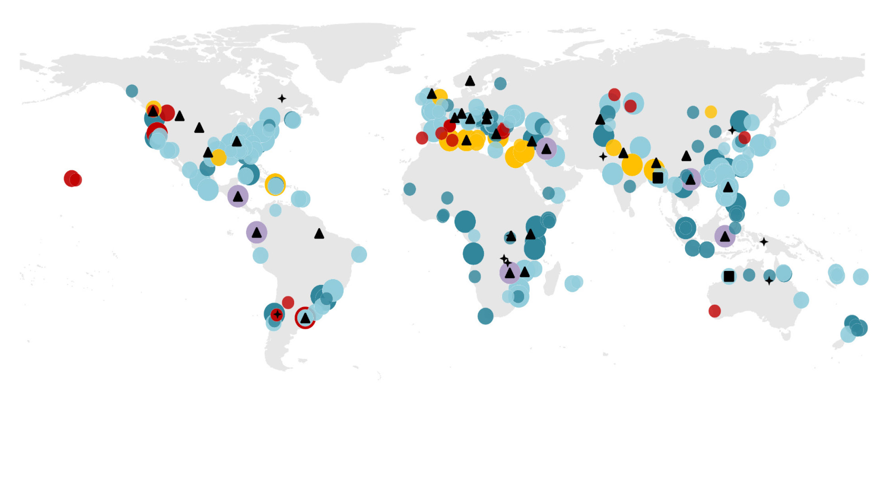

# WorldEnergyOutlook2025 - Part 6

*Pages 251-300*

## Page 251

Chapter 5 | Implications of CPS and STEPS 
251
 
5 
metals and rare earths from all other producing countries in 2035 would meet on average 
only half of the remaining demand when the supply and demand accounted for by the largest 
producer are excluded. This underlines the point that, even in a well-supplied market, critical 
mineral supply chains can be highly vulnerable to supply shocks, be they from extreme 
weather, a technical failure or trade disruptions. 
A supply shock of critical minerals would have far-reaching economic consequences, bringing 
higher prices for consumers, reducing industrial competitiveness and even potentially 
impacting national security. In 2010, the price of rare earth elements spiked by as much as 
ten-fold when China held back exports. If a supply shock affecting battery metals or graphite 
were to result in a ten-fold material price surge, global average battery pack prices could 
increase by as much as 40-50%, and sustained increases could widen the manufacturing cost 
gap between China and other battery manufacturing regions. Prolonged disruption could 
also result in significant revenue and job losses for manufacturers. This emphasises the 
importance of targeted policy mechanisms and global collaboration to diversify supply 
sources, linking resource-rich countries with those possessing refining capabilities and 
downstream consumers. Through its Critical Minerals Security Programme, the IEA is scaling 
up efforts to bolster mineral security by building systems to enhance resilience against 
potential disruptions, supporting the acceleration of project development in diverse regions, 
and deepening market monitoring capabilities. 
Energy technologies 
The combined market size for five key clean energy technologies, i.e. batteries, heat pumps, 
electrolysers, solar PV, wind power and EVs, amounted to around USD 900 billion in 2024. 
EVs accounted for the largest share of the total by some margin, followed by solar PV, 
batteries for stationary storage applications and wind power. Tracking the diversification of 
manufacturing capacity of these energy technologies is an important indicator of energy 
security. Excessive concentration may pose a risk of supply chain disruption, whether from 
natural disasters, accidents, geopolitical conflicts or deliberate actions to manipulate supply 
or price. 
The installed manufacturing capacity of these technologies is highly geographically 
concentrated, notably in China (Figure 5.18). In 2024, China accounted for over 80% of 
installed manufacturing capacity in every part of the solar PV value chain, and nearly 80% for 
nacelles and over 70% for blades of global manufacturing capacity for wind power 
components. The position of China in battery manufacturing is even stronger, accounting for 
at least 85% of global production in all parts of the value chain, and over 95% in the case of 
battery anodes. Manufacturing capacity is more diversified in the case of heat pumps and 
electrolysers for hydrogen production. 
Installed manufacturing capacity, however, exceeded production in 2024 by very substantial 
margins for some clean energy technologies. For example, global installed manufacturing 
capacity of battery cells was around 3 400 gigawatt-hours (GWh) in 2024, but combined 
global demand from EVs and stationary applications was around 1 110 GWh, resulting in an 
IEA. CC BY 4.0.

---

## Page 252

252 
International Energy Agency | World Energy Outlook 2025
 
average utilisation rate of around one-third.2 The global average utilisation rate of solar PV 
module manufacturing facilities was also low at around 50%. Given that the global surplus of 
capacity relative to present demand for these technologies is concentrated in China, its share 
in actual production is estimated to be somewhat lower than its share in installed 
manufacturing capacity. 
Figure 5.18 ⊳ Installed manufacturing capacity of selected energy 
technologies by region, 2024 
 
IEA. CC BY 4.0.
Installed manufacturing capacity for selected clean energy technologies  
is highly geographically concentrated 
The evolution of installed manufacturing capacity and actual output depends on several 
factors, including the demand outlook for individual technologies, the extent to which 
policies support the localisation of manufacturing capacities, and the international trade 
environment. The forthcoming edition of the IEA Energy Technology Perspectives will explore 
the outlook for global supply chains for selected energy technologies, among other issues.   
 
2 Excludes EV and battery stockpiling. 
20%
40%
60%
80%
100%
Polysilicon
Wafers
Cells
Modules
Nacelles
Blades
Cathodes
Anodes
Cells
North America
Europe
Asia Pacific excluding China
China
Rest of world
Solar PV
Wind power
Batteries
Heat pumps
Electrolysers
IEA. CC BY 4.0.

---

## Page 253

Chapter 5 | Implications of CPS and STEPS 
253
 
5 
Box 5.5 ⊳ 
Embodied intelligence: material supply chains for AI  
Artificial intelligence (AI) is becoming increasingly linked to the energy sector as data 
centres account for a growing share of electricity consumption (see Chapter 4). However, 
this is not the only way in which data centres and the energy sector are connected. Data 
centres are also becoming important users within broader supply chains of energy-
related materials and energy technologies. These supply chains, and the position of data 
centres within them, are not yet well understood. 
China dominates the production and supply of critical minerals used in manufacturing 
chips. It refines 95% of the high purity silicon that goes into the chips used in data centre 
servers and fibre optic cables. With a 44% market share, it is also the leading global 
producer of refined copper, which is critically important for the power transformers, 
electrical wiring and on-chip electrical circuits in data centres. As progress in shrinking 
the 2D footprint of transistors stalls, the industry is turning towards 3D stacking of chip 
components, and this may increase the copper intensity of advanced chips. China also 
accounts for 99% of global refined gallium, which is increasingly being used for advanced 
transistor-based power electronics and optical computing applications such as optical 
memory interconnects. 
Figure 5.19 ⊳ Market share of critical components for data centres  
and AI supply chains by region/country 
IEA. CC BY 4.0. 
No one region dominates all steps in the highly complex supply chain for  
data centres, but individual steps show high degrees of concentration 
Note: AI = artificial intelligence; LFP = lithium iron phosphate; EUV lithography = extreme ultraviolet 
lithography machines. 
Various countries dominate different parts of the chip manufacturing supply chain. 
European companies hold a near monopoly on the extreme ultraviolet lithography 
25%
50%
75%
100%
High-purity silicon
Copper
Gallium
EUV lithography
Advanced nodes
Liquid cooling
Transformers
LFP batteries
AI data centres
AI model design
United States
China
Europe
Chinese Taipei
Rest of world
Refining
Auxiliary
equipment
Chip 
manufacturing
AI model
deployment
IEA. CC BY 4.0.

---

## Page 254

254 
International Energy Agency | World Energy Outlook 2025
 
machines used to make the most advanced chips, which are in turn largely manufactured 
in Chinese Taipei. The United States holds a dominant position in chip design software 
and chip design, and companies in Japan and Korea dominate markets for critical AI chip 
components such as high-bandwidth memory. 
Cooling technologies are likely to become more critical as AI-specialised chips become 
denser in terms of power and need to dissipate more heat. The supply chain for liquid 
cooling technologies involves a mix of companies from the United States, China and 
Europe, as does the supply chain for transformers, while China dominates the global 
supply chain for the LFP batteries that are increasingly used in data centres because of 
their power and energy density, long lifecycles and safety and thermal stability (IEA, 
2025c). 
While the United States dominates frontier AI model design and AI-optimised data centre 
deployment, the full supply chain presents a more complicated picture. As data centres 
increase in number and as their needs develop, their supply chains for materials and 
energy-related technologies will increasingly overlap with supply chains critical to the 
energy sector. For example, the extent to which progress is made in closing the projected 
demand and supply gap for copper will have a material impact on both data centres and 
the energy sector, since both are projected to be a key source of copper demand growth. 
Monitoring how the material footprint of AI and data centres evolves will be critical to 
anticipating some key energy security risks. 
  
Building blocks of the Age of Electricity 
Electricity accounts for 21% of global total final consumption. Yet, this understates its 
economic contribution because it provides the key energy input for high value-added 
sectors such as advanced manufacturing, AI and digital services. Electricity is already the 
key source of energy for sectors accounting for over 40% of the global economy. By 2035, 
this rises to around 50% in the STEPS (Figure 5.20). 
An interlinked set of materials and technologies are critical to control and store electrical 
energy while at the same time having important applications in many sectors. As the 
global energy system moves into the Age of Electricity, these materials and technologies 
come to play an ever more important role. Who controls their supply chains, who 
manufactures these technologies, and who leads in their innovation will have major 
implications for both energy and economic security.  
Copper is a critical example. It is used directly in the energy sector in grids, batteries, solar 
and wind power, as well as widely in construction, industrial equipment, data centres, 
phones, computers and semiconductors. Copper can be substituted by aluminium for 
S P O T L I G H T  
IEA. CC BY 4.0.

---

## Page 255

Chapter 5 | Implications of CPS and STEPS 
255
 
5 
some applications, albeit with costs in terms of performance and environmental impact. 
However, there are many applications where there are currently no substitutes such as 
in lithium-ion battery anode current collectors, high-performance electronics, high-
performance transformers and motors, and subsea power cables. 
Figure 5.20 ⊳ Electricity as a share of energy consumption and the share 
of electricity consuming sectors in economic output in the 
STEPS, 2010-2035  
IEA. CC BY 4.0.
Role of electricity to fuel economic output is two-times  
higher than its share in total final consumption 
Similarly, rare earth elements are critical in energy applications such as EV motors, 
nuclear and wind turbines, aircraft engines and conventional cars. They are also essential 
in computer hard drives, smartphones, defence technologies and magnetic resonance 
imaging machines. The effects of shortages are quickly felt. A select number of rare 
earths were subject to export restrictions in April 2025, and many automakers around 
the world had to curtail production lines in short order due to supply constraints of rare 
earth permanent magnets. 
Lithium-ion batteries are another example. As well as being used in the energy sector, 
such as in EVs and battery storage, they are critically important for portable electronics, 
like smartphones, laptops and cameras, and in defence and aerospace applications, such 
as drones, communication equipment and satellites, as well as some types of medical 
equipment. There is no substitute for lithium-ion batteries in applications where weight, 
compactness and reliability are critical. Data centres are increasingly shifting to lithium-
ion batteries for uninterrupted power supply units because of the durability and power 
density that they offer. The critical importance of lithium-ion batteries for modern 
electronic equipment across sectors can scarcely be overstated. 
 10%
 20%
 30%
 40%
 50%
 60%
2010
2015
2020
2025
2030
2035
Share of economic output
Share of energy consumption
IEA. CC BY 4.0.

---

## Page 256

256 
International Energy Agency | World Energy Outlook 2025
 
Semiconductors, transistors and integrated circuits are also relevant in this context. They 
convert electricity into information, allowing the processing and storage of the data 
underpinning modern economies and consumer goods. The rise of AI means that data 
centres and the specialised AI-optimised integrated circuits they house are rising in 
importance for the energy sector. However, semiconductors are also increasingly being 
used in the energy sector for power conversion and control, i.e. power electronics. Wide 
bandgap semiconductors such as silicon carbide and gallium nitride are transforming 
power electronics by allowing operations at higher voltage, temperature and frequency. 
Applications of advanced power electronics include EV batteries, solar PV inverters, and 
advanced transformers for data centres or high-voltage direct current cables. Power 
electronics and the technologies they work with require critical minerals like gallium, 
germanium, and neodymium and yttrium. 
This interrelated set of materials and technologies have innovation and supply chain 
spillovers. For example, innovation in semiconductor manufacturing has fed into 
innovation in solar PV manufacturing, while data centres and EV batteries rely on similar 
power electronics to convert and control electricity with unrivalled precision. In the Age 
of Electricity, innovation leadership, energy security and economic security will 
increasingly be linked to these technologies. Investment in energy innovation is often, in 
this sense, investment in innovation more broadly.  
5.2.4 
Extreme weather events 
Extreme weather events are an energy security risk today 
Natural hazards, which include both geophysical risks such as earthquakes and tsunamis, and 
extreme weather events such as storms, floods, extreme temperatures, droughts and 
wildfire, pose a perennial threat to energy infrastructure around the globe. They are among 
the most frequent causes of energy system or supply chain disruptions each year.3 They can 
damage energy assets, disrupt operations, and hinder the safe and timely transport of key 
energy commodities around the world. Extreme weather events that caused disruption to 
energy systems in 2023 are highlighted in this section, alongside new analysis on the impact 
of extreme heat on the electricity system.  
Extreme weather events threaten the reliable supply of energy through disruptions and 
outages. They also increase the cost of energy supply through loss, damage, higher insurance 
premiums, and the need to build more resilient infrastructure. A new IEA dataset of extreme 
weather impacts on the energy sector shows that in 2023 alone nearly 300 events of extreme 
temperatures, storms, floods, droughts and wildfires caused operational disruptions of 
critical energy infrastructure. The power sector was affected by about 95% of these events, 
emphasising its vulnerability to extreme weather.  
 
3 In September 2025, the IEA held a High Level Roundtable on Strengthening Energy Infrastructure Resilience: 
Managing risks from natural hazards and extreme weather to explore this subject further. 
IEA. CC BY 4.0.

---

## Page 257

Chapter 5 | Implications of CPS and STEPS 
257
 
5 
The IEA dataset shows that extreme temperatures, storms, floods, droughts and wildfires 
were responsible for reported power cuts to more than 210 million households in 2023 
(Figure 5.21). Storms and floods accounted for 46% and 33% of the incidents respectively 
and together caused reported power cuts to 95 million households. Heatwaves and cold 
spells accounted for only 8% of the disruption events caused by extreme weather in 2023, 
but they were responsible for power cuts to more than 75 million households. Electricity 
networks are especially vulnerable to extreme weather events: damage to substations and 
electricity grids or the pre-emptive shutting off power lines, e.g. during high winds in wildfire 
prone areas, together account for around 85% of the incidents in our dataset of 2023 events.  
Figure 5.21 ⊳ Power outages and operational disruption of energy 
infrastructure caused by extreme weather events in 2023 
 
IEA. CC BY 4.0.
Extreme temperatures, storms, floods, droughts and wildfires were  
responsible for reported power cuts to more than 210 million households 
Notes: 2023 provides a snapshot of the impacts of extreme weather events on energy infrastructure. It does 
not necessarily represent an average weather year, as weather is variable. Outage numbers are likely 
underestimated due to variability of reporting by region. Events are recorded as a single type, which 
consolidates compound effects such as storms leading to floods. 
Sources: IEA analysis based on CRED (2025); GDACS (2025); ReliefWeb (2025). 
Other parts of energy systems also suffer damage and disruption from extreme weather. In 
2023, extreme weather caused disruption to a wide range of energy assets including power 
plants, fuel supply chains, coal mines and critical mineral mines. Hydropower was disrupted 
by drought-related water scarcity in Central and South America and by damage caused by 
floods in Canada and Norway. Storms and wildfires led to damage and safety-related 
curtailments in wind, solar PV and nuclear plants. Storms and floods caused the closure of 
Power Plant
Coal or critical mineral mine
Fuel supply chain
Operational disruption of: 
Drought
Extreme Temperature
Storm
Flood
Wildfire
Power outage due to:
Households  affected: less than 10 000; 10 000-150 000; more than 150 000
IEA. CC BY 4.0.

---

## Page 258

258 
International Energy Agency | World Energy Outlook 2025
 
LNG terminals in Bangladesh and led to LNG shortages for gas power plants. Floods also 
caused damage and disruption to a coal mine and several critical mineral mines.  
The scale of the risks to the energy system from extreme weather events depends on 
exposure and vulnerability, and how critical an asset is within a specific energy system. For 
example, an outage in a critical transmission line might be more consequential than an 
outage in a small solar PV plant (Box 5.6). The impact of extreme weather on the energy 
sector can also extend beyond individual assets and have significant economic repercussions. 
For example, storms can disrupt oil and gas infrastructure, causing price impacts to ripple 
across markets. With the rise of electrification, the vulnerability of electricity grids to 
extreme weather events deserves particular attention. Modern economies are dependent 
on uninterrupted supplies of electricity, and short outages can have large economic costs.  
A better understanding of system resilience hinges on improved data collection and 
reporting on the causes and impacts of outages and disruption. While several advanced 
economies already require detailed reporting on the causes of outages in power and fuel 
distribution systems, many countries do not. Investing in the monitoring and reporting of 
incidents could improve planning by documenting the impact of diverse types of extreme 
weather on various parts of the energy system, and the frequency with which such impacts 
occur. 
A forthcoming IEA special report will further investigate the resilience of energy assets to 
extreme weather, natural hazards and climate change. A key finding from this emerging work 
is that solar PV – the world’s fastest growing renewable electricity source – faces one of the 
highest natural hazard-related risks of destruction due to its unique vulnerability to 
hailstorms (Box 5.6).  
Box 5.6 ⊳ 
Destruction risk of severe hailstorms to solar PV assets 
In addition to disrupting supply, extreme weather can cause significant damage to energy 
assets. No global figure is available today for the total damage done to energy 
infrastructure by extreme weather, but recent insurance claims data suggest that hail 
damage to solar PV represents the fastest growing, and in some regions the largest, 
natural catastrophe insurance claim type for power generation assets, averaging more 
than USD 50 million per claim (GCube Insurance, 2023; Hutchins, 2025). Based on 
hailstorm patterns, we estimate that almost 5% of installed global solar PV capacity, 
about 47 GW, risks experiencing at least one severe hailstorm during its lifetime 
(Figure 5.22). Replacing this amount of PV capacity in case of severe loss would result in 
costs of about USD 640 million per year. 
Geographical disparities in hailstorm risks highlight regional hotspots, including the US 
Great Plains, the southern Himalaya foothills, and areas around the Mediterranean Sea 
(Prein and Holland, 2018). Assets in the United States and Europe are particularly 
exposed, with around 13% and 9% respectively of current installed capacity expected to 
face a severe hailstorm during their operational lifetime, while in China and India the 
IEA. CC BY 4.0.

---

## Page 259

Chapter 5 | Implications of CPS and STEPS 
259
 
5 
equivalent figure is around 3%. Measures to reduce the risk of total asset loss include 
increasing the thickness of front glass material and making use of hail stowage solutions 
which allow panels to be tilted vertically during storms. We estimate that at least 4% of 
global solar PV capacity would benefit from using more resilient protective glass, with a 
cost premium of 5-10% at current prices. 
Figure 5.22 ⊳ Exposure risks of solar PV assets to severe hailstorms 
IEA. CC BY 4.0. 
Severe hailstorms pose significant risks to solar PV assets,  
which are most acute in the United States 
Notes: The analysis covers utility-scale solar PV parks. The lifetime of a utility-scale solar PV park is 
assumed to be 25 years. Severe hailstorms are defined as storms with hailstones larger than 3 cm (ping-
pong ball size).  
Sources: IEA analysis based on AXIS Capital (2025); Bang and Cecil (2019); Cecil and Bang (2025); Cui et 
al., 2025; Murillo, Homeyer and Allen (2021); Global Energy Monitor (2025). 
Special focus: impact of extreme heat on energy security 
Extreme heat events are increasingly posing a threat to the resilience of the energy system, 
particularly the electricity sector. In extremely hot weather, electricity demand increases as 
air conditioners work harder to keep buildings cool. In addition, extremely hot weather may 
also lead to thermal power plants having to reduce their output and to falling solar PV panel 
efficiency. Moreover, the transfer capacity of transmission lines decreases at high ambient 
temperatures due to increased resistance, while sagging lines can reduce clearances to 
below regulated standards, forcing system operators to de-energise lines. Hot temperatures 
can also lead to the forced shutdown of overheated substations. 
Such impacts from extreme heat can coincide with other events that reduce the availability 
of power system infrastructure, such as droughts that reduce hydropower output, long 
periods of low wind output, or increased wildfire risk. The way that these risks cascade in 
times of stress is a crucial factor for an assessment of overall system vulnerability. The impact 
3%
6%
9%
12%
15%
United
States
Europe
India
China
Japan
Global
IEA. CC BY 4.0.

---

## Page 260

260 
International Energy Agency | World Energy Outlook 2025
 
of extreme heat on electricity demand and the derating, or reduction in output, of power 
plant capacity is the focus in this section. 
Both the number and duration of heatwaves is growing (Figure 5.23). IEA analysis of data 
from the Copernicus Climate Change Service indicates that the number of people across the 
world exposed to high temperatures has almost tripled since the early 1980s (ECMWF, 2025). 
The distribution is not uniform, with Europe, South America and the Middle East seeing the 
biggest rise in extreme temperatures). In addition to the magnitude of high temperatures, 
the duration of high temperatures is increasing. During the first half of the 2020s, areas on 
every continent except Antarctica experienced the equivalent of an additional month of high 
temperatures compared with the 1980s.  
Electricity system peak demand is increasing, driven in large part by an increase in cooling 
demand (section 5.2.2). System planners factor in electricity demand spikes from peak 
temperatures based on historical experience, the size of grid infrastructure and an 
assessment of power system adequacy. However, peak temperatures occasionally exceed 
the usual maximum of a region, and changes in the climate are driving an increase in the 
frequency and intensity of these extreme peak temperatures (IPCC, 2021).  
Figure 5.23 ⊳ Population exposure to days with high temperatures, and 
change in the highest temperatures by region, 1980-2024 
 
IEA. CC BY 4.0.
Changing weather patterns increased the number of people exposed to  
extreme heat and the changes in extreme temperatures vary by region. 
Notes: °C = degree Celsius. Population exposure to high temperatures is derived from the population exposed 
to days where the minimum temperature is above 20 °C and the maximum temperature is above 35 °C. 
Highest temperatures are the average of those above the 95th percentile for the period 2020-2024 compared 
to 1980-1984. 
Sources: IEA analysis based on data from CIESIN (2018); ECMWF (2025); JRC (2023). 
1
2
3
Population exposed
Change in exposure (1980-1984 = 1)
1980s
1990s
2000s
2010s 2020s
 1
 2
 3
Southeast Asia
North America
Africa
Middle East
South America
Europe
oC
Change in highest temperatures
IEA. CC BY 4.0.

---

## Page 261

Chapter 5 | Implications of CPS and STEPS 
261
 
5 
Increasing uptake and use of air conditioning leads to an increase in peak demand across 
markets by 2035 in the STEPS of around 330 GW. At the same time, the rise in average 
temperature and in extreme heat events adds an additional increase of 430 GW to peak 
demand. More than 50% of this additional increase is associated directly with extreme heat 
events. There is a small difference between the CPS and the STEPS in terms of the rise in 
temperature and extreme heat incidents by 2035, but these factors are less important as a 
differentiator of peak demand growth than the types of air conditioners installed in the two 
scenarios (Figure 5.24).4  
Figure 5.24 ⊳ Aggregated peak electricity demand growth related to cooling 
and impact of extreme heat by scenario, 2035 
 
IEA. CC BY 4.0.
Extreme heat increases peak demand by more than 250 GW in both outlooks,  
equivalent to around half of demand growth from cooling with median temperatures 
Notes: GW = gigawatt; STEPS = Stated Policies Scenario; CPS = Current Policies Scenario. The extreme 
temperatures impact corresponds to the difference between the median and the top-three peak demand 
values across 30 years of weather data. The difference in the growth from the increase in median temperature 
is primarily due to differences in the energy efficiency of cooling, as the median temperature in 2035 is similar 
in both scenarios. 
In addition to increasing cooling demand, extreme heat can also affect the reliability of power 
generation capacity, particularly in thermal power stations. High temperatures can decrease 
generation capacity through physical decreases in production efficiency, regulatory 
constraints on the discharge of water used for cooling, or, ultimately, the forced outage of 
assets. Analysis of empirical data from the European Union and United States indicates that 
forced outages of thermal power stations are more likely to occur, last longer and leave a 
 
4 In the focus of this analysis to 2035, there is essentially no difference in temperature outcomes between the 
two scenarios, and therefore differences between the scenarios in terms of the impact of cooling applications 
on peak demand depends on factors within the energy system, such as efficiency. 
 300
 600
 900
Increase in air conditioner use
Increase in median temperature
Total increase
Increase in extreme temperature
GW
STEPS
Growth from:
CPS
IEA. CC BY 4.0.

---

## Page 262

262 
International Energy Agency | World Energy Outlook 2025
 
larger share of capacity unavailable at extreme high temperatures (Sergio and Colelli, 2025; 
Coffel and Mankin, 2021; Murphy, Sowell and Apt, 2019). Based on our analysis of existing 
power plant locations, historical and projected temperatures, and existing literature on the 
effects of high temperatures, we estimate that the global fleet of thermal power stations are 
likely to face a substantial increase in forced outage incidents due to extreme heat. If covered 
by higher reserve margins, it would require an additional 115 GW of installed capacity by 
2035 in the STEPS, and around 120 GW in the CPS.  
In a worst case scenario where the derating of power capacity coincides with additional 
demand due to extreme temperatures, the combined effects amount to a 6% increase in the 
total capacity needed to meet projected peak demand in both the scenarios (Figure 5.25). 
This is a substantial amount, equivalent to around one-half to one-third of typical reserve 
margins, and it highlights the importance of considering extreme temperatures during 
capacity adequacy planning. However, this analysis excludes two important effects. First, it 
does not consider the compounding effects of other supply disruptions which may be 
correlated with extreme temperatures, such as decreased hydropower output and lower 
wind output. Second, it does not consider the increased risk of reduced transmission line 
availability due to heat-related derating or equipment failures. 
Figure 5.25 ⊳ Demand and supply impacts from extreme heat and equivalent 
share of peak demand by scenario, 2035 
 
IEA. CC BY 4.0.
System operators may have to consider additional capacity margins  
equivalent to around 6% of projected peak demand in both scenarios by 2035 
Notes: STEPS = Stated Policies Scenario; CPS = Current Policies Scenario. The capacity losses estimated here 
are defined as the difference between capacity available at the temperatures generators experience during 
peak demand under extreme heat versus those during median peak hours over 30 weather years.  
Sources: IEA analysis of supply impacts based on observed maximum temperatures from Harris et al. (2020), 
and thermal power generation locations from Global Energy Monitor (2025); and thermoelectric power 
curtailment rates from Sergio and Colelli (2025); Coffel and Mankin (2021); Murphy, Sowell and Apt (2019). 
 2%
 4%
 6%
 100
 200
 300
Demand Supply
Demand Supply
Demand impacts from
extreme heat
Supply impacts from
derated capacity
Share of peak demand
(right axis)
GW
STEPS
CPS
IEA. CC BY 4.0.

---

## Page 263

Chapter 5 | Implications of CPS and STEPS 
263
 
5 
The impact of extreme heat depends on regional characteristics (Figure 5.26). Some regions 
are badly affected because they see high variability in extreme temperatures between years, 
which leads to a large difference between designing for median peak temperatures and 
planning for extreme peak temperatures; because they have large shares of cooling in peak 
demand, and therefore a high sensitivity of demand to peak temperatures; or because they 
have high shares of thermal capacity, which may reduce capacity availability during peak 
temperatures. In some regions, an increase in peaks of extreme heat does not raise annual 
peak demand, because peak demand is still driven by winter heating rather than summer 
cooling. 
In the regions most affected, in a worst case scenario where these effects coincide, the 
combined impact of increased peak demand and capacity derating due to extreme heat 
reaches as much as 10% of peak demand in certain regions by 2035 in the STEPS. Levels of 
derating are at a similar level in the CPS. This is equivalent to around two-thirds of typical 
reserve margins in these regions, and underlines the need to consider projected increases in 
extreme peak temperatures as well as projected increases in median peak temperatures in 
future capacity adequacy and contingency planning exercises. 
Figure 5.26 ⊳ Impact of extreme heat on peak demand and derated power 
supply by region in the STEPS, 2035 
 
IEA. CC BY 4.0.
Combined effects of extreme temperatures on peak demand and  
capacity derating reach 10% of projected peak demand in the most affected regions  
Notes: NZ = New Zealand; C & S America = Central and South America. The capacity losses estimated here are 
defined as the difference between capacity available at the temperatures generators experience during peak 
demand under extreme heat vs those during median peak hours over 30 weather years. Only includes regions 
where extreme heat increases the summer electricity demand beyond the typical winter demand peak. 
Sources: IEA analysis of supply impacts based on observed maximum temperatures from Harris et al. (2020), 
and thermal power generation locations from Global Energy Monitor (2025), and thermoelectric power 
curtailment rates from Sergio and Colelli (2025); Coffel and Mankin (2021); and Murphy, Sowell, and Apt 
(2019). 
 4%
 8%
 12%
Australia
and NZ
North
Africa
Japan
& Korea
Southeast
Asia
China
C & S
America
United
States
India
Middle
East
Demand impacts from extreme heat
Supply impacts from derated capacity
IEA. CC BY 4.0.

---

## Page 264

264 
International Energy Agency | World Energy Outlook 2025
 
5.3 
Emissions 
Energy-related carbon dioxide (CO2) emissions rose by nearly 1% in 2024 to reach an all-time 
high of 38.2 gigatonnes (Gt), though the rate of emissions growth has slowed in recent years. 
Advanced economies, China and the other emerging market and developing economies were 
each responsible for around one-third of global energy-related emissions in 2024, with 
international bunkers for aviation and shipping accounting for the rest. Emissions follow 
divergent trajectories in the STEPS and CPS, but they remain high across the outlook period. 
Both scenarios result in an increase in global temperatures that is incompatible with 
internationally agreed climate goals.  
Global energy-related CO2 emissions peak in the next few years in the STEPS and decline to 
around 8% below their current level by 2035. Emissions in the advanced economies grouping 
peaked in 2007 and have since declined by 20% while their economies have grown 30%. The 
STEPS sees a continuation of this trend, with advanced economy emissions falling by a further 
15% from their 2007 peak by 2035. Per capita emissions in China now exceed average per 
capita emissions in advanced economies as a group. In the STEPS, emissions in China peak 
before 2030, and then decline by around 15% from their current level by 2035. Emissions in 
emerging market and developing economies other than China continue to rise through to 
2035. This diverse group includes regions with high per capita emissions such as the Middle 
East and very low per capita emissions such as India and Africa. By 2050, global energy-
related CO2 emissions are just under 30 Gt, around 20% below the level of 2024.  
Figure 5.27 ⊳ Emissions by region and sector in 2024 and by scenario,  
2035 and 2050 
 
IEA. CC BY 4.0.
Energy-related emissions peak and decline in the STEPS, reflecting power sector  
reductions in China and advanced economies, while emissions plateau in the CPS 
Note: Gt CO2 = gigatonnes of carbon dioxide; STEPS = Stated Policies Scenario; CPS = Current Policies Scenario; 
EMDE = emerging market and developing economies. 
 10
 20
 30
 40
2024
20352050
20352050
Advanced economies
China
Other EMDE
Bunkers
By region
Gt CO₂
CPS
STEPS
2024
20352050
20352050
Power
Industry
Transport
Buildings
Other
By sector
CPS
STEPS
IEA. CC BY 4.0.

---

## Page 265

Chapter 5 | Implications of CPS and STEPS 
265
 
5 
Trends in the electricity sector do much to shape the emissions pathway projected in the 
STEPS. By 2035, global electricity sector emissions are almost 20% lower than in 2024, 
offsetting continued growth in emissions in the transport and industry sectors. By 2050, 
electricity sector emissions are almost 50% below their 2024 level. Emissions from industry 
and transport both peak before 2050, but they are still very close to their current level in that 
year (Figure 5.27).  
In contrast, global energy-related emissions in the CPS do not peak before 2030 and are still 
marginally higher in 2035 than their levels in 2024. They then stay more or less flat through 
to 2050. Both advanced economies and China see a drop in emissions to 2035 in the CPS, 
although this is more muted than in the STEPS. However, emissions in emerging market and 
developing economies other than China increase more strongly between 2024 and 2035 than 
in the STEPS, pushing up the global total. 
Figure 5.28 ⊳ Decomposition of the difference in CO2 emissions by driver and 
scenario, 2010-2035 
 
IEA. CC BY 4.0.
Increased coal-fired electricity generation drives the main difference in emissions  
between the scenarios, though end-use sectors in the CPS also see higher emissions  
Note: Gt CO2 = gigatonnes of carbon dioxide; AE = advanced economies; EMDE = emerging market and 
developing economies; ICE = internal combustion engine. 
Emissions from coal-fired electricity generation in China are 1.2 Gt higher in the CPS than in 
the STEPS by 2035, which accounts for two-thirds of the difference in emissions from 
electricity generation between the two scenarios (Figure 5.28). Coal-fired electricity 
generation emissions are around 0.3 Gt higher in advanced economies in the CPS. The higher 
level of emissions from coal-fired power generation in the CPS largely reflects slower 
deployment of renewables. Other differences between the two scenarios in 2035 stem from: 
natural gas-fired power generation emissions, around 0.2 Gt higher in the CPS, again as a 
 18
 19
 20
 21
 22
2010
2024
2035
Total final consumption (Gt CO₂)
Electric vehicles
Electrification in industry
Energy efficiency in ICE
Efficiency in industry
Electrification in buildings
CPS
STEPS
Other
 12
 13
 14
 15
 16
2010
2024
2035
Electricity generation (Gt CO₂)
Coal in China
Coal in AE
Natural gas in AE
Coal in
Natural gas in EMDE
CPS
STEPS
other EMDE
IEA. CC BY 4.0.

---

## Page 266

266 
International Energy Agency | World Energy Outlook 2025
 
result of slower uptake of renewables; road transport sector emissions, around 0.3 Gt higher 
in 2035 in the CPS as a result of slower adoption of EVs and more sluggish improvements in 
energy efficiency; and industrial production emissions, around 0.6 Gt higher in the CPS 
because increases in technical efficiency are lower in the CPS than in the STEPS and because 
lower levels of recycling and material efficiency in the CPS mean more emissions-intensive 
goods are produced. 
The emissions pathways in the STEPS and the CPS lead to different temperature outcomes 
(Figure 5.29). In both scenarios, the long-term global mean temperature rise exceeds 1.5 °C 
around 2030 and continues to rise to close to 2 °C around 2050. In the CPS, warming 
increases steadily after this by around 0.2 °C per decade to reach about 2.9 °C by 2100 and 
still higher temperatures thereafter. In the STEPS, however, the rate of warming slows after 
2050, reflecting lower emissions of greenhouse gases (GHG) than in the CPS, and reaches 
around 2.5 °C by 2100. 
Figure 5.29 ⊳ Temperature rise by scenario in 2050 and 2100  
 
IEA. CC BY 4.0.
Median temperature rise in 2100 is 2.9 °C in the CPS and 2.5 °C in the STEPS;  
in the CPS there is about an 8% chance of a temperature rise above 4 °C in 2100 
Notes: STEPS = Stated Policies Scenario; CPS = Current Policies Scenario. Figure shows the long-term global 
mean temperature rise equal to the mid-point of a 20-year average of the combined land and marine near- 
surface temperature anomaly relative to 1850-1900, corresponding to the Intergovernmental Panel on 
Climate Change Sixth Assessment Report definition of warming of 0.85 °C between 1995-2014 (IPCC, 2021).  
Source: IEA analysis based on the outputs of MAGICC 7.5.3. 
The long-term temperature rise in this edition of the STEPS is around 0.1 °C higher than in 
the World Energy Outlook-2024, the first year in which the gap between climate outcomes 
of stated policies and international targets to limit climate change has widened rather than 
narrowed. This is mainly due to higher levels of emissions of CO2 and methane in the STEPS 
2025 than in the STEPS 2024. 
1
2
3
4
5
CPS
STEPS
CPS
STEPS
33rd - 67th
percentile
5th - 95th
percentile
Median
2050
°C
2100
IEA. CC BY 4.0.

---

## Page 267

Chapter 5 | Implications of CPS and STEPS 
267
 
5 
Inherent uncertainties in the earth’s response to future GHG emissions and warming mean 
that significantly higher temperatures cannot be ruled out. There is, for example, roughly a 
15% chance of warming above 3 °C by 2100 in the STEPS, and an 8% chance of warming above 
4 °C in the CPS. Future warming from current levels is inevitable in any scenario and carries 
with it risks. Those risks become extreme at the upper end of the levels of warming possible 
in the STEPS and especially in the CPS. 
5.3.1 
Air pollution and human health  
In 2024, air pollution caused more than 16 000 premature deaths per day, nearly five-times 
those from road accidents. Pollution-related diseases also limit economic productivity: it is 
estimated that around 1.2 billion workdays are lost every year due to air pollution, and that 
the total cost of air pollution5 is around USD 6.4 trillion, or 5.6% of global gross domestic 
product (GDP) (OECD, 2016). In heavily polluted countries, the costs can be much higher; 
they are estimated to exceed 11% of GDP in parts of India, Pakistan and Bangladesh (World 
Bank, 2025). However, a shift to clean energy can lead to an immediate improvement in air 
quality. For example, phase outs of coal use for electricity and heating in parts of Canada and 
Beijing in the 2010s resulted in air quality improving by more than two-thirds within several 
years (Government of Ontario, 2025; Clean Air Fund, n.d.). 
Air pollution emissions from energy-related sources are primarily driven by the combustion 
of fossil fuels and solid bioenergy (Figure 5.30), with significant variations around the world. 
Today in China and India, coal use in the power sector is the single biggest contributor to 
emissions, but in the Middle East and Africa, oil use, mostly for electricity and transport, plays 
the largest role. In African and other emerging market and developing economies, the 
continued reliance on traditional bioenergy for cooking and heating is a major source of 
pollution.  
In the CPS, total global pollution emissions fall by around 10% between 2024-2035. This is 
mainly from reductions in China and advanced economies, where declining coal use in power 
generation and turnover of older vehicles in transport lead to sharp declines in air pollution 
emissions. In other regions, emissions decrease only marginally or even increase due to 
continued fossil fuel use and slow progress related to clean cooking. Because more and more 
people live in cities, especially in regions where population growth is highest, the modest 
drop in emissions is not enough to significantly reduce the share of people breathing heavily 
polluted air, which remains around 30% globally by 2035, similar to today’s level. The STEPS 
sees similar trends to the CPS play out among many regions, but with more rapid coal 
reductions globally and reduced emissions from oil in the Middle East. This leads to about a 
15% decline in total emissions to 2035 globally, although the number of people exposed to 
heavily polluted air remains similar to that in the CPS in that year. 
 
5 Economic costs associated with mortality, poor health outcomes, productivity loss and cognitive impacts. 
IEA. CC BY 4.0.

---

## Page 268

268 
International Energy Agency | World Energy Outlook 2025
 
Figure 5.30 ⊳ Total air pollution emissions and share of population exposed to 
heavy air pollution by region in 2024 and by scenario in 2035 
 
IEA. CC BY 4.0.
Air pollution emissions and exposure to heavily polluted air decline in advanced 
economies and China, but see little or no improvement in other parts of the world   
Notes: Total air pollution = sulphur dioxide (SO2), nitrogen oxides (NOX) and fine particulate matter (PM2.5). 
Other = process emissions and combustion emissions from other fuels. Mt = million tonnes. Heavily polluted 
air corresponds to having a PM2.5 density more than 35 microgrammes per cubic metre, in accordance with 
the World Health Organisation Interim Target 1 (WHO, 2021).  
Source: IEA analysis based on International Institute for Applied Systems Analysis (IIASA). 
Despite some progress on access to clean cooking, continued high levels of emissions and 
urbanisation mean that more people are exposed to heavily polluted air by 2035 than today 
in both scenarios. However, a very different trend emerges in health outcomes connected to 
household and ambient air pollution in the next decade.  The decline in deaths from 
household air pollution seen in recent years continues, but slows in both scenarios. By 2035 
there are around 2 million deaths per year in the STEPS, and 2.4 million in the CPS. The 
biggest improvements are in China and India, where clean cooking access rates reach 100% 
and 92% by 2035 respectively in the STEPS.  However, premature deaths are set to rise in 
Africa in both scenarios due to rapid population growth and insufficient progress on clean 
cooking access (see Chapter 6).   
The outlook for premature deaths from ambient air pollution is bleak: they increase in all but 
advanced economies in both scenarios (Figure 5.31). Globally, annual deaths from ambient 
air pollution rise to 5.3 million in 2035 in the CPS and to 5.2 million in the STEPS. China, India 
and Africa together account for about 60% of the increase in deaths to 2035 in both 
scenarios, but there are large rises elsewhere, particularly in per capita terms.  
20%
40%
60%
80%
 10
 20
 30
 40
2024
CPS
STEPS
2024
CPS
STEPS
2024
CPS
STEPS
2024
CPS
STEPS
2024
CPS
STEPS
2024
CPS
STEPS
Mt
Other
Bioenergy
Natural gas
Oil
Coal
Exposure
China
India
Africa
Advanced
Economies
Other 
EMDE
Middle
East
2035
2035
2035
2035
2035
2035
(right axis)
IEA. CC BY 4.0.

---

## Page 269

Chapter 5 | Implications of CPS and STEPS 
269
 
5 
Figure 5.31 ⊳ Premature deaths from air pollution by type and region in 2024, 
and change by scenario, 2024-2035 
 
IEA. CC BY 4.0.
Premature deaths from household air pollution were around 2.5 million in 2024 and decline 
in both scenarios; those from ambient air pollution rise in both scenarios, but more so in CPS 
Note: HAP = household air pollution; AAP = ambient air pollution; STEPS = Stated Policies Scenario; CPS = 
Current Policies Scenario; EMDE = emerging market and developing economies. 
Source: IEA analysis based on IIASA modelling. 
5.4 
Investment and affordability 
5.4.1 
Energy investment 
Investment in the energy sector is projected to reach USD 3.3 trillion in 2025, which is over 
20% more than in 2015. Renewables electricity generation, principally solar PV and wind, and 
the electrification of end-uses, mainly EVs, are responsible for most of the increase. Energy 
investment is unevenly distributed: while China, United States and Europe have all ramped 
up spending, many countries in Africa and Latin America now see lower levels of investment 
in their energy sector than a decade ago. Even so, these regions encompass over 25% of the 
global population and are projected to expand their energy demand by nearly 20% by 2035 
in the STEPS.  
The share of global spending on low-emissions technologies has been rising steadily, driven 
in large part by heightened concerns over energy security since 2022. It is expected to 
account for two-thirds of total energy investment in 2025. Net importers of fossil fuels are 
responsible for 70% of the growth in low-emissions technology investment that has taken 
place over the last five years.  
 1
 2
 3
 4
 5
HAP
AAP
Advanced
economies
Other EMDE
Middle East
Africa
India
China
Million
Premature deaths
2024
Change in annual premature deaths
2024-2035
-800
-400
0
400
800
STEPS
CPS
STEPS
CPS
Thousand
HAP
AAP
IEA. CC BY 4.0.

---

## Page 270

270 
International Energy Agency | World Energy Outlook 2025
 
Investment in the STEPS stabilises at around USD 3.6 trillion in 2035 and stays relatively flat 
to 2050 (Figure 5.32). The level of investment in the CPS is nearly 5% lower in 2035 but 
broadly equal to the STEPS in 2050, yet the structure of investment differs, reflecting the 
different reading of policy settings used in these scenarios. Investment in the CPS is directed 
more towards maintaining the current energy system and responding to rising energy 
demand with conventional sources. Conversely, investment in the STEPS reflects more on 
new technologies, notably those that provide for electrification of energy end-uses, such as 
heat pumps and EVs.  
Accelerating spending on low-emissions technologies in the STEPS means that their share of 
total investment increases by almost ten percentage points to reach 75% in 2035. Investment 
in the CPS is higher for natural gas and lower for renewables and the share of investment in 
low-emissions fuels and technologies increases by a small margin to reach about 70% of total 
energy investment in 2035.  
Figure 5.32 ⊳ Average annual energy investment by type and scenario,  
2015-2050 
 
IEA. CC BY 4.0.
Share of low-emissions technologies in total global energy investment  
continues to rise in both scenarios, though marginally less in the CPS  
Note: MER = market exchange rate; STEPS = Stated Policies Scenario; CPS = Current Policies Scenario. 
Supply, power and end-use 
Between 2025 and 2035, annual investment in the supply of oil and natural gas decreases by 
about 5% in STEPS as uncertainties around oil demand are partially compensated by new 
LNG capacity additions, but increases by about 7% in the CPS. Meanwhile, spending on coal 
declines in both scenarios. By mid-century, investment in the electrification of energy 
demand, efficiency and renewables for power are about 20% lower in the CPS than in the 
STEPS, while spending on oil, gas and coal is almost 60% higher (Figure 5.33). 
 25%
 50%
 75%
 100%
 1
 2
 3
 4
2015-19 2020-24 2025-35
STEPS
2025-35
CPS
2035-50
STEPS
2035-50
CPS
Electrification
Energy efficiency
Grids and Storage
Nuclear
Renewable power
Low-emissions fuels
Coal
Natural gas
Oil
Share of low-emissions
Trillion USD (2024, MER)
technologies (right axis)
IEA. CC BY 4.0.

---

## Page 271

Chapter 5 | Implications of CPS and STEPS 
271
 
5 
Solar PV accounts for 30% of power sector investment today. China was responsible for 60% 
of the additional solar PV capacity added in the world in 2024, increasing its overall solar PV 
capacity by more than 300 GW. In both scenarios, global annual solar PV investment declines 
in dollar terms to 2035. This reflects continued reductions in capital costs, which mean that 
adding a given amount of capacity to the system costs less year-by-year. As a result, even 
with continued new capacity additions, total investment in renewables declines. Investment 
in electricity grids and battery storage is projected to increase robustly in both scenarios, 
with combined annual investment of around USD 800 billion by 2035 – more than the 
amount invested in low-emissions power. 
 Figure 5.33 ⊳ Investment by type and by region/country in the CPS relative to 
the STEPS, 2035 
 
IEA. CC BY 4.0.
Investment in solar PV and wind is around USD 80 billion lower in the CPS  
than in the STEPS, while investment in fossil fuels is nearly USD 150 billion higher 
Note: MER = market exchange rate; AE = advanced economies; EMDE = emerging market and developing 
economies. 
Investment in renewables in the CPS in 2035, at just over USD 500 billion, is below the level 
in the STEPS at USD 600 billion. Spending on nuclear increases in both scenarios as several 
countries take final investment decisions on large new reactors, pushing the current 
investment level up 40% to over USD 100 billion per year in the STEPS, and by about 30% to 
over USD 90 billion per year in the CPS. Global investment related to grids is similar in the 
two scenarios at around USD 730 billion in STEPS and USD 715 billion in CPS in 2035. Higher 
shares of renewables in the STEPS mean that investment in grids is slightly higher than in the 
CPS by 2035, but spending on transmission and distribution is mostly driven by electricity 
demand growth and line refurbishments, which are similar in both scenarios (see Chapter 3). 
Battery storage investment is about 15% higher in the STEPS in 2035 than in the CPS. 
- 100
- 50
0
 50
 100
China
North
America
Europe
India
Middle
East
Other
AE
Other
EMDE
Fossil fuel supply
Fossil generation
Low-emissions fuel supply
Renewables and storage
Grids
Nuclear
End-use efficiency
End-use electrification
Billion USD (2024, MER)
IEA. CC BY 4.0.

---

## Page 272

272 
International Energy Agency | World Energy Outlook 2025
 
Overall investment in energy efficiency and electrification of end-use sectors stands at 
around USD 0.8 trillion per year and increases by about 40% in the STEPS to 2035, and 
reaches USD 1.1 trillion, and by about 15% in the CPS to reach USD 0.9 trillion. This is largely 
driven by existing energy efficiency policies and standards, including CO2 emissions standards 
in transport, mandatory building codes and minimum energy performance standards for 
appliances, air conditioners and industrial electric motors. It is also driven by continued 
increases in energy demand due to economic growth. Energy efficiency investment is 
USD 70 billion higher in the STEPS than in the CPS in 2035, reflecting uptake of more efficient 
appliances in the STEPS and higher efficiency standards in new buildings. Electrification of 
heat and mobility broadens in both scenarios where current supportive policies or where 
technologies like heat pumps and EVs are already cost competitive. In the STEPS, this 
translates into an annual investment increase of about USD 300 billion related to 
electrification in 2035, double the current level.  
Total energy costs 
Investment trends only provide a partial view of the overall costs of energy in each scenario. 
In practice, investment in energy infrastructure, such as power plants, grids and LNG 
terminals, are paid back gradually over time by consumers. Likewise, household energy 
investment, such as EVs, heat pumps and retrofits can either be paid for upfront or financed 
over several years. This means that capital and financing costs – for both suppliers and 
consumers – should be seen as an essential element of total energy costs over time.  
Other components also need to be considered, including operating costs and fossil fuel rents. 
Operating costs are the sum of spending needed to maintain capital assets and to ensure the 
continuing production, transport and storage of energy. Fossil fuel rents, an additional cost 
to energy consumers, are defined as the revenue from fossil fuel sales minus the full costs of 
production, including financing costs. These rents mostly accrue to governments in the form 
of taxes, royalties or income from national oil and gas or mining companies. They are distinct 
from profits made by renewable developers or utilities, which are fully captured in financing 
costs.  
Taking these factors into account, operating today’s global energy system costs about 
USD 7 trillion annually (Figure 5.34). These costs rise in both scenarios as energy services are 
delivered to a growing global economy and an increasing number of people, yet costs in 2035 
are nearly 10% lower in the STEPS than in the CPS. With a higher level of electrification and 
more investment in capital-intensive technologies, including end-use equipment such as EVs 
and heat pumps, the STEPS sees slightly higher rates of capital recovery than the CPS. These, 
however, are offset by higher operating costs in the CPS that reflect higher fossil fuel prices, 
and by higher fossil fuel rents that reflect both higher fuel prices and higher demand levels 
for fossil fuels.  Fossil fuel rents total USD 1.6 trillion in the STEPS in 2035, and USD 2.3 trillion 
in the CPS. 
IEA. CC BY 4.0.

---

## Page 273

Chapter 5 | Implications of CPS and STEPS 
273
 
5 
Figure 5.34 ⊳ Total energy costs by type and scenario, 2024 and 2035 
IEA. CC BY 4.0.
Total energy delivery costs rise in both scenarios, driven by increased capital recovery and 
financing costs, while operating costs and fossil fuel rents are notably higher in the CPS 
Note: MER = market exchange rate; STEPS = Stated Policies Scenario; CPS = Current Policies Scenario. 
5.4.2 
Affordability for households 
Affordable energy is fundamental to social and economic well-being, underpinning 
everything from household comfort and mobility to industrial productivity and national 
competitiveness. Total costs of energy to all consumers today are around USD 9 trillion each 
year, or about 10% of global GDP. Over one-third of it is paid by households to meet energy 
service demands at home and to provide personal mobility. Household energy bills typically 
reflect commodity prices and energy delivery costs, but they are also affected by policy and 
market design: taxes, subsidies and environmental surcharges can substantially influence the 
final price paid by consumers. Today, oil and electricity dominate household energy bills, 
accounting for approximately 50% and 30% respectively of the total.  
Household energy bills in advanced economies averaged around USD 4 700 at purchasing 
power parity (PPP) 6 per year over the 2019-2024 period. In the STEPS, this falls to around 
USD 4 100 (PPP) in 2035 (Figure 5.35). This reflects mostly gains in efficiency and increased 
electrification, for example through improved energy performance in buildings and a higher 
share of EVs in the passenger vehicle fleet, leading to lower natural gas and oil consumption. 
While these trends are also visible in emerging market and developing economies, their 
average household bills increase by nearly 15% as rapid economic growth is translated into 
higher levels of appliance and vehicle ownership. In the STEPS, households in advanced 
 
6 Energy bills expressed in purchasing power parity terms account for differences in income levels and cost of 
living across regions, offering a meaningful proxy for affordability and the relative cost to households. 
2 500
5 000
7 500
10 000
2024
2035 STEPS
2035 CPS
Fossil fuel rent
Operating cost
Financing costs
Capital recovery
Billion USD (MER, 2024)
IEA. CC BY 4.0.

---

## Page 274

274 
International Energy Agency | World Energy Outlook 2025
 
economies spend on average USD 200 more per year in 2035 than in 2024 on clean energy 
equipment such as EVs, heat pumps and building retrofits. This projection assumes that a 
large share of households spread payments for such purchases over several years.  
Figure 5.35 ⊳ Total average annual household energy bills by energy source 
and scenario in selected regions, 2019-2024 and 2035    
 
IEA. CC BY 4.0.
Electricity accounts for a growing share of household energy bills  
across most regions in both scenarios  
Notes: PPP = purchasing power parity; STEPS = Stated Policies Scenario; CPS = Current Policies Scenario. 
Household energy bills include all relevant taxes, subsidies and environmental surcharges, but do not include 
the costs of energy equipment.  
In the CPS, the average annual household energy bill in advanced economies is 6% higher in 
2035 than in the STEPS. Slower efficiency gains in buildings and a less rapid uptake of EVs 
than in the STEPS mean that more energy must be bought to meet the same level of energy 
service demand. Wholesale oil and natural gas prices are also higher in the CPS, and these 
prices mostly get passed through to consumer energy bills. The STEPS involves a higher initial 
outlay than the CPS to improve the efficiency of homes and buying efficient EVs, but this is 
offset by lower ongoing energy bills over time. In a similar way, the implementation of fossil 
fuel subsidy reforms and the introduction of CO2 prices in some regions in the STEPS slightly 
increase consumer energy bills relative to the CPS, but this is more than offset by lower fuel 
prices and the lower level of energy consumption needed to meet the same energy needs. 
One of the main differences in household energy bills between the two scenarios concerns 
the shares accounted for by oil and by electricity. This is particularly evident in markets with 
differing rates of EV sales. While the upfront costs of EVs remain higher than those of 
conventional vehicles in most markets, EVs tend to have lower operating costs, leading to 
lower lifecycle expenditure. Lower EV sales in the CPS are reflected in higher levels of 
 2
 4
 6
2019-24
STEPS
CPS
2019-24
STEPS
CPS
2019-24
STEPS
CPS
2019-24
STEPS
CPS
2019-24
STEPS
CPS
2019-24
STEPS
CPS
Other
Electricity
Oil
Thousand USD (2024, PPP)
North
America
European 
Union
Japan
and Korea
China
India
Africa
2035
2035
2035
2035
2035
2035
IEA. CC BY 4.0.

---

## Page 275

Chapter 5 | Implications of CPS and STEPS 
275
 
5 
spending on gasoline and diesel, leading to overall higher energy bills in some markets 
compared to the STEPS (Figure 5.36). 
Figure 5.36 ⊳ Household energy bills for electricity and oil by effect in selected 
region/country in the CPS relative to the STEPS, 2035   
 
IEA. CC BY 4.0.
Energy bills are higher in the CPS than the STEPS as energy prices are generally higher,  
and a higher level of consumption is needed to provide equivalent energy services  
Notes: PPP= purchasing power parity; Elec = electricity. Total household energy bill includes oil products, i.e. 
gasoline, diesel, fuel oil and liquefied petroleum gas, and electricity, as well as natural gas, bioenergy, coal and 
district heating. 
In advanced economies, key importing regions in Asia such as Japan and Korea see higher 
household energy bills in 2035 in the CPS than in the STEPS primarily because oil and natural 
gas imports cost more in the CPS. European Union retail oil prices are slightly lower in the 
CPS as the STEPS includes CO2 pricing at the pump as set out in the recently tabled EU 
Emissions Trading Scheme II. But lower oil consumption per household in the STEPS offsets 
this, and the average overall household bill is lower than in the CPS. 
In India and parts of Southeast Asia, retail prices for fossil fuels are lower in the CPS than in 
the STEPS because the CPS does not include fossil fuel subsidy reform. However, households 
still face higher energy bills in the CPS because slower improvement in the efficiency of 
vehicles and household appliances, especially air conditioners, increases overall fuel 
consumption.  
In China, the high level of electrification in both scenarios means that households are less 
affected than their counterparts in many other countries by the increase in global oil prices 
in the CPS. They are comparatively more exposed to higher electricity prices, but this is 
moderated by the efficiency of EVs relative to conventional vehicles. 
-250
0
250
500
-10%
0%
10%
20%
Oil Elec
Oil Elec
Oil Elec
Price
Energy consumption
Effect due to:
North
America
Japan and 
Korea
European
Union
Advanced economies
-60
0
60
120
-10%
0%
10%
20%
Oil Elec
Oil Elec
Oil Elec
USD per household (2024, PPP)
Difference in total energy bill (right axis)
China
India
Africa
Emerging market 
and developing economies
IEA. CC BY 4.0.

---

## Page 276

276 
International Energy Agency | World Energy Outlook 2025
 
In Africa, average household electricity consumption is higher in the STEPS than in the CPS in 
part because more people gain access to electricity and clean cooking. However, this 
increased access is almost completely offset by higher efficiency, and it has no visible impact 
on average household energy bills.  
Figure 5.37 ⊳ Household energy bills relative to disposable income and 
expenditure in advanced economies by income decile and 
scenario, 2035 
 
IEA. CC BY 4.0.
Wealthier households see a higher absolute increase in energy bills in the CPS, while lower 
income households see energy take up a bigger share of their disposable income 
Note: PPP = purchasing power parity; STEPS = Stated Policies Scenario; CPS = Current Policies Scenario. 
Source: IEA analysis based on national survey data, for further details see IEA (2024b).  
Higher household energy bills in the CPS affect various segments of the population in 
different ways (Figure 5.37). In 2035 higher income households are more affected in absolute 
terms, and annual energy bills for the top 10% income increase by more than USD 300 (PPP) 
in advanced economies: these households tend to consume more energy overall, particularly 
for transport, and are exposed to higher oil prices in the CPS. However, lower income 
households are more impacted in relative terms, as they generally already spend a larger 
share of disposable income on energy than higher income households. Moreover, it is often 
more difficult for them to invest in energy efficient technologies which reduce energy bills 
over time, such as heat pumps, EVs, solar panels and building insulation, because of the 
upfront cost. Although CO2 taxes or prices are one lever among many to push energy 
investment toward lower emissions outcomes, it is important to design such measures 
carefully to avoid regressive outcomes, for example by using some or all of the revenues to 
fund targeted schemes to assist vulnerable households (IEA, 2024b).  
6%
12%
18%
20
40
60
80
100
Quintiles of income
CPS
STEPS
Share of disposable income
2 000
4 000
6 000
20
40
60
80
100
Quintiles of income
Annual household expenditure
USD per household (2024, PPP)
IEA. CC BY 4.0.

---

## Page 277

Chapter 5 | Implications of CPS and STEPS 
277
 
5 
Residential electricity prices 
Electricity accounts for a rising share of household expenses so electricity prices have a 
significant effect on energy affordability. While electricity prices vary significantly between 
consumer groups and countries because of differing resources, technologies, regulations, 
taxes and subsidies – with households often facing higher prices than industrial consumers – 
their development over time typically reflects the average cost of supplying a unit of 
electricity. The average cost includes: capital recovery, i.e. annuities paid over the economic 
lifetime of generation assets to recoup upfront investment; fuel costs; operational and 
maintenance costs; and emissions-related costs. (Though revenue from carbon taxes or 
emissions allowance auctions can be directly or indirectly returned to consumers.) It also 
includes grid costs, which mainly reflect the capital recovery through grid tariffs of 
investment in grid expansion and replacement, and are often an explicit component of end-
user electricity prices. 
Figure 5.38 ⊳ Household retail electricity prices in selected country/region by 
scenario, 2024 and 2035, and by contributing factor in 2035  
 
IEA. CC BY 4.0.
Residential electricity prices increase in China and decrease in Europe, United States 
and India, where rising capital intensity is offset by declining fuel costs 
Notes: MWh = megawatt-hour; MER = market exchange rate; PPP = purchasing power parity; O&M = operation 
and maintenance; STEPS = Stated Policies Scenario; CPS = Current Policies Scenario. Other includes taxes, 
subsidies and other surcharges.  
Household electricity prices vary significantly across countries and regions. Europe has some 
of the world’s highest prices, which are projected to decline slightly by 2035 in both scenarios 
as the share and the fuel price of natural gas-fired generation declines. Electricity prices in 
the United States remain significantly lower than in Europe due to many factors, including 
significantly lower costs for natural gas-fired generation in the United States, even as 
-24
-12
0
12
24
STEPS
CPS
STEPS
CPS
STEPS
CPS
STEPS
CPS
CO₂
Fuels
Capital recovery
O&M
Grids
Other
Net change
Europe
US
China
India
USD per MWh (2024,MER)
 100
 200
 300
 400
2024
STEPS
CPS
2024
STEPS
CPS
2024
STEPS
CPS
2024
STEPS
CPS
MER
 PPP
USD per MWh (2024)
Europe
US
China
2035
2035
2035
2035
India
Average annual household electricity prices
Changes to 2035 by component
IEA. CC BY 4.0.

---

## Page 278

278 
International Energy Agency | World Energy Outlook 2025
 
domestic gas prices trend upward in both scenarios. In the STEPS, household electricity prices 
decline modestly by 2035 as renewables generation expands, while in the CPS they rise with 
the growing share of gas-fired generation. 
In China and India, household electricity prices are significantly lower than in most advanced 
economies, although the differences are smaller after adjusting for purchasing power parity. 
These prices, however, are more tightly regulated and do not always fully reflect actual costs. 
In the STEPS, household electricity prices in China remain relatively stable to 2035, with 
reductions in fuel costs offsetting increases in capital recovery payments. In the CPS, China 
experiences a slight rise in household electricity prices because the share of renewables in 
power generation expands more slowly than in the STEPS, and coal and natural gas prices 
remain higher. In India, household electricity prices decline in both scenarios: the rising share 
of renewables in the electricity mix leads to a reduction in fuel costs that outweigh an 
increase in capital recovery payments (Figure 5.38). 
5.4.3 
Energy employment 
Energy employment worldwide expanded by 2.2%, 1.7 million jobs, in 2024. This outpaced 
economy-wide growth in employment of 1.3%. Employment in the power sector rose by 4%, 
driven by increasing investment to meet rapidly rising demand for electricity. Much of the 
job growth was concentrated in construction and manufacturing roles to build new energy 
infrastructure. Policy shifts, tariff uncertainty and geopolitical risks are now reshaping market 
expectations, leading many firms to take a cautious approach to hiring and job vacancy rates 
are already falling across major economies. As a result, the IEA projects job growth in energy 
to slow to 1% in 2025. Despite near-term headwinds, employment in energy is expected to 
rise in the medium and long term in both scenarios, driven by robust growth in low-emissions 
power generation, grids and EVs, though its pace hinges on the availability of skilled labour. 
The power sector consolidated its position as the largest provider of employment in the 
global energy industry with 22.6 million jobs as the Age of Electricity gathers pace. The power 
sector has added jobs at twice the pace of the broader energy industry over the past four 
years, with solar PV and grids accounting for 40% of all new energy jobs. Looking ahead, low-
emissions power generation and grids remain the main employment growth engines in both 
scenarios, boosted by rising electricity demand, increasing flexibility needs and the 
expanding integration of AI.  
Fuel supply-related jobs totalled 20.8 million in 2024. Employment in oil and natural gas 
staged an uneven recovery, with firms maintaining lean staffing levels. The latest LNG 
investment cycle has been marked by shortages of welders, pipefitters and electricians, 
driving up costs (Reuters, 2024). Oil and gas employment expands by nearly 1 million to 2035 
in the CPS, but falls by 920 000 in the STEPS, reflecting its faster pace of electrification, the 
more rapid adoption of renewables and the increased focus on efficiency. The coal sector 
sees a decline in employment by 2035 in both scenarios, though fewer jobs are lost in the 
CPS as it projects more use of coal in power generation in emerging market and developing 
economies such as China and India. 
IEA. CC BY 4.0.

---

## Page 279

Chapter 5 | Implications of CPS and STEPS 
279
 
5 
Both scenarios project higher sales of EVs. However, the EV sales share is lower in the CPS, 
reaching 40% by 2035 versus 50% in the STEPS, rising from current levels of around 20%. As 
a result, EV-related jobs increase more in the STEPS than in the CPS by 2035, 4.2 million jobs 
versus 2.6 million jobs. Efficiency gains are higher in the STEPS, reflecting less fossil fuel use 
in electricity generation, lower system losses, broader adoption of efficient electrification in 
transport, and more ambitious efficiency policies. This translates into more efficiency-related 
jobs in the STEPS by 2035, while in the CPS efficiency employment declines, largely due to 
losses in jobs related to energy efficiency in industry (Figure 5.39).  
Figure 5.39 ⊳ Global energy-related employment by type and scenario,  
2024 and 2035 
 
IEA. CC BY 4.0.
Employment in the energy sector expands in both scenarios, though the distribution  
of jobs varies by field and skilled labour shortages shape the pace of the growth 
Note: ICE = internal combustion engine; HVAC = heating, ventilation and air conditioning; STEPS = Stated 
Policies Scenario; CPS = Current Policies Scenario. 
Energy-related employment is projected to expand in the medium and long term in all IEA 
scenarios, but the pace of growth depends on the availability of specialised workers. Trained 
and skilled workers are already in short supply. The energy sector relies more heavily on 
skilled labour than the wider economy: technical roles, including skilled trades, technicians 
and plant operators make up over half the energy workforce, more than double their 25% 
share in the broader economy. Among them, skilled trades – the largest occupational group 
in the energy sector and the main source of new jobs – are emerging as the most critical 
 5
 10
 15
 20
 25
 30
STEPS 2035
CPS 2035
2024
STEPS 2035
CPS 2035
2024
STEPS 2035
CPS 2035
2024
STEPS 2035
CPS 2035
2024
Million workers
Coal
Oil and gas
Low-emissions fuels
Critical minerals extraction
Operating generation capacity
Expanding generation capacity
Operating grids and storage
Expanding grids and storage
ICE vehicles
EVs and batteries
Industrial efficiency
Efficient appliances and lighting
Buildings retrofits
Heat pumps
Other HVAC
Supply
Power
Efficiency
Vehicles
IEA. CC BY 4.0.

---

## Page 280

280 
International Energy Agency | World Energy Outlook 2025
 
bottleneck. IEA analysis suggests that six-out-of-ten occupations in the energy sector where 
shortages are most acute are in skilled trades, e.g. electricians, grid line workers, solar PV 
installers, pipefitters, welders, and heating, ventilation and air conditioning installers. 
This raises the importance of the education system in meeting future energy workforce 
needs in both scenarios. Widespread trade shortages limit the ability of the energy sector to 
attract workers from other industries, and its specialised requirements make transfers 
difficult. Addressing the growing labour needs of the energy sector requires co-ordinated 
policies to expand and modernise vocational education and training (VET) systems. 7 
Priorities identified in the recent IEA Future of Energy Skills workshop include expanding 
certification capacity, modernising training to match emerging technologies, strengthening 
provider-employer partnerships, improving the perception of vocational degrees, and 
broadening access to VET programmes, particularly for young people and underrepresented 
groups. 
Demographic pressures are exacerbating labour shortages, though in different ways in 
different regions. In advanced economies, retirements are outpacing new entrants: nearly 
30% of union electricians in the United States may retire within a decade; in Japan 36% of 
workers in the construction industry are aged 55 or over, while only 12% are aged 29 or 
younger; and Canada expects retirements of 700 000 trade workers by 2028. The challenge 
is most acute in nuclear and grids, where for every young person joining, there are 1.7 and 
1.4 workers, respectively, nearing retirement, well above the economy-wide average. 
Cultural preferences for university over vocational paths add to the difficulties. In emerging 
market and developing economies, the challenge stems less from ageing than from skill gaps: 
in recent years, fewer than 5% of workers aged 19-24 received formal vocational education 
in India, and tradespeople like electricians and welders remain scarce in South Africa despite 
high unemployment levels. Underinvestment in vocational education, low certification rates, 
weak industry-education links and the migration of skilled workers compound these 
mismatches. Countries like India and Indonesia are seeing a rising share of young people 
entering energy-relevant degrees, but most regions need stronger action and better co-
ordination between policy makers, industry and labour unions. 
These shortages are already constraining energy operations. The IEA annual Energy 
Employment Survey received input from over 600 energy firms, trade unions and educators, 
and half of companies reported critical hiring bottlenecks, a steady increase over previous 
years. The most common impacts included project delays, longer lead times and cost 
overruns. Competitiveness also hinges on the ability of the energy sector to adapt to 
emerging skill needs and shifting roles, with AI and digital capabilities standing out as an 
especially pressing gap. Investing to develop digital talent and reskill existing workers is 
critical in both the scenarios. Some early successes have come from industry-university 
partnerships and company-led training platforms. 
 
7 Vocational education and training systems refer to the structures and institutions that provide the skills, 
knowledge and practical experience needed for specific occupations.  
IEA. CC BY 4.0.

---

## Page 281

PART C 
OUTLOOKS BASED ON GOALS AND 
PLEDGES 
Part C of the World Energy Outlook explores what would need to 
happen for the energy sector to meet internationally agreed 
climate and sustainable development goals. 
Chapter 6 presents the Accelerating Clean Cooking and Electricity 
Services Scenario. This new scenario explores the fuels, policies 
and investment that would be needed to meet the goal of 
achieving universal access to clean cooking and electricity.  
Chapter 7 presents an updated Net Zero Emissions by 2050 
Scenario. It explores what could be done by 2050 in the context of 
limiting the increase in global warming to 1.5 °C by 2100, taking 
account of the latest data on emissions, technology deployment 
and investment. 
 
IEA. CC BY 4.0.

---

## Page 283

Chapter 6 | Achieving access for all 
 283 
 
Chapter 6 
Achieving access for all 
A roadmap for universal energy access 
• Today around 2 billion people lack access to clean cooking and some 730 million 
remain without electricity – deficits which have far-reaching implications for health, 
economic opportunity and global development. Since 2010, 1.5 billion people have 
gained access to clean cooking and 1 billion to electricity, demonstrating that rapid 
progress is possible. Our new Accelerating Clean Cooking and Electricity Services 
Scenario (ACCESS) outlines a country-by-country pathway to universal access that 
draws on lessons about what has worked best in recent years. 
• Universal clean cooking access is achieved in the ACCESS around 2040. Over 60% of 
households gaining access to clean cooking do so through the use of liquefied 
petroleum gas and a further 18% with the use of electricity. Bioethanol, biogas and 
solid biomass each account for around 4-6% of households that gain access, while 
natural gas plays a limited role in dense urban areas with planned infrastructure. The 
benefits of this transition by 2040 are immense: it cuts premature deaths due to 
household air pollution by almost two-thirds, significantly reduces the time spent 
cooking, and delivers net emissions reductions of 1.25 gigatonnes carbon dioxide 
equivalent (CO2-eq) annually. 
• The global electricity access gap closes just after 2035. Over 45% of new connections 
are from grid extensions; 30% from mini-grids, which are a good match for dense, 
remote communities; and 25% from stand-alone systems, including solar home 
systems, which are the best option in areas where grid and mini-grid expansion is 
unlikely to be feasible in the near term. By 2040, newly connected users add 
270 terawatt-hours (TWh) to global electricity demand, contributing up to 45% of the 
total increase in residential electricity demand in some regions. This is met largely by 
hydropower, natural gas, and solar photovoltaics (PV), with solar powering most mini-
grids and nearly all stand-alone systems. 
• Closing the access gap worldwide requires USD 4 billion each year for clean cooking 
from now until 2040, and around USD 23 billion each year for electricity until 2035. 
While it is encouraging that private sector involvement is expanding, public and 
concessional financing remains vital to attract capital to underserved segments, 
especially in riskier markets where public finances are constrained. 
• Expanding energy access can support productivity improvements in agriculture and 
local industry, helping to drive broader economic and energy demand growth. 
However, the speed at which energy demand increases once access has been gained 
may be constrained by the cost of energy, the affordability of new equipment and 
appliances, grid reliability, and the availability of maintenance services. 
S U M M A R Y  
IEA. CC BY 4.0.

---

## Page 284

2001
2040
2024
2001
2024
180
million people
gaining access
200
million people
gaining access
The ACCESS scenario
Number of countries reaching
above 95% access per year
Annual investment needed
Electricity
LPG
Other clean
Natural gas
Developing Asia
Rest of world
Sub-Saharan Africa
Benefits from
clean cooking access
P
u
b
li
c
s
e
c
t
o
r
4
5
%
Clean cooking
2025-2040
USD 4 billion
Universal access to 
electricity could be 
achieved by 2035 if 
electrification efforts 
accelerate to the pace 
of the best historical 
achievements.
Universal access to clean cooking could be 
achieved by 2040 if progress accelerates to the 
pace of the most successful historical examples.
2040
Annual premature deaths from
household air pollution
2.5 million people
0.9
3.7 Hours
1.8
1 535 Mt CO2-eq
500
Time spent collecting
fuel and cooking
Total residential cooking emissions
2024
P
ri
v
a
t
e
s
e
c
t
o
r
5
5
%
Less than 1% of today’s
global energy investment
 Electricity 2025-2035
USD 23 billion
1
6
%
50%
44%
27%
Sub-Saharan Africa
Developing Asia
61%
Rest of world
IEA. CC BY 4.0.

---

## Page 285

Chapter 6 | Achieving access for all 
285
 
6 
6.1 
Introduction 
Even as global energy demand continues to rise, billions of people in around 100 countries 
remain without access to basic modern energy services. Today nearly 2 billion people lack 
access to clean cooking and 730 million people lack access to electricity (Figure 6.1). Millions 
of households, businesses and public institutions such as clinics and schools operate without 
reliable modern energy. This limits productivity and hinders socioeconomic development. It 
also perpetuates the use of traditional biomass, with damaging consequences for health and 
the environment. 
Figure 6.1 ⊳ 
Population without energy access, 2000-2024 
 
IEA. CC BY 4.0.
Many countries in developing Asia have made rapid progress to extend energy access, 
but this has not been replicated in some other regions, notably in sub-Saharan Africa  
Note: 40% of the rest of world population without access to electricity is in Latin America and the Caribbean 
and over 70% for clean cooking. 
Rapid progress has been made in recent decades in some regions and countries. Since 2010, 
1.5 billion people have gained access to clean cooking and around 1 billion people have 
gained access to electricity, with notable advances in China, India, Indonesia and Cambodia. 
In sub-Saharan Africa, however, the number of people without access to modern fuels for 
cooking has increased over the same period. As major middle income countries approach or 
achieve universal access, overall global progress has begun to slow, leaving the access gap 
concentrated in low-income countries, including fragile or conflict-affected states. Lower 
budgets available for international development assistance compound the challenge of 
regaining momentum. 
However, the outlook for extending access to modern energy in these countries has been 
gradually improving in recent years. Private sector business and finance are participating 
more actively in the provision of energy access, and innovative technologies and business 
0.5
1.0
1.5
2.0
2.5
  2000
2010
2024
Sub-Saharan Africa
Developing Asia
Rest of world
Electricity
Billion people
  2000
2010
2024
Clean cooking
IEA. CC BY 4.0.

---

## Page 286

286 
International Energy Agency | World Energy Outlook 2025
 
models are providing new and more cost-effective ways to broaden access to modern energy 
services. Growing experience with financing energy access projects is making it easier for 
companies to secure finance at scale, and a surfeit of solar photovoltaics (PV) and battery 
production capacity in China is lowering the cost of solar home systems. Energy access has 
also attracted recent political attention, with clean cooking featuring in the G7 and 
G20 communiqués, building on the political commitments in the 2024 Clean Cooking 
Declaration, and with renewed efforts on electricity access being reflected in the 
Dar Es Salaam Declaration and Mission 300.1 
The Accelerating Clean Cooking and Electricity Services Scenario (ACCESS) charts a path to 
achieve universal access to clean cooking and electricity based on the best rates of progress 
achieved historically. Explored in this chapter, the ACCESS prioritises cost-effective and 
proven measures to improve access, considering all relevant fuels and technologies, and the 
infrastructure, policies and financing needed to scale them up. It draws on new modelling 
developed by the IEA based on a country-by-country analysis. It examines distinct pathways 
for rural and urban areas that take account of the rates of progress achieved in countries 
sharing similar characteristics in terms of demography, levels of prosperity, resource 
availability and institutional governance. The modelling assesses the availability and cost of 
potential solutions and selects the option that is most affordable relative to household 
incomes and that maximises consumer benefits.2 The pace at which people gain access varies 
across the IEA scenarios, and the various trajectories are summarised in Box 6.4. 
The ACCESS pathway and its energy implications are the principal focus of this chapter. The 
scenario examines the current landscape based on the most recent IEA tracking data, the 
trajectory to reach universal energy access and the implied investment requirements for 
access to clean cooking and to electricity. It explores how progress to achieve energy access 
can lay the foundation for broader energy development, helping economies and societies 
achieve better prosperity and health. 
6.2 
Clean cooking 
6.2.1 State of play 
Today, there are still around 2 billion people without access to clean cooking – a quarter of 
the world’s population.3 Most cook with firewood, charcoal, kerosene and animal dung 
 
1 The IEA Clean Cooking Summit took place in May 2024 in Paris with participants from governments, private 
sector, development partners, international organisations, philanthropies and civil society. The Declaration 
pledged signatories to make clean cooking a priority and to enhance efforts to reaching universal access.  
Adopted by African Heads of State and Government in January 2025, the Dar Es Salaam Declaration outlines 
measures to provide access to electricity for 300 million Africans by 2030. 
2 Full documentation of the modelling approach for the ACCESS is available in the 2025 Global Energy and 
Climate Model methodology (IEA, 2025a) is published in parallel with the World Energy Outlook 2025. 
3 Access to clean cooking means having the use of a stove-fuel combination that achieves at least Tier 4 for 
fine particulate (PM2.5) emissions and Tier 5 for carbon monoxide emissions in line with the World Health 
Organization definitions. 
IEA. CC BY 4.0.

---

## Page 287

Chapter 6 | Achieving access for all 
287
 
6 
burned in basic cookstoves or over open fires. This traditional use of biomass leads to poor 
indoor air quality and has serious health consequences. It also requires time-intensive 
gathering of fuel and cooking, which restricts the amount of time people have available for 
more productive activities.  
Some regions have made significant progress to provide access to clean cooking in recent 
decades; others, notably sub-Saharan Africa, have seen the number of people without access 
rise as population growth outstrips gains in access. Since 2010, almost 1.5 billion people in 
Asia and the Latin America and the Caribbean region (LAC) gained access to modern cooking 
stoves and fuels, reducing the number of those without access worldwide by a third in the 
span of 15 years. In 2023, nearly 90% of the population in the LAC region and 77% of the 
population in developing Asia had access to clean cooking, up from 87% and 52% respectively 
ten years ago. This progress has been driven by major government initiatives to provide clean 
cooking. Around three-quarters of those gaining access have done so with the use of 
liquefied petroleum gas (LPG). Yet, in sub-Saharan Africa, the number of people without 
access to clean cooking has risen to around 1 billion today, up from 840 million a decade ago. 
Only around 23% of people in sub-Saharan Africa had access to clean cooking in 2023. 
Figure 6.2 ⊳ 
Clean cooking access by region and fuel 
 
IEA. CC BY 4.0.
Most people gaining access to clean cooking in the last five years live in  
developing Asia, and most have gained access by using LPG  
Notes: LPG = liquefied petroleum gas. Clean bioenergy includes biogas, bioethanol and clean advanced 
biomass cookstoves (Tier 4-5). Preliminary indicators were used to estimate regional access gains in 2024. 
Over 70% of the rest of world population without access is in Latin America and the Caribbean. 
Sources: IEA analysis based on World Health Organization Cooking fuels and technologies database (2025).  
The pace of progress has slowed in recent years. Worldwide in 2019, around 120 million 
people gained access to clean cooking, while in 2023 just 100 million people gained access. 
 50
 100
 150
2019 2020 2021 2022 2023 2024
Million people
Developing Asia
Sub-Saharan Africa
Rest of world
People gaining access by region
 200
 400
 600
Rest of world
Sub-Saharan
Africa
Developing
Asia
Million people
Electricity
LPG
Natural gas
Clean bioenergy
People gaining access by 
region and fuel, 2019-2023
IEA. CC BY 4.0.

---

## Page 288

288 
International Energy Agency | World Energy Outlook 2025
 
To some extent this slowdown reflects the major gains made in recent years in countries 
such as India and Indonesia; those still without access tend to be living in particularly remote 
areas. The spike in LPG prices following Russia’s full-scale invasion of Ukraine in 2022 slowed 
progress. Some households reverted, at least temporarily, to cooking with biomass. 
Countries in developing Asia were particularly affected, given their strong reliance on LPG to 
expand access over the past decades. Preliminary indicators for 2024 indicate a further 
slowdown in developing Asia and stable progress in other regions. 
LPG has fuelled progress to extend clean cooking access in the emerging market and 
developing economies. More than 75% of those gaining access to clean cooking between 
2019 and 2023 did so with the uptake of LPG (Figure 6.2). Others did so by switching to 
natural gas (17%), and electricity (7%) or biogas. The use of natural gas to extend access was 
concentrated in countries with urban gas networks; China accounted for around 70% of the 
total. 
In many parts of the world, almost everyone living in urban areas now has access to clean 
cooking options. In developing Asia and the LAC region, for example, urban access rates are 
around 95%, with remaining gaps concentrated in informal settlements on the urban fringe. 
As a result, most of the remaining global shortfall is in rural areas, where progress has been 
steady but uneven: rural access in the emerging market and developing economies rose from 
44% in 2019 to 53% in 2023. However, sub-Saharan Africa remains an exception, with 
substantial clean cooking access deficits persisting in both urban (41% access rate) and rural 
areas (9% access rate). 
Figure 6.3 ⊳ 
Recent progress in clean cooking policies by region  
 
IEA. CC BY 4.0.
Over 50% of people without access to clean cooking live in countries  
that have introduced new clean cooking policies since the start of 2024  
Notes: Tracking period is 1 January 2024 to 26 March 2025. Over 70% of the rest of world population without 
access is in Latin America and the Caribbean. 
5
10
15
National
strategy
Targets
Stove distribution
programmes
Tax
incentives
Fuel support
programmes
In force
Announced
Number of countries with new clean
cooking policies since the start of 2024
 250
 500
 750
1 000
Sub-Saharan
Africa
Developing
Asia
Rest of
world
Recent progress
No change
Million people
Population without access living in
countries with policy progress in 2024
IEA. CC BY 4.0.

---

## Page 289

Chapter 6 | Achieving access for all 
289
 
6 
One hopeful indicator is that policy frameworks for clean cooking have recently been 
strengthened in a number of countries. The IEA tracks progress in the development of policy 
frameworks by looking at a range of policy measures, including national strategies, targets, 
government incentives, and delivery plans. Since the start of 2024, 64 new clean cooking 
policy initiatives have been adopted or announced in the emerging market and developing 
economies, and almost 55% of the population without clean cooking access live in a country 
that has adopted or announced at least one such initiative (Figure 6.3). Sub-Saharan Africa 
has seen a notable increase in policy coverage, where over 70% of those without access live 
in jurisdictions in which new policies have been implemented: 50 new clean cooking policies, 
including 17 new clean cooking targets, have been put in place since the beginning of 2024. 
6.2.2 Outlook 
Accelerating and maintaining progress in line with the fastest rates of progress witnessed 
globally would result in near-universal clean cooking access by around 2040, as projected in 
the ACCESS (Figure 6.4). On average, 130 million people gain access each year in the ACCESS, 
1.4-times more than today. The rate of progress in the near term is much quicker, rising to a 
peak of about 190 million people per year around 2030. Sub-Saharan Africa sees faster 
acceleration than any other region, with the proportion of the population with access to 
clean cooking increasing at an average annual rate of 4.7 percentage points – a pace 
comparable to the best historical rate achieved in countries such as India, Indonesia and 
Cambodia. Urban areas generally reach full access about five years ahead of national 
averages, reflecting population density and the scope for making use of existing 
infrastructure. 
The timeline to achieve universal energy access to clean cooking differs significantly by 
region. The LAC region is on track to achieve over 95% clean cooking access by 2031, followed 
by developing Asia in 2033 and sub-Saharan Africa just before 2040. In the LAC region, the 
remaining challenge lies in reaching small, often remote or indigenous communities. In 
developing Asia, major access efforts are needed in countries such as Pakistan, Bangladesh 
and Mongolia, and a focus on last-mile connections in countries such as Indonesia and India 
that are approaching universal access. Sub-Saharan Africa is projected to be the last region 
to declare success in universal access, but it sees the sharpest acceleration in the ACCESS, 
with 80 million people gaining access each year – eight-times the current rate. 
By 2030, 24 countries are expected to reach near-universal access in the ACCESS, covering 
around one-quarter of the global population that lack clean cooking solutions today. Most 
other countries are projected to achieve universal access between 2030 and 2040. While 
developing Asia and other regions move towards universal access sooner, sub-Saharan Africa 
lags behind. By 2038, nearly 80% of the remaining population without access to clean cooking 
is projected to be in Africa. 
All types of clean cooking solutions contribute to progress. Geographic location, existing 
infrastructure and socioeconomic conditions all influence which options are likely to be 
adopted by communities, as do consumer preferences that reflect local cuisine and culture. 
IEA. CC BY 4.0.

---

## Page 290

290 
International Energy Agency | World Energy Outlook 2025
 
The IEA assesses the impact of these factors on the availability and affordability of different 
fuels by region in the modelling for the ACCESS. It takes account of new IEA spatial analysis 
that evaluates the delivered cost of various fuels at a very granular level to assess which 
options households are likely to favour, based on the assumption that they will select the 
most advantageous option within their financial means. The analysis also considers the 
scalability of supply chains, the scope for improvement in infrastructure and fuel availability 
over time, and broader considerations of energy security. While recognising that there are 
wider cultural and other non-financial factors that will also play a part in decisions about 
which cooking options to adopt, the IEA has not attempted to model these.  
Figure 6.4 ⊳ 
Clean cooking access by region in the ACCESS 
 
IEA. CC BY 4.0.
 Developing Asia closes the clean cooking gap by maintaining today’s pace of progress, 
while sub-Saharan Africa accelerates sharply in the ACCESS 
Notes: Right chart shows 95 countries with an access gap, but excludes small countries which together 
represent less than 1% of the total access gap. Over 70% of the rest of world population without access is in 
Latin America and the Caribbean. 
Source: IEA analysis based on World Health Organization Cooking fuels and technologies database (2025). 
Based on this analysis, LPG remains the primary means of expanding clean cooking in the 
ACCESS, accounting for 63% of new clean cooking access (Figure 6.5). Its primacy reflects its 
affordability, relatively low infrastructure requirements, ease of transport and compatibility 
with traditional cooking practices. LPG plays a significant role in both urban and rural 
settings. Electric cooking provides 18% of new access, a larger share than observed over the 
past decade, driven by stronger policy support, increased efforts to take advantage of 
domestic electricity production, and declining technology costs. Electric cooking is a 
particularly favoured option in urban areas with a reliable electricity supply. Bioethanol and 
biogas each contribute around 4% of new access, with biogas mainly focused in agricultural 
areas with ample feedstock. Modern solid bioenergy accounts for a further 6%, and is 
 800
1 600
2 400
2010
2020
2030
2040
2050
Million people
Population without access
 4
 8
 12
2025
2030
2035
2040
2045
Sub-Saharan Africa
Developing Asia
Rest of world
Countries achieving over 95% access
Number of countries
IEA. CC BY 4.0.

---

## Page 291

Chapter 6 | Achieving access for all 
291
 
6 
adopted mainly in parts of Africa where affordability and underdeveloped distribution 
networks limit access to other clean fuels. Natural gas extends access to about 5% of 
households, primarily in urban areas where infrastructure exists and where supplies of 
domestically produced gas are readily available. Around two-thirds of the new natural gas 
connections are in developing Asia, often alongside housing development projects that 
target informal settlements. 
Figure 6.5 ⊳ 
Residential energy demand for cooking and population gaining 
access by fuel in emerging market and developing economies 
in the ACCESS, 2024-2040 
 
 IEA. CC BY 4.0.
Most households that gain access to clean cooking access  
do so with the use of LPG (63%) or electricity (18%)  
Notes: EMDE = emerging market and developing economies; EJ = exajoule; LPG = liquefied petroleum gas. 
Advanced biomass cookstoves only include clean advanced biomass cookstoves (Tier 4-5). 
Demand for modern cooking fuels increases 1.5-times from today’s level by 2040 in emerging 
market and developing economies in the ACCESS. While this is a significant shift – roughly 
equivalent to current total energy use in the United Arab Emirates – it accounts for a 
relatively small share of global energy demand growth. In sub-Saharan Africa, the transition 
to modern cooking fuels has a particularly pronounced impact, reshaping regional energy 
consumption patterns. 
Global LPG use for residential cooking increases from 2.4 million barrels per day (mb/d) today 
to around 3.4 mb/d by 2040 in the ACCESS. In the near term, global LPG markets can supply 
this additional demand, but the increase in LPG demand for cooking may have implications 
for other users and for how the oil industry markets natural gas liquids. In the longer term, 
LPG supply is expected to increase through to 2040 as new liquefied natural gas and refining 
capacity comes online. Households gaining access to clean cooking via electricity increase 
demand by 120 terawatt-hours (TWh) in 2040 (Figure 6.6). The share of this increase in total 
LPG
63%
Advanced biomass
cookstoves 6%
Biogas 4%
Ethanol 4%
Natural gas 5%
Electricity
18%
Share of population gaining
access by fuel
 5
 10
 15
 20
 25
2024
2040
Biomass and
other polluting
fuels
Total
People gaining
access
People with
access
EJ
Residential cooking energy
demand in EMDE
Modern
Traditional
IEA. CC BY 4.0.

---

## Page 292

292 
International Energy Agency | World Energy Outlook 2025
 
electricity demand growth in the ACCESS varies by region, ranging from less than 1% in 
developing Asia to around 9% in sub-Saharan Africa. Expanding the use of electric cooking 
depends on improvements in grid reliability and upgrades to household wiring to 
accommodate the higher power needs of electric appliances. Bioethanol demand reaches 
6.5 billion litres annually – around 6% of today’s global fuel ethanol market – driven largely 
by growth in Africa, particularly East Africa. Biogas and modern solid biomass used for 
residential cooking also see strong growth, increasing twofold and 15-fold respectively over 
current levels in the emerging market and developing economies. 
Figure 6.6 ⊳ 
Demand for modern energy for clean cooking access by fuel in 
the ACCESS, 2024-2040 
 
IEA. CC BY 4.0.
Modern energy use for cooking in emerging market and  
developing economies increases by a factor of 1.5 by 2040 
Note: Mt = million tonne; TWh = terawatt-hour; bcm = billion cubic metre; PJ = petajoule; LPG = liquefied 
petroleum gas. 
Adequate distribution infrastructure is much more of a challenge in most regions than fuel 
supply. Countries need to build distribution infrastructure to reach a broad array of 
consumers, including many in underserved regions and communities. This requires 
investment in logistics, retail networks, port infrastructure, storage, new manufacturing 
facilities and supply chain co-ordination. 
Affordability persists as a significant challenge. Many low-income households cannot afford 
the upfront or recurring costs of clean cooking options. Bridging the gap requires a mix of 
measures such as tax and tariff reductions on clean cooking equipment and fuels, targeted 
subsidies, results-based financing and innovative business models such as pay-as-you-go 
systems or micro-purchases of fuel. The affordability challenge is particularly acute in 
sub-Saharan Africa, where IEA analysis shows that nearly 600 million people would need to 
 15
 30
 45
LPG
Mt
 50
 100
 150
Electricity
TWh
 110
 220
 330
Biogas Bioethanol
PJ
Modern 
solid bioenergy
 2
 4
 6
Natural
gas
bcm
IEA. CC BY 4.0.

---

## Page 293

Chapter 6 | Achieving access for all 
293
 
6 
spend more than 10% of their income to adopt and consistently use clean cooking solutions 
in the first year. 
The transition to clean cooking presents other important policy considerations for 
governments. From an energy security perspective, increased reliance on imported fuels 
such as LPG, natural gas and ethanol risks increasing exposure to global price volatility and 
straining hard currency reserves. Governments can mitigate the risks by investing in local 
storage, diversifying fuel supply sources, and pursuing a broad mix of clean cooking solutions. 
Many governments are currently looking into reinforcing electric cooking and modern 
bioenergy options to make use of domestic energy resources such as surplus electricity and 
agricultural waste, and to create new income streams for farmers and utilities. 
In addition, the shift away from traditional fuels will affect the livelihoods of workers in the 
firewood and charcoal supply chains. Supporting a just transition through retraining and 
integration into clean cooking markets could help to move these workers from the informal 
economy into formal employment. Their existing distribution networks and logistical 
experience means that many of them are likely to be good candidates for new roles in fuel 
delivery, appliance sales and servicing. 
6.2.3 Investment 
Global investment in stoves, end-user equipment and distribution infrastructure averaged 
USD 4.5 billion per year in the 2019-2023 period (Figure 6.7). LPG dominated at around 
USD 3 billion per year, largely financed by state-owned enterprises and the private sector, 
particularly oil and gas distribution companies leveraging on-balance sheet debt. Together 
electric cooking devices, natural gas, bioethanol, biogas and other cooking solutions 
attracted an average of nearly USD 1.5 billion in investment over the same period. 
To reach universal access to clean cooking, total investment of around USD 65 billion is 
needed, with annual spending peaking in the first half of the 2030s at around USD 5 billion. 
While this annual average is largely in line with the levels of investment seen today, the 
ACCESS sees a shift from developing Asia, 80% of investment today, to sub-Saharan Africa 
with two-thirds of investment in 2036-2040. LPG continues to be the leading option, 
accounting for 60% of total investment over the period to 2040. The overall amounts remain 
modest compared with global energy investment, but could bring very high benefits 
(Box 6.1). 
Scaling up investment in clean cooking requires action to expand the current range of finance 
providers and instruments, and to increase access to low cost, flexible debt to support 
working capital needs, especially for companies that are expanding their customer base but 
have yet to generate steady revenues from fuel sales or carbon credits. In the ACCESS, the 
share of debt in total financing for access to clean cooking rises from 35% today to around 
60% toward 2040. 
IEA. CC BY 4.0.

---

## Page 294

294 
International Energy Agency | World Energy Outlook 2025
 
Figure 6.7 ⊳ 
Investments in clean cooking access by type, 2019-2035, and by 
source of finance in the ACCESS, 2025-2040 
 
IEA. CC BY 4.0.
Most of the USD 4 billion average annual investment needed for clean cooking  
comes from private investment, but public support is also crucial 
Note: MER = market exchange rate. Over 70% of the rest of the world population without access is in Latin 
America and the Caribbean. 
Financing requirements for clean cooking differ across regions. In developing Asia, support 
has largely come from state-owned enterprises or through concession-based models. In Latin 
America and the Caribbean, clean cooking programmes have primarily been administered by 
government bodies. In Africa, where financing for clean cooking is most needed, private 
capital is projected to account for 80% of total flows by 2040. 
Private sector participation is constrained by structural barriers such as macroeconomic and 
political risk, and by the limited maturity of some markets. This an issue for small and 
medium enterprises in particular. Larger and more established clean cooking companies are 
increasingly able to secure financing from domestic and international banks, while major LPG 
distributors benefit from the ability to raise capital through their parent oil and gas 
companies, which are either public state-owned enterprises or overseas companies that can 
access debt in other markets, thereby avoiding the risk premiums typically applied to 
emerging market and developing economies. However, small and medium enterprises, 
especially those owned and operated by women, face persistent challenges. Many struggle 
to access finance or face high capital costs, despite playing a critical role in reaching 
underserved and remote communities where commercial players are unwilling to invest. As 
a result, many rely on off-balance sheet financing to fund operations, which inhibits their 
ability to scale up. 
 2
 4
 6
2019-
2023
2025-
2030
2031-
2035
2036-
2040
Sub-Saharan Africa
Developing Asia
Rest of world
Annual average investment 
Billion USD (2024, MER)
25%
50%
75%
100%
Provider
Type
Public
Private
Debt
Equity
Grant
Investment share by source of finance
IEA. CC BY 4.0.

---

## Page 295

Chapter 6 | Achieving access for all 
295
 
6 
Affordability is another major hurdle. In many cases, clean cookstoves are replacing fuels 
such as firewood that were either free or low cost. For projects to be viable for price sensitive 
consumers, stove and fuel costs need to be low, which reduces the likelihood of private 
investment, unless it can be supplemented by public funding. 
Viable business models are essential to address these challenges, mitigate repayment risk 
and unlock access to debt. Clean cooking companies are increasingly adopting innovative 
approaches such as pay-as-you-go, savings schemes, third-party financing and utility-led 
models. There is also an increasing focus on empowering women as users, entrepreneurs 
and employees. If these are seen to be successful, commercial banks are likely to perceive 
the models as less risky and to be willing to build on their growing experience with similar 
models for electricity access. This would lead to more favourable lending conditions, i.e. 
lower interest rates, reduced collateral requirements and longer loan periods, making it 
easier for companies to secure the financing needed to scale up. Carbon markets can also 
help close the financing gap, for example by facilitating the use of future carbon credit 
revenues as collateral to secure loans for their expansion. Carbon credit revenues already 
account for a significant proportion of the revenue stream for clean cooking companies 
operating in some regions, notably in Africa, where they represent over 10% of capital flows. 
While private capital will remain the dominant source of finance, concessional public 
investment remains vital to extend access to commercially unattractive market segments 
and to catalyse private sector involvement. There are encouraging efforts to mobilise larger 
volumes of public finance to support clean cooking in underserved areas such as sub-Saharan 
Africa. USD 470 million has been disbursed following the USD 2.2 billion worth of new 
commitments made at the IEA Summit on Clean Cooking in Africa in 2024. 
Domestic and international public financiers today offer a range of concessional instruments 
to de-risk investment. Many instruments are increasingly focused on crowding in private 
sector finance by offering guarantees, political risk insurance and currency hedging. 
Concessional capital providers can also help address the shortage of equity needed to unlock 
cost-effective debt at scale for medium-size enterprises with proven models seeking to 
attract angel investors, venture capital and private equity. In addition, technical assistance 
grants can help to support early stage business development, flexible grant instruments can 
help fill equity gaps for smaller firms, and access to flexible debt facilities on concessional 
financing terms, such as short-term or revolving debt facilities, can help cover fluctuations in 
cash flows and thus ease constraints on working capital and equity. 
Box 6.1 ⊳ 
Benefits of extending access to clean cooking 
Even when considering the costs of extending access to clean cooking, the benefits 
remain immense (Figure 6.8). Lack of access to clean cooking harms health, economic 
development, education and the environment. In the ACCESS, the impact of the 
transition to clean cooking solutions contributes to reducing premature deaths caused 
by household air pollution by almost two-thirds globally by 2040. The time saving benefits 
IEA. CC BY 4.0.

---

## Page 296

296 
International Energy Agency | World Energy Outlook 2025
 
are also significant. In regions with a clean cooking access gap, women and girls in areas 
dependent on foraged firewood spend up to five hours a day gathering fuel and cooking, 
which cut short the time available for education or remunerated activities. In aggregate, 
the time saved by households switching to clean cooking solutions by 2040 is roughly 
equivalent to the total number of hours worked each year in Indonesia today. 
Figure 6.8 ⊳ 
Impacts of the ACCESS pathway in 2040 
 
IEA. CC BY 4.0. 
Benefits of extending clean cooking access are substantial  
in terms of health, productivity and the environment 
Notes: Mt CO₂-eq = million tonnes of carbon-dioxide equivalent. Emissions are compared to a baseline 
scenario which assumes no further progress in access beyond 2024, with changes driven solely by 
population growth. Premature deaths refer to deaths caused by household air pollution. 
Providing access to clean cooking cuts emissions too. Extending access to clean cooking 
generates approximately 165 million tonnes of carbon-dioxide equivalent (Mt CO₂-eq) of 
additional emissions through increased demand for electricity, LPG and natural gas. 
However, the transition away from biomass used in traditional cooking methods also 
reduces or avoids emissions by helping to prevent deforestation and by cutting methane 
emissions resulting from the incomplete combustion of biomass. This reduces 
greenhouse gas emissions from cooking and deforestation by around 1.4 gigatonnes of 
carbon-dioxide equivalent (Gt CO2-eq) compared to a baseline in which there is no 
increase in access to clean cooking from the current level. Therefore, in net terms, actions 
to achieve universal clean cooking access in the ACCESS reduce greenhouse gas emissions 
by around 1.25 Gt CO2-eq annually, equivalent to energy-related CO2 emissions from 
international aviation and shipping. 
 1
 2
 3
 4
2024
2040
Annual premature
deaths (million)
 1
 2
 3
 4
2024
2040
Daily time-savings per
household (hours)
-1 500
-1 000
- 500
0
 500
Total
Avoided
Net
savings
Emissions from people gaining
access by 2040 (Mt CO₂-eq)
IEA. CC BY 4.0.

---

## Page 297

Chapter 6 | Achieving access for all 
297
 
6 
6.3 
Electricity access 
6.3.1 State of play 
The world has witnessed substantial progress towards universal electricity access in the last 
two decades. The global access rate increased from 80% in 2010 to over 90% today, which 
means that 1 billion people have gained access to electricity over the past 15 years. Some 
countries have seen very significant progress. For example, Indonesia, India, and Bangladesh 
achieved universal access in 2020, 2021 and 2023 respectively, while access rates in Kenya 
and Rwanda have increased by around 30 and 40 percentage points since 2015 respectively. 
Yet, successive crises in recent years, including the Covid-19 pandemic, have reversed 
progress. For the first time in decades, the number of people without access to electricity 
globally actually increased in 2022. While access levels then picked up, the pace of progress 
fell short of pre-pandemic trends and the global population without electricity access 
reduced by only 11 million between 2023 and 2024 (Figure 6.9). In some major economies, 
the pace of progress is slowing as they approach universal access, leaving only those most 
difficult to reach without access; in others, the slowdown reflects obstacles such as debt 
burdens after the Covid-19 pandemic and global energy crisis, and cuts in international aid. 
Figure 6.9 ⊳ 
Population without electricity access by region, 2010-2024 and 
2018-2024 
 
IEA. CC BY 4.0.
Number of people without access to electricity has declined more slowly since  
the pandemic; in sub-Saharan Africa it has been broadly flat since 2010 
Note: Around 40% of the rest of the world population without access is in Latin America and the Caribbean. 
Today, 730 million people still lack access to electricity. A persistent gap remains in 
sub-Saharan Africa, which accounts for 80% of the world’s population that lack access. This 
 400
 800
1 200
1 600
2010
2015
2020
2024
Sub-Saharan Africa
Developing Asia
Rest of world
Population without access
Million people
-150
-100
-50
0
 50
2018
2020
2022
2024
Annual change in people without access
IEA. CC BY 4.0.

---

## Page 298

298 
International Energy Agency | World Energy Outlook 2025
 
population has hovered around 600 million since 2010. By contrast, most countries in 
developing Asia report access rates above 95%, with key exceptions in Pakistan, Afghanistan, 
Mongolia, Myanmar, and the Democratic People’s Republic of Korea (North Korea). The LAC 
region has a regional access rate of 98%, though progress lags in Haiti, and connecting 
remote communities remains a complex task. 
Grid expansion remains the main way of providing electricity access, but decentralised 
solutions such as mini-grids and solar home systems play an expanding role, particularly 
where grids are not available or lack reliability (Figure 6.10). Of the 27 million people that 
gained access to electricity globally in 2024, the vast majority of new connections were 
attributable to grid and mini-grid expansions. However, decentralised electricity systems 
played a particularly significant role in sub-Saharan Africa where over 4 million people – 12% 
of new connections – gained access to electricity through solar home systems in 2024. 
Around 4% of households in sub-Saharan Africa now get their electricity from solar home 
systems that meet the IEA threshold for electricity access (IEA, 2023).4 
Figure 6.10 ⊳ New electricity connections by type, 2019-2024, and population  
with and without access in 2024 in sub-Saharan Africa 
 
IEA. CC BY 4.0.
New connections in sub-Saharan Africa picked up in 2024 mostly with grid-based  
solutions which accounted for the largest share of those with electricity access  
Notes: SHS = solar home systems. Medium and large SHS have capacity of >50 Watt-peak (Wp). Small SHS 
have capacity of 10- 50 Wp. This figure does not include SHS less than 10 Wp, which are not large enough to 
support the power and demand thresholds in the IEA definition for electricity access. The IEA analysis takes 
account of a replacement rate that excludes systems sold as substitutes for existing units.  
Source: IEA analysis based on the Global Off-Grid Lighting Association (GOGLA) (2025). 
 
4 The IEA defines solar home systems of 10 Wp and above as providing access to electricity. 
 2
 4
 6
 8
2019
2020
2021
2022
2023
2024
Grid and mini-grid
Medium and large SHS
Small SHS
Number of new connections by type, 2019-2024
Without 
access
47%
Grid and 
mini-grid
49%
SHS 4%
Share of population with and 
without access, 2024
IEA. CC BY 4.0.

---

## Page 299

Chapter 6 | Achieving access for all 
299
 
6 
Despite a challenging macroeconomic situation, sales of solar home systems in sub-Saharan 
Africa rose by 60% between 2019 and 2024, driven by continued market growth in East and 
West Africa (GOGLA, 2025). In developing Asia, solar home system sales have been more 
volatile over the same period, but recent data show a nearly 30% increase in 2024. In both 
regions, adoption has also been fuelled by increased demand for backup supply in areas with 
frequent grid disruptions. Innovative business models such as pay-as-you-go systems have 
helped overcome affordability barriers. 
Electricity access policy frameworks have recently been enhanced in a number of countries 
with 56 new related policies implemented or announced since the start of 2024 (Figure 6.11). 
Examples include national electrification strategies, rural electrification or last-mile 
connection programmes, tax exemptions and consumer affordability support. Around 60% 
of the global population that lack electricity access live in the countries that have recently 
strengthened their access policy frameworks. 
Figure 6.11 ⊳ Recent progress in electricity access policies by type and region 
 
IEA. CC BY 4.0.
Around 60% of people lacking electricity access live in countries that have seen  
recent policy progress, with 56 new policies tracked since the start of 2024 
Note: Recent progress includes both policies that are in force and announced policies.  
Most of these enhancements are in sub-Saharan Africa, where two-thirds of those without 
access live in countries with new policies, including Nigeria, Ethiopia, Kenya, Madagascar and 
Ghana. Policies include new targets laid out in Energy Compacts agreed by African countries 
at the African Energy Summit in Dar Es Salaam in 2025. In developing Asia, one-third of those 
without access live in countries with new policies, including Myanmar, Pakistan and the 
Philippines. In the LAC region, Bolivia and Paraguay have implemented major new policies. 
10
20
National
strategy
Consumers
support
Tax incentives
Targets
Electrification
programmes
In force
Announced
Number of countries with new electricity
policies since the start of 2024
support
200
400
600
Sub-Saharan
Africa
Developing
Asia
Rest of
world
Recent progress
No change
Population without access living in 
countries with policy progress in 2024
Million people
IEA. CC BY 4.0.

---

## Page 300

300 
International Energy Agency | World Energy Outlook 2025
 
6.3.2 Outlook 
Universal access to electricity could be near by 2035 if global efforts were stepped up to rates 
equivalent to the best achieved so far. In the ACCESS, an average of 80 million people – more 
than a twofold increase compared to current rates – gain electricity access each year. Around 
19 countries are expected to achieve near-universal access by 2030. Most other countries 
close their access gaps between 2030 and 2035, while a handful continue to extend last-mile 
connections through to 2038. 
Figure 6.12 ⊳ Electricity access by region in the ACCESS   
 
IEA. CC BY 4.0.
Most countries in developing Asia and the rest of the world close the last-mile gap  
before 2030 in the ACCESS, while most countries in sub-Saharan Africa need more time 
Notes: Right chart shows 60 countries with an access gap but excludes small countries which together 
represent less than 1% of the total access gap. Around 40% of the rest of world population without access is 
in Latin America and the Caribbean. 
The pathway to closing the electricity access gap varies significantly among countries. Some 
are on the final stretch to reach universal access, while others face a steep climb. In 
developing Asia and the LAC region, most countries have high penetration of electricity 
access and are now focused on reaching remote rural communities, which have historically 
been more difficult and expensive to connect. In the ACCESS, progress in these regions 
continues, but at a slower pace than previously, with around 10 million people gaining access 
each year. Sub-Saharan Africa, by contrast, still has large numbers of people without access 
in both urban and rural areas (Figure 6.12). This presents an opportunity for rapid gains in 
the ACCESS on the scale of those seen in India, Indonesia and China at the peak of their 
electrification drives. In the ACCESS, sub-Saharan Africa sees 70 million people gain access 
each year – almost a fourfold increase compared to today. 
 300
 600
 900
2010
2024
2050
Million people
Population without access
 3
 6
 9
2025
2030
2035
2040
Sub-Saharan Africa
Developing Asia
Rest of world
Countries achieving over 95% access
Number of countries
IEA. CC BY 4.0.

