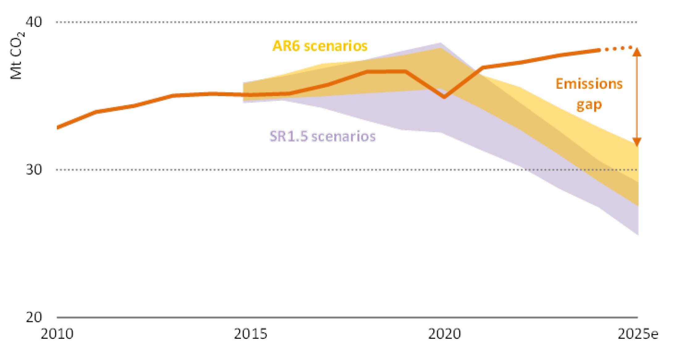

# WorldEnergyOutlook2025 - Part 7

*Pages 301-350*

## Page 301

Chapter 6 | Achieving access for all 
301
 
6 
Electricity connections derive from three main sources: grid extensions, mini-grids or stand-
alone systems. The type of electricity connection households receive in the ACCESS depends 
on several factors: proximity to existing infrastructure; population density of unelectrified 
areas; projected demand and ability to pay; and the speed at which new connections can be 
made. Allocations are informed by a geospatial, least-cost assessment that considers the cost 
of delivery alongside the projected demand profile, which in turn is closely linked to 
household income levels. 
Figure 6.13 ⊳ Global new electricity connections by type and associated 
generation mix by region in the ACCESS, 2024-2040 
 
IEA. CC BY 4.0.
Almost half of households are connected via grids,  
while mini-grids connect 30% and stand-alone systems connect 25%  
Note: SAS = stand-alone systems. 
Grid expansion remains the dominant approach, accounting for 45% of new connections by 
2040, mostly in regions which are relatively densely populated and where unelectrified 
communities lie close to existing transmission and distribution networks (Figure 6.13). In 
more remote but sizeable communities, i.e. especially those with schools, clinics, telecom 
towers, small-scale industry and local mining, mini-grids play a significant role and provide 
around 30% of new access. Stand-alone systems account for around 25% of new connections 
in the ACCESS. Stand-alone systems range from small solar home kits to larger set-ups 
including some with oil-based generators. They are typically deployed in dispersed, low 
demand areas where neither grid nor mini-grids are economically viable. Many of these 
systems power just a few basic appliances like lights, fans, radios and mobile phone chargers. 
Although they are more expensive than grids on a per kilowatt-hour (kWh) basis, and are 
limited in the services they can provide, stand-alone systems play a crucial role to provide 
electricity for isolated households. Falling solar PV and battery storage costs mean that solar 
45%
Grid
30%
Mini-grid
25%
SAS
New connections by type
25%
50%
75%
100%
Sub-Saharan
Africa
Developing
Asia
Rest of
world
Other
Oil
Nuclear
Coal
Natural gas
Reservoir
hydro
Run-of-river
hydro
Wind
Solar PV
Generation mix for new access
Dispatchable
Variable
IEA. CC BY 4.0.

---

## Page 302

302 
International Energy Agency | World Energy Outlook 2025
 
powered systems are becoming increasingly more common and accessible, particularly in 
sub-Saharan Africa, while pay-as-you-go and other innovative business models have 
improved affordability and increased uptake. Small “pico-solar” devices are also widely 
purchased and used today: while these may fall short of formal electricity access definition 
thresholds, they help meet the energy needs of those who cannot afford anything more. 
When households are first connected, they typically consume only small amounts of 
electricity for lighting, phone charging and perhaps a fan, radio or television. This reflects 
affordability constraints and limited appliance ownership. Over time, demand tends to grow 
as incomes rise and households acquire more appliances, such as a refrigerator, washing 
machine or electric stove, but this process is gradual. Based on data in several African 
countries, the IEA has calculated that most newly connected households initially consume 
one-fifth of the regional average household energy use and even five years on, they consume 
20% less than average households in those countries. 
Despite low per household consumption at the outset, the sheer number of new connections 
means that demand growth from newly electrified homes is significant. By 2040, the 
incremental electricity demand arising from households gaining access reaches 270 TWh in 
the ACCESS, roughly the electricity consumption of Italy today. This increased demand has a 
marked effect in sub-Saharan Africa, where new access accounts for 45% of additional 
residential electricity demand from now to 2040, compared with 15% in developing Asia and 
5% in other regions (Figure 6.14). 
Figure 6.14 ⊳ Residential electricity demand from connected households and 
those gaining access by region in the ACCESS by 2040 
 
IEA. CC BY 4.0.
Extending electricity access contributes little to residential electricity demand growth  
to 2040 in most regions, but it accounts for over 40% of the total in sub-Saharan Africa 
Notes: Rest of world = all regions with an access gap other than sub-Saharan Africa and developing Asia. 
Developing Asia in this figure excludes China, India and Indonesia, which have already reached universal 
electricity access. 
 250
 500
 750
1 000
2024
2040
TWh
Sub-Saharan Africa
Households with access
Households gaining access
 250
 500
 750
1 000
2024
2040
Developing Asia
 500
1 000
1 500
2 000
2024
2040
Rest of world
IEA. CC BY 4.0.

---

## Page 303

Chapter 6 | Achieving access for all 
303
 
6 
New electricity demand is met by the most cost-effective generation sources that can ensure 
reliable service in the ACCESS. Hydropower and natural gas account for 30% and 25% of 
global electricity supplied to newly connected households. Solar PV meets a quarter of this 
demand and powers most off-grid systems. In mini-grids, especially those serving larger rural 
communities with schools, clinics or small businesses, solar is often combined with battery 
storage and oil-based backup generators to ensure reliability and continuous supply. The vast 
majority of stand-alone systems and small access solutions rely on solar and batteries. The 
total capacity needed to meet the additional demand from new connections through to 2040 
is relatively limited. 
Scaling up electricity access, particularly in areas with limited financial resources, requires 
efforts to identify and support productive uses of electricity. Local industries, agricultural 
activities and service providers can act as anchor customers for new access projects helping 
to stabilise demand and improve project economics. Such anchor consumers are often able 
to convert reliable electricity into increased productivity and income, improving their ability 
to pay for electricity services. For developers and financiers, this focus on productive uses is 
critical, as projects with strong commercial anchors are generally easier to finance and more 
sustainable. 
At the same time, expanding electricity access must be accompanied by efforts to improve 
reliability and affordability. Without dependable electricity, households and businesses 
cannot make full use of their connections, particularly for income generating activities. IEA 
analysis of satellite data on nighttime lighting in sub-Saharan Africa reveals that only about 
half of areas with access to electricity show signs of consistent electricity availability during 
peak evening hours. A number of countries in sub-Saharan Africa are beginning to strengthen 
regional power pools and improve co-ordination between rural electrification agencies and 
national utilities in order to boost reliability. These are important steps to ensure service 
quality keeps pace with access. Similar actions are underway in other regions too. 
6.3.3 Investment 
The IEA now tracks commitments from public and private financiers related to electricity 
access. Between 2019 and 2023, an average of USD 3 billion was committed annually to 
finance electricity access (Figure 6.15). Following a Covid-19 pandemic-related dip in 2020, 
finance commitments rebounded in 2021; total commitments are now around one-quarter 
higher than in 2019, at USD 3.4 billion. Finance flows have been heavily concentrated in a 
handful of countries: in Africa, six countries – South Africa, Mozambique, Kenya, Senegal, 
Angola and Nigeria – accounted for almost 50% of tracked financing on the continent over 
the five-year period. Funding has also been skewed towards urban and peri-urban areas, 
where higher population density and incomes made it easier to demonstrate bankability for 
projects. 
Reaching universal access to electricity worldwide requires around USD 250 billion of 
investment between 2025 and 2035 to fund capital expenditure, including the cost of 
installing grid or mini-grid lines, and equipment costs for decentralised solutions. This 
translates into around USD 23 billion of spending per year between 2025 and 2035, which 
IEA. CC BY 4.0.

---

## Page 304

304 
International Energy Agency | World Energy Outlook 2025
 
represents a sizeable portion of expected power sector investment outlays in the coming 
years and would mean a sevenfold increase in the current level of investment for electricity 
access. 
Figure 6.15 ⊳ Investment in electricity access by type, 2019-2035, and by 
source of finance in the ACCESS, 2025-2035 
IEA. CC BY 4.0.
Investment in access to electricity increases sevenfold in the period to 2035;  
of which around 55% is from private sources, with a notable increase in equity capital 
Notes: MER = market exchange rate; SAS = stand-alone systems. Investment in the 2019-2023 period is based 
only on countries that have not yet reached universal access in order to have an equal comparison to future 
investment needs. As such, countries such as India, Indonesia and Bangladesh that reached universal access 
in recent years are not included. 
Mobilising more private finance is central to expand electricity access. The private sector 
accounts for roughly 60% of the investment needed in the ACCESS to reach universal 
electricity access. The level of private finance involvement varies across solution types: it 
accounts for 80% of investment in solar home systems, but that figure falls to 50% for grid 
connection projects, where state-owned utilities are the largest or only players in some 
markets (Box 6.2). Regulatory hurdles and exposure to financially struggling utilities (Box 6.3) 
can further hinder private investment in grid connection projects.  
Box 6.2 ⊳ 
Innovative financing solutions for off-grid access 
Private sector investment in off-grid solutions has been increasing in recent years thanks 
to the development of new financing instruments, particularly off-balance sheet 
financing for solar home system (SHS) companies (Figure 6.16). Historically, SHS projects 
were financed through company balance sheets, but this can be restrictive for companies 
using a pay-as-you-go model because the liability for sold appliances remains on the 
 5
 10
 15
 20
 25
2019-2023
2025-2035
Grid
Mini-grid
SAS
Annual average investment 
Billion USD (2024, MER)
25%
50%
75%
100%
Provider
Type
Public
Private
Debt
Equity
Grant
Investment share by source of finance
IEA. CC BY 4.0.

---

## Page 305

Chapter 6 | Achieving access for all 
305
 
6 
balance sheet until it is fully paid off by the consumer. Since 2020, large SHS developers 
began using off-balance sheet transactions underpinned by the securitisation of company 
receivables – the future payments from customers as they pay back their SHS obligations 
– to attract a broader range of private investors, including commercial banks. This 
approach frees up the developer balance sheet while also limiting the risk exposure of 
investors (IEA, 2025b). In the ACCESS, the use of securitisation increases, including 
through the use of aggregation platforms that make such transactions viable for smaller 
developers. 
Figure 6.16 ⊳ Private financing for decentralised electricity access in Africa 
by type of solution and investor, 2019-2023 
 
IEA. CC BY 4.0. 
Stand-alone systems and private sector finance contribute significantly to electricity 
access projects with large transactions in 2021 and 2022 boosting investment 
Notes: SHS = solar home systems; impact investors = debt and equity funds with an impact mandate, 
including private equity and venture capital. Other = crowdfunding, family offices, foundations and angel 
investors. Data covers financing commitments in high impact countries which together account for about 
80% of countries with significant levels of population without access to electricity.  
Mini-grid companies, which have attracted lower shares of private investment compared 
to SHS, also expand their use of financing instruments in the ACCESS, including through 
green debt issuances. Mini-grid development is capital intensive, so access to cheap debt 
is essential to keep project costs manageable. Developers need longer term loans than 
are available from most commercial banks, but their transactions are generally too small 
for them to be able to raise capital in public capital markets. In Nigeria, a combination of 
concessional capital and local currency guarantees has been used to overcome this 
difficulty by enabling mini-grid developers to issue green bonds which have been 
purchased by private investors, including local pension funds. This model could be 
replicated in markets with clear mini-grid regulatory frameworks and strong financial 
markets.  
25%
50%
75%
100%
2019
2020
2021
2022
2023
Corporate
Impact investors
Banks
Other
By provider type
 150
 300
 450
 600
2019
2020
2021
2022
2023
Million USD (current, MER)
SHS
Mini-grid
By solution type
IEA. CC BY 4.0.

---

## Page 306

306 
International Energy Agency | World Energy Outlook 2025
 
Future private investment depends on the creation of favourable and stable regulatory 
frameworks, including provision for investment in grids, clear tariff design and targeted 
financial incentives. It also depends on an understanding of where private capital can feasibly 
be deployed, and of how public finance can be strategically disbursed to mobilise this 
investment. Concessional resources have fallen significantly below the levels envisaged in 
the ACCESS, but recently received a renewed push to increase them under Mission 300 – an 
initiative led by the World Bank and the African Development Bank to provide access to 
300 million people by 2030 – and this could be invaluable. 
One of the most significant changes in investment in the ACCESS concerns the structure of 
financing. As higher risk-taking capital, equity plays a pivotal role in attracting other forms of 
capital, notably low-cost debt that can help scale up projects to increase access to electricity. 
Difficulty in obtaining equity has so far held back growth, particularly in the start-up stage 
for solar home system developers and the growth stage for mini-grid developers. In the 
ACCESS, new sources of patient equity emerge, including local pension funds and the 
International Finance Corporation Zafiri Fund, which was announced in 2025 and is expected 
to scale up in coming years. As a result, the equity share of commitments to last-mile delivery 
rises in the ACCESS from the 20% level of in the last five years to over a third in the years 
ahead. 
Box 6.3 ⊳ 
Sustaining utility revenues while extending access  
Extending electricity access requires significant upfront investment. This is rarely covered 
by the one-off connection fees paid by consumers: utilities typically recover these costs 
over time through tariffs. However, affordability challenges in many regions make this 
model difficult to sustain. Low and stagnant demand means utilities have to wait a long 
time to recoup their investment, which strains revenue and limits the liquidity they need 
to finance new connections. 
This problem is particularly acute in sub-Saharan Africa. Newly electrified households in 
the region consume around 50% less electricity than their counterparts in countries like 
Indonesia and India, and average household electricity consumption in sub-Saharan 
Africa has declined by about 25% since 2012, while it has increased by a third in other 
emerging markets and developing economies (Figure 6.17). Expansion costs are also 
typically higher in sub-Saharan Africa, with dispersed populations and weak transmission 
networks pushing up the per connection cost of grid investment. 
To strengthen the economic viability of electrification, utilities are increasingly promoting 
productive uses of electricity, such as irrigation, agri-processing, textile production and 
refrigerated supply chains. These uses consume more power than households, generate 
income that supports repayment, and stimulate broader economic development that, in 
turn, enables households to afford more energy services. They also support utility 
finances. In Kenya, for example, small and large industrial customers represent just 5% 
of connections but account for around 70% of electricity consumption and utility 
revenues (Kenya Power, 2024). 
IEA. CC BY 4.0.

---

## Page 307

Chapter 6 | Achieving access for all 
307
 
6 
There is no estimate for how much suppressed demand for productive uses exists in 
Africa, though it may well be large, given that industrial, services, and agricultural 
electricity demand per unit of gross domestic product (GDP) in sub-Saharan Africa is 
around two-times lower than the average of the emerging market and developing 
economies grouping. Scaling up productive uses of energy could make a major 
contribution to the expansion of affordable access, while also contributing to economic 
development, food and water security. 
Figure 6.17 ⊳ Residential electricity consumption in sub-Saharan Africa and 
selected countries, 2012-2024, and by solution type, 2024 
IEA. CC BY 4.0. 
Average household electricity consumption in sub-Saharan Africa  
is low and has decreased by a quarter since 2012 
Notes: kWh = kilowatt-hour; SHS = solar home systems. Large SHS have capacity of >100 Watt-peak (Wp). 
Small SHS have capacity of 10-50 Wp. Sub-Saharan Africa excludes South Africa in this figure. 
6.4 
Moving beyond access 
Many emerging market and developing economies stand to benefit immensely from 
expanded economic activities which are powered by constructive energy use. For example, 
making energy services available and affordable can help make the industry and agriculture 
sectors more productive, improve transportation logistics and enable refrigerated supply 
chains. Such opportunities are often untapped or underdeveloped by households and 
businesses that have only recently acquired access to energy services. Making energy more 
affordable and reliable could unlock this latent demand and help to deliver both economic 
and development goals. This section explores how energy demand has developed alongside 
energy access in the past and how it might evolve in the trajectory of the ACCESS. 
 50
 100
 150
 200
2012
2016
2020
2024
Average
When first connected
kWh per month
Residential electricity consumption
Indonesia
India
Sub-Saharan Africa
Grid
Mini
grid
Small
SHS
Large
SHS
Consumption
Average
Consumption by solution type in 
sub-Saharan Africa, 2024
IEA. CC BY 4.0.

---

## Page 308

308 
International Energy Agency | World Energy Outlook 2025
 
Many major emerging market and developing economies have seen economy-wide energy 
demand per capita rise substantially in the last decade, often during periods in which they 
made major progress to extend energy access (Figure 6.18). For example, in China and India, 
residential energy demand rose alongside demand in the industry and services sectors, even 
as they registered fast reductions in energy intensity, comparable to rates seen in advanced 
economies. Other regions, however, have seen per capita modern energy use remain 
stagnant or fall. In sub-Saharan Africa, for example, per capita energy use has declined in 
recent years as efforts to energise economies and improve access to energy have lagged 
population growth. 
Figure 6.18 ⊳ Total final modern energy consumption per capita by region, 
2000-2024, and change in household consumption and 
application by region, 2015-2024 
 
IEA. CC BY 4.0.
Modern energy consumption per capita has continued to rise in developing Asia over the 
past decade amid rising economic prosperity, while it has declined in other regions  
Note: EMDE = emerging market and developing economies; LAC = Latin America and the Caribbean; SSA = sub-
Saharan Africa; GJ = gigajoule. 
In the ACCESS, regions where broader increases in energy-based services have stalled shift 
onto new trajectories that pair growth in energy demand rise with improved access to 
energy, similar to those witnessed in other emerging market and developing economies. 
Some regions that are closing their energy access gap, such as India and Indonesia, continue 
to advance along energy demand trajectories similar to those of advanced economies. In 
those regions, energy access rises alongside energy demand and GDP per capita 
(Figure 6.19). Total modern energy demand per capita rises in the ACCESS by around 15% per 
decade in developing Asia and sub-Saharan Africa, compared with 10% in the average of the 
overall group of emerging market and developing economies. 
The overall level of energy demand per capita can vary between regions with similar levels 
of GDP, which reflects differences in industrial structure, climate, level of reliance on 
 10
 20
 30
 40
20%
40%
60%
80%
100%
GJ per capita
Electrification rate
Sub-Saharan Africa
India
Indonesia
EMDE
Other Southeast Asia
Total final modern energy consumption
LAC
-1
0
1
2
3
4
5
Residential
Private transport
SSA
LAC
Indonesia
China
India
GJ per capita
Change in household consumption
IEA. CC BY 4.0.

---

## Page 309

Chapter 6 | Achieving access for all 
309
 
6 
personal transport, prevalence of energy-efficient home appliances and the energy mix. 
Moreover, advances in energy efficiency mean that countries developing today will see lower 
increases in energy use per unit of GDP growth than economies that developed with less 
efficient options, while still achieving comparable levels of energy services. Increases in 
energy efficiency also play a key role to provide affordable options for households just 
gaining access. 
Figure 6.19 ⊳ Total final modern energy consumption per capita and GDP per 
capita for selected countries/regions in the ACCESS, 2010-2035 
 
IEA. CC BY 4.0.
In developing regions, rising total final modern energy consumption accompanies 
improvements in energy access and increases in income levels 
Note: LAC = Latin America and the Caribbean; PPP = purchasing power parity. EMDE = emerging market and 
developing economies 
Despite recent improvements in energy access, the average household in emerging market 
and developing economies still consumes far less than in an advanced economy. Households 
in emerging market and developing economies today consume only 44% of the modern 
energy used in households in advanced economies (Figure 6.20). Even within emerging 
market and developing economies, the differences are striking: the average household in 
sub-Saharan Africa consumes just one-third of modern energy used by the average 
household in India, and one-tenth of the level in China. 
Utility data in several African countries show modern energy demand in newly connected 
households significantly lagging national averages more than ten years after gaining access. 
This is reflected in the rates of household energy demand growth in the ACCESS. As incomes 
rise, household energy demand nevertheless increases in the ACCESS, doing so at a pace in 
line with what has been seen in other emerging market and developing economies, and 
reflecting expanding energy access, rising appliance ownership and improving living 
standards. Residential modern energy demand per household increases at different speeds 
 10
 20
 30
 40
 50
 0
 10
 20
 30
Historical
ACCESS
projections
India
GJ per capita
Thousand USD per capita (2024, PPP)
Sub-Saharan Africa
Indonesia
EMDE
Other Southeast Asia
LAC
IEA. CC BY 4.0.

---

## Page 310

310 
International Energy Agency | World Energy Outlook 2025
 
in different regions: by around 15% over the 2025-2035 decade in China; around 20% in the 
rest of developing Asia; and more than doubling in sub-Saharan Africa. Among other things, 
the differences in speed reflect the variations in current levels of energy use and energy 
access in the regions concerned. Energy demand growth is somewhat faster through to 2035 
than in later years, due to the rapid pace of access expansion during that period, but the 
growth of energy consumption per household with access is relatively constant over time. 
Figure 6.20 ⊳ Residential modern energy demand growth per household by 
region in the ACCESS, 1980-2035 
 
IEA. CC BY 4.0.
Energy demand per household is set to continue rising in emerging market and developing 
economies as countries become wealthier and more people benefit from energy access 
Note: GJ = gigajoule. 
Energy access is not enough on its own to improve prosperity. Realising the full 
transformative potential of energy requires parallel efforts to connect households and 
companies with the equipment and services needed to turn energy access into improved 
livelihoods and economic opportunities. Possible initiatives might include: programmes to 
build refrigerated supply chains that allow farmers to bring more produce to market; to 
provide low-cost farming and manufacturing equipment to artisanal industries in order to 
enhance productivity; and to replace oil-based irrigation with efficient electric pumps. Efforts 
outside the energy sector could include improvements to transport and logistics 
infrastructure, and efforts to increase access to digital and financial services and tools. 
The ACCESS presents a pathway to universal access which recognises that progress takes 
time and that affordability challenges will not be resolved overnight, but still illustrates the 
transformative potential of universal energy access and productive energy use. It also shows 
how proven models can be scaled up to address, once and for all, one of the most profound 
instances of energy insecurity that still persists in the world today. 
 10
 20
 30
 40
Sub-Saharan Africa
India
Indonesia
China
1980
2000
2020
ACCESS 2035
GJ per household
 20
 40
 60
 80
Advanced 
economies
IEA. CC BY 4.0.

---

## Page 311

Chapter 6 | Achieving access for all 
311
 
6 
Box 6.4 ⊳ 
Energy access in the WEO scenarios 
As with all the scenarios in the World Energy Outlook, our energy access projections are 
not forecasts but rather an exploration of a range of possible outcomes under various 
sets of assumptions. The treatment of energy access progress is closely linked to how the 
wider energy sector is modelled (see Chapter 2).  
In the Current Policies Scenario (CPS), only those access policies and programmes already 
in place are considered. In the Stated Policies Scenario (STEPS), we take into account also 
announced policies and programmes, although we do not assume that aspirational 
access targets are met. The Accelerating Clean Cooking and Electricity Services Scenario 
(ACCESS), introduced in this chapter, accelerates action to match the best historical 
progress observed in comparable country contexts. The Net Zero Emissions by 2050 
Scenario (NZE) maps out a way to achieve the global Sustainable Development Goal 7 
target to achieve universal access to electricity and clean cooking by 2030.  
Figure 6.21 ⊳ Global population lacking access to electricity and clean 
cooking by scenario, 2010-2050 
 
IEA. CC BY 4.0. 
Energy access slows in the CPS and STEPS as some countries reach universal access, 
leaving the bulk of those without access in countries with weak policy frameworks 
Note: NZE = Net Zero Emissions by 2050 Scenario; ACCESS = Accelerating Clean Cooking and Electricity 
Services Scenario; STEPS = Stated Policies Scenario; CPS = Current Policies Scenario. 
Outcomes related to modern energy access diverge sharply in these scenarios. In the CPS, 
progress slows as the countries making the strongest efforts achieve universal access, 
while leaving behind around 700 million people without electricity access and 1.8 billion 
without clean cooking by 2030, most of whom live in countries that have seen little 
progress in recent years under current policy settings (Figure 6.21). In the STEPS, the 
1 000
2 000
3 000
2010
2024
2050
NZE
ACCESS
STEPS
CPS
Electricity
Million people
2010
2024
2050
Clean Cooking
IEA. CC BY 4.0.

---

## Page 312

312 
International Energy Agency | World Energy Outlook 2025
 
most recently announced policy measures lead to a modest acceleration of progress, 
though 1 650 million people remain without access to clean cooking in 2030. Electricity 
access also improves, but 640 million people without electricity access, mostly in 
sub-Saharan Africa. To achieve the targets of Sustainable Development Goal 7, the pace 
would need to rise dramatically in order to give around 150 million people access to 
electricity and nearly 400 million access to clean cooking each year to 2030 – a rate of 
progress never previously achieved. 
 
IEA. CC BY 4.0.

---

## Page 313

Chapter 7 | Net Zero Emissions by 2050 
313
 
Chapter 7 
Net Zero Emissions by 2050 
Acting now to limit overshoot 
• The Paris Agreement set the global goal of limiting warming to well below 2 °C and 
pursuing efforts to limit it to 1.5 °C. The IEA Net Zero Emissions by 2050 (NZE) Scenario  
translates the 1.5 °C goal into a global pathway for the energy sector. The updated 
NZE Scenario presented here takes account of the most recent data and trends. Each 
country will tailor its own path to net zero emissions. The updated  NZE Scenario is 
based on four central pillars that are widely applicable: clean energy electrification, 
energy efficiency, low-emissions fuels and methane abatement.  
• The installed capacity of renewables increases nearly fourfold from today’s level by 
2035 in the NZE Scenario: nuclear and other low-emissions technologies increasingly 
contribute as electricity demand grows to account for one-third of all energy 
consumption. Energy efficiency increases by about 4% per year by 2035, double the 
rate of 2022. Sustainable fuels – including liquid biofuels, biogases, low-emissions 
hydrogen and hydrogen-based fuels – are widely deployed: their use more than 
quadruples by 2035 from current levels. Methane emissions are cut by more than 80% 
by 2035. 
• Global energy-related carbon dioxide (CO2) emissions were 38 gigatonnes (Gt) in 
2024. In the NZE Scenario, emissions fall by nearly 55% by 2035 to around 18 Gt. Yet, 
the increase in long-term global average temperature exceeds 1.5 °C around 2030 and 
peaks at around 1.65 °C about 2050. The NZE Scenario achieves the COP28 goals of 
doubling efficiency and tripling renewables capacity by 2030, and it meets the Paris 
Agreement goal of holding warming well below 2 °C throughout the 21st Century.  
• The updated NZE Scenario reflects the fact that exceeding 1.5 °C is now inevitable, 
and some reliance on technologies to remove CO2 from the atmosphere is 
unavoidable to return warming to below 1.5 °C. Such technologies are expensive and 
unproven at scale: immediate action to reduce emissions can limit the scale of the 
removals needed. In the NZE Scenario, the global average temperature increase falls 
back below 1.5 °C by 2100.  
• Energy investment in the NZE Scenario increases to around USD 4.8 trillion per year 
over the next decade, from USD 3.3 trillion today. As these upfront investments are 
made, savings from lower fuel prices together with efficiency gains mean that 
households face costs for energy services comparable to those of today through to 
2035, and lower still in the longer term. Fuel importers benefit too as import bills are 
cut by about two-thirds. Electricity takes on a bigger role to meet energy demand, 
underlining the significance of electricity security, and the need for secure and 
diversified supply chains for critical minerals and energy technologies. 
S U M M A R Y  
IEA. CC BY 4.0.

---

## Page 314

YOU ARE
HERE
1.5 °C 
A pathway to return temperature rise below 1.5 °C
Methane
emissions
Nuclear
capacity
Renewables
capacity
Sustainable
fuel production
Energy
productivity
2010
2015
2020
2025
The world has gone off track with pathways
to 1.5 °C with no or low overshoot.
The NZE scenario sees temperatures rise by around 1.65 °C above pre-industrial levels before 
falling back to 1.5 °C by 2100. Returning warming to below 1.5 °C requires immediate emissions 
reductions and carbon dioxide removal.
Pathway to 1.5 °C
with no or low overshoot
40 Gt CO2
20
30
Key indicators for energy transitions in the NZE Scenario
715 GW
2024
NZE 2035
60%
19 600 GW
32 EJ
80%
NZE
2020
2030
2040
2050
2060
2070
2080
2090
2100
1 °C 
2 °C 
Constant Emissions
IEA. CC BY 4.0.

---

## Page 315

Chapter 7 | Net Zero Emissions by 2050 
315
 
7 
7.1 
Context 
Background to the NZE Scenario 
In 2015, the Paris Agreement set the overarching goal of holding the increase in the global 
average temperature to well below 2 degrees Celsius (°C) above pre-industrial levels and 
pursuing efforts to limit the temperature rise to 1.5 °C. Subsequent meetings under the 
United Nations Framework Convention on Climate Change (UNFCCC) of the Parties to the  
Paris Agreement strengthened the focus on limiting warming to 1.5 °C, building on the 
findings of the Intergovernmental Panel on Climate Change (IPCC) Special Report on 1.5 °C 
(IPCC, 2018). The outcome of the UNFCCC Conference of the Parties (COP) 28 in 2023 
recognised that limiting the temperature increase to 1.5 °C required countries to reach net 
zero emissions from the energy sector by mid-century. It identified key milestones for the 
global energy sector, including tripling the installed capacity of renewables and doubling the 
rate of increase in energy efficiency improvements by 2030. 
The International Energy Agency (IEA) was asked by the COP26 Presidency in 2021 to give an 
indication of what achieving the 1.5 °C goal would mean for the energy sector. Responding 
to this request, the Net Zero Emissions by 2050 Scenario (NZE Scenario) was developed. It 
represents a global pathway towards the goal of limiting global warming to 1.5 °C. The IEA 
has always been clear that there are various paths to reach this objective and that each 
country will have its own route. Since 2021, the IEA has updated its NZE Scenario each year, 
in line with changes in real world investment, technology developments and greenhouse gas 
(GHG) emissions. 
Three inter-related trends have marked the last several years: 
 
Energy sector emissions have continued to set record highs. 
 
Progress in deploying low-emissions technologies and increasing energy efficiency has 
been very rapid in some cases but is uneven across sectors and countries. 
 
The context in which governments and energy companies are operating remains 
complex and challenging, marked by features such as increasing geopolitical 
fragmentation, high government debt burdens, and rising levels of concern about 
energy security and affordability after the global energy crisis. 
With these in mind, we have revisited several aspects of the design of the NZE Scenario in 
this Outlook, while maintaining the end point of net zero energy-related CO2 emissions by 
2050, in order to provide an up-to-date analysis of the current state of efforts to meet the 
Paris Agreement target of 1.5 °C and additional efforts needed to achieve it in the current 
context. The updated NZE Scenario is presented in this chapter. 
A limited overshoot pathway to 1.5 °C has slipped out of reach 
Pathways assessed by the IPCC which limit the increase in the global average temperature to 
below 1.5 °C by 2100 with no or limited overshoot assumed immediate and rapid emissions 
IEA. CC BY 4.0.

---

## Page 316

316 
International Energy Agency | World Energy Outlook 2025
 
reductions from 2015 or 2020. 1 Global energy-related carbon dioxide (CO2) emissions, 
however, have continued to rise, increasing by 1% in 2024 to an all-time high of 
38.2 gigatonnes (Gt). Current emissions levels are therefore moving the world increasingly 
away from these IPCC pathways (Figure 7.1). 
Figure 7.1 ⊳ 
Energy-related CO₂ emissions and emissions pathways in 
scenarios assessed by the IPCC consistent with no or limited 
overshoot of 1.5 °C, 2010-2025 
 
IEA. CC BY 4.0.
Energy-related emissions are increasingly diverging from pathways assessed  
by the IPCC which limit warming to 1.5 °C with no or limited overshoot 
Notes: Mt CO2 = million tonnes of carbon dioxide. 2025e = estimated values for 2025. The ranges for scenarios 
assessed by the IPCC represents the 25th and 75th percentile. SR1.5 scenarios refers to scenarios assessed in 
the IPCC Special Report: Global Warming of 1.5 °C (IPCC, 2018). AR6 scenarios refers to C1 scenarios assessed 
by the IPCC in the Sixth Assessment Report (IPCC, 2022a).   
Sources: IEA analysis based on IIASA (2022a; 2022b). 
Because of the delay in reducing emissions, each edition of the World Energy Outlook (WEO) 
has updated the NZE Scenario to factor in higher cumulative emissions and higher peak 
warming. In the WEO-2024 version of the NZE Scenario, peak warming reached just below 
1.6 °C around 2040 before subsequently declining to below 1.5 °C by 2100. Therefore, our 
NZE Scenario in the WEO-2024 came very close to exceeding the threshold of limited 
overshoot of about 0.1 °C as defined by the IPCC.  
 
1 Limited overshoot 1.5 °C pathways are defined by the IPCC as those that keep the temperature rise below 
1.5 °C with a 33% chance or greater, and which hold the temperature rise in 2100 below 1.5 °C with a 50% 
chance or greater, and which exceed the 1.5 °C limit by “up to several decades”. This is equivalent to a 50% 
chance or greater of exceeding 1.5 °C by up to about 0.1 °C (IPCC, 2022). 
IEA. CC BY 4.0.

---

## Page 317

Chapter 7 | Net Zero Emissions by 2050 
317
 
7 
The level of long-term warming today stands at around 1.4 °C. Given continued high levels 
of emissions and recent investments in emissions-intensive infrastructure, temporarily 
exceeding the 1.5 °C threshold is virtually certain. Even pathways that limit this overshoot to 
less than about 0.1 °C, i.e. IPCC limited overshoot pathways, have slipped out of reach. They 
would require global CO2 emissions to reach net zero in the mid- to late-2030s. This would 
mean a fall in emissions of around 3.5 Gt CO2 per year – twice the drop seen in 2020 related 
to the Covid-19 pandemic – which would have to continue every year for at least the next 
decade. 
Deployment of some low-emissions technologies is in line with what is needed,  
but progress is uneven 
IEA scenarios are not predictions. Nonetheless, it is useful to compare real world data and 
trends with scenario projections in order to assess the extent to which they are aligned with 
what is needed to achieve climate goals. In several areas, clean energy deployment is broadly 
in line with or even above the levels seen in the NZE Scenario in the WEO-2021: solar 
photovoltaics (PV) and electric vehicles (EVs) are the best examples (Figure 7.2). In other 
areas, deployment has been slower: carbon capture, utilisation and storage (CCUS), 
hydrogen and hydrogen-based fuels, and energy efficiency have all made slower progress 
than in the WEO-2021 NZE Scenario. Improvements in energy efficiency from 2021 to 2024 
averaged 1.6% per year, which is slower than the long-term average during the 2010s, and 
far below the levels modelled in our original NZE Scenario in 2021. Deployment of clean 
energy technologies has been highly concentrated geographically. In the 2021-2024 period, 
advanced economies and China accounted for 80% of all clean energy investment. 
Figure 7.2 ⊳ 
Key indicators of energy transition in the NZE Scenario in the 
WEO-2021 versus actual outcomes, 2020-2024 
 
IEA. CC BY 4.0.
Technology deployment has been uneven: some areas are tracking  
ahead of or in line with a path towards 1.5 °C, while others are lagging 
Note: GW = gigawatt; Mt CO2 = million tonnes of carbon dioxide. 
0.9
1.0
1.1
1.2
2020
2024
Efficiency gain
(2020 = 1)
Actual
outcome
2021 NZE
Scenario
 300
 600
 900
2020
2024
Wind and solar 
additions (GW)
 8
 16
 24
2020
2024
Electric car sales
(million units)
 100
 200
 300
2020
2024
Carbon capture
(Mt CO2)
IEA. CC BY 4.0.

---

## Page 318

318 
International Energy Agency | World Energy Outlook 2025
 
Policies face a complex context 
Three issues are creating a complex international context for climate policies.  
First, the global economy is just coming out of the worst bout of inflation since the 1970s, 
which was exacerbated by the 2022 global energy crisis triggered by the Russian invasion of 
Ukraine. In many countries, consumer prices rose substantially faster in the post-Covid 
period than before. Inflationary pressures in the energy sector were worsened by high global 
fossil fuel prices, in particular for natural gas, leading to widespread concerns about energy 
affordability (Figure 7.3).   
Figure 7.3 ⊳ 
Global monetary, fiscal and geopolitical indicators in the  
pre- and post-Covid periods, 2015-2025 
 
IEA. CC BY 4.0.
Affordability, fiscal and geopolitical headwinds have sharpened in the post-Covid period 
Note: EMDE = emerging market and developing economies. 2025e = estimated values for 2025. 
Sources: IEA analysis based on data from Oxford Economics (2025); IMF (2025); Caldara and Iacoviello (2021).  
Second, clean energy technologies are typically more capital intensive than incumbent 
technologies, and rapid energy transitions require high levels of investment (section 7.4.1). 
At present, many households, businesses and governments are facing high interest rates and 
many governments around the world are grappling with challenging fiscal outlooks: in 2025, 
fiscal deficits in both advanced and emerging market and developing economies are 
projected to be around 60% larger than on average during the pre-Covid period. Low-
emissions energy systems can provide hedges against volatility in fossil fuel markets, but 
raising the investment needed to achieve energy transitions is made more difficult by tighter 
financing conditions.  
Third, governments face a challenging and increasingly fragmented geopolitical 
environment. Large-scale armed conflict has broken out in multiple regions of the world, 
economic frictions have increased, trust between countries has eroded, and multilateralism 
 80
 100
 120
 140
 160
2015
2025e
Consumer price index
2020 = 100
Advanced
economies
EMDE
-12%
-9%
-6%
-3%
2015
2025e
Fiscal deficit as 
a share of GDP
 100
 200
 300
 400
2015
2025
Geopolitical risk index
2019 = 100
IEA. CC BY 4.0.

---

## Page 319

Chapter 7 | Net Zero Emissions by 2050 
319
 
7 
is struggling to provide solutions to problems like climate change which require global co-
operation. 
NZE Scenario 
As countries prepare to consider the next round of Nationally Determined Contributions 
(NDCs) under the Paris Agreement, this updated NZE Scenario pathway aims to provide a 
pragmatic but ambitious vision of what would it take for the world to pursue efforts to limit 
warming to 1.5 °C, given recent data on energy, technology, and emissions.  
As in previous editions, this updated pathway keeps the goal of net zero global CO₂ emissions 
by 2050. However, it also factors in the reality of recent high emissions, recent emissions-
intensive investment, and the slow progress being made in taking forward some options for 
emissions reductions. Consequently, while it still achieves the COP28 energy goals of 
doubling the pace of annual efficiency improvements and tripling the installed capacity of 
renewables, it sees a slightly less rapid transition, with higher emissions in the near term than 
in previous WEO editions. Warming exceeds 1.5 °C degrees for several decades, and 
returning to below 1.5 °C by 2100 is only possible with the deployment in the second half of 
this century of carbon dioxide removal technologies that are currently unproven at large 
scale. This updated NZE Scenario nevertheless remains a highly ambitious and challenging 
pathway (Figure 7.4). Critically, it remains below the upper limit enshrined in the Paris 
Agreement of holding warming to well below 2 °C above pre-industrial levels throughout the 
21st Century and meets internationally agreed energy goals. 
Figure 7.4 ⊳ 
Average annual emissions reductions from peak year to 2035, 
and scale up of low-emissions energy supply to 2035 in various 
editions of the NZE Scenario 
 
IEA. CC BY 4.0.
The NZE Scenario 2025 retains an ambitious outlook for  
emissions reductions and scaling up low-emissions energy supply 
Note: Gt = gigatonne; NZE = Net Zero Emissions by 2050 Scenario. 
-2.5
-2.0
-1.5
-1.0
-0.5
NZE
2025
NZE
2024
NZE
2023
NZE
2022
NZE
2021
Annual emissions reduction (Gt CO₂)
 0.6
 1.2
 1.8
 2.4
 3.0
NZE
2025
NZE
2024
NZE
2023
NZE
2022
NZE
2021
Increase in low-emissions energy (2024=1)
IEA. CC BY 4.0.

---

## Page 320

320 
International Energy Agency | World Energy Outlook 2025
 
Box 7.1 ⊳ 
Interpreting the 1.5 °C goal of the Paris Agreement  
The 1.5 °C goal enshrined in Article 2 of the Paris Agreement forms the basis of the target 
to reach net zero emissions by 2050 which has been adopted as a domestic policy goal 
by over 90 countries. However, the wording of the Paris Agreement does not specify 
several key aspects of the 1.5 °C goal. The most important of these are how the increase 
in temperatures should be defined and measured; whether it incorporates a temporary 
exceedance of 1.5 °C; and, if so, how long the period above 1.5 °C may be allowed to last. 
A scientific and policy consensus on these issues has emerged, shaped to a large extent 
by subsequent clarifications made by the UNFCCC as well as by assessments of the 1.5 °C 
target made by the IPCC (UNFCCC, 2022; IPCC, 2021). On the question of how to measure 
warming, the UNFCCC has specified that warming should be anthropogenic in origin, i.e. 
for example the effects of volcanic activity should not be taken into account, and that it 
should be measured “over decades” to smooth out the effects of short-term climate 
variability, caused for example by the El Nino Southern Oscillation.2 This decadal average 
results in a long-term temperature rise which can differ from the measured temperature 
rise in a given year by up to around 0.2 °C. In 2024, for instance, the best estimates of the 
long-term temperature rise were between 1.34 °C and 1.41 °C, whereas the measured 
annual average temperature rise was a record-breaking 1.55 °C (Forster, Smith and 
Walsh, 2025; WMO, 2025).  
Figure 7.5 ⊳ 
Peak temperature rise and years of overshoot in the 
NZE Scenario and IPCC 1.5 °C scenarios 
IEA. CC BY 4.0. 
Only 4% of scenarios assessed by the IPCC avoid overshoot of the  
1.5 °C threshold, and more than half exceed 1.5 °C for at least 40 years 
Note: Figure shows the C1 and C2 scenarios from IPCC’s Sixth Assessment Report (IPCC, 2022a).   
 
2 The IPCC used the middle year of a 20-year average to define the point in time when a certain average global 
surface temperature level is reached and used the period 1850-1900 as an approximation of the pre-industrial 
period specified as a baseline in the Paris Agreement (IPCC, 2021a).  
 1.3
 1.4
 1.5
 1.6
 1.7
 1.8
 1.9
0
15
30
45
60
75
Years of overshoot 
NZE scenario
High overshoot
Limited overshoot
No overshoot
Peak temperature rise (°C)
IPCC scenarios:
1.5 °C threshold
IEA. CC BY 4.0.

---

## Page 321

Chapter 7 | Net Zero Emissions by 2050 
321
 
7 
The IPCC classification of scenarios compatible with 1.5 °C warming also sheds light on 
the question of overshoot (Figure 7.5). Only 4% of these scenarios avoided overshooting 
the 1.5 °C threshold; 40% have a peak temperature rise of up to around 1.6 °C (limited 
overshoot), and the remainder have a peak temperature rise of up to 1.8 °C (high 
overshoot). Most of the scenarios involve overshoots lasting between 35 and 65 years. 
The updated NZE Scenario presented in this chapter has a peak temperature rise of 
around 1.65 °C and overshoots 1.5 °C for around 55 years (section 7.2.2). 
7.2 
Pathways for emissions and temperature 
7.2.1 
Emissions 
In 2024, global energy-related GHG emissions3 reached 42.6 gigatonnes of carbon-dioxide 
equivalent (Gt CO2-eq). CO2 emissions accounted for 38.2 Gt of this total – an all-time high. 
In the NZE Scenario, GHG emissions fall around 50% to 2035, and CO2 emissions by almost 
55% to around 18 Gt (Figure 7.6). Emissions from electricity generation, which today make 
up about 40% of total energy-related CO2 emissions, decline particularly fast: they drop to 
around one-quarter of today’s levels by 2035. By 2050, remaining energy-related CO2 
emissions of around 2.1 Gt are mainly from industry (0.45 Gt), aviation and shipping (0.4 Gt) 
and road freight (0.32 Gt), and are balanced by removals of the same magnitude, without 
any reliance on removals from land-use measures. 
The NZE Scenario also sees rapid reductions in GHG emissions and climate forcers other than 
CO2, including short-lived climate forcers (SLCFs), which exert a large warming effect but have 
short atmospheric lifetimes. Cutting emissions from SLCFs has a key role to limit global 
warming in the decades around mid-century (section 7.2.3). Important energy-related SLCFs 
include methane and black carbon4, emissions of which drop by more than 80% in 2035 from 
today’s level (section 7.3.4). As many SLCFs are air pollutants, curbing their emissions also 
has significant benefits for public health.  
Reducing or limiting the growth in non-energy-related GHG emisions also plays a valuable 
part in minimising the rise in global temperatures. For example, in the NZE Scenario CO2 
emissions associated with deforestation fall almost 50% by 2050, with the result that net CO2 
emissions from land use and forestry, i.e. including the effects of afforestation, fall from over 
4 Gt today to net zero in the mid-2040s. In a similar vein, efficiency gains in crop management 
which reduce reliance on fertiliser mean that nitrous dioxide emissions from agriculture in 
2050 are close to current levels, despite a 75% increase in crop production for food and 
 
3 Carbon dioxide (CO2), methane (CH4) and nitrous oxide (N2O) from fossil fuel combustion, flaring and fugitive 
CO2 and industrial processes. 
4 The warming effects of black carbon remain highly uncertain due to its complex interactions with clouds and 
surface albedo, especially in snow- and ice-covered regions (IPCC, 2021b). 
IEA. CC BY 4.0.

---

## Page 322

322 
International Energy Agency | World Energy Outlook 2025
 
bioenergy by that time. Despite these measures, it remains hard to eliminate all non-energy-
related GHG emissions by 2050, particularly those from agriculture and from F-gases used as 
refrigerants and in industrial processes. Emissions of non-energy-related GHGs fall by 45% 
between 2024 and 2050.  
Figure 7.6 ⊳ 
Energy-related and other GHG emissions, and energy-related 
CO2 emissions by sector in the NZE Scenario, 2010-2050 
 
IEA. CC BY 4.0.
Global energy-related GHG emissions fall by around 55% by 2035,  
led by rapid reductions in the electricity sector and in methane emissions  
Note: GHG = greenhouse gases; CO2-eq = carbon-dioxide equivalent. Other includes agriculture, forestry and 
other land use (AFOLU) and waste.  
Sources: AFOLU emissions based on IEA modelling and Land-Use Analytic.   
Implications for emissions and atmospheric carbon dioxide removals after 2050  
Bringing the global increase in average temperature back down to below 1.5 °C requires 
scaling up CO2 removal from the atmosphere. The NZE Scenario assumes that this occurs 
predominantly through bioenergy with carbon capture and storage (BECCS) and direct air 
capture and storage (DACS), although other removal strategies exist outside the energy 
sector (Box 7.2). Annual CO2 removal using these technologies in the NZE Scenario reaches 
2.1 Gt CO2 in 2050 and 3.8 Gt CO2 by 2100 (Figure 7.8). This would mean removing the 
current annual energy-related CO2 emissions of India and Indonesia combined from the 
atmosphere by 2100. CO2 removal on this scale has obvious economic and resource 
implications. The earth system response to net zero emissions and to net removals from the 
atmosphere is also highly uncertain.    
15
30
45
60
2010
2030
2050
Energy-related and other GHG emissions
Gt CO₂-eq
Energy-related GHGs
Other GHGs
-5
0
5
10
15
2010
2030
2050
CO2 emissions by sector
Electricity
Industry
Transport
Other
Buildings
IEA. CC BY 4.0.

---

## Page 323

Chapter 7 | Net Zero Emissions by 2050 
323
 
7 
Box 7.2 ⊳ 
The critical importance of cutting gross emissions 
Removing CO₂ from the atmosphere is very challenging. The scale of CO₂ removals 
needed to return warming to below 1.5 °C depends not just on the degree of 
temperature overshoot but also on the size of residual gross emissions. Some sectors, 
such as aviation, may struggle to reach net zero emissions if low-emissions technologies 
such as sustainable aviation fuels cannot be scaled up sufficiently (section 7.3.3). If this is 
the case, some atmospheric removals will be needed to achieve net zero emissions. 
In the NZE Scenario, gross annual emissions are reduced to around 2.1 Gt by 2050 and 
decline further to just under 1 Gt by 2100. Comparable high overshoot 1.5 °C scenarios 
assessed by the IPCC assume much lower potential to reduce gross emissions. In these 
scenarios, even after net zero is reached, gross emissions average nearly 7 Gt per year 
out to 2100 (Figure 7.7). This is more than the total emissions today from hard-to-abate 
sectors such as international transport, iron and steel and cement.  
Figure 7.7 ⊳ 
Average annual emissions and removals from applications of 
BECCS and DACS in high overshoot 1.5 °C scenarios assessed 
by the IPCC 
IEA. CC BY 4.0. 
In scenarios assessed by the IPCC, continued high levels of gross emissions lead  
to a large reliance on removal technologies which are unproven at scale today 
 Note: Annual average is measured from the year energy sector emissions reach net zero to 2100. 
Source: IEA analysis based on data from IIASA (2022).  
Limiting reliance on removal technologies, which are unproven at scale today, means 
acting now to reduce peak warming as much as possible, for example by cutting 
emissions of short-lived-climate forcers and maximising the deployment of clean energy 
technologies across the entire energy system. Achieving this in sectors such as energy-
intensive industries and long-distance transport will require innovation.   
- 15
- 10
- 5
0
 5
 10
Gross emissions
Gross removals
Net Emissions
NZE
Gt CO₂
IEA. CC BY 4.0.

---

## Page 324

324 
International Energy Agency | World Energy Outlook 2025
 
Figure 7.8 ⊳ 
Global gross and net energy-related CO2 emissions in the 
NZE Scenario, 2020-2100 
 
IEA. CC BY 4.0.
Around 3.8 Gt per year of CO₂ removals via BECCS and DACS  
would be needed to bring the temperature rise to below 1.5 °C by 2100 
Note: Gt CO2 = gigatonne of carbon dioxide; BECCS = bioenergy equipped with CCUS; DACS = direct air capture 
and storage. 
By 2050, around 1.1 Gt CO2 is removed from the atmosphere through BECCS in the 
NZE Scenario, and this rises to around 2 Gt by 2100. The extent to which BECCS can be 
increased is constrained by limits on sustainable bioenergy supply, as well as by the economic 
and logistical challenges of deploying infrastructure to connect widely dispersed bioenergy 
facilities with large-scale CO2 storage sites. Removing 2 Gt CO2 per year would require 
gathering, processing, combusting, capturing, transporting and storing the emissions from 
bioenergy produced on roughly 150 million hectares (Mha) of land, around 15% more than 
the total land area of Peru (Figure 7.9).  
While the deployment of DACS is not restricted by the availability of feedstock or suitable 
sites, the low concentration of CO2 in the atmosphere means that DACS is currently much 
more energy-intensive and costly than BECCS. By 2050 around 1 Gt of CO2 is removed by 
DACS in the NZE Scenario, and this grows to about 1.8 Gt by 2100 to make up the remaining 
removals. This level of DACS would require just over 13 exajoules (EJ) per year by 2100, 
roughly equivalent to the energy requirements for buildings in the European Union today. If 
the energy required for the deployment of DACS were provided by solar PV, this would 
require around 3.3 Mha of land - slightly more than the land area of Belgium. While this is 
orders of magnitude lower than the land and water footprints typically associated with 
bioenergy production, it would put further strains on an already resource-constrained energy 
system.  
-10
0
10
20
30
40
2020
2030
2040
2050
2060
2070
2080
2090
2100
Gt CO₂
Net 
emissions
Gross 
emissions
BECCS and DACS
IEA. CC BY 4.0.

---

## Page 325

Chapter 7 | Net Zero Emissions by 2050 
325
 
7 
Figure 7.9 ⊳ 
Global annual energy use, costs and land-use requirements  
for CO2 removal technologies in the NZE Scenario, 2100  
 
IEA. CC BY 4.0.
BECCS and DACS required in the NZE Scenario would require  
enormous amounts of energy, money and land  
Note: EJ = exajoule; Mha = million hectares; BECCS = bioenergy equipped with carbon capture and storage; 
DACS = direct air capture and storage; EU = European Union. 
Today, total CO2 removal capacity stands at around 1 Mt CO2 per year, mostly in the form of 
BECCS. While recent company announcements suggest that BECCS and DACS capacity may 
increase more than 80-fold by 2035 from current levels, this is still far below the annual 
removal of 660 Mt CO2 needed by 2035 in the NZE Scenario. Reaching the levels needed 
would take huge, concerted efforts to support innovation, increase efficiencies, and promote 
durable, measurable and verifiable removals. It would also require a huge amount of money: 
removing 2 Gt with BECCS and 1.8 Gt with DACS each year by the end of the century would 
cost just over USD 850 billion per year, or around one-third more than was spent on global 
renewables investment in 2024. Organising this scale of resource mobilisation would be a 
major challenge requiring close international co-operation. The difficulties involved in large-
scale removal of CO2 from the atmosphere very strongly underline the case for ensuring that 
everything possible is done to minimise the need for it.  
7.2.2 
Climate outcomes  
The long-term global average rise in temperatures above pre-industrial levels was around 
1.4 °C in 2024 (Forster, Smith and Walsh, 2025; WMO, 2025). In the NZE Scenario, this 
increases to above 1.5 °C around 2030 and peaks at around 1.65 °C in about 2050 
(Figure 7.10). It then gradually declines by 0.04 °C per decade to below 1.5 °C in 2100. The 
reduction in warming after 2050 reflects in part natural processes whereby land and oceans 
absorb atmospheric carbon and reduce its warming effect, the steep drop in emissions of 
 5
 10
 15
 20
Energy use (EJ)
0.3
0.5
0.8
1.0
BECCS
DACS
Cost (Trillion USD)
 40
 80
 120
 160
2024 EU energy consumption for building
2024 Global renewables investment
Land area of Peru
Land (Mha)
IEA. CC BY 4.0.

---

## Page 326

326 
International Energy Agency | World Energy Outlook 2025
 
SLCFs such as methane in the preceding decades, and a small additional uptake of CO2 from 
afforestation. However, these factors alone would not be sufficient to reduce the 
temperature rise below 1.5 °C: this outcome is only achieved through the large-scale 
deployment of CO2 removal technologies. 
Figure 7.10 ⊳ Temperature rise in the NZE Scenario, 2000-2100  
 
IEA. CC BY 4.0.
Temperature rise peaks close to 1.65 °C around 2050 and falls back below 1.5 °C by 2100; 
however, significantly higher levels of warming cannot be ruled out 
Note: Figure shows the long-term global mean temperature rise equal to the mid-point of a 20-year average 
of the combined land and marine near-surface temperature anomaly relative to 1850-1900, corresponding to 
IPCC Sixth Assessment Report definition of warming of 0.85 °C between 1995-2014.  
Sources: IEA analysis based on the outputs of MAGICC 7.5.3, IPCC (2021). 
In the NZE Scenario, global warming rises above 1.6 °C for almost 30 years and above 1.5 °C 
for around 55 years. This prolonged temperature overshoot presents significant 
consequences for vulnerable populations, ecosystems and the stability of critical climate 
tipping elements. This is in part because overshooting 1.5 °C intensifies extreme weather 
events, e.g. heatwaves, droughts and floods, which disproportionately impact vulnerable 
populations and regions, especially in low-income countries with limited adaptive capacity. 
Weather extremes can also adversely affect the functioning of energy systems with 
associated costs arising from climate impacts and the necessity to build more climate 
resilient infrastructure (see Chapter 5).  
The IPCC Reasons for Concern framework notes that increased warming brings extra risks for 
unique and threatened systems, such as glaciers and biodiversity hotspots, and is likely to 
mean more frequent and damaging extreme weather events and raises the risk of large-scale 
singular events, such as abrupt shifts in ocean circulations. The level of additional impact and 
risk due to climate change grows markedly as warming progresses beyond 1.5 °C, with 
 0.5
 1.0
 1.5
 2.0
 2.5
2000
2020
2040
2060
2080
2100
33rd - 67th
percentile
5th - 95th
percentile
NZE
°C
IEA. CC BY 4.0.

---

## Page 327

Chapter 7 | Net Zero Emissions by 2050 
327
 
7 
multiple risks becoming high or very high between 1.5 °C and 2 °C (IPCC, 2022b). Threats to 
biodiversity and ecosystem integrity are expected to persist for decades beyond the period 
of peak warming. In over one-quarter of surveyed global regions, the likelihood that animal 
and plant species can fully recover to pre-overshoot conditions is either highly uncertain or 
effectively negligible (Meyer et al., 2022). Some effects of global warming are also known to 
be irreversible as temperatures fall back down. For example, sea levels will continue to rise 
for centuries to millennia even if long-term temperatures decline, and regional changes in 
climate are likely to persist after global mean temperatures decline (Schleussner, 2024).  
Inherent uncertainties in how the earth responds to future warming, GHG emissions, and the 
engineered removal of CO₂ from the atmosphere mean that significantly higher levels of 
warming cannot be ruled out. We calculate that, even if the NZE Scenario were to be 
achieved in full, there would still be about a 20% chance of future warming exceeding 2 °C, 
and about a 45% chance of not reducing warming below 1.5 °C by 2100. In addition to 
exacerbating extreme weather and other physical hazards associated with climate change, 
higher levels of warming might lead to various tipping points being reached, e.g. melting of 
the Greenland Ice Sheet or the rapid dieback of the Amazon rainforest, which would not 
reverse even if warming were subsequently brought down below 1.5 °C. Reaching these 
kinds of tipping points would have  consequences for the long-term habitability of the planet 
(Wunderling et al., 2022). The risks associated with rising temperatures are much more acute 
in the STEPS and CPS. 
How the NZE Scenario limits peak warming  
and then cools the planet  
If economy-wide GHG emissions were to continue at 2024 levels then the temperature 
rise – which today stands at around 1.4 °C – would reach just under 2 °C by 2050. In the 
NZE Scenario, however, the temperature rise reaches a peak of around 1.65 °C in 2050 
and then starts to decline. Around two-thirds of the avoided warming in the NZE Scenario 
results from rapidly reducing economy-wide CO2 emissions to net zero around 2050, with 
the almost all the remainder of avoided warming due to declining methane and N2O 
emissions. Other effects in the NZE Scenario, including cuts to emissions of aerosols and 
fluorinated gases, lead in aggregate to a small warming effect, raising temperatures in 
2050 by around 0.1 °C above what their level would have been otherwise (Figure 7.11). 
After 2050 the temperature rise reduces steadily to around 1.45 °C in 2100 in the NZE 
Scenario. About 30% of this cooling happens because of removals of CO2 from the 
atmosphere, mainly via BECCS and DACS, and a further 30% of cooling stems from 
reductions in methane and N2O emissions – both as a lagged response to reductions that 
happen prior to 2050 and because of continuing reductions in emissions of these GHG 
after 2050. A final 40% of cooling is associated with natural processes that reduce global 
S P O T L I G H T  
IEA. CC BY 4.0.

---

## Page 328

328 
International Energy Agency | World Energy Outlook 2025
 
surface temperatures in the decades after net zero CO2 emissions are achieved. There is 
also a small temperature rebound from other effects. 
Figure 7.11 ⊳ Global warming avoided in the NZE Scenario relative to 
constant emissions in 2050 and cooling 2050 to 2100 by lever  
IEA. CC BY 4.0.
Reducing CO2 emissions to net zero contributes most to warming avoided in the NZE 
Scenario in 2050; after 2050 cooling from natural processes plays a key role  
Notes: Constant emissions = all GHG emissions held at 2024 levels between 2024-2050; Other GHG 
reductions = methane and N2O reductions; CDR = carbon dioxide removals; Other = reduced emissions of 
aerosols, aerosol precursors and Montreal gases (including fluorinated gases) and the lagged temperature 
response to prior emissions due to physio-chemical interactions between GHGs in the atmosphere. 
Analysis based on global anthropogenic emissions, not only energy-related emissions. 
Source: IEA analysis based on Climate Resource and MAGICC 7.5.3.  
Predicting the level of warming associated with future GHG emissions is inherently 
uncertain, meaning that significantly higher warming than happens in the NZE Scenario 
cannot be ruled out. Much of the uncertainty stems from physical and biogeochemical 
feedback effects as the earth warms such as changes to cloud cover and the rate at which 
the land and oceans draw down atmospheric CO2. Nonetheless there is a well-established 
near linear relationship between cumulative CO2 emissions and the short-term 
temperature rise. 
However, there is currently a weaker scientific understanding of the extent to which 
removing CO2 from the atmosphere will cool the climate (Zickfeld, 2021). Much of this is 
due to uncertainty in the “Zero Emissions Commitment” (ZEC) – the change in global 
average surface temperatures due to natural processes in the decades after reaching net 
zero CO2 emissions. For example, the MAGICC climate model used by the IEA for this 
assessment estimates a ZEC corresponding to around 0.1 °C of cooling in the 50 years 
 0.5
 1.0
 1.5
 2.0
2050
2050
2100
Surface temperature (°C)
CO₂ reductions to net zero
Other GHG reductions
Natural processes
CDR
Other
Constant emissions
NZE
2024 
IEA. CC BY 4.0.

---

## Page 329

Chapter 7 | Net Zero Emissions by 2050 
329
 
7 
after net zero is reached, but other climate models find between around 0.4 °C of cooling 
to 0.3 °C of warming under similar conditions (Palazzo Corner S, 2023). 
Achieving the climate outcomes of the NZE Scenario if natural processes fail to lower 
surface temperatures after 2050 would present major implications for the energy sector. 
Emissions of methane and N2O in aggregate drop by around 20% between 2050 – 2100; 
speeding up this rate of reduction by 50%, which would be extremely difficult given the 
scarcity of options to further cut emissions, could reduce temperatures in 2100 by around 
0.02 °C – around one-quarter of what would be needed to compensate for the absence 
of cooling from natural processes. The remaining cooling would need to be achieved via 
CO2 removals from the atmosphere, which would need to increase to around 8 Gt per 
year by 2100 – around twice the level in the NZE Scenario. It is possible that some of this 
could happen because of increased afforestation, but it is likely that technological 
removals via BECCS and DACS would need to reach much higher levels than in the NZE 
Scenario, with stark consequences for land use, energy requirements and cost. 
7.3 
Energy pathways in the NZE Scenario 
The NZE Scenario illustrates a possible global path to the goal of net zero emissions by 2050. 
Each country will have its own pathway, depending on their circumstances. The energy 
transition set out in the NZE Scenario has four main pillars: deployment of low-emissions 
sources of electricity and electrification to reduce emissions in end-uses; improvements in 
energy efficiency; use of low-emissions fuels such as hydrogen, biofuels, and CCUS; and 
reductions in methane emissions. These strategies rapidly reduce emissions and drive a 
demand-led transition away from fossil fuels in this scenario.    
7.3.1 
Clean electrification 
Today, the power sector accounts for about 40% of global energy-related emissions. Shifting 
electricity generation to low-emissions sources and increasing the deployment of low-
emissions electricity in existing and new end-uses are central to the NZE Scenario: these 
strategies give rise to around two-thirds of the emissions reductions to 2035 (Figure 7.12). In 
the NZE Scenario, low-emissions sources provide nearly all electricity generation by 2040, 
while electricity increases its share in total final consumption to around 40% by 2040 and 
55% by 2050. The expanding role of electricity in total final consumption and the increase in 
electricity supply from variable renewable sources underline the importance of electricity 
security in the NZE Scenario. 
IEA. CC BY 4.0.

---

## Page 330

330 
International Energy Agency | World Energy Outlook 2025
 
Figure 7.12 ⊳ Low-emissions share of generation relative to electricity in final 
consumption and levers employed to cut emissions in the 
NZE Scenario, 2024-2050   
 
IEA. CC BY 4.0.
Clean electrification, which includes shifting generation to low-emissions sources  
and maximising electricity end-use, provides around two-thirds of  
emissions reductions achieved by 2035 
Note: Gt CO2 = gigatonnes of carbon dioxide; CCUS = carbon capture, utilisation and storage; DACS = direct air 
capture and storage. 
Generating electricity with low-emissions sources 
Low-emissions sources of electricity – renewables, nuclear, fossil fuels with CCUS, hydrogen 
and ammonia – accounted for just over 40% of global electricity generation in 2024, up from 
around 30% a decade ago. Renewables were responsible for 32% of power generation 
worldwide, and nuclear for around 9%: there was also a very small contribution of less than 
0.003% from fossil fuels equipped with CCUS.  
Global installed capacity of renewables triples to 2030 from a 2022 baseline in the 
NZE Scenario, building on the strong momentum already seen in the power sector, and 
meeting the goal set at COP28 in 2023 (Figure 7.13). As a result, renewables expand from 
around one-third of total generation today to around three-quarters by 2035. Achieving this 
while maintaining electricity security means ensuring that investment in electricity system 
flexibility keeps pace. Having surged by over 80% in 2024, the installed capacity of stationary 
batteries increases 17-fold to 2035, average of 30% per year, reaching almost 2 900 gigawatts 
(GW) in capacity terms and more than 8 400 gigawatt-hours (GWh) in energy terms. In the 
NZE Scenario, investment surges in grid infrastructure, and around 30 million kilometres (km) 
of new transmission and distribution lines are added by 2035.  
As variable renewables such as solar PV and wind account for a rising share of generation, 
dispatchable capacity plays a critical role to ensure electricity security. Long lead-times for 
2024
2030
2035
2040
2045
2050
15%
30%
45%
60%
20%
40%
60%
80%
100%
Electricity in final consumption
Electrification and low-emissions generation
Low-emissions in generation
-40
-30
-20
-10
2024
2030
2035
2040
2045
2050
Electrification
Low-emissions
Efficiency
Other fuel
Direct
CCUS and DACS
Other CO₂
Emissions reductions by lever
Gt CO2
electricity
switch
renewable use
abatement
IEA. CC BY 4.0.

---

## Page 331

Chapter 7 | Net Zero Emissions by 2050 
331
 
7 
nuclear limits its role in the near term, but installed nuclear capacity in the NZE Scenario 
increases 70% by 2035 from the current level, and by 2050 it is two-and-a-half times higher. 
By the 2030s, the nuclear industry delivers annual additions of around 40 GW per year 
(Box 7.3). Hydropower capacity also expands strongly, with generation increasing more than 
1.5-times by 2050. Unabated fossil fuel plants are operated increasingly for flexibility and 
capacity adequacy, and consequently their installed capacity falls more slowly than their 
output across the Outlook period. Fossil fuel plants equipped with CCUS and plants fired with 
hydrogen or ammonia are also deployed, providing additional low-emissions dispatchable 
capacity.  
Figure 7.13 ⊳ Electricity generation and key pillars for the power sector in the 
NZE Scenario, 2000-2050 
 
IEA. CC BY 4.0.
Rapid growth in all low-emissions sources enables the electricity sector to reach net zero by 
the early 2040s, supported by investment in grids, storage and dispatchable capacity 
Notes: TWh = terawatt-hour; GW = gigawatt; CCUS = carbon capture, utilisation and storage. The goal to triple 
renewables capacity set at COP28 refers to a baseline of installed capacity as of 2022. 
Box 7.3 ⊳ 
What would it take to meet the pledge of tripling installed 
nuclear capacity? 
At the COP28 in December 2023, more than 20 countries, representing 70% of current 
installed nuclear capacity, pledged to triple global nuclear power capacity by 2050. Six 
additional countries signed the pledge at the COP29 in 2024. If fully realised, this 
commitment would increase global nuclear capacity from 413 GW in 2020 to 1 240 GW 
by mid-century, which would exceed the level in the NZE Scenario by 160 GW.  
 30
 60
 90
2000
2024
2050
Electricity generation (TWh)
Unabated coal
Unabated natural gas
Other
Nuclear
Hydro
Solar PV
Wind
Other renewables
Hydrogen, ammonia and fossil fuels with CCUS
 6
 12
2030
2024
Renewables (Thousand GW)
 600
1 200
2050
2024
Nuclear (GW)
1 700
3 400
2035
2024
Storage (GW)
 60
 120
2035
2024
Grids (Million km)
IEA. CC BY 4.0.

---

## Page 332

332 
International Energy Agency | World Energy Outlook 2025
 
Reaching the tripling target by 2050 would require immediate efforts to scale up the 
nuclear industry in the 2020s to accelerate deployment in the 2030s and beyond, with 
annual deployment rates rising quickly in the 2030s to around 40 GW and being 
maintained throughout that decade and the 2040s. According to our analysis, this would 
lead to levels of global nuclear capacity additions never achieved before (Figure 7.14). 
This expansion would support a wide range of applications. Beyond its traditional role in 
the power sector, nuclear energy could contribute to water desalination and to low-
emissions hydrogen production, for example. In the NZE Scenario, the pace of nuclear 
capacity additions is expected to slow after the mid-2030s, in line with other low-
emissions technologies, as most electricity systems become largely decarbonised by 
then: as a result, capacity rises 2.5-times from the current level rather than tripling. 
Figure 7.14 ⊳ Global nuclear installed capacity and capacity additions to 
reach the tripling target by 2050 relative to the NZE Scenario 
 
IEA. CC BY 4.0. 
Achieving the tripling of global nuclear capacity requires capacity additions of some 
40 GW annually through the 2030s and 2040s, primarily driven by advanced economies 
Note: Other EMDE = emerging market and developing economies other than China; NZE = Net Zero 
Emissions by 2050 Scenario. 
Achieving this tripling of nuclear capacity would require a significant increase in 
investment. Annual investment spending would need to rise from over USD 70 billion 
today to a peak of about USD 210 billion around 2035 before plateauing at around 
USD 160 billion through the 2040s. Investment would need to be on average 50% higher 
throughout the 2040s than in the NZE Scenario, resulting in an additional USD 900 billion 
of spending by 2050. This scaling up would be heavily dependent on robust supply chains, 
skilled labour and long-term policy support. 
 300
 600
 900
1 200
1 500
1990
2000
2010
2020
2030
2040
2050
Advanced economies
China
Other EMDE
NZE
Installed capacity
GW
 10
 20
 30
 40
 50
1970s
1980s
1990s
2000s
2010s
2020s
2030s
2040s
Average annual capacity additions
IEA. CC BY 4.0.

---

## Page 333

Chapter 7 | Net Zero Emissions by 2050 
333
 
7 
The United States could play a central role in this global effort.  An Executive Order issued 
in May 2025 to reform the US Nuclear Regulatory Commission aims to revitalise the 
domestic nuclear industry and sets a goal of adding 300 GW of new capacity by 2050. It 
is reinforced by the One Big Beautiful Bill Act, which makes continued tax credits available 
to the nuclear industry. Countries in the European Union, Middle East, Africa, East Asia 
and North and Central America are also showing renewed interest in nuclear power as 
part of their decarbonisation strategies.  
Electrifying final consumption 
Electrification is one of the key levers in the NZE Scenario to reduce CO2 emissions in the end-
use sectors, i.e. industry, transport and buildings. Direct emissions from end-use sectors 
currently account for more than half of total energy-related CO2 emissions. Electrification 
provides almost 40% of the emissions reductions from end-uses by 2050. 
Figure 7.15 ⊳ Electricity demand by use and in total final consumption by  
end-use sector in the NZE Scenario, 2024-2050 
 
IEA. CC BY 4.0.
Industrial demand and electric vehicles drive up the share of electricity  
over half of total final consumption by 2050 
Notes: TWh = terawatt-hour; AC = air conditioning; TFC = total final consumption. Hydrogen production 
excludes onsite production which is covered in energy-intensive industries. 
Rising demand in existing end-uses and the electrification of new end-uses in the 
NZE Scenario led to significant growth in electricity demand, which increases by 4.1% on 
average per year until 2035, adding an average of 1 400 terawatt-hours (TWh) each year. By 
2035, a third of the energy used in end-use sectors comes from electricity, up from one-fifth 
today. This rises to over half of total final consumption by 2050 (Figure 7.15). The share is 
higher in the buildings sector and lower in the transport and industry sectors, where 
 20
 40
 60
 80
2024 2035 2050
Other
Hydrogen production
Other buildings
Heat pumps
Appliances and AC
Other industry
Energy-intensive
Electric vehicles
Electricity demand
Thousand TWh
industry
20%
40%
60%
80%
2024
2035
2050
TFC
Buildings
Industry
Transport
Share of electricity
IEA. CC BY 4.0.

---

## Page 334

334 
International Energy Agency | World Energy Outlook 2025
 
bioenergy, CCUS, hydrogen and hydrogen-based fuels and some residual fossil fuels account 
for a higher share of the total. In these sectors, low-emissions fuels are required to meet 
demands for energy that are difficult to electrify, notably in some energy-intensive industries 
and in aviation and shipping (section 7.3.3).  
EVs are one of the most important contributors to electricity demand growth. They are 
central to the decarbonisation of the transport sector, reducing its CO2 emissions by 2.4 Gt 
by 2035. Heat pumps are the key technology for decarbonisation of buildings through 
electrification of space heating: their share in space heating increases from around 12% 
today to 45% by 2050. Heat pumps are also an important technology for decarbonising the 
industry sector, particularly in non-energy-intensive industries with low temperature heat 
needs: the share of electricity in non-energy-intensive industries rises from around 40% 
today to over 50% by 2035. After 2035, technologies currently under development accelerate 
the electrification of energy-intensive industries (Box 7.4). 
Box 7.4 ⊳ 
Emerging technology focus: Direct electrification of 
energy-intensive industries 
Direct electrification of processes in energy-intensive industries is challenging because 
most of them require high temperatures and specific materials for reactions. As a result, 
the share of electrification in steel, cement and primary chemicals production is well 
below 15% today. However, there are several technologies under development that 
could electrify these processes, in some cases directly and in others indirectly, notably by 
using electricity to produce onsite low-emissions hydrogen. While first demonstration 
plants for processes such as electrolytic ammonia and methanol or hydrogen-based steel 
making are already online or under construction, technologies such as iron ore 
electrolysis or electric steam crackers are at the prototype stage.  
Integrating these technologies is vital if energy-intensive industries are to be 
decarbonised. Their use avoids 2.2 Gt CO2 of emissions by 2050 in the NZE Scenario, 
contributing around a third of combustion emissions reductions in the industry sector. 
Technologies that are more mature today reach market shares of 30-50% in their 
respective industries in the NZE Scenario, and electric alumina digestion attains a market 
share of over 80% by 2050 (Figure 7.16). Technologies at the prototype level today are 
not deployed as extensively in the NZE Scenario, so there is potential upside if they prove 
to be feasible in larger demonstration projects.  
The deployment of electrification technologies in the NZE Scenario has important 
implications for the electricity system. The electricity demand of all technologies 
analysed reaches nearly 6 700 TWh by 2050: this is more than twice the electricity 
consumption of energy-intensive industries today, and accounts for about 10% of total 
electricity demand in 2050. 
IEA. CC BY 4.0.

---

## Page 335

Chapter 7 | Net Zero Emissions by 2050 
335
 
7 
Figure 7.16 ⊳ Current readiness, deployment and electricity demand of 
electrification technologies in energy-intensive industry in the 
NZE Scenario in 2050 
 
IEA. CC BY 4.0. 
Technologies that electrify energy-intensive industries account for around 10% of total 
electricity demand by 2050, and this could rise if their deployment potential increases 
Note: TRL = technology readiness level; TWh = terawatt-hour; DRI = direct reduced iron.  
Source: TRL is based on IEA (2025a). 
7.3.2 
Energy efficiency 
Energy efficiency plays a critical role to boost economic competitiveness, increase 
affordability of energy and lower overall energy demand. Many efficiency measures have 
short payback periods and offer attractive opportunities to reduce energy spending and CO2 
emissions. Annual global gross domestic product (GDP) growth averaged 3% in the 2015-
2024 period, while total energy demand increased by 1.6% annually, indicating a relative 
decoupling of energy demand from economic growth at the global level. At national level, 
some 40 countries that make up about 30% of total global energy demand are seeing a 
decline in energy demand even while their GDP continues to grow, indicating a long-term 
absolute decoupling of energy demand from economic growth.5 
In the NZE Scenario, the annual rate of improvement in energy intensity – defined as the 
energy demand needed to produce a dollar of economic output – steadily rises to reach 4% 
on average in the period to 2030. This meets the goal of doubling the rate of annual energy 
efficiency improvement.  
 
5 Relative decoupling refers to GDP increasing faster than energy demand. Absolute decoupling refers to an 
absolute decline in energy demand even while GDP continues to grow. 
1 520 TWh
Iron ore 
electrolysis
Electric 
cement kiln
Silicates for 
cement
Electric steam 
cracker
2 480 TWh
Electrolytic 
ammonia
1 830 TWh
Electrolytic 
methanol
Electric alumina 
digestion
20%
40%
60%
80%
100%
TRL 5
Technology share
Hydrogen-based DRI
TRL 6
TRL 7
TRL 8
IEA. CC BY 4.0.

---

## Page 336

336 
International Energy Agency | World Energy Outlook 2025
 
Figure 7.17 ⊳ Energy demand by effect and selected economic activity 
indicators in the NZE Scenario, 2024-2035 
 
IEA. CC BY 4.0.
Energy efficiency plays an important part in reducing energy demand  
even as the global economy expands   
Note: Energy demand in this figure refers to total primary energy demand, also known as total energy supply. 
In the NZE Scenario, the annual rate of improvement in energy intensity – defined as the 
energy demand needed to produce a dollar of economic output – steadily rises to reach 4% 
on average in the period to 2030. This meets the goal of doubling the rate of annual energy 
efficiency improvement.  
In the NZE Scenario, energy efficiency is achieved through:  
 
Technical efficiency improvements in equipment and buildings. 
 
Switching from other fuels to electricity in end-uses where feasible, as electricity is much 
more efficient as an energy carrier than other fuels. 
 
Structural effects such as material efficiency and modal switching. 
 
Shifting to more efficient sources of energy where electrification is not feasible or where 
those sources are being used to generate electricity, for example when renewables are 
used in place of less efficient fuels to generate electricity. 
Together these elements enable energy efficiency to play an important part to reduce energy 
demand (Figure 7.17). However, the importance of each element varies from sector to sector 
(Figure 7.18).  
In the buildings sector, minimum energy performance standards for appliances and energy 
codes for new construction are combined with policies that boost retrofit rates in the 
NZE Scenario. By 2035, new space cooling equipment in all markets reaches the performance 
levels of today’s best available technologies in their respective regions, and there is progress 
-180
-90
0
90
2024
2030
2035
Economic growth
Technical efficiency
Electrification
Structural effects
Other fuel switching
Net change
Change in energy demand by effect (EJ)
0.8
1.0
1.2
1.4
2024
2030
2035
Growth in economic activity (2024 = 1)
Freight transport
Floorspace
Industry value
added
and renewables
IEA. CC BY 4.0.

---

## Page 337

Chapter 7 | Net Zero Emissions by 2050 
337
 
7 
toward global best-in-class standards thereafter. Continued electrification of space and 
water heating equipment also increases efficiency in the buildings sector. Moving to more 
efficient cooking fuels such as liquefied petroleum gas and electricity reduces energy 
demand by up to 85% compared to traditional cooking. 
Figure 7.18 ⊳ Energy consumption by effect in end-use sectors in the 
NZE Scenario, 2024-2035 
 
IEA. CC BY 4.0.
Continued energy efficiency gains allow economic growth to  
go hand-in-hand with reductions in energy consumption 
In the transport sector, the switch from internal combustion engine (ICE) vehicles to EVs 
reduces energy consumption because of the higher efficiency of electric motors, 
regenerative braking and simpler drivetrains: an EV uses 70-80% less energy than a 
comparable ICE vehicle to travel the same distance. Modal shifts and vehicle downsizing can 
help to ensure more efficient use of batteries to meet transport needs. For instance, sport 
utility vehicles today require ten-times more battery capacity per passenger-kilometre than 
electric buses, and almost three-times more than a small battery electric car. Fuel economy 
improvements across all types of drive trains and increasing sales of EVs together lead to an 
absolute reduction in road transport energy consumption even as demand for transport 
continues to expand. 
In the industry sector, material efficiency measures such as light weighting products, 
extension of product lifetimes and enhanced recycling help to reduce the use of energy-
intensive materials, while providing consumers with the same level of service. Increases in 
technical efficiency in industrial motors, drives and processes also contribute. The increasing 
deployment of artificial intelligence offers scope to bring about further increases in energy 
efficiency across energy-intensive and non-energy-intensive industries (see Chapter 1). 
 50
 100
 150
 200
2024
2035
2024
2035
2024
2035
Economic growth
Technical efficiency
Electrification
Energy demand
Structural effects
EJ
Transport
Buildings
Industry
and other fuel switching
IEA. CC BY 4.0.

---

## Page 338

338 
International Energy Agency | World Energy Outlook 2025
 
7.3.3 
Filling up on low-emissions fuels 
Although electrification plays a major role to increase efficiency and lower emissions in the 
NZE Scenario, it cannot fully decarbonise some key end-use sectors. As a result, low-
emissions molecules, i.e. hydrogen, hydrogen-based fuels and bioenergy, have a vital role to 
play to supplement electricity on the path to net zero emissions. In the NZE Scenario, such 
low-emissions fuels supply around 10% of total final consumption in 2035 and around 20% 
in 2050, up from 5% today. In the short and medium term, low-emissions molecules have a 
role to play as drop-in fuels for decarbonising conventional energy technologies; in the long 
term, they play a significant role in the decarbonisation of some hard-to-abate sectors. 
Biofuels 
Liquid biofuel consumption today is dominated by road transport. In the NZE Scenario, EVs 
are the main route to decarbonise passenger road transport, and continued growth for liquid 
bioenergy comes from other end-use sectors which rely on energy-dense liquid fuels. These 
include shipping and aviation, which together account for around 25% of liquid and gaseous 
bioenergy consumption by 2035 (Figure 7.19). In aviation, biofuels play an important role in 
the next decade as the primary means of producing sustainable aviation fuels (SAF) that can 
be directly substituted for conventional fossil-based jet fuel. In 2035, around 80% of SAF are 
biofuels, more than 85% of which are produced from biomass that does not compete with 
food production. It is not until the 2040s that fuels synthesised from hydrogen and CO2 
captured from point sources or the atmosphere become an important source of SAF in the 
NZE scenario. 
The use of heat pumps brings about a shift to electricity for much of space heating and many 
non-energy-intensive industrial processes, but some buildings and non-energy-intensive 
industrial processes are difficult or costly to electrify, notably those processes that require 
high-temperature heat. Bioenergy plays a role to reduce emissions in these cases, especially 
for buildings and industries that remain connected to natural gas infrastructure. Emerging 
market and developing economies are the largest source of expansion, with blended 
biomethane playing an important role to decarbonise gas networks that supply domestic 
heating and non-energy-intensive industries, meeting around 10% and 7% respectively of 
those energy demands by 2050. 
This increase in blending leads to significant growth in biogas demand compared to liquid 
biofuels. Biogases can be deployed in hard-to-abate sectors using existing infrastructure. 
They also tend to score well on energy security metrics because they are usually consumed 
close to the sites where they are produced, and because they can be stored more cheaply 
than electricity. The IEA 2025 update to the Outlook for Biogas and Biomethane used 
geospatial analysis to demonstrate that almost 25% of today’s natural gas demand could be 
met sustainably by biogases (IEA, 2025b). The NZE Scenario does not rely on all this potential 
being tapped: it envisages biogas demand reaching 15 EJ in 2050, or around 10% of current 
demand for natural gas. 
IEA. CC BY 4.0.

---

## Page 339

Chapter 7 | Net Zero Emissions by 2050 
339
 
7 
Figure 7.19 ⊳ Fuel demand met by liquid bioenergy and biogases relative  to 
electricity for key end-uses in the NZE Scenario, 2024-2050 
 
IEA. CC BY 4.0.
Energy demand that is hard to electrify relies heavily  
on low-emissions molecules to decarbonise 
Notes: Liquid bioenergy includes biogasoline, biodiesel, biomethanol and bio-jet kerosene, i.e. biogenic SAF; 
biogases include biogas and biomethane. Solid biofuel, including modern and traditional use of biomass, is not 
shown.  
Biofuels depend on land use for their production. Expanding the use of biofuels is constrained 
by competition for other land uses, e.g. forest conservation and forest restoration. Total 
bioenergy and waste consumption in the NZE Scenario is just over 100 EJ in 2050, which is 
approximately equivalent to conservative estimates for its sustainable global production 
potential (Creutzig, 2014). In contrast with current production, which relies mainly on 
constrained supplies of food crops and waste vegetable oil, the NZE Scenario sees increasing 
amounts of liquid biofuels produced from short rotation woody biomass crops, which can be 
grown on marginal land but still produce twice as much bioenergy per hectare as existing 
bioenergy crops. Woody biomass is also used as solid bioenergy with minimal processing in 
several sectors, particularly power, energy-intensive industries and space heating. 
Converting these crops into drop-in liquid fuels requires advanced technologies, of which the 
NZE Scenario sees production rise from low levels today to nearly 5 EJ by 2035.  
Adoption of biofuels is influenced by costs as well as supply limitations. The main cost driver 
for existing commercial biofuels is feedstock, which accounts for more than 80% of the total 
cost of production. These production costs vary significantly over time and between regions: 
at times they have fallen below the equivalent fossil fuel price. Looking forward, increasing 
competition for biofuels reduces the incidence of very low prices and increases the lowest 
prices at which existing commercial biofuels can be produced (Figure 7.20). The share of 
feedstocks in the cost of emerging biofuel technologies is lower than for existing commercial 
 10%
 20%
 30%
 40%
0%
10%
20%
30%
40%
50%
60%
70%
Electricity fuel share
Shipping 
Aviation
Road
Non-energy intensive industry
Space heating
Liquid bioenergy and biogases fuel share
2024
2035
2050
IEA. CC BY 4.0.

---

## Page 340

340 
International Energy Agency | World Energy Outlook 2025
 
options, reflecting the high capital and operating costs of the biofuel conversion processes. 
However, these conversion costs decline slightly over time, reducing the costs of emerging 
biofuel technologies and bringing them closer to those of existing commercial biofuels: in the 
case of biogasoline, it brings costs into the historical range of fossil end-user prices. 
Figure 7.20 ⊳ Existing commercial and emerging liquid biofuel costs relative to 
fossil equivalent prices, 2024 and 2035 
 
IEA. CC BY 4.0.
Biofuel costs are highly uncertain, but can be competitive with fossil alternatives; emerging 
biofuel technologies become more competitive over time as processing costs fall 
Notes: GJ = gigajoule; MER = market exchange rate. Historical and projected feedstock prices for existing 
commercial biofuels are taken from OECD-FAO (2025), the variation in which underpins the range in cost 
estimates.  
Box 7.5 ⊳ 
Emerging technology focus: What next for bioethanol? 
More than half of liquid biofuels in use today are based on bioethanol produced from 
food crops. Bioethanol plays an important role in decarbonising the road sector, 
particularly in regions where it is already widely deployed, but growth opportunities are 
limited because of the widespread electrification of vehicles. Continued expansion 
therefore depends on the extent to which other applications are found, particularly in 
the heavy-duty transport sector, where there is a higher level of uncertainty about the 
lowest cost routes to decarbonisation.  
In the aviation sector, alcohol-to-jet (AtJ) pathways are a promising option for upgrading 
bioethanol, and demonstration projects are under way in both Europe and the United 
States. In the NZE Scenario, these pathways account for over 10% of SAF production in 
2035. Because bioethanol can be produced from a range of feedstocks, AtJ pathways 
have much higher SAF production potential than today’s dominant hydrotreated esters 
 15
 30
 45
 60
2024
2035
2024
2035
2024
2035
2014-2024 fossil equivalent price (excluding tax)
Existing commercial
Emerging
Biogasoline
USD per GJ (2024, MER)
Biodiesel
Bio-jet kerosene
IEA. CC BY 4.0.

---

## Page 341

Chapter 7 | Net Zero Emissions by 2050 
341
 
7 
and fatty acids pathway which produces fuels from vegetable oils, waste oils and fats. 
However, the ability of AtJ to compete with more established technologies for alternative 
fuel production like the Fischer-Tropsch process has yet to be demonstrated. 
In the shipping sector, bioethanol does not currently meet the requirements for 
consideration as a sustainable fuel by the FuelEU Maritime regulation if produced from a 
food crop. As a result, its future use depends to a considerable extent on whether it can 
be produced affordably using waste material. If this hurdle can be overcome, it could be 
a competitive option, since it is denser and less toxic than some other biofuels like 
biomethanol. In regions with established production and robust regulatory frameworks 
for sustainable production chains, bioethanol may offer an option for near-term 
emissions reductions where existing infrastructure could be used to make it available for 
bunkering before other types of sustainable fuel are viable. 
Hydrogen and hydrogen-based fuels 
In addition to biofuels, low-emissions hydrogen and hydrogen-based fuels can support 
decarbonisation in parts of the energy sector where other mitigation measures are more 
difficult or costly. In the NZE Scenario, low-emissions hydrogen and hydrogen-based fuels 
account for 2% of total final consumption by 2035, increasing to almost 10% by 2050. 
However, their share is much higher in sectors such as aviation and shipping.  Low-emissions 
hydrogen and ammonia are also used as fuels for electricity generation. 
Around 100 million tonnes of hydrogen (Mt H2) were used in the energy sector in 2024, of 
which around 55% was in industry, mostly to produce ammonia and methanol, and around 
45% was in refineries for hydrocracking and desulphurisation processes (Figure 7.21). Today, 
hydrogen is almost entirely produced from unabated fossil fuels, resulting in CO2 emissions 
of 980 Mt CO2. Low-emissions hydrogen meets less than 1% of global hydrogen demand. 
Low-emissions hydrogen production rapidly scales up in the NZE Scenario, and over 35% of 
all hydrogen used in the industry sector by 2035 comes from low-emissions sources. The two 
largest electrolyser projects in the world that have received a final investment decision (FID) 
are in Saudi Arabia (2.2 GW) and India (1.3 GW): both will use low-emissions hydrogen to 
produce ammonia. In refineries, low-emissions hydrogen meets around 30% of hydrogen 
demand by 2035. The iron and steel sub-sectors start to make use of low-emissions 
hydrogen: several projects that plan to use low-emissions hydrogen in the direct reduced  
iron (DRI) are under development, and eight projects with an electrolyser capacity at or 
above 100 megawatts (MW) have received FID approvals, the largest of which is being built 
in Sweden with an electrolyser capacity of 800 MW. 
In the transport sector, hydrogen is already used in road transport, but it plays a minor role, 
with only 100 000 fuel cell vehicles on the road worldwide and 1 300 hydrogen refuelling 
stations in operation in 2024. In the NZE Scenario, the role of hydrogen in road transport 
remains limited. However, the use of hydrogen and hydrogen-based fuels expands in other 
IEA. CC BY 4.0.

---

## Page 342

342 
International Energy Agency | World Energy Outlook 2025
 
parts of the transport sector where the direct use of electricity is more difficult. In the 
shipping industry, more than 65 methanol-powered vessels were in operation as of October 
2025, running on methanol derived from fossil fuels, and an additional 300 ships are on the 
order books of shipping companies. In the NZE Scenario, low-emissions ammonia, synthetic 
methanol and hydrogen rapidly displace other fuels, and between them they meet around 
30% of the energy needs for shipping in the NZE Scenario by 2035. In the aviation sector, 
synthetic kerosene, from a power-to-liquid process, is not being used today, though 
mandates for its future use have been put into force in the European Union and the United 
Kingdom. By 2035, it meets 3% of global aviation fuel demand in the NZE Scenario, and this 
share rises rapidly in later years. 
Figure 7.21 ⊳ Hydrogen demand by sector to 2050, and hydrogen fuel use in 
selected sub-sectors, 2035 and 2050, in the NZE Scenario 
 
IEA. CC BY 4.0.
Low-emissions hydrogen replaces hydrogen from unabated fossil fuels in refining and 
industry and takes an increasing share in shipping, aviation and electricity generation 
Notes: HCF = hydrocarbon fuels. Other includes buildings and agriculture. The share of low-emissions 
hydrogen and hydrogen-based fuel use refers to the share of these fuels in energy consumption in the sub-
sector. For chemicals and steel, the total energy consumption includes the energy use for onsite low-emissions 
hydrogen production. 
Low-emissions hydrogen and ammonia are not used in electricity generation today, but they 
could help to reduce emissions from existing plants while also providing flexibility for the 
electricity system. In the longer term, power plants running entirely on hydrogen or ammonia 
and combined with hydrogen storage could become a seasonal electricity storage option. In 
the NZE Scenario, low-emissions hydrogen and ammonia meet around 1.5% of the total fuel 
needs in the global power sector by 2035. 
 10
 20
 30
 40
2024
2030
2035
2050
2024
2030
2035
2050
Industry
Transport
Refining
Power
Other
Hydrogen
Ammonia
Synthetic HCF
Hydrogen and hydrogen-based fuel demand
EJ
Unabated
Low-emissions
Chemicals
Steel
Aviation
Shipping
15%
30%
45%
60%
2035
2050
2035
2050
2035
2050
2035
2050
Share of hydrogen and hydrogen-based fuels
IEA. CC BY 4.0.

---

## Page 343

Chapter 7 | Net Zero Emissions by 2050 
343
 
7 
Box 7.6 ⊳ 
Emerging technology focus: Geological hydrogen 
Geological hydrogen can be broadly grouped into two categories: natural hydrogen and 
stimulated geological hydrogen. Natural hydrogen refers to hydrogen that has 
accumulated in subsurface reservoirs. The only documented well producing natural 
hydrogen is in Bourakébougou, Mali, with a production rate of about 5 tonnes of 
hydrogen per year. Stimulated geological hydrogen is produced by artificially accelerating 
the natural hydrogen generating reaction in iron-rich rocks using chemical, physical or 
biological stimulation. Stimulating the production of geologic production is still at an early 
development stage and has been demonstrated so far only in the laboratory. 
Natural hydrogen exploration activities are now underway in more than ten countries. In 
the United States, for example, the US Geological Survey released a map for the first time 
in 2024 showing likely areas to explore for hydrogen. In France, two natural hydrogen 
deposits were discovered in 2023 and 2025; the size of the earlier discovery has been 
estimated at 46 Mt (Ruffine et al., 2025). The Philippines launched the world’s first 
natural hydrogen exploration auction in 2024 covering 230 000 ha near Manila. Venture 
capital is investing in geological hydrogen: start-up companies attracted USD 300 million 
in 2024. Over 40 companies are searching for natural hydrogen deposits commercially, 
and some developers have announced that they expect to be able to extract natural 
hydrogen at estimated costs of around USD 1 per kilogramme of hydrogen. However, 
commercial development remains uncertain due to limited understanding of reservoir 
behaviour and replenishment rates, and to the lack of demonstration of sustained 
production at scale. 
7.3.4 
Cutting energy-related methane emissions 
Methane is responsible for around 30% of the rise in global temperatures that has taken 
place since the industrial revolution (IPCC, 2021a). Rapid and sustained reductions in 
methane emissions are key to limit near-term global warming and to improve air quality. 
Methane has a much shorter atmospheric lifetime than CO₂, around 12 years for methane 
versus centuries for CO₂, but it absorbs much more energy while it remains in the 
atmosphere. 
Today the concentration of methane in the atmosphere is over two-and-a-half times above 
pre-industrial levels. Atmospheric records show that, in relative terms, methane 
concentrations have been rising more quickly than those of all other major GHGs, and at a 
rate faster than in any period since recordkeeping began. The energy sector, including oil, 
natural gas, coal and bioenergy, accounts for more than 35% of methane emissions from 
human activity.  
The fossil fuel sector offers significant potential for rapid and low-cost reductions in methane 
emissions. In the NZE Scenario, methane emissions from the energy sector fall by more than 
80% by 2035 as all available mitigation measures are deployed across energy supply chains 
(Figure 7.22).  
IEA. CC BY 4.0.

---

## Page 344

344 
International Energy Agency | World Energy Outlook 2025
 
Figure 7.22 ⊳ Opportunities to reduce methane emissions in the energy sector, 
2024 
 
IEA. CC BY 4.0.
Measures to reduce methane emissions are available across the value chains of all fuels 
Note: Mt = million tonne. 
Nearly half of global oil and gas production is covered by corporate near zero methane 
targets. Measures to lower methane emissions from fossil fuels to near zero already exist 
and could be deployed today at little cost. Around 30% of total methane emissions from oil, 
gas and coal could be avoided at no net cost, based on 2024 average energy prices. This is 
because the required outlays for abatement measures are less than the market value of the 
additional methane gas captured and used or sold. 
There are many reasons why companies may fail to invest in methane abatement despite 
positive rates of return. Companies could be unaware of the scale of the problem or the 
available solutions or may not have identified an effective route or business case to bring 
captured methane to productive use. There may be higher profile opportunities competing 
for resources, or contractual arrangements may fail to incentivise methane savings. It may 
also be difficult to secure the capital required for upfront investment, especially in 
developing economies. 
The implementation of tried and tested policy measures, such as leak detection and repair 
(LDAR) requirements and a ban on routine flaring and venting, could cut global oil and gas 
emissions of methane by more than half. Additional measures, for example establishing 
emissions pricing, financing instruments and performance standards, could lead to an 85% 
reduction by 2035. Almost all these abatement measures would be cost effective to deploy 
with a GHG emissions price of about USD 20 per tonne of carbon-dioxide equivalent. 
Novel applications of technologies for associated gas utilisation, continuous LDAR systems 
and process improvements offer ways to go further to reduce oil and gas emissions. These 
 30
 60
 90
 120
 150
Energy
sector
Oil and gas
Coal
Bioenergy Remaining
emissions
Replace leaky equipment
Vapour recovery units
Leak detection and repair
Plug leaky abandoned wells
Mine degasification
Flaring or oxidation
Other measures
Provide access to clean
Mt methane
cooking
IEA. CC BY 4.0.

---

## Page 345

Chapter 7 | Net Zero Emissions by 2050 
345
 
7 
applications include the use of methane monitoring towers equipped with specialised 
sensors, use of artificial intelligence for predictive maintenance, and use of automated air-
fuel controls to increase combustion efficiencies.  Tests are underway to deploy methane 
oxidation catalyst systems that tackle methane emissions from incomplete combustion, 
which are also known as methane slips, from marine LNG engines. 
In the coal sector, methane emissions could be halved through effective methane utilisation 
in mines, or by deploying flaring or oxidation technologies when energy recovery is not 
viable. Drainage systems could be used to direct coal mine methane to power generation, 
heating or processing ahead of pipeline injection. Net costs to deploy these solutions globally 
at scale would amount to less than USD 5 billion per year. 
In the bioenergy sector, accelerating access to clean cooking and modern heating would 
eliminate most methane emissions from the incomplete combustion of bioenergy (see 
Chapter 6), while the application of best available technologies, e.g. gastight digestate (a 
byproduct of anaerobic digestion) storage at biogas plants, would minimise emissions from 
modern bioenergy supply. Biogas production could also help reduce methane emissions from 
waste and agriculture. 
Existing high-level pledges on methane, including the Global Methane Pledge, cover around 
80% of global fossil fuel production. There is scope for importing countries to help drive 
significant cuts in methane emissions in exporting countries through economic incentives or 
trade measures, such as the import standards referenced by the European Union Methane 
Regulation, and for investors to contribute by promoting performance standards and pushing 
for verifiable methane reductions together with transparent and comparable disclosures on 
measured emissions.   
7.4 
Implications 
7.4.1 
Investment 
Transformation of the energy sector in the NZE Scenario involves the roll out of technologies 
with high capital costs, but generally low operating costs, across the energy system. 
Reflecting this, total annual energy sector investment increases, reaching USD 4.8 trillion on 
average in the next decade, and rising to USD 5.6 trillion in 2035. This latter figure is around 
70% higher than today’s level and over 50% higher than in the Stated Policies Scenario 
(STEPS). 
Clean electrification is a key driver of emissions reductions in the NZE Scenario, and annual 
global investment in the power sector reaches over USD 2.5 trillion by 2035, almost double 
today’s level. Low-emissions power generation and grid infrastructure account for nearly 
90% of investment in the power sector since 2020, and this share increases to almost 100% 
by 2035. Investment in renewable sources of electricity dominates power sector investment, 
nearly doubling to reach almost USD 1.3 trillion on average in the next decade. Between 
2025 and 2035, annual spending on grids and storage rises to USD 800 billion, and annual 
IEA. CC BY 4.0.

---

## Page 346

346 
International Energy Agency | World Energy Outlook 2025
 
spending on nuclear power to USD 150 billion. In both instances, this is double the level of 
annual investment from 2020-2024. 
Figure 7.23 ⊳ Annual energy sector investment by sector, 2015-2024, and in 
the NZE Scenario to 2035 
 
IEA. CC BY 4.0.
Spending on renewables, grids and storage, energy efficiency  
and electrification accelerate rapidly over the next decade 
Note: MER = market exchange rate; NZE = Net Zero Emissions by 2050 Scenario. 
On the demand side, the NZE Scenario sees rapid electrification of final energy use across 
the buildings, transport and industry sectors, driven by the swift deployment of EVs and heat 
pumps. This translates into average spending on electrification of over USD 900 billion each 
year to 2035 – a tripling from current levels. Average annual investment in energy efficiency 
in the buildings sector alone approaches USD 600 billion per year over the next decade. 
Annual average investment in efficiency in transport and industry also nearly doubles, 
though from a smaller base, reaching about USD 160 billion and USD 70 billion respectively. 
The scale up in investment in low-emissions technologies and energy efficiency in the 
NZE Scenario brings down the investment requirement in fossil fuels. Compared to an annual 
average spending of around USD 1 trillion in fossil fuel supply in recent years, investment in 
the NZE Scenario falls to an average of less than USD 350 billion per year in 2035. As in 
previous editions of the NZE Scenario, upstream investment is directed towards maintaining 
the output of existing fields, as – in the absence of such investment – their natural decline 
rates would exceed the rate of decline of fossil fuel demand in the NZE Scenario. By 2050, 
the energy system still consumes some fossil fuels, with emissions from unabated fossil fuels 
offset by BECCS and DACS or fossil fuel emissions abated with CCUS. This means that fossil 
fuel supply investment does not drop to zero even by 2050, but it falls 90% compared to 
today.   
 20%
 40%
 60%
 80%
 100%
 1
 2
 3
 4
 5
2015-19
2020-24
2025-35
Electrification
Energy efficiency
Grids and storage
Nuclear
Renewable power
Low-emissions fuels
Coal
Natural gas
Oil
Share of low-emissions
Trillion USD (2024, MER)
technologies (right axis)
IEA. CC BY 4.0.

---

## Page 347

Chapter 7 | Net Zero Emissions by 2050 
347
 
7 
7.4.2 
Social inclusion 
Affordability for households 
How changes in investment, fuel prices and operating costs ultimately impact the 
affordability of energy for end-users is a key issue in all our scenarios. The IEA has extensively 
explored the implications of transitions to net zero emissions such as the NZE Scenario on 
overall affordability. Here, we focus on household energy consumption, including both 
residential and transport energy use. There are three main dynamics at play: a large increase 
in upfront spending on clean energy equipment; a shift away from spending on direct fossil 
fuels like gasoline and towards electricity; and regulatory interventions that add CO2 costs, 
remove fossil fuel subsidies and provide incentives for the uptake of low-emissions 
technologies. 
The most immediate implication of the NZE Scenario for households is a large increase in 
spending on EVs, building retrofits and appliances, especially heating and cooling equipment. 
This increase means that households in advanced economies spend on average around 
USD 650 per year more on these technologies than they do today. This figure considers that 
many households will spread payments for large purchases such as EVs, heat pumps or 
building renovations over a number of years.  
Figure 7.24 ⊳ Average annual household energy expenditure in  
advanced economies in the NZE Scenario, 2024-2035 
 
IEA. CC BY 4.0.
In advanced economies, increased household investment in low-emissions  
equipment is offset by lower spending on energy bills over time 
Notes: MER = market exchange rate. Spending on clean energy options only reflects the share which is borne 
by households, minus any public subsidies or fiscal incentives.  
Over time, households in advanced economies see a sharp reduction in expenditure on 
gasoline and diesel as more of their energy needs are met with low-emissions electricity. By 
2024
2035
Investment in low-emissions measures
Electric vehicles
Building retrofit
Heat pump
1 500
3 000
4 500
6 000
2024
2035
Energy bill
Oil
Electricity
Other
Ex-tax price
Subsidy removal
Carbon pricing
Net tax
Consumption
USD per household (2024, MER)
Fuels:
Drivers:
IEA. CC BY 4.0.

---

## Page 348

348 
International Energy Agency | World Energy Outlook 2025
 
2035, average household spending on oil products falls to around USD 700 per year in the 
NZE Scenario, down from about USD 2 000/year today. Over the same period, electricity 
expenditure increases only slightly from around USD 1 200/year to USD 1 300/year. As a 
result, overall household energy bills are lower. This reduction is driven by the widespread 
electrification of end-uses – most notably the uptake of EVs and electrification of heating – 
alongside efficiency gains from building retrofits and appliances. In general, electrification 
enables households to consume less energy for the same level of service, thanks to the 
superior efficiency of electric technologies. 
Additional household investment in low-emissions technologies on average lead to larger 
energy savings, reducing total energy expenditure by households in advanced economies by 
around 15%. These gains particularly benefit lower income households, which tend to need 
to spend a higher proportion of their income on energy than wealthier households. For 
instance, some households in the lowest income decile currently spend over 30% of 
disposable income on energy services: this share declines to less than 20% in 2035 in the 
NZE Scenario. Though these gains depend on lower income households being  able to fund 
the upfront purchase costs of low-emissions technologies, and this may only be possible if 
subsidies or other support measures are available.  
The other major implication of the NZE Scenario for households is that a set of changes in 
regulations and policies affects the costs of different energy services, notably through the 
introduction of CO2 pricing, the removal of untargeted fossil fuel subsidies, and an increase 
in financial support for the adoption of clean energy technologies. 
Figure 7.25 ⊳ Average annual household energy expenditure in emerging 
market and developing economies in the NZE Scenario,  
2024-2035 
 
IEA. CC BY 4.0.
Carbon pricing and subsidy removal increase energy prices in emerging market and 
developing economies, but also generate new revenues streams for governments 
 250
 500
 750
1 000
2024
2035
Energy bill
Oil
Electricity
Other
Subsidy removal
Carbon pricing
Consumption
Net tax
Ex-tax price
USD per household (2024, MER)
Fuels:
Drivers:
2024
2035
Investment in low-emissions measures
Electric vehicles
Building retrofit
Heat pump
IEA. CC BY 4.0.

---

## Page 349

Chapter 7 | Net Zero Emissions by 2050 
349
 
7 
Managing the removal of fossil fuel subsidies while protecting low-income households and 
keeping fiscal budgets balanced would be a major challenge for some emerging market and 
developing economies and could be especially difficult for major producer economies whose 
revenues from fossil fuel exports decline in the NZE Scenario. However, the removal of 
untargeted subsidies and introduction of CO2 pricing in the NZE Scenario also create new 
revenue streams and reduce fiscal burdens. These new revenues could be used to provide 
extra assistance for low-income households, for example through payments to reduce 
energy bills or to help them invest in low-emissions energy equipment. 
Box 7.7 ⊳ 
Energy employment in the NZE Scenario 
Global energy employment expands by more than 14.5 million jobs by 2035 in the 
NZE Scenario, an 20% increase from 2024 compared with increases of 4% in the Current 
Policies Scenario and 6% in the Stated Policies Scenario. Most of the growth comes in the 
power sector, where the number of jobs rises to 36 million, driven by a doubling of low-
emissions jobs related to electricity generation and a 50% expansion in the electricity 
grids workforce. Vehicle manufacturing also undergoes a major shift, with EVs projected 
to account for 90% of vehicle industry employment by 2035. Employment in the fossil 
fuels sectors contracts in the NZE Scenario, with coal declining by 60% and oil and gas by 
45%, underscoring the importance of just transition policies to support affected workers. 
Figure 7.26 ⊳ Energy employment by technology, 2015 and 2024, and in 
the NZE Scenario in 2035 
 
IEA. CC BY 4.0. 
Global energy employment expands by more than 14.5 million jobs by 2035 in the 
NZE Scenario, though labour market constraints may slow the pace of the transition  
Note: NZE = Net Zero Emissions by 2050 Scenario; PG = power generation; ICE = internal combustion 
engine. 
 10
 20
 30
 40
2035
2024
2015
2035
2024
2015
2035
2024
2015
2035
2024
2015
Million workers
Coal
Oil and gas
Low-emissions fuels
Critical minerals extraction
Solar PV
Wind
Other low-emissions PG
Unabated fossil PG
Grids and storage
EVs and battery
ICE vehicles
Other efficiency
Heat pumps
Supply
Power
Efficiency Vehicles
IEA. CC BY 4.0.

---

## Page 350

350 
International Energy Agency | World Energy Outlook 2025
 
Yet even if the direction is clear, the speed of transition may be constrained by labour 
market realities. Skilled labour shortages, already a challenge in today’s energy sector, 
would intensify in the NZE Scenario. Trades workers, such as electricians, welders, and 
line workers, are expected to remain the largest occupational group in the energy sector, 
with more than 5.8 million additional workers needed between 2024 and 2035. At the 
same time, acquiring new skills to address the growing importance of digitalisation, 
automation and AI will require large-scale reskilling and upskilling.  
Air pollution 
Ambient (outdoor) air pollution caused about 4.5 million premature deaths in 2024, and 
there were about 2.5 million premature deaths related to household air pollution, mainly 
smoke from burning fuelwood for cooking. Over 90% of the premature deaths occurred in 
emerging market and developing economies, where forty percent of people breathe heavily 
polluted air daily which adversely impacts human health and economic productivity.   
Figure 7.27 ⊳ Volume and share of population exposure to heavy air pollution 
by source, and premature deaths by economic grouping in 2024 
and in 2035 in the NZE Scenario  
 
IEA. CC BY 4.0.
Exposure to heavy air pollution drops by 80% in the NZE Scenario,  
resulting in 4 million fewer premature deaths per year by 2035 relative to 2024    
Notes: Mt = million tonnes; NZE = Net Zero Emissions by 2050 Scenario; EMDE = emerging market and 
developing economies. HAP = household air pollution; AAP = ambient air pollution. Air pollution emissions 
include the sum of SO2, NOX, and PM2.5 with concentrations ≥ 35 microgrammes per cubic metre.  
Over the past decade, less use of coal for electricity generation, tighter fuel standards and 
early progress to broaden access to clean cooking options have helped to reduce air pollution 
emissions in some regions, yet progress has been uneven around the world. The NZE 
10%
20%
30%
40%
 30
 60
 90
 120
2024 2035
2024 2035
Mt
Coal
Oil
Natural gas
Bioenergy
Other
Exposure (right axis)
Advanced
economies
EMDE
 1
 2
 3
 4
 5
2035
2024
2035
2024
Advanced economies
EMDE
Pollution emissions and 
population exposure
Million premature deaths
AAP
HAP
IEA. CC BY 4.0.

