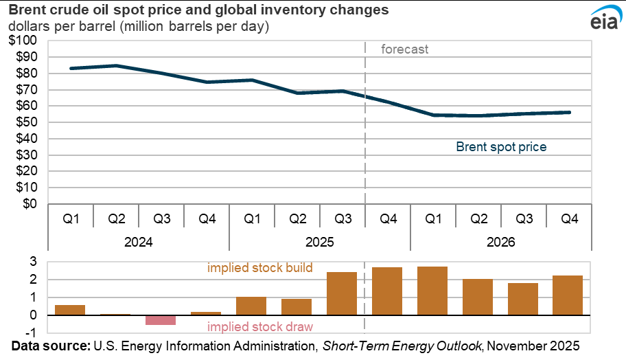
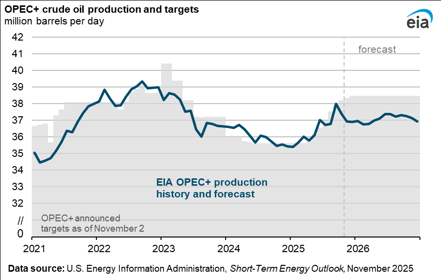
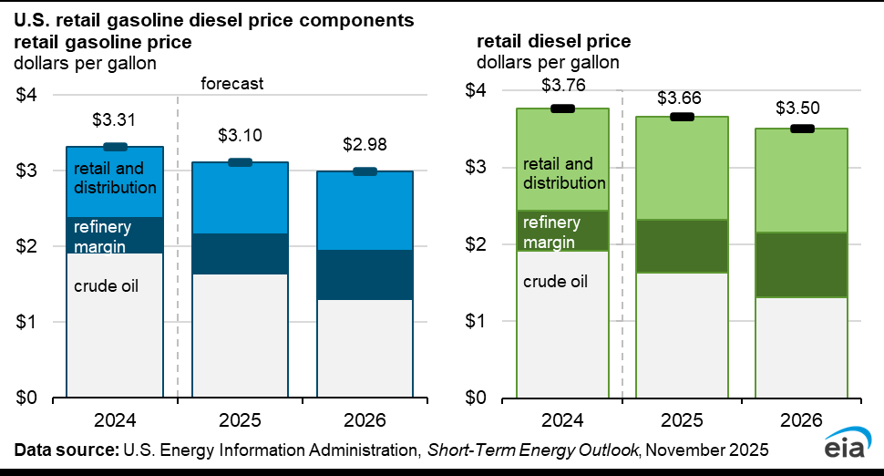
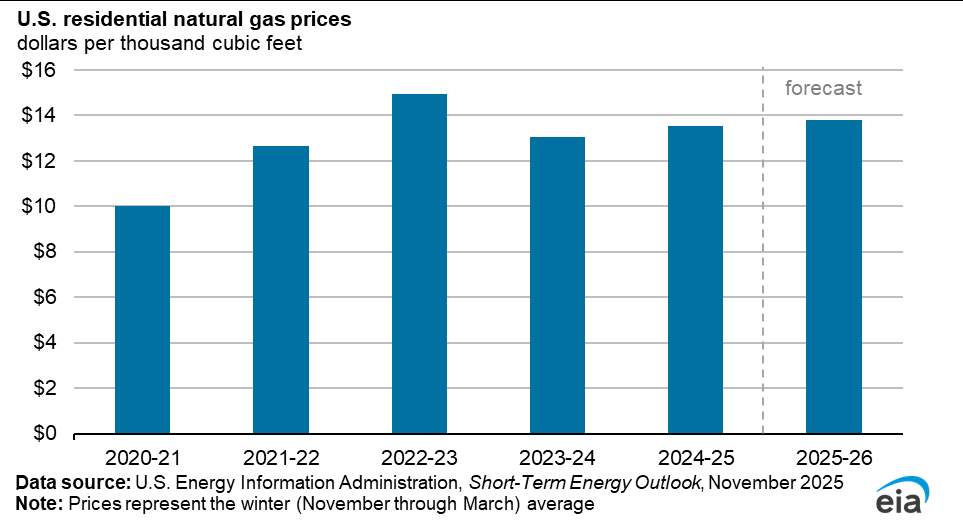
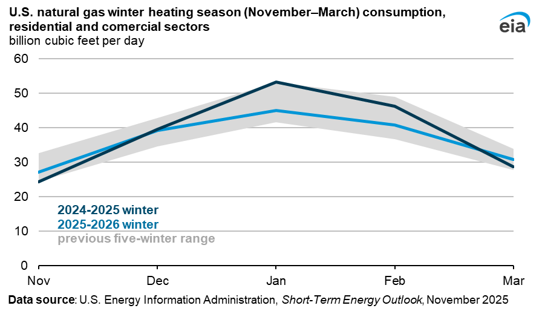
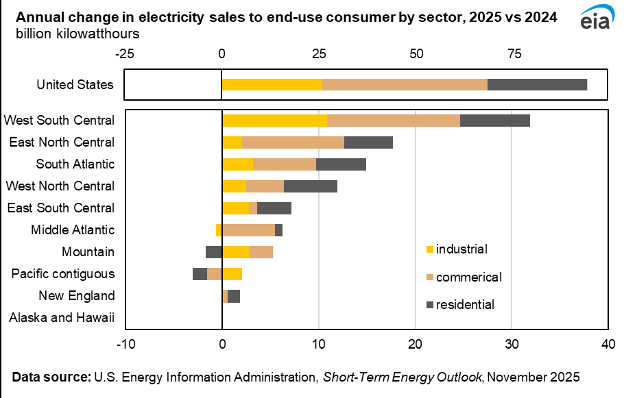
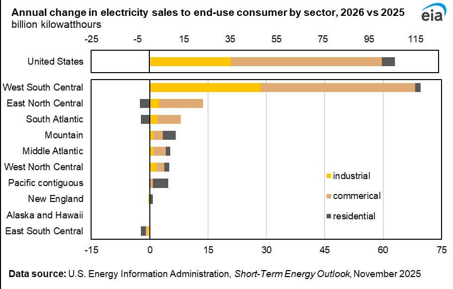
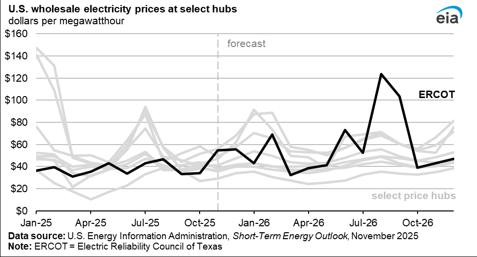
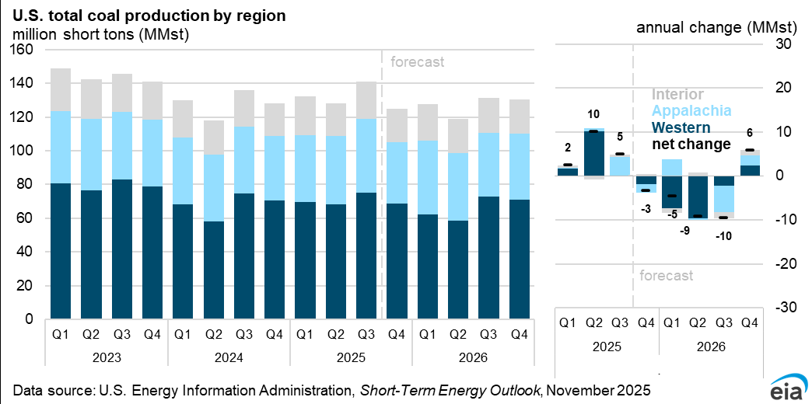
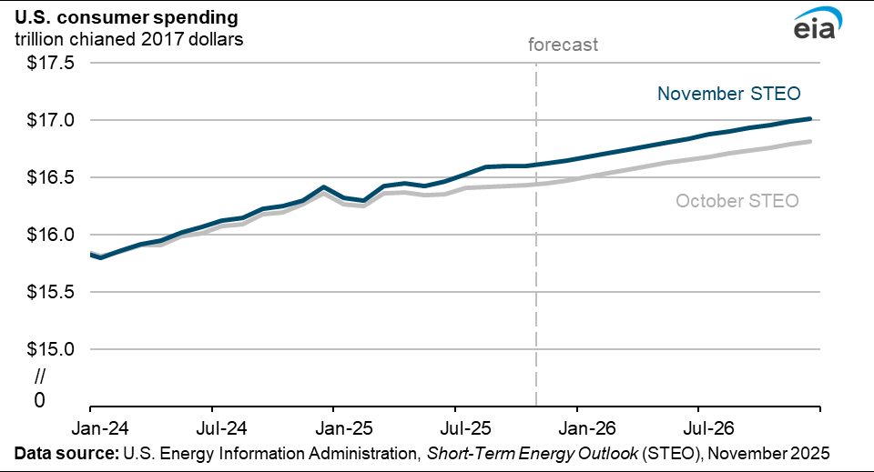

# steo_2025-11

*Converted on 2025-11-17 08:26:36*

## Page 1

STEO 
November 2025 
Short-Term Energy 
Outlook

---

## Page 2

November 2025 
U.S. Energy Information Administration | Short-Term Energy Outlook 
1 
 
 
 
 
 
 
 
 
 
 
 
 
 
 
 
 
 
 
 
 
 
 
 
The U.S. Energy Information Administration (EIA), the statistical and analytical agency within the  
U.S. Department of Energy (DOE), prepared this report. By law, our data, analyses, and forecasts are 
independent of approval by any other officer or employee of the U.S. Government. The views in this 
report do not represent those of DOE or any other federal agencies.

---

## Page 3

November 2025 
U.S. Energy Information Administration | Short-Term Energy Outlook 
2 
 
Overview 
U.S. energy market indicators 
2024 
2025 
2026 
Brent crude oil spot price (dollars per barrel) 
 $81 
 $69 
 $55 
Retail gasoline price (dollars per gallon) 
 $3.30 
 $3.10  
 $3.00  
U.S. crude oil production (million barrels per day) 
 13.2  
 13.6  
 13.6  
Natural gas price at Henry Hub (dollars per million British 
thermal units) 
 $2.20 
 $3.50  
 $4.00  
U.S. liquefied natural gas gross exports (billion cubic feet 
per day) 
12 
15 
16 
Shares of U.S. electricity generation  
  
  
  
Natural gas 
42% 
40% 
40% 
Coal 
16% 
17% 
16% 
Renewables 
23% 
24% 
26% 
Nuclear 
19% 
18% 
18% 
U.S. GDP (percentage change) 
2.8% 
2.0% 
2.2% 
U.S. CO2 emissions (billion metric tons) 
4.8 
4.9 
4.8 
Data source: U.S. Energy Information Administration, Short-Term Energy Outlook, November 2025 
Note: Values in this table are rounded and may not match values in other tables in this report. 
 
• 
Global oil prices. We expect global oil inventories to continue to rise through 2026, putting 
downward pressure on oil prices in the coming months. We forecast the Brent crude oil price 
will fall to an average of $54 per barrel (b) in the first quarter of 2026 (1Q26) and average $55/b 
for all of next year. Although we continue to expect crude oil prices to fall in the coming months, 
our Brent forecast for 2026 is $3/b higher than in last month’s outlook, largely as a result of 
updated assumptions about inventory builds in China and sanctions on Russia.  
• 
U.S. gasoline and diesel prices. Our forecast assumes lower crude oil prices, the largest 
component of retail prices, will contribute to lower retail gasoline and diesel prices throughout 
the forecast period. We expect gasoline prices to fall below $3.00 per gal (gal) on average in 
2026, down 10% from 2024, and diesel prices to fall to $3.50/gal in 2026, down 7% from 2024.  
• 
Natural gas prices. The Henry Hub natural gas spot price in our forecast rises to an average of 
almost $3.90 per million British thermal units (MMBtu) this winter (November–March) following 
seasonal patterns of prices rising during the winter alongside increased space heating demand. 
We expect prices to average $4.00/MMBtu in 2026, 16% higher than in 2025, primarily due to 
increased liquefied natural gas (LNG) exports amid flat production growth.  
• 
LNG exports. We expect the United States will export 14.9 billion cubic feet per day of LNG this 
year, which is 25% more than last year. Plaquemines LNG in Louisiana has ramped up exports 
more quickly than we expected, leading us to raise our forecast of LNG exports in 4Q25 by 3% 
Short-Term Energy Outlook

---

## Page 4

November 2025 
U.S. Energy Information Administration | Short-Term Energy Outlook 
3 
compared with last month’s outlook. We expect U.S. LNG exports will increase by an additional 
10% in 2026.  
• 
Electricity demand. Electricity sales to end-use customers in our forecast increase across the 
United States by 2.4% in 2025 and 2.6% in 2026. Forecast growth is led by the West South 
Central region, which includes Texas, as electricity demand from data centers and 
cryptocurrency mining facilities in that region increases.  
• 
Coal production. We forecast coal production to increase in 2025 and then decrease slightly 
2026. Coal production is expected to remain over 500 million short tons (MMst) in 2026, about 
15 MMst higher than forecasted in the October Short-Term Energy Outlook. The higher forecast 
for next year mostly results from the reopening of three mines in the Appalachia region and our 
assumption that coal-fired power plants will not draw down stocks as much as we previously 
forecast.  
 
 
 
 
Notable forecast changes 
Current forecast: November 12, 2025; previous forecast: October 7, 2025 
2025 
2026 
Brent crude oil spot price (dollars per barrel) 
$69 
$55 
      Previous forecast 
$69 
$52 
         Percentage change 
0.2% 
5.3% 
U.S. LNG gross exports (billion cubic feet per day) 
14.9 
16.3 
      Previous forecast 
14.7 
16.3 
         Percentage change 
0.8% 
0.4% 
Data source: U.S. Energy Information Administration, Short-Term Energy Outlook  
Note: Percentages and changes are calculated from unrounded values.

---

## Page 5

November 2025 
U.S. Energy Information Administration | Short-Term Energy Outlook 
4 
Global Oil Markets  
Global oil prices  
Brent crude oil spot prices averaged $65 per barrel (b) in October, $3/b less than the average in 
September and $15/b less than the average in January of this year. Crude oil prices fell in October as 
growing supplies of crude oil outweighed uncertainties related to the effect of new rounds of sanctions 
on Russia’s oil sector. We forecast that growing global oil production and the transition to the low point 
of seasonal demand over the winter will accelerate the growth in global oil inventories, causing crude oil 
prices to continue to fall in the coming months. We forecast that the Brent price will drop to an average 
of $54/b in the first quarter of 2026 (1Q26) and will average $55/b in 2026. Although we expect prices to 
fall through the early part of 2026, our 2026 Brent outlook is $3/b higher than we forecast last month. 
 
Our higher crude oil price forecast for 2026 compared with last month reflects two major factors. First, 
we now assess that China’s ongoing purchases of oil for strategic stockpiling will place more upward 
pressure on oil prices than we had assumed previously. Second, this forecast recognizes that the recent 
round of sanctions on Russia’s oil sector could result in less oil production next year than we are 
currently forecasting.  
China has added large volumes of oil to its strategic stockpiles this year. Because China’s inventory 
builds have been strategic, they have partly acted as a source of demand, limiting downward price 
pressures more than our estimated balances would otherwise suggest. We estimate that China’s 
strategic oil inventory builds averaged 0.8 million b/d from January 2025 through September of this 
year, but that estimate is highly uncertain given the lack of visibility into inventory data in China. We 
assume that China will continue adding oil to strategic stockpiles through 2026, although at a slightly 
slower pace than it has this year. The pace at which China continues to purchase oil to fill inventories is a

---

## Page 6

November 2025 
U.S. Energy Information Administration | Short-Term Energy Outlook 
5 
key uncertainty in our forecast, and a slowdown in these purchases would likely put downward pressure 
on oil prices.  
We assume sanctions on Russia will primarily increase the costs and risks of shipping Russia’s oil, which 
we expect will lower the prices Russian oil producers receive. Although the effect of sanctions on 
Russia’s oil exports is still unclear, we assess a slight drop in Russia’s crude oil output of about 0.1 million 
b/d in 1Q26, as we believe the global oil market will adjust to the new sanctions. However, if sanctions 
result in a large reduction in oil purchases from Russia, it could cause a steeper drop in production than 
we are forecasting and put upward pressure on oil prices.      
 
Lastly, much of the increase in global oil inventories is based on OPEC+ increasing production in line with 
targets this year. OPEC+ began increasing production in April 2025 and has consistently increased 
production targets through 2026. For much of this year, the group’s production has been close to its 
targets, but we expect production will begin to fall below targets in the coming months. On November 2, 
the group again confirmed plans to increase production targets through December 2025, but for the first 
time, announced plans to pause any further production increases through March 2026 due to lower 
expected seasonal demand. Even taking into consideration the latest announcement, our forecast 
assumes OPEC+ production will average about 1.3 million b/d below its latest targets next year given the 
expectation of substantial global oil inventory builds.    
We forecast that global oil inventories will increase by an average of 2.2 million b/d in 2026, compared 
with an average annual increase of 1.8 million b/d in 2025. Inventory builds will be highest in 4Q25 and 
1Q26, averaging 2.7 million b/d over that time. Strong inventory builds could fill commercial storage 
options on land, which would prompt market participants to increasingly seek other, more expensive 
options for storing crude oil, such as floating storage. As a result, some of the crude oil price declines will

---

## Page 7

November 2025 
U.S. Energy Information Administration | Short-Term Energy Outlook 
6 
likely reflect the higher marginal cost of storage. We also assume some portion of those oil inventory 
builds go into strategic stockpiles in China, which limit downward price pressures. We forecast that 
inventory builds will moderate later in 2026 due to a combination of higher global oil demand and 
slightly lower oil production growth, both in response to lower oil prices. We forecast that the Brent 
crude oil price will average $55/b in 2026, compared with an average of $69/b in 2025. 
Global oil consumption and production 
Global liquid fuels production in our forecast increases by 2.8 million b/d in 2025 and by another 1.4 
million b/d in 2026.  Brazil, the United States, Guyana, and Canada drive production growth over the 
forecast period. Together these countries contribute 75% (1.5 million b/d) of total global growth this 
year and 67% (0.8 million b/d) in 2026. Production in South America has been the leading source of 
growth in 2025 as new offshore vessels have started up ahead of schedule in Brazil and Guyana, with 
additional projects still in development.     
Forecast OPEC+ crude oil production increases by 0.5 million b/d in both 2025 and 2026, based on our 
assumption that production increases due to higher OPEC+ targets will moderate as the group aims to 
keep inventory builds from accelerating too quickly and pushing oil prices down further.    
Forecast global liquid fuels consumption increases by 1.0 million b/d in 2025 and by 1.1 million b/d in 
2026. Global liquid fuels consumption growth is driven almost entirely by non-OECD countries, which 
together grow by 1.1 million b/d in 2025 and 1.0 million b/d in 2026. Forecast OECD consumption falls 
by 0.1 million b/d in 2025 before increasing by 0.1 million b/d in 2026.  
Most of non-OECD growth is concentrated in Asia. Total liquid fuels consumption in China increases by 
250,000 b/d from in both 2025 and 2026. We expect India will increase its liquid fuels consumption by 
70,000 b/d this year and 170,000 b/d next year. Compared with last month’s outlook, we reduced our 
estimate of liquid fuels consumption growth in India for 2025 by 120,000 b/d mainly because of upward 
revisions to the historical data. We increased our estimates of India’s 2024 consumption but did not 
increase our forecast of consumption for this year, as incoming data for 3Q25 have been lower than our 
expectations in prior outlooks.  
U.S. Petroleum Products  
U.S. gasoline and diesel prices   
Lower crude oil prices will continue to push down retail gasoline and diesel prices in the United States in 
2026. We forecast the average U.S. retail gasoline price to remain near $3.00 per gallon (gal) for the 
remainder of 2025, resulting in an average 2025 price of $3.10/gal, a 6% decrease from 2024. In 2026, 
we forecast the average retail gasoline price to fall by 4% to just under $3.00/gal, which would be the 
lowest annual average price since 2020. We forecast the U.S. retail diesel price will average almost 
$3.70/gal in 2025, down 3% from 2024. Diesel prices are forecast to fall by another 4% in 2026. As with 
gasoline, lower diesel prices are primarily a result of lower crude oil prices. We expect the Brent crude 
oil price will average $69 per barrel (b) this year, down from $81/b in 2024, and we forecast it will fall to 
an average of $55/b in 2026.

---

## Page 8

November 2025 
U.S. Energy Information Administration | Short-Term Energy Outlook 
7 
 
Crude oil is the largest component of retail gasoline and diesel prices, typically accounting for about half 
of the total price per gallon. As crude oil prices fall, the portion of retail fuel prices attributable to crude 
oil also falls. For retail gasoline, crude oil is expected to make up 53% of the price in 2025 and 44% in 
2026.  
Similarly, for diesel, crude oil’s contribution to the retail price is forecast to be 45% in 2025 and 37% in 
2026. If the 2026 forecast for diesel is realized, it would be the lowest crude oil contribution to retail 
diesel prices since 1998.   
However, falling crude oil prices do not lead to a proportional drop in prices at the pump because the 
effect of lower crude oil costs is partly offset by rising crack spreads. A crack spread is the difference 
between wholesale petroleum product prices and crude oil prices, broadly serving as a measure of 
refiners’ profit margins. Rising crack spreads can dampen the impact of falling crude oil prices for 
consumers.  
We forecast diesel crack spreads to rise from an average of $0.52/gal in 2024 to $0.69/gal in 2025, 
reaching $0.84/gal in 2026. In the gasoline market, we similarly forecast strong crack spread gains for 
2025 and 2026. 
We forecast all regional gasoline prices in the United States will average less than $3.00/gal in 2026 
except for on the West Coast, where the forecast annual average price is $4.10/gal. The West Coast—
which usually has the highest retail fuel cost in the country—faces additional price pressure in the 
coming years due to reduced refinery capacity stemming from two planned refinery closures: Phillips 
66’s Wilmington refinery in the Los Angeles area this year and Valero’s Benicia refinery in the Bay Area in 
April 2026.

---

## Page 9

November 2025 
U.S. Energy Information Administration | Short-Term Energy Outlook 
8 
Natural Gas  
Natural gas prices 
The U.S. benchmark Henry Hub spot price in our forecast averages $3.90 per million British thermal 
units (MMBtu) over this winter season (November–March), peaking in January at $4.25/MMBtu. Natural 
gas prices typically rise during the winter as demand for space heating increases and consumption of 
natural gas peaks for the year. This winter, we expect rising LNG exports to increase demand for U.S. 
natural gas as well.  
This October, U.S. inventories ended the month about the same as last year and 4% above the five-year 
average (2020–2024). Despite similar inventory levels, the October monthly Henry Hub price averaged 
about $3.20/MMBtu, up 45% from the same month last year. We expect prices to average 
$4.00/MMBtu in 2026, up 16% from this year. 
Plaquemines LNG in Louisiana received approval from the Federal Energy Regulatory Commission to 
introduce natural gas into Block 17, bringing the last remaining block at the 2.6-billion-cubic-feet-per-
day (Bcf/d) terminal into LNG production earlier than January 2026, which is what we previously 
expected. With this capacity online earlier than expected, we raised our forecast for LNG exports in 
4Q25 by 3% compared with last month’s outlook. We expect Golden Pass LNG Trains 1–2 and Corpus 
Christi Stage 3 Blocks 4–7 will begin shipping cargoes in 2026, adding 2.1 Bcf/d of LNG export capacity by 
the end of the year. 
The effect of changing wholesale natural gas prices on residential natural gas prices is delayed because 
of the nature of utility regulations. We forecast the residential price of natural gas will average just over 
$13.80 per thousand cubic feet this winter, up 2% from last year, largely keeping costs stable for 
consumers that heat their homes with natural gas.

---

## Page 10

November 2025 
U.S. Energy Information Administration | Short-Term Energy Outlook 
9 
Natural gas consumption 
We expect lower domestic natural gas consumption during the 2025―26 winter heating season 
(November—March) because of a warmer weather forecast compared with last winter. We expect U.S. 
natural gas consumption in the residential and commercial sectors this winter, which largely stems from 
space heating, to average 36.5 Bcf/d, 5% less than last winter and 2% less than the five-year (2020–
2024) average. 
Temperatures across much of the country were slightly above normal into the first week of November, 
and forecasts from the National Oceanic and Atmospheric Administration show the South Central and 
Southwestern United States will have above average temperatures for much of the month. Our forecast 
includes 3% fewer heating degree days (HDDs)  than last winter and 2% fewer HDDs than the prior five-
year average..  
 
Electricity, Coal, and Renewables 
Electricity sales 
We expect electricity sales to ultimate customers in the United States to increase 2.4% in 2025 and 2.6% 
in 2026, after rising 2.6% in 2024. Electricity sales will rise in nearly all regions in 2025 and 2026, but 
growth is particularly concentrated in the West South Central region, which includes Texas, Oklahoma, 
Louisiana, and Arkansas. We forecast that electricity sales will grow 4.4% in the West South Central 
region in 2025 and by 9.2% in 2026. These increases contribute 34% of the growth in U.S. electricity 
sales in 2025 and 66% of the growth in U.S. electricity sales in 2026. Much of the growth in this region is 
due to rising electricity demand from data centers and cryptocurrency mining facilities that are coming 
online, or are expected to come online, in the regional market that is managed by the Electric Reliability 
Council of Texas (ERCOT), which is located within the broader West South Central region.

---

## Page 11

November 2025 
U.S. Energy Information Administration | Short-Term Energy Outlook 
10 
We expect sales of electricity to commercial customers in the West South Central region will rise by 6% 
in 2025 and 17% in 2026, accounting for 61% of the expected nationwide growth in electricity sales next 
year. We expect electricity sales to industrial customers in the region will grow by 4% in 2025 and 11% in 
2026, accounting for 81% of the nationwide sales to the industrial sector growth next year. Our 
expectations for growth in electricity sales in this region is consistent with ERCOT’s forecasts of load in 
the years to come.

---

## Page 12

November 2025 
U.S. Energy Information Administration | Short-Term Energy Outlook 
11 
Wholesale electricity prices 
Increases in wholesale electricity prices in ERCOT drive forecast increases in overall U.S. wholesale 
electricity prices next year. We expect that the load-weighted average of the 11 regional wholesale 
prices tracked in the Short-Term Energy Outlook will be $47 per megawatthour (MWh) in 2025, which is 
23% higher than the 2024 average. We expect this price to rise to $51/MWh in 2026. This 8% rise in the 
wholesale price is driven mostly by the ERCOT North pricing hub, where we forecast the wholesale 
electricity will increase 45% in 2026 after rising 21% in 2025. Natural gas prices tend to be the biggest 
determinant of power prices, among numerous other factors that typically influence the wholesale 
power price. But in 2026, the increase in power prices in ERCOT tends to reflect large hourly spikes in 
the summer months due to high demand combined with relatively low supply in this region. 
 
Coal markets 
We estimate U.S. coal production in the third quarter of 2025 (3Q25) reached 141 million short tons 
(MMst), the highest level since 3Q23 and a 10% increase from 2Q25. About half of the production 
increases came from the Western region. We expect production will fall to 125 MMst in 4Q25, down 3% 
from a year earlier. Overall, we anticipate 2025 production will total 526 MMst, a 3% increase from 
2024. The coal production increase in 2025 results from rising demand for coal, which can be attributed 
to a few factors. These factors include an increase in natural gas prices particularly in the first half of the 
year, delayed coal plant retirements, and strong demand for heating in the earlier winter months this 
year. In response to higher demand, we expect electric power coal inventories to end the year at 107 
MMst, which is 17% lower than at the end of 2024.

---

## Page 13

November 2025 
U.S. Energy Information Administration | Short-Term Energy Outlook 
12 
 
We expect 2026 total production to fall by 3% to 509 MMst. Although we expect production to drop, our 
forecast is 15 MMst higher than in the October STEO. The increased production forecast in 2026 reflects 
several factors. First, we now expect coal-fired power plants will hold 13% more coal in stockpiles at the 
end of next year than we forecast last month. We have raised our forecast for coal inventories 
compared with last month’s forecast to account for ongoing changes in coal markets that raise the 
likelihood plants will keep more coal in inventory. Based on what power plant operators are reporting to 
us on our 860M survey, we now expect about 3 gigawatts more coal-fired generation capacity will be 
operational next year compared with what we had assumed earlier this year. Moreover, our 
expectations for electricity demand have been rising, and we expect a 2.6% increase in electricity sales 
to ultimate customers next year. Also, we anticipate higher production from the reopening of the 
Allegheny Metallurgical’s Longview, Core Natural Resources’ Leer South, and Warrior Met Coals’ Blue 
Creek mines. The increase in production in these coal mines led us to raise our forecast of metallurgical 
coal exports in 2026 by 9% compared with 2025 levels. The possibility of a weaker dollar and higher 
metallurgical coal prices creates further upside for U.S. met coal exports in 2026 that provides further 
impetus to coal production. 
Economy, CO2, and Weather  
U.S. macroeconomics 
This month’s forecast assumes that real GDP will grow at an annualized rate of 2.0% in 2025 and 2.2% in 
2026, revisions of 0.1 and -0.2 percentage points, respectively, from last month.  
The macroeconomic assumptions in the Short-Term Energy Outlook are based on S&P Global’s 
macroeconomic model. We incorporate STEO energy price forecasts into the model to obtain the final 
macroeconomic assumptions.

---

## Page 14

November 2025 
U.S. Energy Information Administration | Short-Term Energy Outlook 
13 
The U.S. Bureau of Economic Analysis’s (BEA) Third Estimate of 2Q25 GDP, released on September 25, 
showed that GDP grew at an annualized rate of 3.8% in the second quarter of 2025 (2Q25), 0.5 
percentage points above the Second Estimate. The upward revision was mostly due to faster consumer 
spending growth in 2Q25, which was revised higher from 1.6% to 2.5%. Changes to the GDP and 
consumer spending forecast directly affect EIA’s forecast for electricity consumption, natural gas 
consumption in the commercial and industrial sector, and distillate product supplied. Energy is an input 
to production, so faster GDP growth implies more energy consumption, in general.  
In addition to the revision of 2Q25 GDP growth, BEA released its 2025 annual update, which included 
revised estimates of GDP and expenditure subcategories. Much of the difference between the 
macroeconomic assumptions in the November and October STEO reflects the cumulative effects of the 
2Q25 GDP growth estimate and the annual revision, which covers 1Q20 to 1Q25. 
 
Emissions 
We forecast U.S. energy-related carbon dioxide (CO2) emissions to increase by 1.8% in 2025, followed by 
a decrease of 0.7% in 2026. CO2 emissions from coal, natural gas, and petroleum products all rise in 
2025. Decreases in 2026 occur mostly from coal, with smaller decreases from petroleum products, 
which offset emissions increases from natural gas. The largest changes in emissions for both years are

---

## Page 15

November 2025 
U.S. Energy Information Administration | Short-Term Energy Outlook 
14 
attributable to shifting coal consumption for power generation.
 
Weather  
Based on our current forecasts and data from the National Oceanic and Atmospheric Administration, 
our forecast assumes the United States will experience a cooler November this year compared with last. 
We expect the cooler start to the 2024–2025 winter heating season (November—March) will be offset 
by a relatively mild 1Q26, with 7% fewer HDDs in 1Q26 compared with 1Q25, resulting in a slightly 
milder winter than both the previous winter (3% fewer HDDs) and the previous 10-year winter average 
(2% fewer HDDs).

